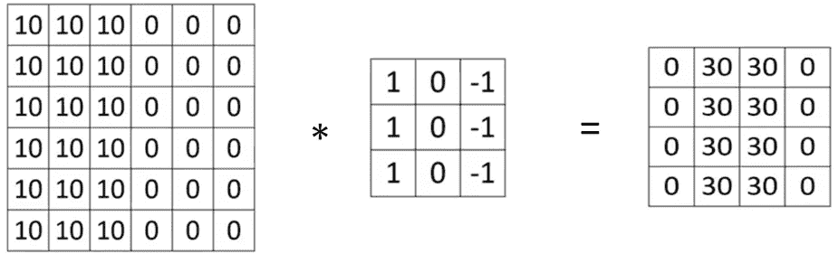
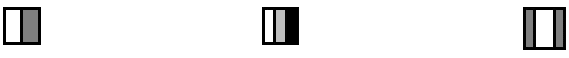
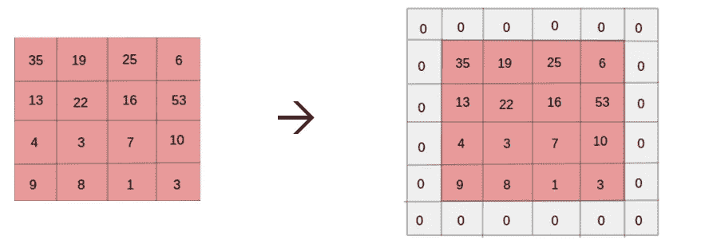
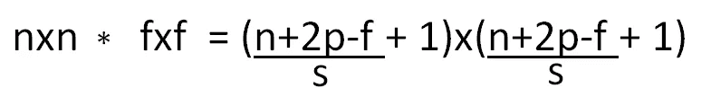
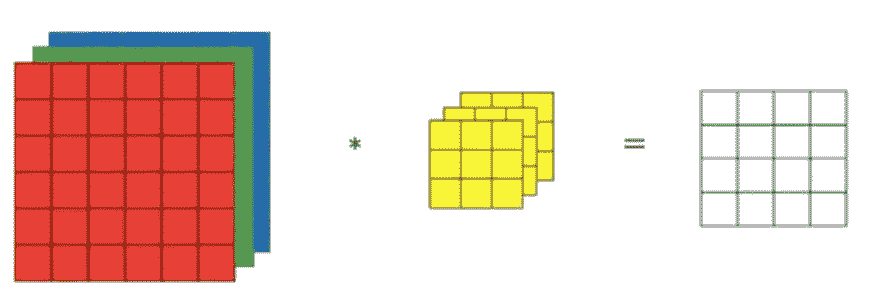
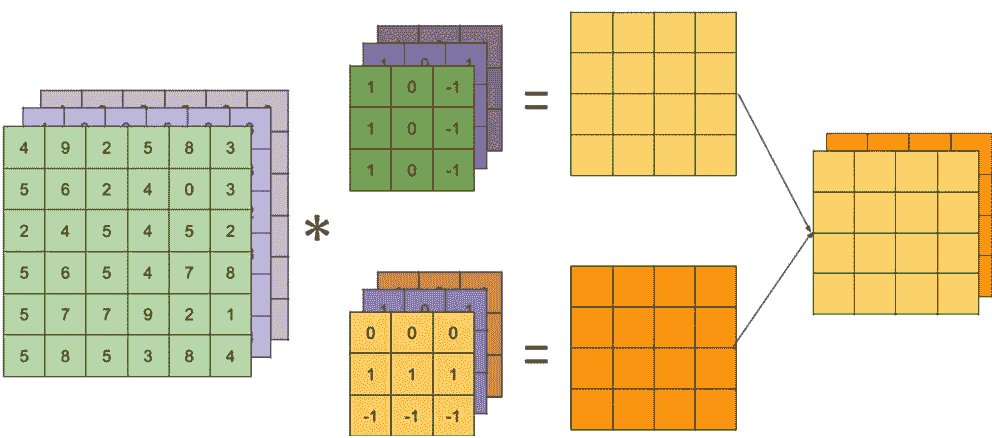
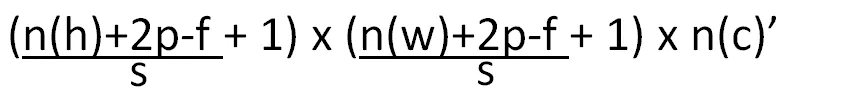
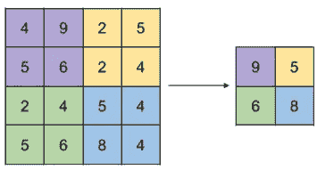
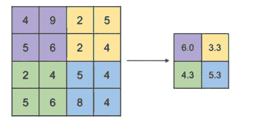

# 介绍了细胞神经网络和使用 python 中 MNIST 数据库的数字识别器的逐步模型

> 原文：<https://medium.com/coinmonks/an-introduction-to-cnns-and-a-step-by-step-model-of-a-digit-recognizer-using-mnist-database-in-f4ea6af06d77?source=collection_archive---------1----------------------->


卷积神经网络(CNN 或 ConvNets)在 20 世纪末被引入，但由于计算成本高而没有得到普及。在 AlexNet 赢得 2012 年的 ImageNet 挑战赛后，CNN 成为人们关注的焦点。现在，随着 GPU 和 TPU 可用性的增加，ConvNets 正被广泛使用。本文将介绍 CNN 的基本轮廓，然后是 MNIST 数据库(手写数字识别)的完整解决方案。

# 第一部分(CNN 简介)

# 概观

为理解 ConvNets 的基本结构和工作原理，将涉及以下主题:

1.  卷积运算(用于边缘检测) :滤波器工作、填充和跨越。
2.  体积上的卷积
3.  建立一个 CNN
4.  汇集层
5.  全连接层

# **边缘检测的卷积运算**

我们使用**滤波器**(或内核)进行边缘检测。滤光器可以是水平的、垂直的，或者甚至倾斜一个角度，例如 45 度。垂直检测器的工作如下所示:



The input matrix (6x6x1) convolves with the filter matrix(3x3x1) to give the output matrix(4x4x1)



We notice an edge in the output matrix(white color) which gets thinner as the size is increased

滤波器矩阵从左上角开始一次扫描输入图像的 9(3×3)个元素。逐元素乘法之后是所有九个乘积的相加，以形成输出矩阵的一个元素。

第一次迭代:过滤器扫描列 1 到 3 和行 1 到 3。

第二次迭代:过滤器扫描第 2 到 4 列和第 1 到 3 行，依此类推。

最后一次迭代:过滤器扫描第 4 到 6 列和第 4 到 6 行。

因此，输出图像的大小为(6–3+1)x(6–3+1)。

如果输入矩阵有 nxn 个元素，滤波器有 fxf 个元素，则输出矩阵有(n-f+1) x (n-f +1)个元素。

根据数学，这个过程被称为**互相关**，但在神经网络中它被命名为卷积。

## **填充**

随着图像尺寸的减小，卷积过程也有缺点。此外，拐角中的像素仅被计数一次，因为不存在导致拐角周围信息丢失的重叠。填充有助于克服这些缺点。



A 4x4 image padded with a single layer of zeros (p=1)

现在，如果输入矩阵有 nxn 个元素，p 是填充，滤波器有 fxf 个元素，则输出矩阵有(n+2p-f+1) x (n+2p-f +1)个元素。这有助于我们更加重视角落中的像素。

## 阔步

如前所述，滤波器矩阵以连续的方式一次扫描输入矩阵的 9 个元素。默认情况下，步幅设置为 1。如果我们想在每次迭代后跳过一次迭代，我们可以设置步幅= 2。迭代次数以有规律的方式减少。当图像尺寸很大时，这很有用。如果步幅给出了滤波器的某些部分没有完全覆盖输入矩阵的情况，我们不考虑它。

因此，在卷积中的填充和跨步的组合效果下:



上面输出的值并不总是整数。在值不是整数的情况下，我们取下限值。

## 体积上的卷积

1.**带单个过滤器**



6x6x3 input matrix convolves with 3x3x3 filter to give 4x4x1 output

输入矩阵的尺寸为 n(h)x n(w)x n(c)[通道的高度、宽度和数量]。输入矩阵和滤波器的通道数应该相同。n(h)和 n(w)的值可以不同。在这个例子中，过滤器可以被认为是一个立方体，它从左上角开始一次移动输入的 27 个元素。因此，无论通道的数量是多少，使用一个滤波器的输入将总是给出单个通道的输出。

2.**使用多个滤镜(多个滤镜)**

输入和滤波器中的通道数将保持不变。输出的通道数量将等于所使用的滤波器数量。



The number of channels in the output layer is equal to the number of filters

## 建立一个 CNN

现在，我们已经理解了卷积的概念，我将尝试证明这些被认为是一类神经网络的原因。滤波器的元素(3×3 滤波器中的 9 个)可以以类似于 ann 的方式训练。我们还可以添加一个偏置项和一个非线性激活函数。对于单个 3×3 滤波器，我们有 10 个参数(9 个权重和 1 个偏置项)。这种使用一个(或多个)滤波器从输入层到输出层的计算被称为 CNN 的一层。我们可以在网络中添加许多这样的层。与传统神经网络相比，CNN 的优势在于，由于参数的数量与输入的大小无关，因此 CNN 不容易过拟合。

对于 CNN 的单层:

1.  输入:n(高)x n(宽)x n(高)
2.  滤波器:f x f x n(c)并且滤波器的数量是 n(c)’
3.  输出:



4.重量数:[n(h) x n(w) + 1] x n(c)'

# 汇集层

ConvNets 使用池层来减少表示的大小并提高计算速度。关于池层的一个重要事实是没有参数。我们只给出池层的一组超参数(过滤器的大小(f)、步幅(s)和类型(max 或 avg))。由于在反向传播期间没有参数需要学习，我们可以说池就像一个固定的函数。卷积层和池层通常被视为同一层，因为池层没有任何参数。

最常见的池类型有:

1.  **Max pooling** :定义为超参数的过滤器将从符合条件的元素集中选择最大值。最大池比平均池应用更广泛。



Max Pooling

2.**平均池**:定义为超参数的过滤器将从考虑的元素集中选择平均值。这用于非常深的 NNs。



Avg Pooling

# 全连接层

完全连接的层就像单个 NN 层一样。前一层的输出作为这一层的输入给出。这一层之所以得名，是因为前一层的每个单元都与这一层的每个单元相连。

# B 部分(MNIST 数据库的逐步解决方案)

我们的目标是从成千上万的手写图像数据集中正确识别数字。数据可以在:[https://www.kaggle.com/c/digit-recognizer/data](https://www.kaggle.com/c/digit-recognizer/data)找到

完成我们第一个 CNN 项目的步骤:

1.我们首先导入所需的库。

```
import pandas as pd
import numpy as np
import matplotlib.pyplot as plt
import matplotlib.image as mpimg
import seaborn as snsfrom sklearn.model_selection import train_test_splitfrom keras.utils.np_utils import to_categorical 
from keras.models import Sequential
from keras.layers import Dense, Dropout, Flatten, Conv2D, MaxPool2D
from keras.optimizers import RMSprop
from keras.preprocessing.image import ImageDataGenerator
from keras.callbacks import ReduceLROnPlateau
```

2.我们加载文件并将标签分配给 Y_train。这些是**一个热编码的**，其余数据给 X_train。

```
train = pd.read_csv("../input/train.csv")
test = pd.read_csv("../input/test.csv")
Y_train = train["label"]
X_train = train.drop(labels = ["label"],axis = 1) 
Y_train = to_categorical(Y_train, num_classes = 10)
```

3.我们检查空值。数据集中没有空值。

```
X_train.isnull().any().describe()
test.isnull().any().describe()
```

4.除以 255 是像素的**归一化**的一种简单有效的方法。CNN 在[0，1]数据上比在[0，255]上收敛得更快。

```
X_train = X_train / 255
test = test / 255
```

5.我们使用整形，因为输入值是一维的，但我们想要 n(h) x n(w)的二维形式。然后，我们将训练集分成 10%的验证数据和 90%的训练数据。

```
X_train = X_train.values.reshape(-1,28,28,1)
test = test.values.reshape(-1,28,28,1)
X_train, X_val, Y_train, Y_val = train_test_split(X_train, Y_train, test_size = 0.1, random_state=2)
```

6.这是我们模型的前 4 层。Conv2D 层后跟 max pool 层被视为一个层。 **Dropout** 是一种减少过拟合的正则化技术。它指的是在神经网络中删除单元(隐藏的和可见的)。

```
model = Sequential()model.add(Conv2D(filters = 32, kernel_size = (5,5),padding = 'Same', 
                 activation ='relu', input_shape = (28,28,1)))
model.add(Conv2D(filters = 32, kernel_size = (5,5),padding = 'Same', 
                 activation ='relu'))
model.add(MaxPool2D(pool_size=(2,2)))model.add(Dropout(0.25))
model.add(Conv2D(filters = 64, kernel_size = (3,3),padding = 'Same', 
                 activation ='relu'))
model.add(Conv2D(filters = 64, kernel_size = (3,3),padding = 'Same', 
                 activation ='relu'))
model.add(MaxPool2D(pool_size=(2,2), strides=(2,2)))
```

7.这些是完全连接的层。我们在最后添加了 softmax 激活单元，以获得 softmax 输出**。展平用于将二维输出转换回一维，因为它必须进入完全连接的层。**

```
model.add(Dropout(0.25))
model.add(Flatten())
model.add(Dense(256, activation = "relu"))
model.add(Dropout(0.5))
model.add(Dense(10, activation = "softmax"))
```

8.我们将 **RMSprop** 设置为优化器。如果精度在 3 次迭代中保持不变，学习率将变为其值的一半。

```
optimizer = RMSprop(lr=0.001, rho=0.9, epsilon=1e-08, decay=0.0)
model.compile(optimizer = optimizer , loss = "categorical_crossentropy", metrics=["accuracy"])
epochs = 30
batch_size = 64
learning_rate_reduction = ReduceLROnPlateau(monitor='val_acc', 
                                            patience=3, 
                                            verbose=1, 
                                            factor=0.5, 
                                            min_lr=0.00001)
```

9.最后，我们拟合我们的模型。这是向前和向后传播发生的阶段。如果历元数为 30，这一步在 CPU 上的计算大约需要 2 小时。我们最终预测我们的测试标签。

```
final = model.fit(X_train, Y_train, batch_size = batch_size, epochs = epochs, validation_data = (X_val, Y_val),callbacks=[learning_rate_reduction])
results = model.predict(test)
```

[https://www.kaggle.com/mridul02/digit-recognizer-cnn-keras](https://www.kaggle.com/mridul02/digit-recognizer-cnn-keras)是数字识别器上我的 kaggle 内核的链接。**测试集的准确率为 99.58%(前 15%)。**

为了更好地了解 CNN 的能力，尝试应用其他机器学习算法并比较结果。

# 结论

在本文中，我们已经理解了 ConvNet 的工作原理，并在一个著名的机器学习问题上实现了它。完成文章后，我们知道:

1.  ConvNets 的工作原理及其命名原因。
2.  为什么 CNN 比传统的人工神经网络工作得更好。
3.  如何建立一个基本的 CNN 模型？

我投入了我所有的知识和努力，使这篇文章尽可能的翔实和紧凑。我欢迎反馈，并感谢如何使这篇文章更好的建议。