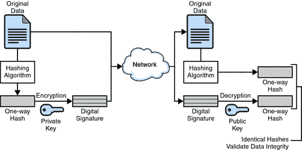
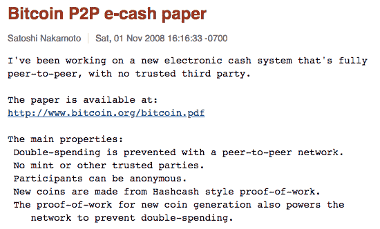
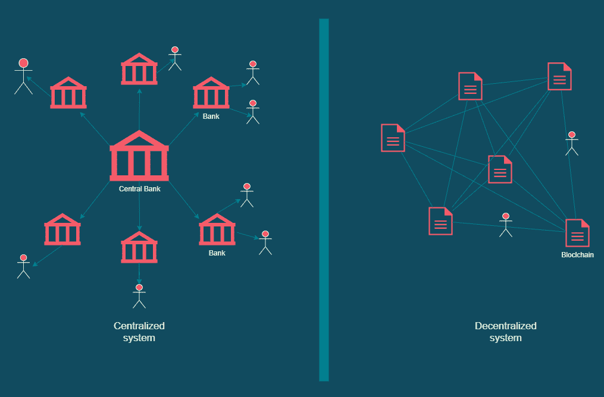
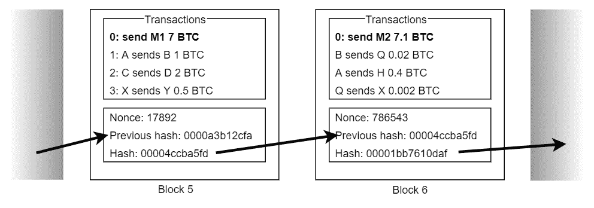
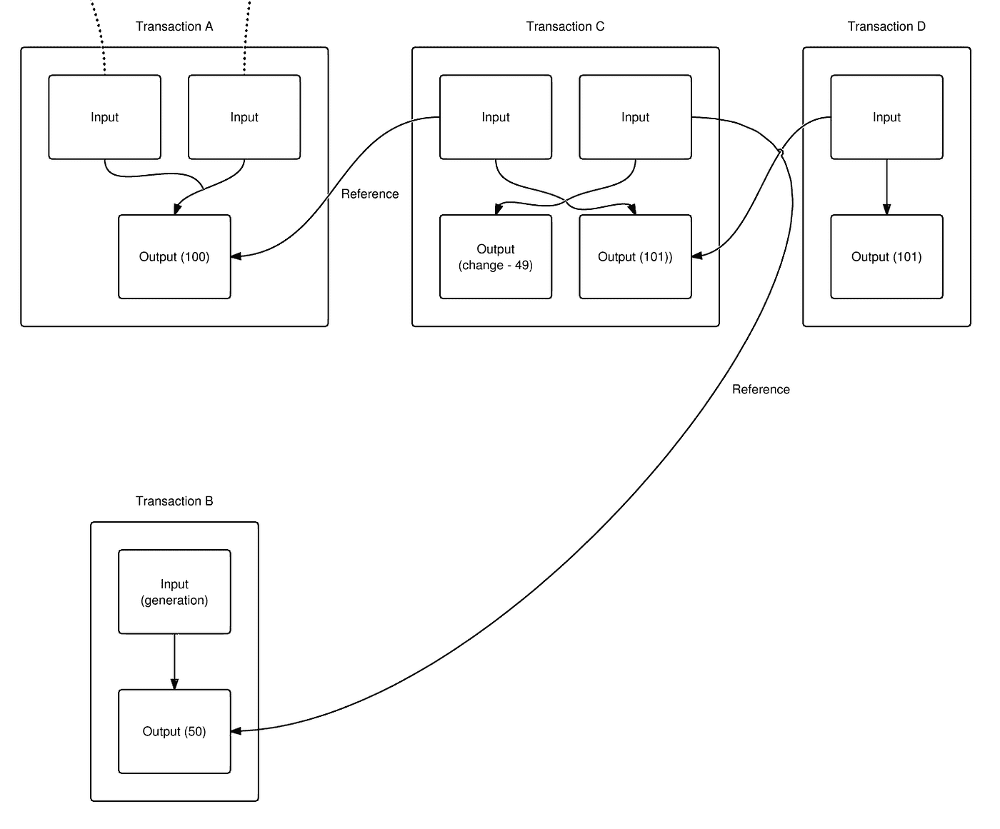

# 密码学、区块链和比特币简介

> 原文：<https://medium.com/coinmonks/an-introduction-to-cryptography-blockchain-and-bitcoin-9a6c435db1bd?source=collection_archive---------3----------------------->

这篇文章旨在向没有该主题先验知识的初学者介绍[比特币](https://blog.coincodecap.com/a-candid-explanation-of-bitcoin)和[区块链](https://blog.coincodecap.com/what-is-blockchain-a-simple-guide-for-dummies)比特币是一种基于密码学的加密货币货币系统，因此得名“加密货币”，所以需要对一些密码学功能有基本的了解。如果你对下面讨论的任何话题都感到满意，请随意跳到另一个话题。

# 对密码学的需求

自从人类文明的早期，就有了安全通信的需要，因此只有相关方才能安全地发送和接收消息。保护通信的过程经历了许多阶段，从使用简单的密码语言到使用复杂的数学函数。

*图 1:德国洛伦兹密码机，二战中使用过*

*加密非常高级别的总参谋部消息(来自维基百科)*

# 密码系统

是一组用于保护相关方之间通信的方法，这样第三方就无法读取或修改消息。密码学使用数学函数将明文转换成不可读的密文。它可能会在一个称为加密的过程中产生一个可逆的密文，将其转换回明文的过程称为解密，或者它可以在一个称为哈希的过程中产生一个不可逆的密文(称为哈希或摘要)。

有三种类型的加密技术:

1.对称密码术

使用一个密钥进行加密和解密，因此发送方和接收方使用相同的密钥加密和解密邮件。它很快，但不安全，因为密钥是共享的，任何人都可以拥有它。对称算法的例子:数据加密标准(DES)。

*   密钥:是一个很长的数，密钥越大，算法越能抵抗蛮力攻击。
*   强力攻击:尝试所有可用的密钥，直到找到一个密钥，对于大小为 1024 位的密钥，这意味着尝试 2^1024 密钥。

2.不对称密码术

使用两个数学上相关的密钥，一个是公钥，另一个是私钥，公钥可以从私钥中提取出来，当然，反之亦然。公钥用于加密明文，而私钥用于解密密文。密钥的所有者保留私钥，没有人应该知道它，而公钥则与任何想向密钥所有者发送加密消息的人共享。非对称加密是安全的，但与对称加密相比速度较慢。

3.散列法

是一个产生不可逆摘要的单向标准函数，它就像指纹一样，每个输入都有它的散列，两个不同的输入不能产生相同的散列，并且您不能从它的散列恢复原始输入。一些标准散列函数包括:SHA256，SHA512，MD5。然而，由于存在严重的漏洞，MD5 已被弃用(参见:参考文献 6)。哈希函数漏洞之一是碰撞，这意味着；两个不同的输入产生相同的哈希，这可能是由于哈希算法的有限空间与无限的输入可能性相反，但 SHA256 被认为是一种强哈希算法，它产生 256 位长的哈希(或 64 个十六进制字符)，要了解这个数字有多大，请参见此视频:[256 位安全有多安全？](https://www.youtube.com/watch?v=S9JGmA5_unY)

例如:( abc)的 SHA256 是

ba 7816 BF 8 f 01 cfea 414140 de 5d AE 2223 b 00361 a 396177 a9cb 410 ff 61 f 20015 ad

改变任何字符，都会产生完全不同的散列，例如,( Abc)的 SHA256 是

06d 90109 c8 CCE 34 ec0 c 776950465421 e 176 f 08 b 831 a 938 B3 c6e 76 CB 7 bee 8790 b

你可以用这个工具玩 sha 256:【https://andersbrownworth.com/blockchain/hash】T2

(这是 Anders Brownworth 的《伟大教程》的演示实用程序，参见参考文献 5)

# 数字签名

与纸质签名一样，数字签名也是一种身份验证方法。比如说；A 想给 B 发一条消息，不一定要加密，消息本身并不保密，但是应该有一个方法让 B 确定真的是 A 发来的，没有人篡改过消息。a 发送该消息以及他对该消息的签名，然后 B 可以检查该消息是否被篡改。
在 RSA 中，数字签名结合了加密和哈希。
有两个功能:

*   签名:散列消息，然后用私钥加密散列，输出是数字签名。
*   验证:用公钥解密数字签名，将结果与随数字签名一起发送的消息的哈希进行比较，如果两者相同，则消息是完整的，否则它应该在签名后发生了变化。

*图 RSA 中的数字签名*

注意:在使用 RSA 的数字签名中，私钥加密产生数字签名的消息的散列，而公钥解密签名以得到散列。这与使用保密性服务时的情况相反，在保密性服务中，公钥对消息进行加密，私钥对密文进行解密。比特币使用 ECDSA 算法进行数字签名，其工作原理与 RSA 不同。

# 加密服务

密码术提供三种主要服务:

*   机密
*   不可否认性
*   完整

每一个都是通过特殊的加密功能实现的。

**机密性**:当需要消息机密性时，使用该服务，例如向 WhatsApp 联系人发送消息时，使用该服务来确保消息用接收者的公钥加密，在接收者端，使用他的私钥解密消息。

**不可否认性**:是一种维护证据的安全服务，这样数据的发送者和接收者就不能否认参与了通信。它们分别被称为“来源的不可否认性”和“接收的不可否认性”。简单来说，你收到某人以一种特殊的“格式”发来的信息，你确定是他发的，想想“签名”。数字签名提供了不可否认性

**完整性**:确保消息是按原样发送的，没有人会在不知情的情况下修改消息。哈希提供了完整性。

现在你已经有了密码学的基础知识，让我们来了解一下比特币是如何在上面工作的。

# 钱是什么？

金钱是价值的储存手段；它本身不是一个价值。你花 100 L.E .买了披萨，你实际上是用一块价值 100 L.E .的金子换了这块披萨。这里的黄金也被称为交换媒介。

那么，是什么让像黄金这样的东西成为交换媒介或“货币”呢？

金钱的属性(来自[维基百科](https://en.wikipedia.org/wiki/Money#Properties)):

*   可替代性:其单个单元必须能够相互替代(即互换性)。
*   耐用性:能够承受重复使用。
*   可分性:可被分割成小单位。
*   便携性:易于携带和运输。
*   可认知性:其价值必须易于识别。
*   稀缺性:它在流通中的供应一定是有限的。

一旦有了具有这些特性的媒介，它就可以用来储存价值，因此被称为货币。

# 比特币是什么？

首先，一些人可能会被流行的比特币图片所淹没，认为它是真实的，特别是当它被描述为真币时。这不是比特币:

*图 3:比特币*

这只是艺术家想象中的一个设计，到本文结束时，你会意识到比特币没有固定的表现形式，即使是在低层次上。

对于比特币和其他数字货币的初学者来说，最困惑的是我们如何使用比特币这样的无形资产作为货币，如果我们可以使用它们，我们为什么要考虑新的货币系统，当前的货币系统有什么问题？以及我将在本文中尝试回答的许多其他问题。

> 比特币使用点对点技术，在没有中央权威机构或银行的情况下运行；比特币的交易和发行由网络集体管理。比特币是开源的；它的设计是公开的，没有人拥有或控制比特币，每个人都可以参与其中。

点对点(Peer-to-peer)意味着这是一个协作系统，或者更通常的说法是，一个分散的货币系统，与控制整个事情的单一机构或中央银行相反，交易通过一组计算机进行验证，任何人都可以参与，他们被称为节点，他们拥有区块链(自 2009 年比特币推出以来所有交易的公共数据库)的相同副本。

把它的设计想象成 torrent vs Google Drive。

诺贝尔经济学奖获得者米尔顿·弗里德曼在 1999 年给出了这一富有远见的 T2 式的陈述，他说，在互联网上运行的分散化数字货币并不是一个新的想法

> 唯一缺少的，但很快就会被开发出来的，是一种可靠的电子现金，一种你可以在互联网上把资金从 A 转移到 B，而 A 不知道 B 或者 B 不知道 A 的方法。

不同的电子现金系统在比特币之前就已经出现，但从未被广泛采用，直到 2008 年的今天，中本聪宣布了他对比特币的研究:

*图 4:中本聪电子邮件*

没有人知道 Satoshi 是谁，因为他的身份仍然很神秘，但他在比特币和区块链方面的工作被认为是革命性的，正在改变我们所知道的世界。

# 比特币是货币？

大多数加密货币话题的新手，包括几个月前的我，都不明白一些代币如何可以像我们知道的钱一样对待，这里有一个类比，可能会将话题引向我们知道的钱(它帮助了我的小弟弟):

想象一下，在一个完美的世界中，我们所有的金融交易都是通过我们的银行账户进行的，每个人都有一个银行账户，几乎每个人，甚至是孩子，都可以用信用卡在当地商店购买糖果，公共交通(我想到的是埃及)也可以通过信用卡支付。在这个不需要现金的完美世界里(我们已经在向这个世界前进)，你的公司每个月把你的工资转到你的账户上，你公司的客户通过转账到你公司的银行账户来支付给你公司。现金变得毫无用处，你的账户余额只是银行系统数据库中的一个记录，仅此而已，如果你在网上或向朋友出售旧笔记本电脑时，你的公司支付你的工资或你，账户余额就会增加，而当你去购物中心时，账户余额就会减少。

在这个阶段，法定货币消失了，我们的财富变成了银行数据库中的一组记录。这正是区块链(加密货币数据库/分类账)的工作方式，除了一些技术细节(重要细节)使其能够胜任当前的货币系统。这个例子中的比特币是你的余额记录。

区块链是所有加密货币(比特币、以太币等)的支柱，它有数字货币以外的应用，这使它真正具有革命性。

如果你想知道区块链的影响，请看这个视频:

[区块链如何改变货币和商业|唐·塔斯考特](https://www.youtube.com/watch?v=Pl8OlkkwRpc)

# 比特币的货币属性

让我们看看货币属性是否可以应用于比特币:

**✅Fungibility** :任何比特币都可以与另一种比特币互换。

**✅Durability** :只要区块链存在，比特币就存在，目前它由数千个节点维持(稍后会有更多)。它甚至比易受撕裂或损坏等物理故障影响的法定货币更耐用。

**✅Divisibility** :在大多数情况下，如果你想购买比特币，你大多会购买其中的一小部分，比特币的最小单位是 Satoshi (SAT)，一个比特币价值 108 SAT

✅Portability:它是数字化的，甚至比法定货币更便于携带。

**✅Cognizability** :区块链是公开的，任何人都可以下载([https://bitcoin.org/en/download](https://bitcoin.org/en/download))。

**✅Scarcity** :比特币的供应是有限的，比特币协议规定只有 2100 万个比特币可供开采，1800 万个比特币(BTC)已经被开采，在未来 100 年内只有 300 万个 BTC 有待开采(尽管这可能会发生变化)。

# 比特币的去中心化本质

那么，为什么要考虑一个不同的、有争议的货币体系，而不是目前已知的体系呢？

*图 5:比特币去中心化 vs 法定货币中心化*

加密货币的主要优点是它是分散的，这意味着没有一个集中的机构或银行来控制交易并跟踪交易。相反，它是点对点和公开的，任何人都可以对其网络做出贡献。这个网络的革命和发展让我想起了 90 年代互联网的出现。此外，虽然集中式系统依赖于信任(我们把钱存在银行，因为我们信任它们)，但分散式数字货币依赖于加密技术。

但毕竟，这一切是如何协同工作的；区块链、节点、矿工和密码学，来赚钱吗？

这是我将在接下来的部分中尝试回答的问题。

# 区块链

顾名思义，区块链是一个区块链，它是一种数据库(分类账)，记录自创世区块(2009 年由 Satoshi 添加的第一个区块)以来的每一笔交易。每个块包含几个事务(可以是 1000 个事务，或多或少)。每个块都通过其散列来引用前一个块。

*图 6:滑车的主要部件*

# 事务的生命周期

比方说，A 想要发送 B 1 BTC，A 首先指定 B 的地址(他的公钥)，然后用他的私钥(A 的私钥)签署交易，作为对比特币所有权的认可，并广播这个交易，等待确认。

这些节点验证 A 拥有 1 个 BTC，如果是真的，它们将事务移动到 mempool(内存池)中，挖掘器可以在那里提取事务进行挖掘，直到它处于未确认状态。采矿是用来证明矿工所做的工作并获得报酬的技术。

# 工作证明

矿工们因为他们所做的工作而获得比特币:向区块链添加区块，但比特币非常有价值，矿工们应该付出几乎有价值的努力才能获得它们，这种努力是由 CPU 完成的，它们试图解决非常复杂的数学问题，需要一种特殊的计算机，并且可悲的是消耗了大量的能量来将区块添加到区块链，从而赢得了宝贵的比特币(例如，见一名比特币矿工的视频:[在加密货币革命](https://www.youtube.com/watch?v=u-vrdPtZVXc)中)。

奖励的比特币数量在比特币代码中定义，并有限制性规则，例如每 21 万块(约 4 年)减半，比特币推出时从 50 BTCs 开始，截至 2021 年 2 月，奖励为 6.25 BTCs。采矿过程的重要性在于，它是比特币的主要和唯一来源，那里的每一枚比特币都源自采矿奖励。

# 非常复杂的问题

矿工需要解决的问题或难题很容易理解，但解决起来非常复杂。

它需要生成一个带有特定数量前导零的块哈希。您知道任何输入都有不同的散列，但是矿工如何改变输入(块)？他们不被允许改变块数据，他们不拥有它。这里是块字段:nonce(见图 6)，它是一个应该改变的数字，以便块的散列改变，矿工不断改变它，直到散列满足目标难度，这就是为什么所有块的散列都以零开始。

提示:你可以通过一些区块链探险家来看看真正的区块链街区

# 入侵区块链

区块链的结构使其不可能被黑客攻击，比特币网络有数千个节点保护区块链免受不良行为者的攻击，它们都有区块链的相同副本，因此如果有人试图修改他副本上的一块，他也需要对 51%的节点这样做。

例如，如果 B 试图将事务“A 发送 B 1 BTC”改变为“A 发送 B 2 BTC”，则包含块的散列也将改变，并且应该重新评估随机数以满足目标难度，并且如果发生这种情况(这将消耗大量功率)，则下一个块散列将改变，因为先前的散列已经改变，因此需要重新评估随机数，等等，直到最近的块。如果黑客设法做到了这一点，他还必须更新至少 51%的节点(大约 5000 个区块链副本)。这项工作在功耗方面的成本高得惊人，可能根本不值得，而且在技术上也不可行。

参见参考文献 5，这是一个非常好的可视化过程。

# 甲派乙 x BTC？

我用这个类比来简化交易细节，但是它比那个更复杂。比特币用输入和输出来表示:

*图 7:交易参考*

在上图中(来自 ref:25): A 的总输入(余额)为 100 BTC，它们被称为未用事务输出(UTXOs)，但是一旦它们在另一个事务(事务 C)中被引用，它们就会失效，并且不能在另一个事务中被引用。您会注意到，任何事务输入都是另一个事务的输出。此外，没有余额的概念，而是“未用完的交易输出”，比特币钱包所做的是计算总 UTXOs 以显示你的余额。

# 变化

如果 A 需要向 B 发送 3 个比特币，他有 2 个 UTXO，每个 UTXO 有 2 个 BTC，总共有 4 个 BTC，他要做的是将 4 个 BTC 发送到两个地址，第一个是 B 的地址，有 3 个 BTC，第二个是他自己的地址，有 1 个 BTC，以获得零钱，因为只允许引用整个 UTXO。如果您没有指定接收变更的地址，将被视为交易费用。

# 硬币库

该块必须包含至少一个交易，它被称为 coinbase 交易，这是一种特殊类型的交易，包含发送到矿工地址的奖励和费用。

参见图 6，块 5 的 coinbase 事务将 7 BTC 发送到 M1(该块的矿工的地址)，这 7 BTC 是采矿奖励+费用的总和，如果奖励是 6.25 BTC，则费用是 0.75 BTC。

# 费用

你(发送比特币的人)必须支付费用，以便矿工挑选你的交易，并将其打包成块。这些费用不同，但你支付的越多，越多的矿工会优先考虑你的交易，交易得到确认的速度越快。当所有的比特币(2100 万)被开采时，矿工们只会赚取费用。

# 摘要

*   我从密码学的一些重要概念开始，比特币依靠密码学来保证交易安全。
*   我们使用哈希来确保数据的完整性。
*   比特币是一种去中心化的加密货币，没有像银行那样的实体控制它，它通过加密技术保持安全，由人来运行，也称为节点。
*   比特币用户有一对非对称密钥:公钥作为他们的地址，其他人可以用它来向他们发送比特币，私钥作为他们的密码，他们用它来签署交易。
*   然后我们看到了比特币和货币是如何关联的，看到了所有的货币属性都可以适用于比特币。
*   区块链是所有交易曾经发生过并且将永远存在的分类账。
*   由于网络节点和加密技术的协同工作，区块链几乎不可能被破解。
*   用户通过参考之前发送给他们的输入来发送比特币，称为未用交易输出(UTXOs)。
*   在事务被签名之后，它移动到网络，在那里节点验证它，如果被验证，事务被移动到内存池(mempool)。
*   矿工从内存池中挑选交易，将它们打包成一个块，然后开始挖掘过程，如果他们找到随机数，他们将获得新挖掘的比特币和费用。
*   费用越高，矿商挑选交易的速度就越快，因此交易得到确认的速度也就越快。
*   coinbase 是一种特殊的交易，它包含矿工的奖励和费用，这是块中的第一个交易。

# 参考资料:

以下参考资料作为本文的补充，为了全面了解比特币的工作原理，我在观看和阅读了大量资源后仔细收集了这些资料。

## 视频:

(1): [比特币费用和未确认交易——完全初学者指南](https://youtu.be/waP7n8crMhg)

(2): [比特币交易详情—第一部分](https://youtu.be/Em8nJN8IEes)

(3): [比特币交易——从“发送”到“接收”](https://youtu.be/ZPFL6R-voW0)

(4): [什么是股权证明？—利用赌注赚取被动收入](https://youtu.be/0RhJBZGnOLQ)

(5): [区块链 101 —可视化演示](https://www.youtube.com/watch?v=_160oMzblY8)

(6): [哈希算法和安全性—计算机爱好者](https://www.youtube.com/watch?v=b4b8ktEV4Bg&t=300s)

(7):[256 位安全有多安全？](https://www.youtube.com/watch?v=S9JGmA5_unY)

(8): [比特币 Q & A:节点的作用是什么？](https://www.youtube.com/watch?v=fNk7nYxTOyQ)

## 中等:

(11): [如何验证交易？。比特币网络的独创性是……|布莱尔·马歇尔](/@blairlmarshall/how-do-miners-validate-transactions-c01b05f36231)

(12): [比特币交易实际上是如何运作的？|作者布莱尔·马歇尔](/@blairlmarshall/how-does-a-bitcoin-transaction-actually-work-1c44818c3996)

(13):[UTXO 到底是个什么鬼东西。窥视比特币交易……|作者 Rajarshi Maitra | BitHyve](/bitbees/what-the-heck-is-utxo-ca68f2651819)

## 其他:

(21): [钱](https://en.wikipedia.org/wiki/Money)

(22):[investopedia.com 2100 万全部被开采后比特币会怎么样？](https://www.investopedia.com/tech/what-happens-bitcoin-after-21-million-mined/)

(23): [比特币交易如何运作|比特币如何运作？|开始使用](https://www.bitcoin.com/get-started/how-bitcoin-transactions-work/)

(24): [什么是 coinbase？](https://bitcoin.stackexchange.com/questions/4571/what-is-the-coinbase/46213#46213?newreg=acc38b82d1a241ff9754b9aec239a2d5)

(25): [比特币维基交易](https://en.bitcoin.it/wiki/Transaction)

(26): [区块链探索者——搜索区块链| BTC | ETH | BCH](https://www.blockchain.com/explorer)

(27): [比特币交易生命周期](https://miro.medium.com/max/3742/1*e3_n2X5iIWESS28XiFMEpw.jpeg)(图片)