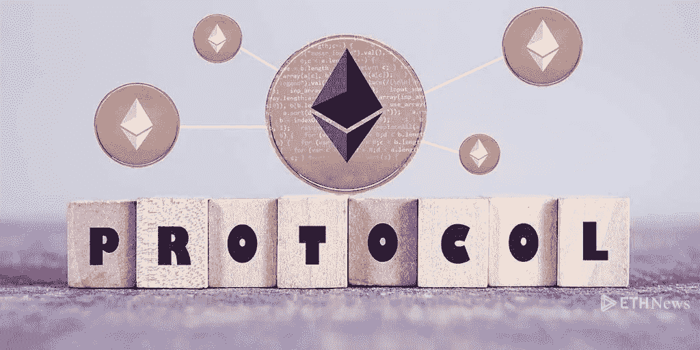

# 以太坊的 ERC-777 标准介绍

> 原文：<https://medium.com/coinmonks/an-introduction-to-ethereums-erc-777-standard-3cf2fb46b567?source=collection_archive---------1----------------------->

随着 CryptoKitties 等知名 dApps 的最近推出，ERC-721 令牌受到了关注，因为公司开始探索不可替代的数字资产的价值(ERC-721 令牌的简要损耗[这里](https://github.com/ethereum/eips/issues/721)和[这里](/@everett.muzzy/cryptokitties-isnt-about-the-cats-aef47bcde92d))。虽然 ERC-20 和 ERC-721 在以太坊开发者中受到了最多的关注，但还有许多不同的 ERC 标准正在讨论和开发中。ERC-777 就是这些标准之一。本文简要总结了当前发布的关于 ERC-777 协议的内容，以及该协议试图解决 ERC-20 令牌的一些问题。

**ERC-20 令牌标准**

ERC 代表以太坊请求注解——这是一个简单的术语，用来描述一组在以太坊区块链上实现的协议。ERC-20 协议是为以太坊区块链推出的原始令牌协议。它作为一个蓝图，开发者可以用来为他们的公司或 ICO 创建令牌。基于 ERC-20 标准构建的令牌都遵循相同的底层协议和功能，这一特性促进了广泛采用。值得注意的是，ERC20 令牌与 MyEtherWallet 和大多数硬件兼容。这意味着，在 ICO 期间，开发人员和客户都可以对他们销售/购买的令牌的技术性能充满信心。这种标准化不应该被忽视。在 2017 年的 211 个 ico(总计近[40 亿美元](https://www.coinschedule.com/stats.html))中，大多数令牌都是根据 ERC-20 标准构建的。可以肯定地说，ERC-20 协议降低了发行新硬币的难度和摩擦，这在一定程度上促进了 ICOs 的爆炸。尽管 ERC-20 令牌功能强大且至关重要，但它们也有局限性。

以太坊最令人兴奋的功能之一是编写和执行智能合同的能力。去中心化账本的部分好处是消除了“繁文缛节”——你可以将加密资产发送到你想要的任何地址，而不必经过中间的艰难步骤。然而，有些契约并不支持每一个令牌。如果您不小心向不支持底层协议的合同发送了 ERC-20 令牌，您的令牌将被永远锁定。随着越来越多的非专业用户使用新兴的区块链技术，如果人们发现他们的令牌突然无法挽回地被锁定，不兼容的 ERC-20 可能会产生对该技术的不信任。

**介绍 ERC-777 令牌标准**

ERC-777 协议于 2017 年 11 月在 GitHub 上提出，旨在保持 ERC-20 协议的优势，同时弥补一些缺点并增加额外的功能。该协议的一些主要好处如下:

**摩擦**:ERC-777 令牌协议减少了在 ERC-20 协议下制定智能合同所需的摩擦和交易数量。ERC-20s 要求发送一个双重调用函数(即第二次验证交易)以执行合同。ERC-777 标准包括一个定义是否收到令牌的功能(“收到令牌”功能)，允许立即触发合同。从面向用户的角度来看，这减少了在以太坊区块链上交易所需的时间和精力。在幕后，通过只允许一个事务触发一个合同，ERC-777 协议降低了区块链上的事务开销(即在相同的吞吐量下可以完成更多的事情)。总体而言，这可能是解决一些正在进行的辩论的关键，这些辩论是关于以太坊区块链上的高流量导致的每秒低交易量的当前限制。

**安全**:从安全的角度来看，ERC-777 也比 ERC-20 有优势。地址可以拒绝来自已被列入黑名单的地址的任何传入令牌，即出于任何原因被标记，即与黑客、非法活动或不兼容相关联。随着区块链 dApps 在日常交易中变得越来越根深蒂固，供应商对支付来源更加自信的能力是链上 KYC/反洗钱(了解您的客户/反洗钱)的重要发展。对于一种真正建立在不可信生态系统理论基础上的技术，任何让人们对通过区块链发送资金/资产更有信心的实现都可能带来巨大的积极影响。

**信息**:ERC-777 协议包含一个用户数据字段，发送方可以在其中包含任何与接收方相关的信息。这也将支持 KYC/反洗钱，因为令牌发送者可以包括关于其身份或交易原因的信息。不可变账本的重要性意味着通过区块链发送的更多数据支持更强大、更值得信赖、更健壮的生态系统。用户数据字段是朝着这个方向迈出的第一步，它允许发送和接收简单交易数据之外的信息。

向后兼容性:这是 ERC-777 令牌的一个重要元素。新协议与不具有“接收令牌”功能(在上面的“摩擦”中讨论过)的老式钱包兼容，即 ERC-20 令牌。这意味着 ERC-777 协议的广泛实施不会在没有“接收”功能的令牌(ERC-20s、ERC-721s 等)之间的生态系统中产生“分割”。)和那些有。相反，向后兼容性支持以太坊生态系统，其中许多协议可以同时存在。可以开发协议来赋予令牌和地址特定于发射令牌的公司或用户的期望的质量，并且与其他令牌共存。

**展望 ERC-777 标准**

ERC-777 协议仍然有许多障碍。它仍在讨论和改进中，我们还没有看到令牌建立在协议之外或通过 ICO 提供。此外，我们面临的问题是，不存在将 ERC-20 令牌转换为 ERC-777 令牌的标准方法。根据设计，一些 ERC-20 令牌可以编码为包括与 ERC-777 类似的改进，或者公司可以进行回购，从而将原始令牌兑换为基于新协议的新令牌(即参见 [MKR](https://makerdao.com/redeem/) 或 [Storj](https://storj.io/tokensale) )。是的，向后兼容性允许 ERC-20 和 ERC-777 令牌流畅地共存，但公司无法无缝地将其 ERC-20 令牌迁移到 ERC-777 标准可能会阻碍新标准的采用。我们只是看到了区块链发展的开始，ERC-777 标准是以太坊进一步发展的垫脚石。

> [直接在您的收件箱中获得最佳软件交易](https://coincodecap.com/?utm_source=coinmonks)

