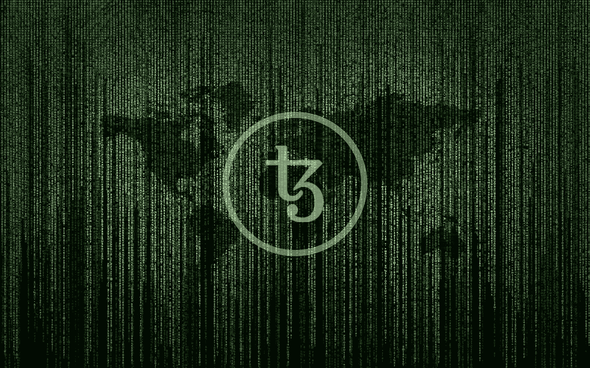

# 迈克尔逊介绍:Tezos 的脚本语言(第 3 部分)

> 原文：<https://medium.com/coinmonks/an-introduction-to-michelson-the-scripting-language-of-tezos-part-3-70bb294cd19e?source=collection_archive---------1----------------------->

## 了解如何使用 Michelson 编程语言并在 Tezos 上编写智能合同

[Source: Pixabay](https://pixabay.com/illustrations/matrix-code-data-networking-1735640/)

*(请先查看第一部分***和* [*第二部分*](/@claudebarde/an-introduction-to-michelson-the-scripting-language-of-tezos-part-2-4cc972c8237c) *)**

*在我们关于迈克尔逊语言系列的这一篇新文章中，我们将把它提高一个档次！*