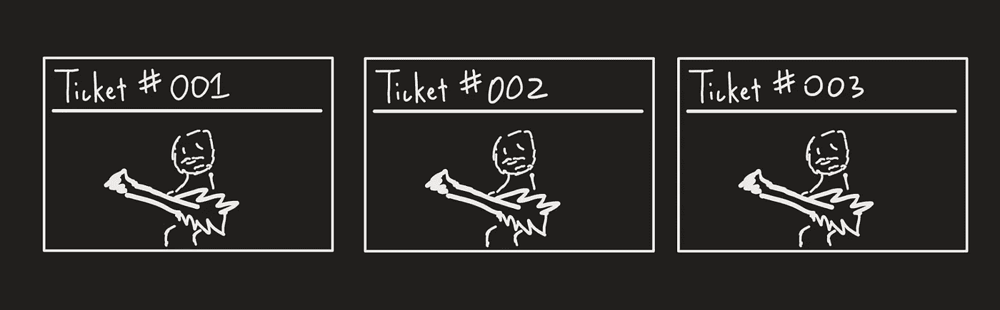
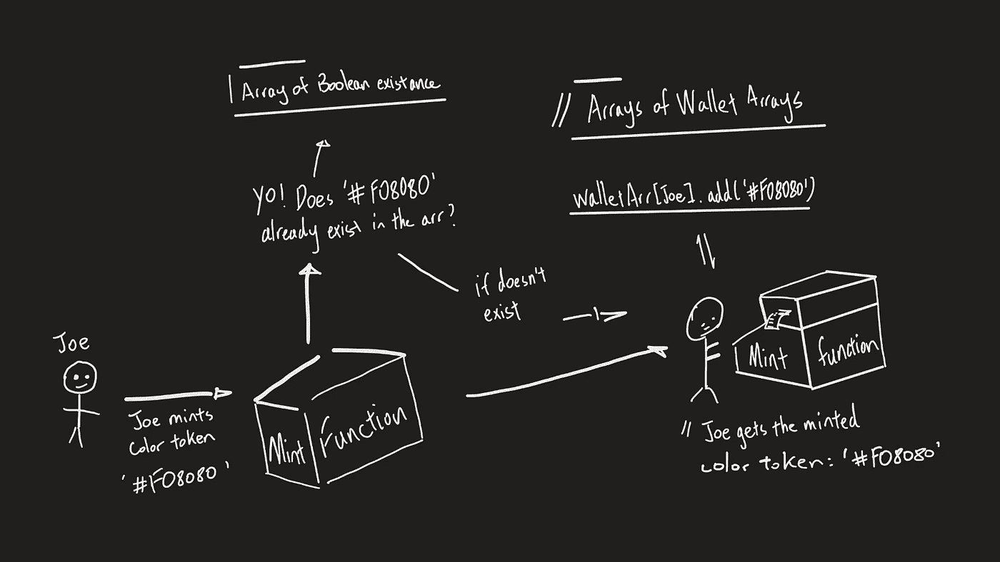
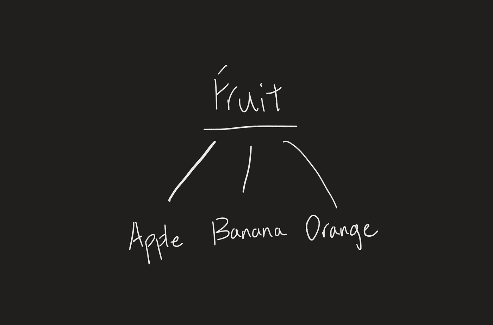
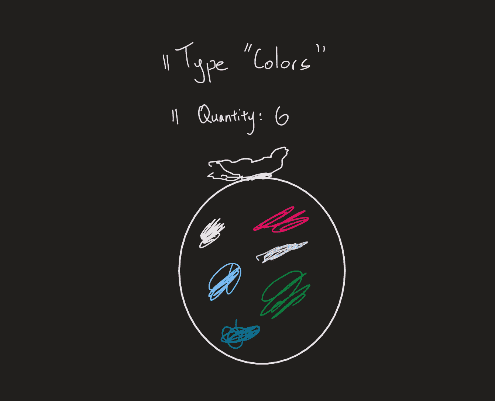
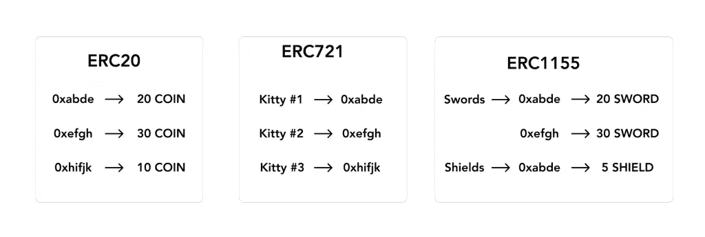
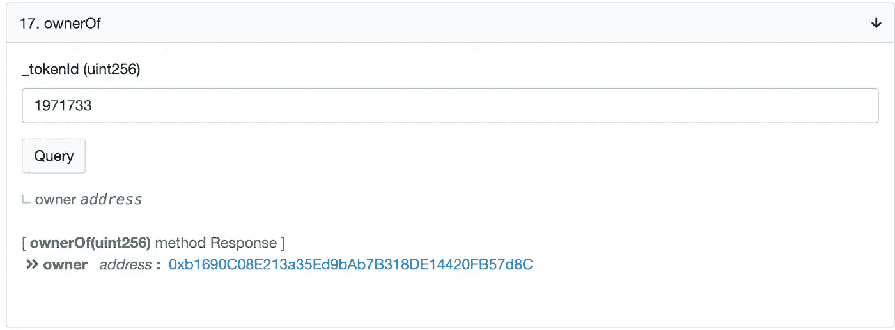
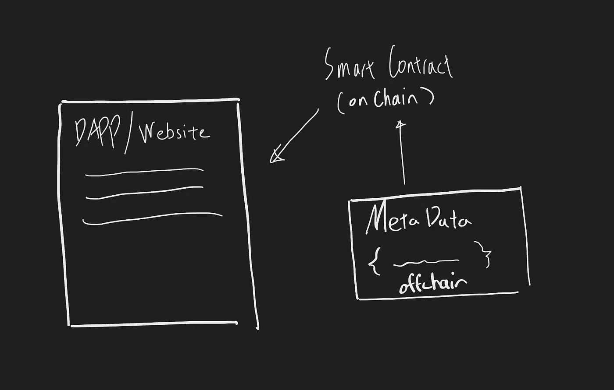
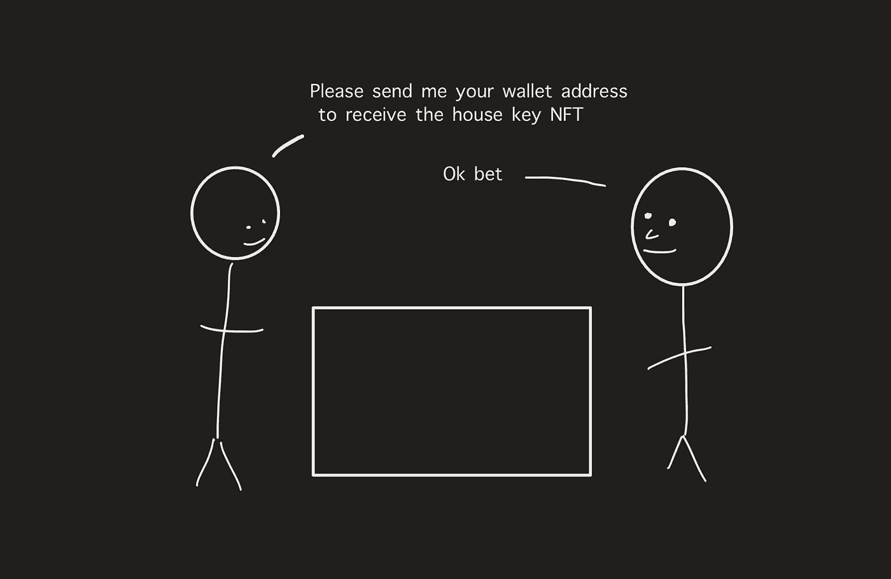

# NFTs 简介

> 原文：<https://medium.com/coinmonks/an-introduction-to-nfts-944aba5c157?source=collection_archive---------1----------------------->

NFT 或不可替代的令牌现在很流行！它们是虚拟货币的对等物。在本文中，我将解释 NFT 的概念、它们的特征、代表 NFT 的 ERC 标准，以及 NFT 如何存储数据。

> *一定程度的计算机科学知识将有助于理解文章中的主题。


Beeple Digital Artwork

NFT:不可替代的代币与你所期望的“代币”是相反的。它是 **FT:可替换代币**的小兄弟。然而，NFT 和 ft 可以被看作是彼此的对应物，因为它们的令牌结构代表不同类型的事物。**金融交易税的形式是货币**和商品，它们是一种商品，是可以交换的(例如。[乙醚](https://www.coindesk.com/price/ethereum)。另一方面，NFTs 以**不可复制或可替换的唯一令牌和实例**的形式出现(例如一幅画的一部分，一块化石的一部分……)。因此，每个 NFT 不能像以太这样的令牌一样互换。
**一个 NFT！=另一个 NFT** 。同样，因为这个原因，我将把 **NFT 代币称为单独的*资产*** 。


uniqueness

非常像它的对应物，FTs，**NFT 也在区块链上起作用**。它由智能合同“驱动”,智能合同有助于整个网络中的令牌。此外，由于智能合约的本质是帮助促进令牌在整个网络中的分发，因此智能合约的不可替代性确保了在某个时刻特定 NFT 资产只有一个副本存在。

就智能合约而言，目前最兼容和使用的 **NFT 标准是以太坊上的**[**ERC 721**](https://eips.ethereum.org/EIPS/eip-721)**标准**。事实上，它的功能几乎与所有的 [ERC20](https://ethereum.org/en/developers/docs/standards/tokens/erc-20/) 标准重叠；例如能够在具体参考令牌的情况下被转移。此外，ERC20 标准也具有向账户出借令牌的能力，但这一特定方面在 ERC721 中不可实现，因为**NFT 在值**上不可互换。

> 每个 NFT 智能控制法案都会包含一些所有权记录方式。一种常见的方法是所有权数组，存储重要的值，如每个钱包帐户拥有的资产列表，并将每个资产映射到所有者钱包地址。

NFT 令牌智能合约的一个独特方面是**造币功能**(可由客户端访问)，而 **ERC20 令牌没有**。NFTs 智能合约中的造币功能允许用户**造币并创建一个唯一的令牌。**

不同的平台，如 [OpenSea](https://opensea.io/) 、 [Rarible](https://rarible.com/) 和 [CryptoKitties](https://www.cryptokitties.co/) 都使用 mint 功能，允许用户使用 marketplaces 的在线平台创建自己独特的资产/令牌。通常，NFT 市场支持各种文件格式、图像、声音文件、动画等等(为了最大限度地发挥创造力！).

Ethereum.org 智能合同段中的代码实现将实现 NFT 令牌的不同特性:([)](https://ethereum.org/en/nft/)

*   每个 NFT 令牌被铸造并被赋予唯一的标识符
*   能够找到每个令牌/资产的所有者钱包地址
*   在以太坊 NFT 市场上买卖
*   NFT 代币铸造后，任何人都不能以任何方式更改其数据(只有在编程为自我修改的情况下，数据才会更改)
*   创作者可以在出售时获得收入(当在 NFT 市场 P2P 上出售时)

当有特殊情况**表示需要有限数量复制的资产**时，创作者可以在他们的创作阶段复制他们的创作(例如。演唱会门票)。创建者可以决定在铸造时存在多少复制品(只有那些复制品会在铸造后存在)。尽管 NFT 令牌的相同副本有不同的复制品，但它们总是被分配唯一的标识符(类似于散列)，只有一个所有者。以音乐会门票为例，活动组织者可以创建 5000 张标准门票和 500 张豪华门票。**虽然每张票的副本是相同的，但它们具有不同的标识符，就像你在实际票上看到的独特的条形码一样**。



The tickets are all the same, but the #id is different

根据十六进制颜色标记进行铸造的示例:



rough onenote sketch: Joe mints color token

**图的基本走查** :
乔想要铸造一个颜色令牌#F08080(具有唯一颜色十六进制代码的令牌)。他首先通过调用“mint 函数”来创建令牌。因为这个令牌是一个 NFT，所以 mint 函数必须检查颜色的特定十六进制代码是否已经被生成。为了继续，颜色标记必须是以前从未铸造过的。然后，当新的颜色令牌被生成时，令牌存在数组将被更新以包含新生成的颜色令牌。为了让 Joe 在技术上拥有令牌，彩色令牌将被添加到智能合约中他的钱包帐户的数组存储中，将他的钱包地址指定为彩色令牌的所有者。

# 表示 NFT 的不同标准

智能合约中不同类型的标准在不同的分散式应用程序和 web 界面中创建了一致性。以太坊 **ERC721 和 ERC1155 标准**是以太坊 ERC 标准系列的一部分(**E**thereum**R**equest for**C**comments)。它们是以太坊智能合约的应用层标准，包括令牌标准、名称注册中心、库和包。**任何人都可以创建 ERC** ，但是他们必须解释标准并在社区内获得批准。

ERC 标准通常为一种类型的令牌定义一组功能。常见的例子是 ERC20 令牌标准，这意味着创建类似以太的加密。

ERC 标准通常通过以太坊智能合约开发的主要编程语言 **Solidity** 来展示。Solidity 是一种类似于 python 和 javascript 的 OOP 风格的[图灵完整的](https://stackoverflow.com/questions/7284/what-is-turing-complete)语言。这种相似性可以从使用接口的 ERC 标准声明中看出。**界面本质上是一个空白的模板或故事板**，大致说明了智能合同应该如何构造*。*

***接口包含方法声明的第一行，如:***

```
*function ownerOf(uint256 _tokenId) external view returns (address);*
```

*但是接口不实现该方法。遵循/实现该接口的智能协定必须实现该接口内的方法。因此，ERC 标准有时被构建为智能合约开发人员遵循的接口，作为基本模板。*

*因此，您将看到一些智能合约的第一行，如下所示:*

```
*contract myContract is **ERC721** { 
  // contract content
}* 
```

## *ERC721 标准*

*ERC721 标准引入了一个仅用于 NFTs 的**接口标准。每个资产都是独一无二的，这是基于其不同的变量值，例如:年龄、稀有性、视觉效果。通过一个名为 *tokenId*** 的 *uint256* 变量，视觉效果也被合并到标准的**资产中，对于每个资产以及合同地址来说是唯一的。智能合约能够将视觉/图像存储在其内置空间中，或者使用外部数据库，利用 *tokenId* 值来访问和存储特定值。***

*ERC721 提供唯一标识符(每个代表一个 NFT 令牌资产)到所有者钱包地址的映射。*

```
****interface* IERC721** { function ***ownerOf***(uint256 _tokenId) external view returns (address);function ***transferFrom***(address _from, address _to, uint256 _tokenId) external payable;}*
```

*为了表示 NFT，以上是 ERC721 标准的本质(*注意，该标准的接口比以上更多)。 ***ownerOf*** 功能允许客户根据市场功能检查不同资产/代币的所有者，而 ***transferFrom*** 功能允许在钱包地址之间转移资产/代币。*

*除了手工实现之外，开发人员还可以通过从 ERC721 [OpenZeppelin](https://github.com/OpenZeppelin/openzeppelin-contracts/tree/master/contracts/token/ERC721) 库中导入库和包来轻松创建新的契约。*

## *ERC1155 标准*

*由[金恩](https://enjin.io/about/erc-1155)首创的 ERC1155 标准**也可以用来表示 NFT 资产**。但是，这个智能合约标准也可以用来创建**一个** [**半可替换**](https://boxmining.com/erc-1155/) **令牌**，将**的唯一性和可交换性**组合成令牌。不同的主要方面是能够使用不同的 *id* 对不同的资产进行分类和分组。这个概念非常类似于 OOP 语言中关于类的继承。(id 概念解释如下)*

**

*The items: apple, banana, and orange are all “Fruit” type*

```
***interface IERC1155** {**function** ***balanceOf***(address _owner, uint256 _id) external view returns (address);**function *transferFrom***(address _from, address _to, uint256 _id, uint256 quantity) external payable;// more implementation not shown}*
```

*上面这段接口代码是 ERC1155 标准的 的***balance 和 ***transferFrom*** 函数。关于函数的两个声明，值得注意的是，它们都具有用于引用令牌类别***的**uint256 变量 *_id* ，函数 ***transferFrom*** 具有用于传输指定类型金额的 uint 256 变量 *quantity* (变量通常在可替换令牌中定义)。***

*比如有没有一个 *id* 代表不同的“贴纸”。如果一个钱包账户拥有 300 个“贴纸”类型的资产，包括不同的贴纸项目，如“Gopro 贴纸”、“付令超贴纸”、“Supreme 贴纸”等……利用函数的*balance 并插入 *id* 类型“贴纸”的参数，将返回钱包中“贴纸”类型资产的数量，在本例中为 300 个。与转移代币类似，可以使用一个 *id* 来转移大量相同类型的资产。在这种情况下，**钱包所有者可以在一次交易中转移所有 300 个指定了 *id* 和 uint256 *数量*** 的独特贴纸。通过这种方式，在分散式交易中提供了更大的灵活性。**

**

*6 tokens of type “color”*

***ERC1155 提供了 ERC721 功能的超集**，ERC721 NFT 智能合约也可以使用 ERC1155 构建，但唯一 id 和数量保持为 1。*

# *数据映射剖析*

*这是三种不同 ERC 标准的数据映射结构。ERC20 将地址映射到金额，ERC721 将唯一 id 映射到所有者，ERC1155 具有从对所有者的引用到金额的嵌套映射。*

**

*Source: [opensea.io](https://opensea.io/blog/guides/non-fungible-tokens/#Non-fungible_token_metadata)*

# *但是合同数据存储在哪里呢？*

*这是通过名为**元数据**的文件完成的。NFT 令牌智能合同指向一系列元数据文件，以便访问视觉/图像、供应和真实性的信息。(关于[元数据标准](/blockchain-manchester/evolving-erc-721-metadata-standards-44646c2eb332)的详细信息)。*

*元数据通过变量为特定的令牌 id 提供描述性信息。例如，颜色令牌的元数据文件可能如下所示:*

```
*{
  "name": "Color",
  "hex": "#F08080",
  "link": "[https://bit.ly/3mdRahT](https://bit.ly/3mdRahT)",
  "owner": "0x6902702BB5678D7361C94441c71F600C255dd833"}*
```

*元数据文件的结构通常类似于**一系列用于存储数据的变量声明**，在这种情况下，颜色令牌的元数据告诉我们:令牌的名称、十六进制颜色代码、到颜色图像的链接以及颜色令牌的所有者。*

*NFTs 的一个在线现实例子是[隐猫](https://www.cryptokitties.co/catalogue)，一个用乙醚作为货币的小猫收集游戏(每只小猫都是独一无二的)。CryptoKitties 智能合同中的一个重要方法是*owner ROF*方法，该方法使用特定 kitty 的元数据来计算 kitty 的所有者和其他属性，该方法使用每个资产的元数据。*

**

*ownerOf Function of CryptoKitties smart contract ([deployment page](https://etherscan.io/address/0x06012c8cf97bead5deae237070f9587f8e7a266d#readContract))*

# *存储元数据*

*主要有两种选择:**链上**和/或**链外**。*

## *链上*

*“链条”指的是区块链，所以这个词完全指的是区块链上的**。这意味着无论被指定为链上的什么，都必须跟随特定区块链(例如。部署后，任何人都不能修改数据)。我关于区块链功能的文章[在这里](https://jerryq0101.medium.com/the-upcoming-blockchain-revolution-5cc0df5434b8)。***

*部署链上令牌的元数据将确保它一直存在，并且**将永久驻留在令牌**中，从而克服链外数据存储的外部因素。所以，无论原始网站或分散应用的存在，一件数字艺术都可以继续存在。*

## *断链*

*与链上相反，**数据来自区块链**。这意味着数据不必遵守区块链当地或全球的限制。然而。这造成了自由和安全漏洞(数据修改的自由)。*

*由于以太网块链的部署成本和存储限制，现在离线存储元数据更加高效和方便。许多开发人员利用集中式服务器(如 AWS 云)和星际文件系统(IPFS)来存储元数据。*

```
*function tokenURI(uint256 _tokenId) external view returns (string);*
```

*上述函数 tokenURI 是 ERC721 标准的一部分，它返回存储在互联网上的外部元数据文件的公共 URL。元数据文件应遵循 [ERC721 元数据 json 模式](https://github.com/ethereum/EIPs/blob/master/EIPS/eip-721.md)。*

**

*onenote sketch of data retrieval*

***总体:***

*   *链上元数据是时间证明，并且提供了与智能合同更有效的通信方法*
*   *链外元数据更便宜、更现实。但它不是防篡改的。*

# *现实生活和系统*

*目前，NFTs 和分散市场在技术上发展迅速。尽管 NFT 系统仍然局限于虚拟娱乐领域(例如[艺术](https://opensea.io/)、[物品](https://www.cryptokitties.co/catalogue)收藏、[歌曲](https://eulerbeats.com/)，有强烈的信号表明未来非功能性翻译将融入我们的日常生活(例如 [DeFi](https://ethereum.org/en/defi/) 。*

*在未来，实体物品的令牌化将成为可能，独特和不同的物品可以被令牌化，如房屋、口袋妖怪卡和不同的可收集的化石和艺术品等…
由于非功能性物品本质上是不同的物品，作为回报，您可以使用 ETH 购买一所房子或公寓作为 NFT(钥匙)，您的以太坊地址成为日常生活的钥匙(字面上)。*

**

*Talking drawing*

*虽然区块链由于采矿而不是非常环保，以太坊正在通过升级到[**【eth 2】**](https://ethereum.org/en/eth2/)逐步改善这一点，用基于验证节点的赌注来代替采矿。(查看我关于区块链矿业的[文章](/coinmonks/what-is-cryptocurrency-mining-3f8a02fb0887)！)*

# *结论*

*嗨，感谢你阅读这篇文章。我是 [Jerry](https://jerryqi.com/) ，15 岁，对即将到来的技术和用这些技术解决现实世界的问题充满热情。*

*下一篇文章再见！:)*

> *加入 coin monks[Telegram group](https://t.me/joinchat/Trz8jaxd6xEsBI4p)学习加密交易和投资*

## *另外，阅读*

*   *最好的[密码交易机器人](/coinmonks/crypto-trading-bot-c2ffce8acb2a) | [电网交易](https://blog.coincodecap.com/grid-trading)*
*   *[加密复制交易平台](/coinmonks/top-10-crypto-copy-trading-platforms-for-beginners-d0c37c7d698c) | [如何在 WazirX 上购买比特币](/coinmonks/buy-bitcoin-on-wazirx-2d12b7989af1)*
*   *[CoinLoan 点评](/coinmonks/coinloan-review-18128b9badc4)|[Crypto.com 点评](/coinmonks/crypto-com-review-f143dca1f74c) | [火币保证金交易](/coinmonks/huobi-margin-trading-b3b06cdc1519)*
*   *[尤霍德勒 vs 考尼洛 vs 霍德诺特](/coinmonks/youhodler-vs-coinloan-vs-hodlnaut-b1050acde55a) | [Cryptohopper vs 哈斯博特](https://blog.coincodecap.com/cryptohopper-vs-haasbot)*
*   *[杠杆代币](/coinmonks/leveraged-token-3f5257808b22) | [最佳密码交易所](/coinmonks/crypto-exchange-dd2f9d6f3769) | [Paxful 点评](/coinmonks/paxful-review-4daf2354ab70)*
*   *[加密套利](/coinmonks/crypto-arbitrage-guide-how-to-make-money-as-a-beginner-62bfe5c868f6)指南| [如何做空比特币](/coinmonks/how-to-short-bitcoin-568a2d0b4ae5)*
*   *[如何在印度购买比特币？](/coinmonks/buy-bitcoin-in-india-feb50ddfef94) | [WazirX 审核](/coinmonks/wazirx-review-5c811b074f5b) | [BitMEX 审核](https://blog.coincodecap.com/bitmex-review)*
*   *[印度比特币交易所](/coinmonks/bitcoin-exchange-in-india-7f1fe79715c9) | [比特币储蓄账户](/coinmonks/bitcoin-savings-account-e65b13f92451)*
*   *[币安收费](/coinmonks/binance-fees-8588ec17965) | [僵尸加密审查](/coinmonks/botcrypto-review-2021-build-your-own-trading-bot-coincodecap-6b8332d736c7) | [热点审查](/coinmonks/hotbit-review-cd5bec41dafb)*
*   *[我的密码交易经验](/coinmonks/my-experience-with-crypto-copy-trading-d6feb2ce3ac5) | [购买硬币评论](https://blog.coincodecap.com/buycoins-review)*
*   *[逐位融资融券交易](/coinmonks/bybit-margin-trading-e5071676244e) | [币安融资融券交易](/coinmonks/binance-margin-trading-c9eb5e9d2116) | [超位审核](/coinmonks/overbit-review-9446ed4f2188)*
*   *[加密货币储蓄账户](/coinmonks/cryptocurrency-savings-accounts-be3bc0feffbf) | [YoBit 审查](/coinmonks/yobit-review-175464162c62) | [Bitbns 审查](/coinmonks/bitbns-review-38256a07e161)*
*   *[Botsfolio vs nap bots vs Mudrex](/coinmonks/botsfolio-vs-napbots-vs-mudrex-c81344970c02)|[gate . io 交流回顾](/coinmonks/gate-io-exchange-review-61bf87b7078f)*
*   *[最佳比特币保证金交易](/coinmonks/bitcoin-margin-trading-exchange-bcbfcbf7b8e3) | [萝莉点评](/coinmonks/lolli-review-e6ddc7895ad8) | [比特币保证金交易](https://blog.coincodecap.com/bityard-margin-trading)*
*   *[创造并出售你的第一个 NFT](https://blog.coincodecap.com/create-nft) | [本地比特币评论](/coinmonks/localbitcoins-review-6cc001c6ed56)*
*   *[加密保证金交易交易所](/coinmonks/crypto-margin-trading-exchanges-428b1f7ad108) | [赚取比特币](/coinmonks/earn-bitcoin-6e8bd3c592d9) | [Mudrex 投资](https://blog.coincodecap.com/mudrex-invest-review-the-best-way-to-invest-in-crypto)*
*   *[如何在印度购买以太坊？](https://blog.coincodecap.com/buy-ethereum-in-india) | [如何在币安购买比特币](https://blog.coincodecap.com/buy-bitcoin-binance)*
*   *[顶级付费加密货币和区块链课程](https://blog.coincodecap.com/blockchain-courses)*
*   *[MXC 交易所评论](/coinmonks/mxc-exchange-review-3af0ec1cba8c) | [Pionex vs 币安](https://blog.coincodecap.com/pionex-vs-binance)*