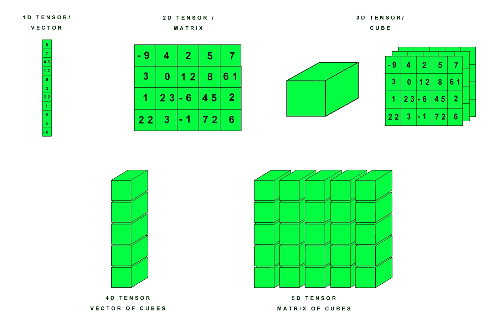
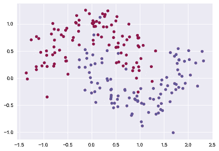
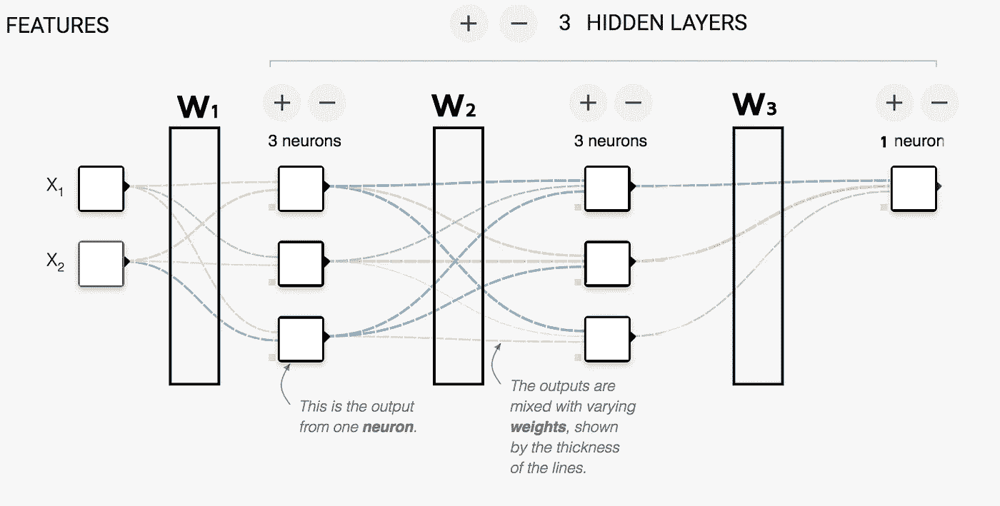
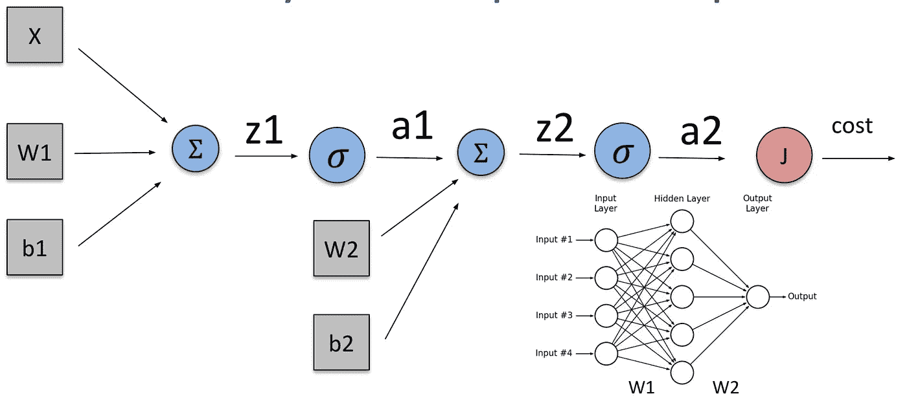
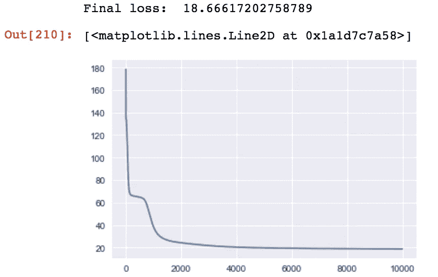

# 通过使用神经网络处理卫星数据集来介绍 PyTorch。

> 原文：<https://medium.com/coinmonks/an-introduction-to-pytorch-by-working-on-the-moons-dataset-using-neural-networks-369b1ac6ccad?source=collection_archive---------1----------------------->

> “迄今为止，人工智能最大的危险在于，人们过早地断定自己理解它。”
> ― [**埃利泽**](https://www.goodreads.com/author/show/4533716.Eliezer_Yudkowsky)

这篇文章是学习如何使用深度学习库 [PyTorch](https://pytorch.org/) 系列文章的第一篇。这是一种尝试，旨在帮助那些刚刚开始学习人工智能，并且在学习其他高水平教程时遇到困难的人。本系列中的方法是首先理解 PyTorch 内置函数背后的代码，这样可以更好地理解其背后的理论，从而获得更全面的知识。在每一篇教程中，更多的定制代码将被内置函数所取代，从而充分利用 PyTorch 的强大功能。

以下是将用于本教程的代码:

[](https://github.com/romanovacca/PyTorch-Moons-Neural-Nets/blob/master/Pytorch-moons-neural-nets.ipynb) [## romanovacca/PyTorch-Moons-神经网络

### PyTorch-Moons-Neural-Nets -教程的一部分“通过使用……

github.com](https://github.com/romanovacca/PyTorch-Moons-Neural-Nets/blob/master/Pytorch-moons-neural-nets.ipynb) 

# PyTorch 是如何工作的？

PyTorch 目前相当新，因为他们最近刚刚发布了 1.0 版本。该框架有许多组件，但其中一个重要的组件是 GPU 的利用。这意味着 PyTorch 可以做和 numpy 一样的事情，但是使用 GPU 的能力来计算更快，这对神经网络非常有用。这里要提到的重要部分是，这只需要一行代码就可以激活，而 Tensorflow 和其他程序需要更多的工作。

**所需包**

*   PyTorch
*   熊猫
*   Numpy
*   Matplotlib
*   Sklearn
*   海生的

# 了解 PyTorch

PyTorch 使用称为张量的矩阵状结构。这些张量可以看作是矩阵的推广，看起来像 n 维数组(numpy 中的 ndarrays)。如果你想更深入地了解张量，点击[这里](/@quantumsteinke/whats-the-difference-between-a-matrix-and-a-tensor-4505fbdc576c)。



Vector/matrix/tensor visualisation from : [https://hackernoon.com/learning-ai-if-you-suck-at-math-p4-tensors-illustrated-with-cats-27f0002c9b32](https://hackernoon.com/learning-ai-if-you-suck-at-math-p4-tensors-illustrated-with-cats-27f0002c9b32)

要创建张量，我们首先要导入 Pytorch 模块，名为 torch。

```
import torchx0 = torch.tensor(10) # 0-dimensional tensor (single value)
x1 = torch.tensor([10,2,5,2,10]) # 1-dimensional tensor (vector)
x2 = torch.tensor([[10,2,4],[5,2,10]]) # 2-dimensional tensor (vector)
x3 = torch.tensor([[[10,2],[5,2]], [[3,1],[15,8]]]) # 3-dimensional tensor (matrix)
```

我们创建 4 个变量 x0，x1，x2，x3，它们都有不同的形状，我们可以通过调用。形状，就像我们对普通 numpy 数组所做的那样。

```
(torch.Size([]), torch.Size([5]), torch.Size([2, 3]),
 torch.Size([2, 2, 2]))
```

火炬张量也有如下类型:

*   火炬。龙腾传感器
*   火炬。漂浮者
*   火炬。双张量

**小心:**张量类型在用它们做计算时需要匹配。如果得到关于类型不匹配的错误，可能需要设置张量的 dtype。

```
x1 = torch.tensor([[10,2,4],[5,2,10]])
x2 = torch.tensor([[0.1, 10.67],[0.15,0.22]])
x3 = torch.tensor([[0.1, 10.67],[0.15,0.22]], dtype=torch.double)
```

**将 numpy 转换为 torch 张量**

PyTorch 中一个强大的转换是从 numpy 数组到 Torch 张量的转换，反之亦然。

```
import numpy as npx_numpy = np.random.randn(10,2)
x_torch = torch.tensor(x_numpy)
type(x_numpy), type(x_torch), type(x_torch.numpy())>>> (numpy.ndarray, torch.Tensor, numpy.ndarray)
```

现在您已经看到了 PyTorch 的一些功能，让我们从 Moons 数据集开始，探索 PyTorch 的其他特性。

# 卫星数据集



Example Moons distribution

moons 数据集是来自 [scikit-learn](http://scikit-learn.org/stable/) 的一个简单的内置数据集。我们使用一个神经网络(我们将自己创建)来解决这个问题。

```
import matplotlib.pyplot as plt
from sklearn import datasets
# plt.style.use('seaborn') 
# %matplotlib inline
```

我们导入所有必要的库。注意:如果你正在使用 [Jupyter 笔记本](http://jupyter.org/)，你可以取消最后两行的注释，这样图形就可以在笔记本中生成。

```
X,y = datasets.make_moons(n_samples=200, shuffle=True, noise=0.2, random_state=1234)
y = np.reshape(y, (len(y),1))
```

我们创建两个变量，X 和 y，它们将存储数据点和相应的标签。我们希望有一个 shape (200，1)的 y 数组，这样我们就可以将数据点匹配到正确的标签，从而进行整形。

现在我们有了数据，是时候制作我们自己的神经网络了！

**神经网络**

PyTorch 有自己内置的神经网络类，但出于演示和学习的目的，我们将构建自己的类。更多关于 PyTorch 神经网络的信息可以在[这里](https://pytorch.org/docs/stable/nn.html)找到。

```
input_size = 2 
hidden_size = 3 # randomly chosen
output_size = 1 # we want it to return a number that can be used to calculate the difference from the actual numberclass NeuralNetwork():
    def __init__(self, input_size, hidden_size, output_size):# weights 
        self.W1 = torch.randn(input_size, hidden_size, requires_grad=True)
        self.W2 = torch.randn(hidden_size, hidden_size, requires_grad=True)
        self.W3 = torch.randn(hidden_size, output_size, requires_grad=True)# Add bias
        self.b1 = torch.randn(hidden_size, requires_grad=True)
        self.b2 = torch.randn(hidden_size, requires_grad=True)
        self.b3 = torch.randn(output_size, requires_grad=True) def forward(self, inputs):
        z1 = inputs.mm(self.W1).add(self.b1)
        a1 = 1 / (1 + torch.exp(-z1))
        z2 = a1.mm(self.W2).add(self.b2)
        a2 = 1 / (1 + torch.exp(-z2))
        z3 = a2.mm(self.W3).add(self.b3)
        output = 1 / (1 + torch.exp(-z3))
        return output
```

这里发生了很多事情，通过可视化可以更好地理解这些代码。让我们从 __init__ 开始:



Neural net visualization from [https://playground.tensorflow.org/](https://playground.tensorflow.org/)

这张图片是我们正在构建的神经网络的可视化。输入大小(2)与图像中的两个特征(x1，x2)匹配。我们将隐藏大小指定为 3，这可以看作是图像中的三个垂直块或神经元(每个隐藏层三个)。在代码中，我们指定了 **W** 1、 **W** 2、 **W** 3，它们是矩阵，因此大写字母 W。这意味着例如 **W** 1 存在于[w1，1 | w1，2 | w1，3 | w2，1 | w2，2 | w2，3]中。此外，还增加了一个偏差。



Forward propagation of another neural network

```
z1 = inputs.mm(self.W1).add(self.b1)
a1 = 1 / (1 + torch.exp(-z1))
```

正向函数可以通过取 **X** 乘以 **W1** 的和以及偏差来计算。在 PyTorch 中，我们使用函数"。“mm”是矩阵乘法的缩写(因为 **X** 1 和 **W** 1 是矩阵),我们给它加上偏差。然后，我们使用激活函数，在这种情况下，sigmoid 在模型中引入非线性。这样做是为了让模型能够了解数据中更复杂的关系。该输出然后被用作下一层的输入，依此类推。

到目前为止，我们得到的代码只完成了一半的工作，它使我们能够通过网络提供输入，但网络需要适应以获得更好的结果，这是通过反向传播完成的。

```
epochs = 10000
learning_rate = 0.005model = NeuralNetwork(input_size, hidden_size, output_size)
inputs = torch.tensor(X, dtype=torch.float)
labels = torch.tensor(y, dtype=torch.float)#store all the loss values
losses = []
```

我们设置变量“model”，向它传递输入大小 2、隐藏大小 3 和输出大小 1。在这种情况下，输入和标签都是浮点数(x 和 y 值)。我们创建了一个变量“损失”,这样我们可以在以后显示损失是如何沿着道路发展的。

然后，我们为反向传播创建一个循环:

```
for epoch in range(epochs):# forward function
    output = model.forward(inputs)#BinaryCrossEntropy formula
    loss = -((labels * torch.log(output)) + (1 - labels) * torch.log(1 - output)).sum()#Log the log so we can plot it later
    losses.append(loss.item())#calculate the gradients of the weights wrt to loss
    loss.backward()#adjust the weights based on the previous calculated gradients
    model.W1.data -= learning_rate * model.W1.grad
    model.W2.data -= learning_rate * model.W2.grad
    model.W3.data -= learning_rate * model.W3.grad
    model.b1.data -= learning_rate * model.b1.grad
    model.b2.data -= learning_rate * model.b2.grad
    model.b3.data -= learning_rate * model.b3.grad#clear the gradients so they wont accumulate
    model.W1.grad.zero_()
    model.W2.grad.zero_()
    model.W3.grad.zero_()
    model.b1.grad.zero_()
    model.b2.grad.zero_()
    model.b3.grad.zero_()print("Final loss: ", losses[-1])
plt.plot(losses)
```

首先，我们通过模型传递输入，这给了我们一定的输出。PyTorch 有一个内置函数来计算 BinaryCrossEntropy，但是为了更好地理解它，我们自己构建了它。PyTorch 可以通过调用。backward()，自动计算所有的梯度。现在我们有了权重应该改变的方向，为了更准确地预测某个输入的结果，我们必须实际更新它们。

```
model.W1.data -= learning_rate * model.W1.grad
```

这里我们说 W1 的所有权重都要减(学习率*梯度)。这样做之后，我们需要将计算出的梯度设置为零，否则这些梯度会累积起来，搞乱我们的网络。

最后，我们可以绘制损失图，看看我们的表现如何。



# 丰富

为了测试你对 PyTorch 实现的理解程度，我建议增加更多的层，或者改变隐藏的大小。添加另一个激活功能也是可能的。

# 结论

本文展示了如何通过使用低级内置函数开始使用 PyTorch。在接下来的教程中，我们将使用 PyTorch 更多的内置函数。本文的目标是更好地理解神经网络是如何实现的。

在下一个系列中，我们将在 [Titanic](https://www.kaggle.com/c/titanic) 数据集上使用 PyTorch 和神经网络。

[](https://github.com/romanovacca/PyTorch-Moons-Neural-Nets/blob/master/Pytorch-moons-neural-nets.ipynb) [## romanovacca/PyTorch-Moons-神经网络

### PyTorch-Moons-Neural-Nets -教程的一部分“通过使用……

github.com](https://github.com/romanovacca/PyTorch-Moons-Neural-Nets/blob/master/Pytorch-moons-neural-nets.ipynb)