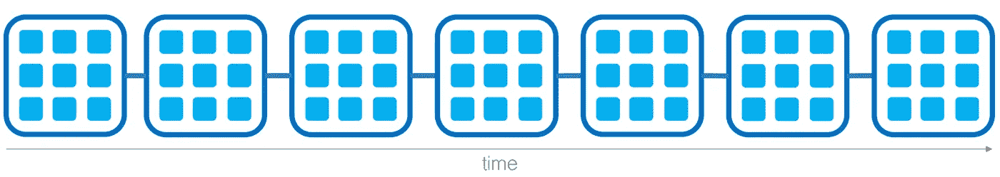
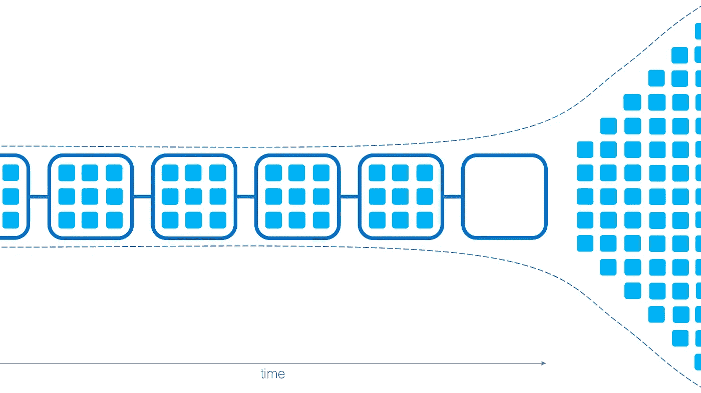
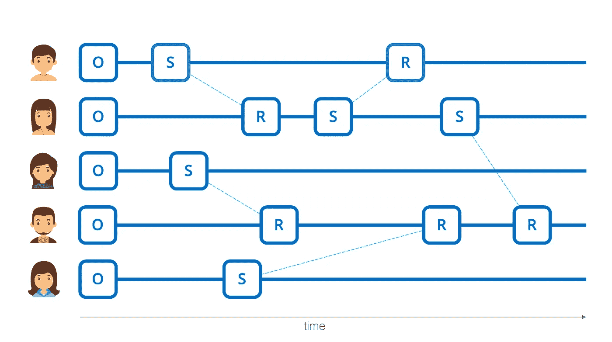

# 块格引论

> 原文：<https://medium.com/coinmonks/an-introduction-to-the-block-lattice-382071fc34ac?source=collection_archive---------2----------------------->

## *解决当今区块链问题的技术*

像 Nano 和 Nollar 这样的下一代支付加密货币做出了一些大胆的承诺，听起来好得令人难以置信。他们提供快速和无感觉的交易，不需要对环境有害的采矿。今天，我们来看看这些下一代支付加密货币的系统架构，即所谓的 **block-lattice，**，并将其与其前身区块链进行比较。

*我们将尽可能保持简单的解释，不要过于深入技术细节，以便不熟悉加密货币世界的读者能够从本文中获得最大价值。因此，我们将抽象出一些技术方面，这些将在以后的文章中讨论。*

2014 年，软件开发人员兼 Nano 创始人科林·勒马休(Colin LeMahieu)在他的 [Nano 白皮书](https://nano.org/en/whitepaper)中介绍了这种块格架构。LeMahieu 采用了六年前在比特币白皮书中介绍的基本原则，并对其进行了改进。他的目标是设计一种能够满足全球支付系统*要求的加密货币，并且*能够与万事达卡、维萨卡或贝宝等公司竞争。由于 NOS 协议是从 Nano 衍生而来的，它继承了所有的特性和能力。

为了理解块格结构是如何工作的以及为什么需要它，我们应该首先看看传统的区块链及其缺点。

一个*区块链*是一个数据结构，由包含信息片段的按时间顺序排列的块组成，其中每个块引用前面的块，一直到第一个，它被称为*起源块*。这就产生了同名的链状结构:

区块链数据结构提供了一些有趣的特征，使其成为创建分布式信息分类帐的有用工具。

区块链技术最常见的使用案例之一是货币价值的转移，因为链接机制无缝跟踪网络上每个参与者的交易历史，并确保一枚硬币的所有权不会同时分配给多个帐户。其中，每条信息包括某笔交易的发送方和接收方，以及要发送的硬币数量。通过分析从起源板块到当前板块的所有交易，可以得出所有账户当前余额的分类账。

如何创建新交易？进行新交易的过程在特定加密货币的协议中定义。就比特币而言，这一过程包括以下(简化的)步骤:

1.  交易的发送者授权并向网络的其余部分广播他想要的交易。
2.  被称为*矿工*的特殊网络参与者拾取广播的事务并将其添加到未处理事务池中。
3.  比赛开始，获胜的矿工选择并验证一些未处理的交易(例如，确保发送者有足够的余额来进行期望的交易，并且他不能将相同的硬币发送到两个不同的账户)。成功的挖掘器将事务添加到新的块中，并将该块附加到链中。他的努力得到了新铸造的比特币的回报。
4.  一旦成功的矿工将他的新块添加到链中，并且其他人都同意这个结果，矿工之间的新竞争就开始了。

在一个使用**工作证明的系统中，**矿工试图猜测一个随机数，称为*随机数*。第一个猜对随机数的矿工获胜。因为得出随机数是一项计算任务，所以获胜的概率与一个矿工在整个网络的总计算能力中所占的计算能力份额成正比。

区块链有许多用例，如分布式存储、数字身份、分散式应用或智能合同。然而，它们有一些固有的缺点，使它们不适合作为货币交易的工具:

*   首先，传统支付加密货币的 PoW 系统为矿工创造了经济激励，使他们使用更多的计算能力，从而消耗更多的电力。
*   其次，每个区块只能包含有限数量的交易，这造成了一个瓶颈，限制了基于区块链的加密货币的交易吞吐量。例如，比特币协议每秒最多只能处理七笔交易。如果对交易的需求很高，成功的矿工必须选择将哪些交易添加到他的区块中。为了确保添加特定的交易，发送者在交易中包括费用。因此，当交易需求较高时，比特币交易的成本会变得更高。[2017 年 12 月 21 日，比特币网络的日均交易费达到了 37.50 美元的历史新高。](https://bitcoinfees.info)

*   第三，区块链很慢。以比特币为例，平均每 10 分钟就有一个新的区块产生。为了确保交易已结算且不可逆，发送方必须等待至少 30 分钟。在零售商店的交易通常只需几秒钟的世界中，这一时间量显然是不合理的，并将阻止传统加密货币在日常交易中的采用。

现在我们对区块链的功能和它们的缺点有了一个基本的了解，让我们看看块格和它们是如何克服这些缺点的。

为了理解块状晶格的结构，想象一排平行的区块链。每个链属于网络上的一个账户，因此被称为*账户链*。只有帐户的所有者自己可以更新他的帐户链并向其追加新的块。

Icons made by Freepik from Flaticon

通过广播一个*开放块*创建一个账户链。所有后续块都引用同一帐户链上的前一个块。这种设计允许网络参与者与其他链异步地更新他们的账户链。

与传统的区块链系统相比，块格系统中的块不包含成千上万的捆绑交易。相反，每笔交易都由发送方账户链上的*发送块*和接收方账户链上相应的*接收块*组成。将交易分成两部分，结合每个网络参与者可以改变自己的链的事实，使得发送者即使在接收者离线时也可以进行交易。

为了进行交易，发送者创建发送块，该发送块包含接收账户的地址、要发送的硬币数量以及对其账户链上的最后一个块的引用。然后，他将该块添加到他的链中，并将其广播到网络。一旦网络同意交易的有效性，硬币从发送者的余额中扣除，交易被结算。整个过程通常不到 3 秒钟。

为了接收资金，接收帐户的所有者现在只需创建一个相应的接收块，并将其附加到自己的帐户链中。一旦他将该块广播到网络，资金就被添加到他的余额中。

Nano 协议使用一种被称为[委托利益证明(dPoS)](https://github.com/nanocurrency/raiblocks/wiki/Double-spending-and-confirmation) 的共识技术来防止用户重复花费他们的硬币。根据 dPoS，每个账户所有人都指定一名*代表*代表他验证新的账户。如果一个网络参与者试图通过广播两个块来重复花费他的硬币，这两个块指的是相同的前面的块，代表们投票决定保留哪个块和丢弃哪个块。他们的投票权重与其他账户分配给他们的硬币数量成正比。一旦获得投票权重总和超过 50%的代表的验证，该区块即被视为已解决。这样，只有一个冲突的块被保留，并且防止了重复花费。由于帐户链相互独立，所以在投票过程中，其余的帐户可以继续进行交易。

dPoS 架构允许无感觉和接近即时的事务以及更高的事务吞吐量，因为它消除了与块挖掘相关的成本和时间。2018 年 8 月 17 日，Nano beta 网络达到了每秒 [756 次交易](https://coingape.com/nano-network-stress-testing-bitcoin-superstore-support/)的最大交易吞吐量，相比之下，比特币每秒只有 7 次交易。

我们 NOS 相信，像 Nano 或 Nollar 这样的下一代支付加密货币有潜力取代传统的支付加密货币，并满足技术要求，以与参与全球货币转移过程的传统金融机构竞争。

> [直接在您的收件箱中获得最佳软件交易](https://coincodecap.com/?utm_source=coinmonks)

