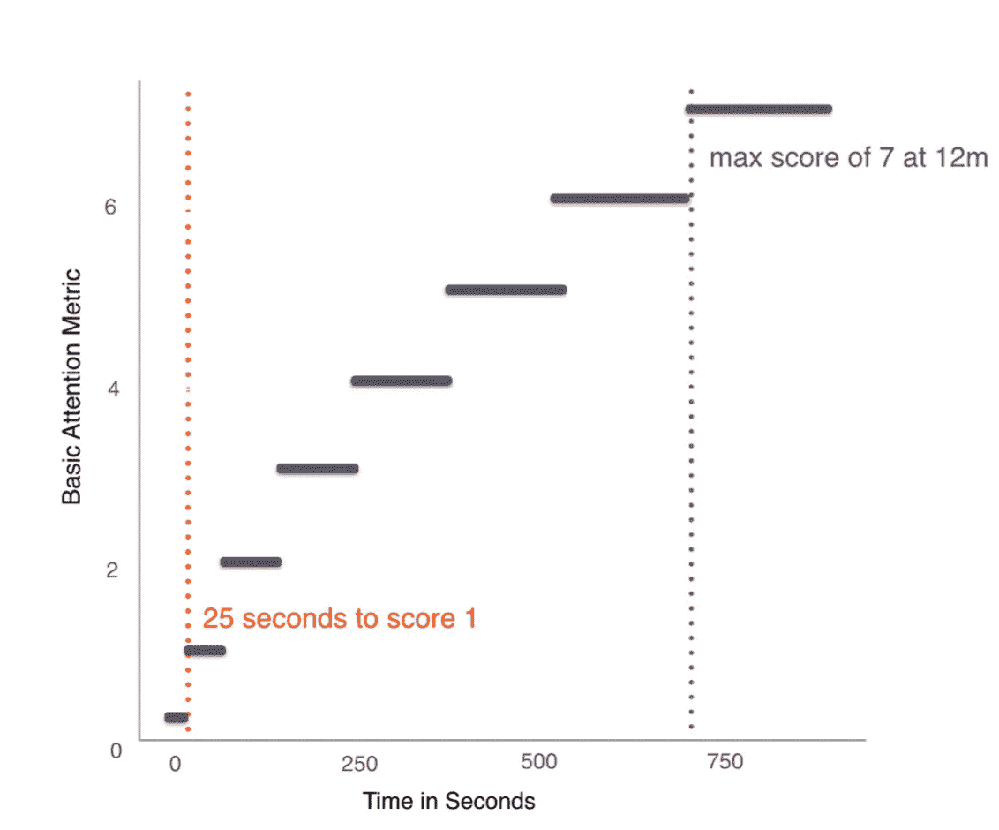
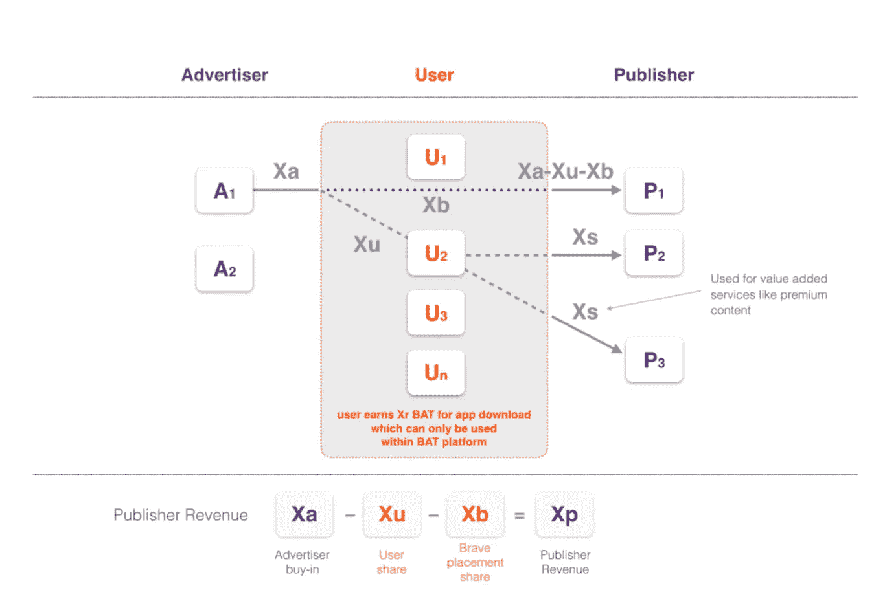

# 勇敢浏览器和基本注意力令牌概述

> 原文：<https://medium.com/coinmonks/an-overview-of-brave-browser-and-the-basic-attention-token-4f46c796d300?source=collection_archive---------7----------------------->

*原发表于一系列帖子* [*此处*](http://orioldc.com)

我最近开始使用[勇敢浏览器](https://brave.com/)并阅读了关于它的[基本注意力令牌](https://www.basicattentiontoken.org/) (BAT)。我认为这两个人有机会改变越来越有害的在线广告行业。

Brave 的主要目的是改善用户隐私，并通过这样做提供增强的浏览体验。整个应用程序是围绕最大限度的用户隐私高于一切的概念构建的。这就是为什么默认情况下，勇敢阻止广告，第三方 cookies，第三方指纹，恶意软件和网络钓鱼，并提供 HTTPS 连接无处不在。Brave-BAT 希望通过使用区块链技术来实现这一目标。

每个人都可以很容易地看到这些默认功能是如何不利于在线广告行业的，最明显的是广告拦截功能。但是这个项目有一个计划来保持这个广告资助的在线媒体经济的活力。这个计划叫做 BAT。

BAT 是一个公用令牌，允许广告商、出版商和用户在 Brave-BAT 区块链生态系统中进行交易。这种效用令牌可以使广告商为广告空间(或 BAT 创造者愿意出售的用户注意力)付费，出版商为其广告空间或内容付费，或用户因出版商和广告商之间的市场交易引起的[负外部性](http://www.economicsonline.co.uk/Market_failures/Externalities.html)而获得奖励。

以下是对该项目的概述，以及一些关于如何改进的个人观点。

# 背后的经济理论

区块链项目的美妙之处在于，它们通常依赖经济理论，为现实世界的问题提供替代方案。密码安全的区块链系统是多学科的结合，主要是计算机科学、经济学和法学。

当前的在线广告市场效率低下。对所有参与者来说，最有价值的资产**用户注意力**交易不畅。因广告投放的影响而导致浏览体验恶化的用户不会因此得到补偿。勇敢——英美烟草公司以科斯定理为基础，为这些低效问题提供了一个解决方案。

但是，在进入拟议的解决方案之前，是什么因素使这个市场效率低下？

*   对广告商来说:多个中间商使得广告库存更加昂贵。由于技术限制，用户定位和广告投放测量不准确。广告欺诈降低了广告投资的有效性(事实上，广告商通过“广告印象”而非“用户注意力”进行交易，从而刺激了欺诈者)。
*   对出版商来说:多重中间商、广告欺诈和广告拦截器使用的增加减少了收入。销售更多“广告印象”的需求导致了广告混乱和可疑的流量生成技术。点击诱饵文章将焦点从调查性新闻转移到仅仅吸引眼球的标题上。
*   对用户而言:隐私问题、广告混乱、沉重的页面、缓慢的加载时间和移动数据消耗的增加导致了糟糕的用户体验(这反过来又刺激了广告拦截器的使用)。

一个更有效率的市场应该是这样的:用户体验较少受到发行商和广告商之间的“广告印象”交易所产生的负面外部性的干扰，广告商有效地投资，发行商最大化其内容的收益。通过将交换的单位从“广告印象”变为“用户注意力”并改善“用户注意力”的交易条件，这个市场可以变得更有效率。这就是提议的解决方案。

从技术的角度来看，BAT-Brave 可以改进用于锁定用户、投放和衡量广告的手段。这可以通过利用 Brave browser 中的内置测量工具以及区块链来实现，该工具可以安全和秘密地记录用户数据、广告投放数据，并实现广告商和出版商之间的即时经济交易。这些功能也有助于减少目前参与在线广告交易的中间商数量。

从用户的角度来看，这种技术进步无法避免的负面外部性(或经济成本术语中的“广告污染”)可以通过对用户注意力的小额支付进行补偿。

因此，随着广告商直接向出版商支付**实际上** l **用户关注**的费用，随着用户从剩余的负外部性中获得这些费用的一部分，BAT 经济理论认为可以实现一个更有效率的市场。

# 注意力指标

与“广告印象”相反，在线广告市场中的“用户注意力”交易需要一种新的衡量标准。迄今为止，广告客户通常基于“印象”购买库存，印象代表广告在页面中显示的次数。要进行“用户关注”交易，你需要首先定义“用户关注”的衡量方式。

Brave-BAT 提出了几个注意力指标:

*   在单个活动窗口中广告内容的总观看次数为 5 次，每次至少 5 秒。这些点击将在 30 天的滚动周期内进行计算。
*   凹分。一种根据用户在网站上花费的时间奖励出版商的分数，随着观看时间的延长回报递减。因此，2 秒视图将是 1“点”，30 秒视图将是 2“点”，60 秒视图将是 3 点。比如说。

Brave 目前使用的基于用户关注度奖励发布者的关注度评分是凹点评分的一种实现，为了达到 1 的关注度评分，凹点评分的最低阈值为 25 秒。这是评分系统如何工作的图示，摘自 [BAT 白皮书](https://www.basicattentiontoken.org/BasicAttentionTokenWhitePaper-4.pdf)

Thresholded basic attention metric

# 实用程序令牌

基本注意力令牌(BAT)是为勇敢者-BAT 生态系统提供燃料的汽油。BAT 可以被定义为一个公用令牌，它促进了在 Brave-BAT 生态系统中的访问和交易。计划中的工作流程是，广告商通过向出版商发送 BAT 来获得广告库存，用户和 Brave browser 从每笔交易中收取少量费用。

按照英美烟草[白皮书](https://www.basicattentiontoken.org/BasicAttentionTokenWhitePaper-4.pdf)的工作流程:

Workflow of BAT tokens in the ecosystem

利用最佳可得技术来促进交易，可以形成一个系统，消除今天在线广告中的许多中间商，并有能力为这种交易产生的“负外部性”奖励用户。

从技术上来说，BAT 交易的第一次迭代将发生在“勇敢的分类账系统”中，这是一个内置的分类账，允许用户根据他们网站上的关注度向出版商捐款(使用前面描述的凹分数)。BAT 的进一步迭代计划使用分布式账本系统(以太坊)来促进 BAT 和广告从广告商到用户的流动。对 BAT 交易使用诸如以太坊的公共分布式分类帐将有助于系统的公共责任和可伸缩性。

BAT 作为实用工具也为开发其他可以利用该系统的应用程序打开了大门。例如，优质出版商可以要求用户向英美烟草付费，以获得优质内容(我在[之前的](https://www.orioldc.com/blog/2018/3/30/there-is-an-appetite-for-micropayments-for-premium-content)帖子中回顾了这个想法)。或者用户自己可以用他们赚来的 BAT 来用广告推广他们自己的小企业或团体，甚至从在线卖家那里购买数字商品。

# 总结所有好的方面和可以改进的地方

勇敢蝙蝠项目总结。

优点:

所有主要参与者(广告商、出版商和用户)都更喜欢一个简化且更高效的在线广告市场。通过使用公共分布式分类账实现的公共问责制为当前不透明的广告技术部门引入了更多的透明度。

用户在隐私方面赢了，同时也因为不得不接收广告的不利方面得到了回报。广告商在广告活动的花费效率和衡量方面胜出。出版商收入最大化得益于与广告商更直接的关系，以及 BAT token 带来的新收入流。

将注意力分为几个层次(例如从 1 到 7)的想法听起来很有吸引力。广告清单可以被分布成从“低关注”质量到“高关注”质量的片段。广告商和出版商可以预期“高关注度”库存的较高价格和较低可用性，以及“低关注度”的较低价格和较高可用性。这种基于注意力的衡量标准也带来了其他好处。

当谈到隐私时，有了拟议的 Brave-BAT 系统，出版商将无需为第三方跟踪供应商征求用户同意(这是目前 GDPR 在欧盟的疯狂行为)。用户的数据永远不会离开他们的设备，只会根据用户的选择与他人共享。换句话说，用户对他们生成的数据拥有完全的控制权和所有权，因此[的同意管理平台](http://advertisingconsent.eu/)，比如 GDPR 推广的那些，就变得多余了。

用户采用率可能很高。可以根据当前用户对广告拦截器的采用情况来预测 Brave 的潜在市场份额。如果广告拦截器的用户真的关心他们阅读的出版商的生存和免费互联网，那么他们没有理由使用标准浏览器+广告拦截器，而不是勇敢的浏览器。对于这类用户，Brave browser 允许广告拦截用户“喜爱”的免费互联网生存。

广告商的采用率可能很高。广告商可能会发现购买“实际用户注意力”的能力比购买“广告印象”更有吸引力。目前分散在在线广告购买过程中的许多中间商手中的钱可以重新用于更有吸引力的产品，对出版商和用户来说更有回报。通过使用 BAT token 实现的未来应用也可以使他们受益:当你可以直接提供用户可以用来交换产品或服务的 BAT token 时，忘记广告中的优惠券代码！

出版商可以从失去的收入机会中获益(如果用户使用标准浏览器+广告拦截器扩展)。通过加入 Brave，他们仍然可以从不会从广告中产生任何收益的用户那里获得收入。从长远来看，从“点击诱饵”文章(用于产生高水平的印象)转向高质量的调查新闻(用于产生高水平的关注)，在线新闻可以整体受益。基于注意力的定价也证明了高质量库存的高价格是合理的。

坏消息:

出版商可能会觉得他们的库存被 Brave 劫持了。看起来似乎是在与 Brave 的货币化平台合作或让你的广告库存被 Brave 内置的广告屏蔽系统屏蔽之间做出选择。出版商仍然可以选择如何销售他们的广告，而不必被迫与一个盈利伙伴合作。Brave 能做的就是通过提供更好的用户体验来吸引出版商与他们合作，尤其是在广告服务和数据隐私方面。

出版商也可以辩称，短期内广告会被屏蔽(Brave 目前还没有完全成为一个广告平台)。出版商目前从使用 Brave 的用户那里获得的唯一收入来源是每月自愿的 BAT 捐款，这些捐款是根据“凹注意力得分”分配的。

区块链以太坊的规模目前是一个问题。为了记录用户数据、广告投放数据以及广告商和出版商之间的经济交易，以太坊每秒需要处理的交易数量远远超过 13 笔。我们说的是每秒几百万次是可行的。

随着 cookies 和任何类型的第三方跟踪的阻止，Brave browser 应该开发一整套超越标准印象和点击的跟踪功能。这也将允许基于“行动”或“转换”的质量来创建新的度量标准。例如，用户点击后发生的“动作”。

没有一个字是关于整合当前的在线广告生态系统的。在线广告生态系统中的所有不同参与者都可以使用所谓的[开放 RTB 协议](https://www.iab.com/guidelines/real-time-bidding-rtb-project/)轻松地相互交流。这在整个行业中被广泛使用。Brave 应该找到一种方法，与使用该协议的所有参与者进行通信，以实现更大的规模。

总的来说，我觉得 Brave-BAT 提供的好处大于缺点，但这个项目需要进一步的发展才能茁壮成长。