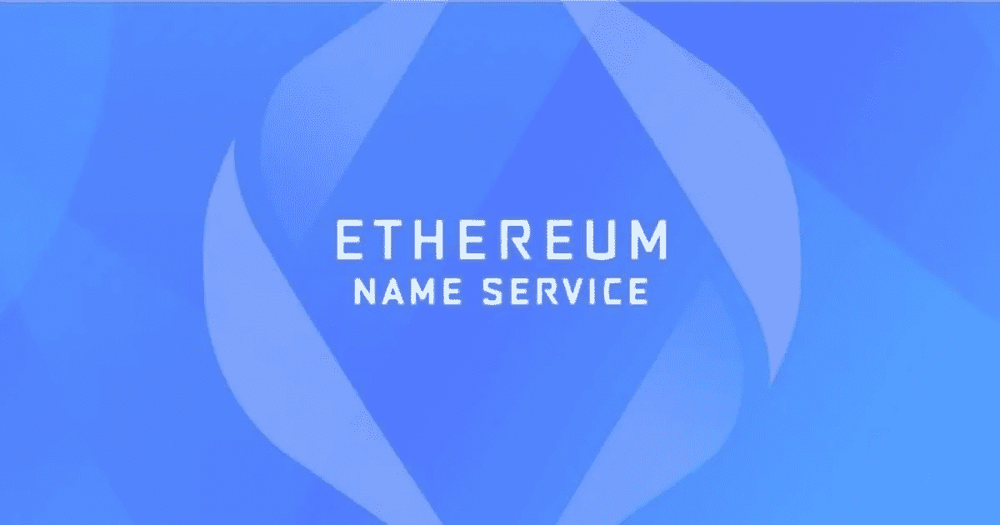

# 以太坊名称服务(ENS)概述

> 原文：<https://medium.com/coinmonks/an-overview-of-ethereum-name-service-ens-e736d0b946ba?source=collection_archive---------1----------------------->

ENS 是一个基于[以太坊](https://ethereum.org/en/)的 dApp，它提供了一个新的命名系统，加密用户可以将他们的长字母数字钱包地址转换成人类可读的格式。ENS 于 2017 年初在以太坊基金会成立，但在 2018 年，它作为一个独立的组织剥离出来。该平台由新加坡非营利的真实姓名有限公司管理。

对于每个互联网用户来说，每天访问几个不同的网站是很常见的。几乎每个网站的名字都可以很容易地通过简单的一瞥读懂。但是我们的操作系统或者互联网理解这些简单的词吗？答案是否定的。后端服务器/应用程序帮助用户找到确切的网站，并在浏览器和操作系统的帮助下用正确的 IP 地址进行映射。以太坊名称服务(ENS)服务于相同的目的，但是具有一些不同的功能。在 ENS 中，域被映射到 42 个字符长的以太坊地址，而不是 IP 地址。顶级 ENS 域名是. eth。

ENS 的主要工作是将 ABC.eth 等人类可读的名称映射到机器可读的标识符，如以太坊/其他加密货币地址、内容哈希和元数据。ENS 对于每个用户来说都是唯一的，取决于他们的以太坊地址。您可以使用这个地址设置和[接收多种加密货币](https://www.altcoinbuzz.io/bitcoin-and-crypto-guide/how-to-get-eth-domain-for-your-ethereum-address/)。你所需要做的就是在 ENS 记录部分添加令牌地址，就这样。您现在可以接收使用您的设置的所有加密货币。ETH 地址。

## **ENS 架构**

下面是 ENS 架构的高级示意图。ENS 有两个核心组件:ENS 注册中心和解析器。

ENS 工艺流程如下:

为了解析一个 ENS 地址，如果有一个用户有一个域名，比如 ABC.eth，那么它首先查询注册中心智能合同以找到正确的解析器。解析器然后引用底层以太坊地址并作出响应，类似于这样——oxe 754689 EB 4 DDD 3987 a 24…

## **核心部件**

ENS 有两个主要组件:

*   登记处
*   下决心者

## **注册表**

这些是在区块链以太坊运行的智能合约。注册商拥有一个域名，所以如果你想建立一个域名，你需要与注册商互动。

不同的域名有不同的注册商。如果用户希望拥有一个. eth 域，他/她需要与。联邦理工学院注册处。

ENS 注册中心的主要功能是将域名映射到正确的解析器。ENS 与以太坊地址的映射从查询注册表开始。注册表维护域和子域列表、所有者记录、解析器以及每个域的缓存 TTL(生存时间),允许域的所有者对数据进行更改。

ENS 注册表存储以下三条重要信息:

*   域的所有者
*   域的解析程序
*   域下所有记录的缓存生存时间

域所有者可以是外部帐户(用户)或智能合同。ENS 注册表中域的所有者可以设置以下属性:

*   为域设置解析器和 TTL
*   将域的所有权转移到另一个地址
*   更改子域的所有权

## **解析器**

顾名思义，解析器解析将 ENS 域名转换成它们各自的地址或散列的查询。

解析器需要根据记录的类型实现正确的方法，以获得正确的输出。记录类型可以是加密货币地址、IPFS 内容哈希或任何有效数据。任何新的记录类型都可以通过 EIP 标准化流程随时定义，而不会对 ENS 注册中心或现有支持的解析器产生影响。

在 ENS 中解析名称是一个两步过程。

注册中心首先检查负责名称的解析器，然后解析器提供给定查询的答案。

## **Namehash**

人类很容易读懂的域名不被后端应用程序直接解释。ENS 智能合约不理解人类可读的域名。因此，为了克服这个问题，ENS 引入了一个固定长度的 256 位加密哈希，它将使用一个称为 Namehash 的过程从人类可读的名称中生成。Namehash 是一个递归过程，它从域名中导出一个唯一的哈希。

比如“alice.eth”的 Namehash 是 0x 787192 fc 5378 cc 32 aa 956 ddfdedbb 26 b 24 e 8d 78 e 40109 add 0 ee a2 C1 a 012 c 3 dec。这是在 ENS 中使用的名称表示。

Namehash 本质上是分层的。如果任何子域的父域是已知的，则 ENS 能够导出该子域的散列。

为了获得 ENS 的一致视图，在使用被称为 UTS-46 标准化的过程找到域名的散列之前，域名首先被标准化。该过程检查并禁止任何无效字符，并同等对待所有大写和小写名称。

## **已部署注册服务商**

ENS 系统由点分隔的分层名称组成，称为域。

以下注册器部署在主网上:

*   **。永久注册官。**
*   **。测试(仅限于 test nets):**测试注册器。
*   **.addr.reverse:** 反向注册器。
*   **。xyz:** 通过 DNS 集成。
*   **。luxe:** 通过自定义集成，允许任何. luxe DNS 名称的所有者使用 ENS。
*   **。kred:** 通过一个定制的集成，自动将. kred ENS 令牌同步并更改到 DNS。
*   **。艺术:**通过自定义集成

出了这三个，**。eth** 和**。test** 是顶级域名，由被称为注册商的智能合同所有。注册商负责建立和维护相关子域名的规则。

由于 ENS 遵循分层结构，这意味着如果用户拥有一个域，他们可以在需要时配置子域，并完全控制所有相关的子域。

## **特性**

ENS 具有以下吸引人的特性:

*   分散的
*   不变的
*   抵制审查
*   用户拥有/控制
*   庞大的生态系统，由众多钱包、dApps 和浏览器支持
*   支持多种语言

## **域名更新**

为了防止其他用户选择您的域名，用户需要续订。您可以在域名到期前的任何时间通过支付所需的续费来续费。续费以瑞士法郎支付。

最短续订期为 28 天。但是，最长续展期限没有限制。ENS 在您的域名到期后提供 90 天的宽限期。用户可以在此期间更新域名，以保留其所有权。

每年的续订费用如下:

*   包含 5 个或更多字符的名称—5 美元/年
*   4 个字符的名字——160 美元/年
*   三个字符的名字——640 美元/年

## **社交场合**

[网站](https://ens.domains/)

[中等](https://medium.com/the-ethereum-name-service)

[不和](https://discord.com/invite/AskZbFx)

[推特](https://twitter.com/ensdomains)

[Github](https://github.com/ensdomains)

**资源:** [ENS 文档](https://docs.ens.domains/ens-deployments)

**阅读更多:** [如何获取。以太坊地址的 ETH 域](/coinmonks/how-to-get-eth-domain-for-your-ethereum-address-b28013b61efe)

***注:*** *本帖首发* [*此处*](https://www.altcoinbuzz.io/reviews/altcoin-projects/an-overview-of-ethereum-name-service-ens/) *上*[***altcoinbuzz . io***](http://www.altcoinbuzz.io/)*。*

使用我的推荐加入

[Crypto.com](https://binance.com/en/register?ref=E8PCD3AF)——[币安](https://platinum.crypto.com/r/sut3pd9bzn)

跟我来

**👉** [推特](https://twitter.com/rumadas123)

**👉**[**Linkedin**](https://www.linkedin.com/in/ruma-das-a1439320/)

*   **包括附属链接**

> **加入 [Coinmonks 电报小组](https://t.me/joinchat/uiLERCQL1fQ5ZjA1)并了解加密交易和投资**

## **另外，阅读**

*   **[什么是融资融券交易](https://blog.coincodecap.com/margin-trading) | [美元成本平均法](https://blog.coincodecap.com/dca)**
*   **最好的[密码交易机器人](/coinmonks/crypto-trading-bot-c2ffce8acb2a) | [网格交易机器人](https://blog.coincodecap.com/grid-trading)**
*   **[3 商业评论](/coinmonks/3commas-review-an-excellent-crypto-trading-bot-2020-1313a58bec92) | [Pionex 评论](/coinmonks/pionex-review-exchange-with-crypto-trading-bot-1e459d0191ea) | [Coinrule 评论](/coinmonks/coinrule-review-2021-a-beginner-friendly-crypto-trading-bot-daf0504848ba)**
*   **[AAX 交易所评论](/coinmonks/aax-exchange-review-2021-67c5ea09330c) | [德里比特评论](/coinmonks/deribit-review-options-fees-apis-and-testnet-2ca16c4bbdb2) | [FTX 交易所评论](/coinmonks/ftx-crypto-exchange-review-53664ac1198f)**
*   **[n rave ZERO Review](/coinmonks/ngrave-zero-review-c465cf8307fc)|[phe MEX Review](/coinmonks/phemex-review-4cfba0b49e28)|[PrimeXBT Review](/coinmonks/primexbt-review-88e0815be858)**
*   **[Bybit 交易所评论](/coinmonks/bybit-exchange-review-dbd570019b71) | [Bityard 评论](/coinmonks/bityard-review-7d104239be35) | [CoinSpot 评论](https://blog.coincodecap.com/coinspot-review)**
*   **[3 commas vs crypto hopper](/coinmonks/3commas-vs-pionex-vs-cryptohopper-best-crypto-bot-6a98d2baa203)|[赚取加密利息](/coinmonks/earn-crypto-interest-b10b810fdda3)**
*   **最好的比特币[硬件钱包](/coinmonks/the-best-cryptocurrency-hardware-wallets-of-2020-e28b1c124069?source=friends_link&sk=324dd9ff8556ab578d71e7ad7658ad7c) | [BitBox02 回顾](/coinmonks/bitbox02-review-your-swiss-bitcoin-hardware-wallet-c36c88fff29)**
*   **[莱杰 vs n rave](/coinmonks/ledger-vs-ngrave-zero-7e40f0c1d694)|[莱杰 nano s vs x](/coinmonks/ledger-nano-s-vs-x-battery-hardware-price-storage-59a6663fe3b0) | [币安评论](/coinmonks/binance-review-ee10d3bf3b6e)**
*   **[加密复制交易平台](/coinmonks/top-10-crypto-copy-trading-platforms-for-beginners-d0c37c7d698c) | [Coinmama 评论](/coinmonks/coinmama-review-ace5641bde6e)**
*   **[CoinLoan 评论](/coinmonks/coinloan-review-18128b9badc4) | [YouHodler 评论](/coinmonks/youhodler-4-easy-ways-to-make-money-98969b9689f2) | [BlockFi 评论](/coinmonks/blockfi-review-53096053c097)**
*   **最好的[加密税务软件](/coinmonks/best-crypto-tax-tool-for-my-money-72d4b430816b) | [硬币追踪评论](/coinmonks/cointracking-review-a-reliable-cryptocurrency-tax-software-5114e3eb5737)**
*   **最佳[加密借贷平台](/coinmonks/top-5-crypto-lending-platforms-in-2020-that-you-need-to-know-a1b675cec3fa) | [杠杆令牌](/coinmonks/leveraged-token-3f5257808b22)**
*   **[BlockFi vs Celsius](/coinmonks/blockfi-vs-celsius-vs-hodlnaut-8a1cc8c26630)|[Hodlnaut 点评](/coinmonks/hodlnaut-review-best-way-to-hodl-is-to-earn-interest-on-your-bitcoin-6658a8c19edf) | [KuCoin 点评](https://blog.coincodecap.com/kucoin-review)**
*   **[Bitsgap 评审](/coinmonks/bitsgap-review-a-crypto-trading-bot-that-makes-easy-money-a5d88a336df2) | [Quadency 评审](/coinmonks/quadency-review-a-crypto-trading-automation-platform-3068eaa374e1) | [Bitbns 评审](/coinmonks/bitbns-review-38256a07e161)**
*   **[埃利帕尔泰坦评论](/coinmonks/ellipal-titan-review-85e9071dd029) | [赛克斯斯通评论](/coinmonks/secux-stone-hardware-wallet-review-15-discount-coupon-2020-7577032faa6e)**
*   **[本地比特币评论](/coinmonks/localbitcoins-review-6cc001c6ed56) | [加密货币储蓄账户](https://blog.coincodecap.com/cryptocurrency-savings-accounts)**
*   **最佳[区块链分析](https://bitquery.io/blog/best-blockchain-analysis-tools-and-software)工具| [赚比特币](/coinmonks/earn-bitcoin-6e8bd3c592d9)**
*   **[加密套利](/coinmonks/crypto-arbitrage-guide-how-to-make-money-as-a-beginner-62bfe5c868f6)指南| [如何做空比特币](/coinmonks/how-to-short-bitcoin-568a2d0b4ae5)**
*   **最佳[加密制图工具](/coinmonks/what-are-the-best-charting-platforms-for-cryptocurrency-trading-85aade584d80) | [最佳加密交易所](/coinmonks/crypto-exchange-dd2f9d6f3769)**
*   **[如何在印度购买比特币？](/coinmonks/buy-bitcoin-in-india-feb50ddfef94) | [瓦济克斯审查](/coinmonks/wazirx-review-5c811b074f5b)**
*   **[印度比特币交易所](/coinmonks/bitcoin-exchange-in-india-7f1fe79715c9) | [比特币储蓄账户](/coinmonks/bitcoin-savings-account-e65b13f92451)**
*   **[CoinDCX 评论](/coinmonks/coindcx-review-8444db3621a2) | [加密保证金交易交易所](https://blog.coincodecap.com/crypto-margin-trading-exchanges)**