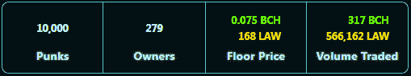

# smartBCH 概述及其对比特币现金的影响

> 原文：<https://medium.com/coinmonks/an-overview-of-smartbch-and-its-effect-on-bitcoin-cash-1d0a45f1c73e?source=collection_archive---------2----------------------->

Image Source: [Pixabay](https://pixabay.com/photos/drop-splash-impact-ripples-water-2235618/), (modified)

比特币现金每周上涨 10%，表现优于几乎所有其他加密货币。

比特币现金生态系统最近的表现令人瞩目。SmartBCH 项目很有吸引力，因为有很大的潜力，而且大多数项目都优于其他侧链的令牌。

smartBCH 上几乎每天都有新的开发，如新项目、实用程序、新 NFT、新 Web3 应用程序、桥梁等。比特币现金是 smartBCH 的原生加密货币，侧链已经提高了它的价值。

智能合约已经席卷了比特币现金社区，并开辟了新的视野和新的机会。基于智能合约的竞争区块链和侧链之间的差距仍然很大，但这也意味着我们处于早期阶段。

在这篇文章中，我写了一个关于 smartBCH 的概述，它已经扩展到各个领域，并在今天呈现了一个具有难以想象的潜力的稳固的区块链网络。

# SmartBCH 概述

*Image from:* [*Pixabay*](https://pixabay.com/tr/photos/piramit-da%c4%9flar-ba%c5%9f-a%c5%9fa%c4%9f%c4%b1-piramit-5552588/) *(modified)*

## 指数:市值。现金

marketcap.cash

我们 SmartBCH 之旅的起点是一个索引器服务， [**Marketcap.cash**](https://www.marketcap.cash/) ，该网站为我们提供了一个动态数据库，其中包含了 [**SmartBCH**](https://smartbch.org/) 市场中所有活跃的代币。

网站已经是一个很好的信息来源，列出一个项目可以增加投资者的曝光率和兴趣。

## SmartBCH 令牌(SEP20)

已经有将近 40 种不同的(SEP20)令牌。每一种都有不同的目的，其中大多数在三个 smartBCH 指数中以高流动性提供。

这些令牌中最受欢迎的一些是:

*   **DEX 令牌:**Ben swap[**EBEN**](https://t.me/bentokenfinance)、MIST swap[**MIST**](https://twitter.com/mistswapdex)、mueslisswap[**MILK**](https://t.me/MuesliSwapofficial)
*   **stable coins:**[**flex USD**](https://t.me/coinflex_EN)， [**Smart BUSD**](https://sbusd.cash/)
*   **NFT 代币:**法小混混( [**法**](https://t.me/BlockNGGlobal) )，现金猫(**)**
*   ****Meme 代币:**shib abch([**shib BCH**](https://t.me/ShibaBCHcom))、嘎( [**嘎**](https://t.me/honkhonktoken) )、土豆币( [**锅**](https://t.me/PotatoCoinBCH) )、现金小猫( [**小猫**](https://t.me/CashKitten_BCH) )**
*   ****社区令牌:**克努特([**【KTH】**](https://t.me/kthtoken))、BCH·阿吉尼塔( [**ARG**](https://bitcoincashargentina.com/) )、UatX 项目( [**UATX**](https://www.uat.cash/) )**
*   ****博彩代币:**阿希 BCH ( [**阿希巴赫**](https://t.me/axiebch) )，进入球体( [**宝珠**](https://t.me/thespherechat) )，Joystic 俱乐部( [**JOY**](https://t.me/joystickclub) )**
*   ****其他值得注意的代币:**FLEX Coin([**FLEX**](https://t.me/coinflex_EN))，BCHPad ( [**BPAD**](https://t.me/bchpad) )，芹菜( [**CLY**](https://t.me/celeryToken) )**

**这些代币大多有很强的概念和服务于比特币现金生态系统的目的。**

**其余活跃令牌是**香料，XMIST，迷宫，KONRA，火腿，僵尸，SVNT，HODL，闪电，汪达尔，糖果人，PHA，奶酪，WRS，RMZ** 。**

**他们中的一些人从 SLP 移民过来，在 smartBCH 上创造了新的代币。其他的都是 smartBCH 上的新项目，但是大部分都是 dex 上的低流动性。**

**网站 marketcap.cash 包含更多信息，包括更多链接和价格行为信息。**

****

## **DeFi 指数:DeFi Llama**

**Defi Llama 现在正在跟踪 SmartBCH 提供的有关 TVL 和德克斯的信息:**

****

**[Source](https://defillama.com/chain/smartBCH)**

**SmartBCH 的 TVL 已经达到 3780 万美元，并且还在继续上涨。**

****

## **德克斯，迪菲**

**已经有三个 dex 提供交易 DeFi 服务，如产量农业、贷款、赌注，还有三个正在开发中。**

****当前指数:****

*   **[BenSwap](https://benswap.cash/)**
*   **[**错换**](https://app.mistswap.fi/swap)**
*   **[**MuesliSwap**](https://bch.muesliswap.com/)**

****即将发布:****

*   **[**柯英夫**](https://app.koingfu.com/)**
*   ****1BCH****
*   ****SquidSwap****

****

## **SmartBCH 上的 NFT 场景**

****

**[**Poolside Puffers**](https://puffers.cash/)**

**许多人在 SmartBCH 看到如此高的 NFT 量时感到惊讶，并且有许多项目创造和提供 NFT 收藏。**

*   **[**池边河豚**](https://puffers.cash/)(2100 NFTs——3 天售罄)**
*   **[**法朋克**](https://blockng.money/#/punks)(10000 NFT——22 天售罄)**
*   **[**猫**](https://oasis.cash/) (一小时卖出 5000 只 NFT，另外 5000 只在拍卖中)**

**这三个 NFT 系列是 SmartBCH 推出的首批产品，拥有**

**Law Punks 的交易量激增，预计一旦交易开始，其余两个 NFT 系列也会出现类似的情况。**

**法律朋克交易的数量正在飙升。据该网站称，BCH 的总成交量已经达到 317 张，而法律代币的总成交量更是达到了 566，162 张。**

****

**[*Source*](https://blockng.money/#/punks)**

****NFT 市场:绿洲****

****

**oasis.cash**

**SmartBCH 现在有一个市场，很快将向所有人开放，用于交易 NFT。**

**[**绿洲**](https://oasis.cash/) 已经推出，一开始只是用来铸造猫 NFT。NFT 的交易者和收藏者将很快能够使用 Metamask 钱包在 Web3 NFT 市场上交易 NFT。**

**还有一些市场正在开发中，对竞争来说可能非常有利。**

****

## **布里奇斯**

****

**[*Source*](https://bchcc.cash/?lang=en)**

**Web3 桥已经可以进入 smartBCH 生态系统。SmartBCH 没有原生令牌，但使用比特币现金。**

**现在有很多方法可以将 BCH 传入和传出 SmartBCH 网络:**

*   **[**CoinFLEX**](https://coinflex.com/home) (进出 SmartBCH)**
*   **[**wagon . cash**](https://wagon.cash/)**(仅单向到 SmartBCH)****
*   ****[**prompt . cash**](https://prompt.cash/bridge)**(仅单向到 SmartBCH)******
*   ******[**BCHCC**](https://bchcc.cash/?lang=en)**(进出 SmartBCH)********

******很快将会有通向以太坊的桥梁，供用户在两个网络之间迁移令牌。******

************

## ******沟通渠道******

************

******noise.cash******

******大部分讨论在电报和推特中开始和结束。 **Read.cash** 和 **noise.cash** 是项目手中的特殊资源，应该得到最大限度的利用。******

****一些项目在 read.cash 上发布公告，但在 noise.cash 上很少或没有出现。随着为公告创建官方账户以及与感兴趣的成员和潜在投资者进行更多沟通，这种情况可能会有所改变。****

****它不需要任何成本，而且它将改善与数万名比特币现金用户的沟通和项目广告。****

****smartBCH 项目中可能会有吸引公众关注的事件和促销活动。****

********

## ****有用的 SmartBCH 网站****

****有各种网站为 SmartBCH 用户提供支持，也有一些网站包含对投资者重要的信息。****

****[**smart scan**](https://www.smartscan.cash/)**:**smart BCH 官方区块浏览器****

****[**tux paper . nu**](http://smartbch.tuxpaper.nu/TokenTransferScanner/)**:**一个有用的地址扫描器。****

****[**MarketCap。**](https://www.marketcap.cash/) **:** 上述 SEP20 指数****

****[**sep 20 Tokens**](https://zh.thedev.id/sep20tokens/)**:**只需点击一下，即可在 metamask 上添加任何 SmartBCH tokens。****

****[**格拉法纳**](https://smartbch.fountainhead.cash/grafana/d/GUnTOBGnz/smartbch?orgId=1&refresh=5s) **:** BCH 节点运营商 fountainhead 给出 SmartBCH 网络信息上更高级的细节，如费用、阻塞统计、锁定的 BCH、天然气价格等。****

****build.cash : Build.cash 包含了 SmartBCH 用户需要的几乎所有东西。这是一个巨大的信息数据库，有链接和教程。****

****[**支票簿.现金**](https://checkbook.cash/app/) :空投的有用工具([旧服务链接](https://app.checkbook.cash/receive))****

********

## ****最后****

****最近几个月，人们对 SmartBCH 越来越感兴趣。它仍处于非常早期的阶段，但宽限期已经结束。现在是时候让当前和即将开展的项目成为具有清晰愿景的严肃项目了。****

****专业是必需的，尤其是从 smartBCH 和任何其他出现的当前流行的项目。仅仅受短期利润或贪婪的驱动会(暂时)损害整个市场的潜力。****

****自上周以来，smartBCH (marketcap.cash)上的大多数代币都上涨了 50%。人们对 SmartBCH 项目有着巨大的兴趣，虽然现在还为时尚早，但通常当某个市场的受欢迎程度大大提高时，所承担的风险就会得到回报。****

****比如索拉纳，克服困难，达到了极高的估值。尽管如此，Solana 利用大量营销资源取得了成功，并在加密货币媒体上广泛宣传自己。****

****SmartBCH 正在成长，并悄悄地实现了其他智能合同区块链永远不会满足的里程碑。对比特币现金的影响目前可能相对较低，但在近期的某个时候会出现爆发。****

********

*******Follow me on:*** *●* [*ReadCash*](https://read.cash/@Pantera) *●* [*NoiseCash*](https://noise.cash/u/Pantera99) *●* [*Medium*](/@panterabch) *●* [*Hive*](https://hive.blog/@pantera1) *●* [*Steemit*](https://steemit.com/@pantera1) *●*[*Vocal*](https://vocal.media/authors/pantera) *●* [*Minds*](https://www.minds.com/pantera99/) *●* [*Twitter*](https://twitter.com/Panterabch) *●* [*LinkedIn*](https://www.linkedin.com/in/panterabch/) *●* [*email*](https://read.cash/@Pantera/cryptouknowns-battlegrounds-the-crypto-battle-royale-part-i-0ca762da#bad-link)****

******相关内容:******

*   ****[**比特币现金上的 DeFi 来了！**T21【2021 年 3 月 22 日】](https://read.cash/@Pantera/defi-on-bitcoin-cash-is-here-e748db64)****
*   ****[**SmartBCH 网络讨论**](https://read.cash/@Pantera/smartbch-network-discussion-620545e2)(2021 年 4 月 30 日)****
*   ****[**如何设置元遮罩并添加网络:币安(BSC)、多边形(Matic)、OKEx、SmartBCH —教程**](https://read.cash/@Pantera/how-to-set-up-metamask-and-add-networks-binance-bsc-polygon-matic-okex-smartbch-tutorial-7265e1c4)(2021 . 7 . 7)****
*   ****[**SmartBCH Metamask 教程—连接网络，转移 BCH，添加代币，在 dex 上交易**](https://read.cash/@Pantera/smartbch-metamask-tutorial-connect-to-network-transfer-bch-add-tokens-and-trade-on-dexs-601f4b17)(2021 年 9 月 8 日)****
*   ****[**SmartBCH:这是关于什么的，为什么我们要关心？**](https://read.cash/@Pantera/smartbch-what-is-this-about-and-why-we-should-care-5688867f)(2021 年 9 月 17 日)****
*   ****[**池畔河豚！—一个明智的 NFT 艺术项目，目的很好！**](https://read.cash/@Pantera/poolside-puffers-a-smartbch-nft-art-project-with-a-good-purpose-93fc2ee5)(2021 年 10 月 3 日)****
*   ****[**用 SmartBCH DeFi**](https://read.cash/@Pantera/yield-farming-with-smartbch-defi-2a58beda) 进行产量耕作(2021 年 10 月 12 日)****
*   ****[**smart BCH 网络快速成长— DeFi、NFTs 蓬勃发展**](https://read.cash/@Pantera/rapid-growth-of-the-smartbch-network-defi-nfts-booming-20ce5a3c)(2021 年 10 月 15 日)****
*   ****[**宇宙的起源**](https://read.cash/@Pantera/the-genesis-of-the-smartbch-nft-universe-7cef1a9c)**(2021 年 10 月 16 日)******
*   ******[**MuesliSwap smart BCH DeFi:5 天 100%盈利！**](https://read.cash/@Pantera/muesliswap-smartbch-defi-100-profit-in-5-days-cf09919c)(2021 年 10 月 18 日)******
*   ****[**用 Wagon 轻松将您的 BCH 转移到 SmartBCH。现金&提示。现金**](https://read.cash/@Pantera/transfer-your-bch-to-smartbch-easily-with-wagoncash-promptcash-936f88a7)(2021 年 10 月 19 日)****
*   ****[**小混混 NFT 卖了唱片 33 BCH！SmartBCH 卷峰值！**](https://read.cash/@Pantera/lawpunks-nft-sold-for-record-33-bch-smartbch-volumes-spike-0b3ac253)(2021 年 10 月 21 日)****
*   ****[**【小混混】:高卷中的**](https://read.cash/@Pantera/lawpunks-high-volumes-in-the-smartbch-nft-field-fc9a622a)**(2021 年 10 月 24 日)******

********tipb . ch:**https://tipb.ch/Pantera******

******备注:******

> *****免责声明:本内容中发布的所有材料均用于娱乐和教育目的，并符合合理使用准则。无意侵犯版权。如果您是或代表本文所用材料的版权所有者，并对所述材料的使用有异议，请发送* [*电子邮件*](https://read.cash/@Pantera/cryptouknowns-battlegrounds-the-crypto-battle-royal-part-i-0ca762da#bad-link) *。*****

*******支持内容创作者。*******

****如果你喜欢这个故事，就订阅吧！****

*****最初发布于*[*https://read . cash*](https://read.cash/@Pantera/an-overview-of-smartbch-and-the-effect-on-bitcoin-cash-93b3154a)*。*****

********

> ****加入 Coinmonks [电报频道](https://t.me/coincodecap)和 [Youtube 频道](https://www.youtube.com/c/coinmonks/videos)了解加密交易和投资****

## ****也阅读****

**** [## 最佳加密交易所| 2021 年十大加密货币交易所

### 编辑描述

blog.coincodecap.com](https://blog.coincodecap.com/crypto-exchange)  [## 2021 年 10 大最佳加密贷款平台| CoinCodeCap

### 编辑描述

blog.coincodecap.com](https://blog.coincodecap.com/crypto-lending)  [## 2021 年最佳免费加密交易机器人

### 2021 年币安、比特币基地、库币和其他密码交易所的最佳密码交易机器人。四进制，位间隙…

medium.com](/coinmonks/crypto-trading-bot-c2ffce8acb2a)  [## 最佳 4 个加密交易信号电报通道

### 这是乏味的找到正确的加密交易信号提供商。因此，在本文中，我们将讨论最好的…

medium.com](/coinmonks/best-crypto-signals-telegram-5785cdbc4b2b)  [## BlockFi 评论 2021:利弊和利率| CoinCodeCap

### 编辑描述

blog.coincodecap.com](https://blog.coincodecap.com/blockfi-review)  [## 如何在印度购买比特币？2021 年购买比特币的 7 款最佳应用[手机版]

### 如何使用移动应用程序购买比特币印度

medium.com](/coinmonks/buy-bitcoin-in-india-feb50ddfef94)  [## 加密税务软件——五大最佳比特币税务计算器[2021]

### 不管你是刚接触加密还是已经在这个领域呆了一段时间，你都需要交税。

medium.com](/coinmonks/best-crypto-tax-tool-for-my-money-72d4b430816b)  [## 存储比特币的最佳加密硬件钱包[2021] | CoinCodeCap

### 编辑描述

blog.coincodecap.com](https://blog.coincodecap.com/best-hardware-wallet-bitcoin)  [## Pionex 评论 2021 |免费加密交易机器人和交换

### Pionex 是为交易自动化提供工具的后起之秀。Pionex 上提供了 9 个加密交易机器人…

medium.com](/coinmonks/pionex-review-exchange-with-crypto-trading-bot-1e459d0191ea)****