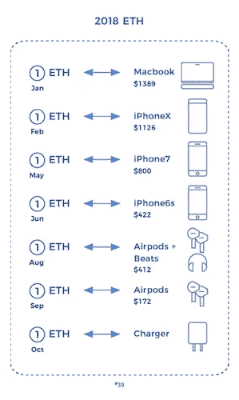
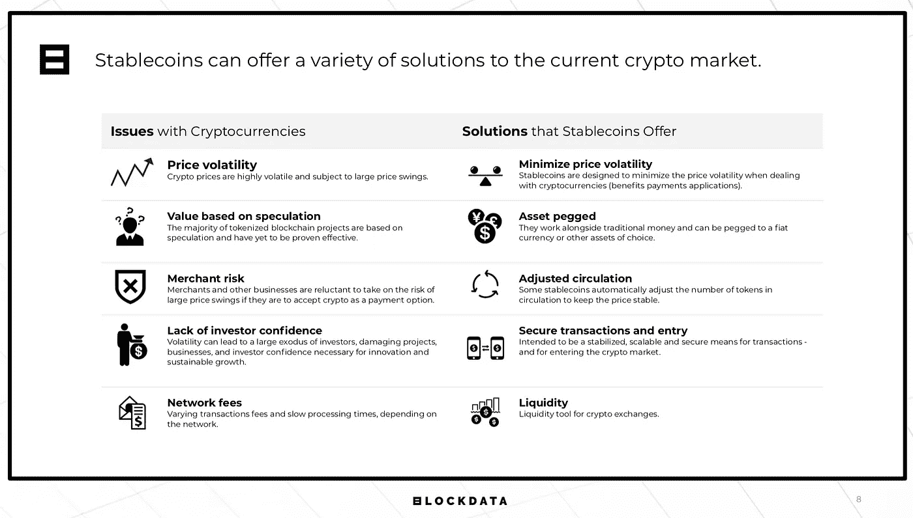
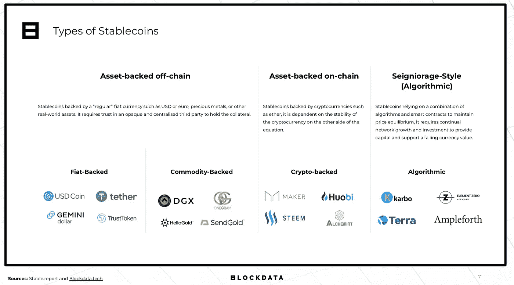
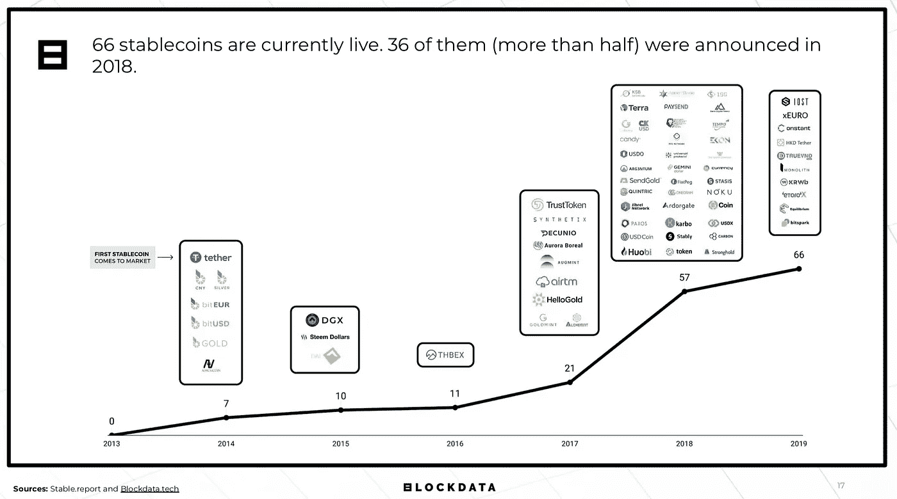
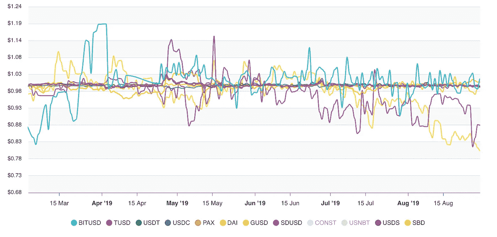

# 稳定曲线概述

> 原文：<https://medium.com/coinmonks/an-overview-of-stablecoins-fed7553fb25b?source=collection_archive---------3----------------------->

Photo by [Fabian Blank](https://unsplash.com/@blankerwahnsinn?utm_source=unsplash&utm_medium=referral&utm_content=creditCopyText) on [Unsplash](https://unsplash.com/search/photos/bank-deposit?utm_source=unsplash&utm_medium=referral&utm_content=creditCopyText)

2019 年 8 月 29 日

S *桌币已经成为区块链/ DLT* [*风景*](/@kyleellicott/the-growth-evolution-of-the-blockchain-landscape-q2-2019-edition-61dacb0ce0d) *内越来越重要的一类。最近，随着脸书的* [*天秤座*](https://cointelegraph.com/news/could-facebook-libra-become-the-largest-dapps-network-to-date) *和币安的* [*金星*](https://cointelegraph.com/news/binance-reveals-venus-its-own-project-to-rival-facebooks-libra) *项目的相继推出，stablecoins 这个词更是风靡各大新闻媒体。随着我们开始看到新的商业模式的引入和应用程序(DApps)的推出，数字货币这一新兴类别尤其有趣。那么这一切意味着什么呢？*

让我们从基础开始——什么是稳定币。根据 [BLOCKDATA](https://medium.com/u/279c07ad0b4d?source=post_page-----fed7553fb25b--------------------------------) ，稳定币被定义为一种加密货币，作为基础资产价值的担保**。它们旨在维持稳定的市场价格，有助于降低目前其他加密货币/数字资产的波动性。这避免了一个人以 100 美元的数字货币开始一天的市场波动，一夜之间看到它翻倍到 200 美元，然后早上醒来，价值下降到 50 美元。**

[*Source: George Samman & Andrew Masanto*](https://static1.squarespace.com/static/564100e0e4b08c9445a5fc5d/t/5c71e43ef9619ae6c83c30af/1550967911994/The+State+of+Stablecoins+2019_Report+2_20_19.pdf)

随着易失性的降低，stablecoins 可以允许更多的日常使用情况——支付、交换、价值存储等。可用于支持稳定货币的资产示例包括其他货币(即美元)、其他加密货币，甚至是商品，如白银或黄金。如今，大多数货币都与美元挂钩，Diar 的研究显示，稳定的货币构成了 40 亿美元的市值。这个市场还包括其他一些有希望的名字，比如:的戴、的 EOSDT、双子星的、摩根大通的币等等。每一个都以不同的方式保护和保存它的价值。

在脸书的 Libra 中，价值将由一篮子稳定和流动的资产支持，如来自稳定和声誉良好的央行的各种货币的银行存款和短期政府证券，这将从第一天开始提供内在价值。这意味着稳定币以比特币和其他货币无法做到的方式保持其价值。你今天存入的 100 美元稳定币在明天甚至下周仍将价值 100 美元。

# 技术细节

在技术层面，stablecoins 总体上拥有比特币和其他货币的许多相同优势，但缺点较少。Stablecoins 建立在相同的区块链技术之上，允许用户进行透明的点对点(P2P)交易，无需任何中间人参与。这些交易的费用很低，在某些情况下甚至是零费用。它们也可供任何人使用，无论他们在世界的哪个角落。

Source: [Blockdata](https://www.blockdata.tech)

让我们在技术方面再深入一层。并非每种稳定币都是相同的，目前可分为以下三类:

1.  **资产支持链上**:稳定的货币由加密货币(如以太)支持，它取决于等式另一端的加密货币的稳定性。
2.  **资产支持的非链条**:由“常规”法定货币支持的稳定债券，如美元(USD)或欧元、贵金属或其他现实世界的资产。它需要信任一个不透明且集中的第三方来持有抵押品。
3.  **算法** : Stablecoins 依靠算法和智能合约的组合来维持价格平衡，它需要持续的网络增长和投资来提供资本和支持货币贬值。

Source: [Blockdata](https://www.blockdata.tech)

# 市场概述

根据 Blockdata 的研究，2014 年至 2019 年期间，stablecoin 市场推出了 200 多个项目。这些项目中只有大约 30%目前处于运行状态，其他的都在开发中或者已经关闭。此外，其中 66 人目前还活着(见下图)。

Source: [Blockdata](https://www.blockdata.tech)

2014 年，我们看到了第一轮项目的启动，包括 Tether，其中一个更引人注目，也是[有争议的](https://www.newsbtc.com/2019/03/14/tether-spotlight-once-again-controversy-over-100-peg-to-usd/)。由美元支持的 [Tether](https://tether.to) 使用法定抵押，为其发行的每一美元数字货币在银行存入一美元。随着市场的发展，引入了新的 stablecoins 来测试各种用例。2018 年 2 月，委内瑞拉引入了一个有趣的用例，stablecoins 将硬币与[一桶石油](https://cointelegraph.com/news/petro-ignited-venezuela-launches-pre-sale-of-oil-backed-national-cryptocurrency)挂钩。

Source: [Stable Report](http://dashboard.stable.report/)

最近市场的成熟被揭示出来，“分散的稳定公司”，如&[balance _ EOSDT](https://medium.com/u/5db4a8782ba2?source=post_page-----fed7553fb25b--------------------------------)&[maker Dao](https://medium.com/u/743224aba00c?source=post_page-----fed7553fb25b--------------------------------)(戴)，它们的价值来自数字资产的过度抵押。尽管它们受到波动性较大的加密货币的支持，但过度抵押为用户提供了必要的回旋空间，让他们在稳定的货币价值保持不变的情况下，容忍抵押品价值的波动。例如，EOSDT 目前的超额抵押率为 130%，这意味着在采取任何行动来保护这枚硬币的价值之前，基础抵押品可能会下降 23%。

密切关注稳定的硬币市场的成熟度。随着[采用率的增长](http://fintechnews.ch/blockchain_bitcoin/stablecoins-versus-centralized-exchanges-who-drives-mass-adoption/30209/)，新的使用案例(游戏、娱乐、零售、无银行服务等)的出现，它在区块链市场中的作用将会继续增加。)被引入，技术栈得到加强以支持它们的规模(框架、DApps、网络等)。).敬请关注。

关于稳定资本、分散金融(DeFi)、应用(DApps)和市场未来的更多信息，请查看这个[播客](https://soundcloud.com/kyle-ellicott/an-overview-of-stablecoins-with-equilibrium)，在这里我与[均衡](https://eosdt.com/?utm_source=medium&utm_medium=referral&utm_campaign=medium_kyleellicott)团队坐下来了解最新信息。

# 更多稳定币资源:

*   乔治·萨姆曼和安德鲁·马桑托*——*[稳定的状态进入 2019 年](https://static1.squarespace.com/static/564100e0e4b08c9445a5fc5d/t/5c71e43ef9619ae6c83c30af/1550967911994/The+State+of+Stablecoins+2019_Report+2_20_19.pdf)
*   [何塞·加雷](https://medium.com/u/86721275ab93?source=post_page-----fed7553fb25b--------------------------------)—[https://medium . com/witnet/the-next-step-for-stable coins-decentralized-Oracle-da12e 0792 fc](/witnet/the-next-step-for-stablecoins-decentralized-oracles-da12e0792fc)
*   Linda Xie—[https://lindajxie . com/2019/08/23/where-stable coins-are-head/](https://lindajxie.com/2019/08/23/where-stablecoins-are-headed/)

*作者注:我参与了本文中提到的平衡项目。不过，我确实提供了对大区块链、DLT、& DApps* [*地貌*](/@kyleellicott/the-growth-evolution-of-the-blockchain-landscape-q2-2019-edition-61dacb0ce0d) *的见解和研究。*

## 另外，阅读

*   [最佳加密交易机器人](/coinmonks/whats-the-best-crypto-trading-bot-in-2020-top-8-bitcoin-trading-bot-c16adeb13317)
*   最好的比特币[硬件钱包](/coinmonks/the-best-cryptocurrency-hardware-wallets-of-2020-e28b1c124069?source=friends_link&sk=324dd9ff8556ab578d71e7ad7658ad7c)
*   最好的[加密税务软件](/coinmonks/best-crypto-tax-tool-for-my-money-72d4b430816b)
*   [最佳加密交易平台](/coinmonks/the-best-crypto-trading-platforms-in-2020-the-definitive-guide-updated-c72f8b874555)
*   [unis WAP 最佳钱包](/coinmonks/best-wallets-to-use-uniswap-e91a6385d9e8)
*   最佳[加密贷款平台](/coinmonks/top-5-crypto-lending-platforms-in-2020-that-you-need-to-know-a1b675cec3fa)
*   [顶级 DeFi 项目](/coinmonks/defi-future-10-promising-projects-in-the-defi-world-ff2b697ab006)
*   Bitsgap 评论——一个轻松赚钱的加密交易机器人
*   [Quadency Review](https://blog.coincodecap.com/quadency-review-a-crypto-trading-automation-platform) -为专业人士打造的加密交易机器人
*   [3 商业评论](https://blog.coincodecap.com/3commas-review-an-excellent-crypto-trading-bot) |一款优秀的密码交易机器人
*   [3Commas vs Cryptohopper](/coinmonks/cryptohopper-vs-3commas-vs-shrimpy-a2c16095b8fe)
*   Bitmex 上的[保证金交易指南](/coinmonks/the-idiots-guide-to-margin-trading-on-bitmex-dbbd7742c6fc?source=friends_link&sk=7bfa99d2a181142510c8442c8ddb0786)
*   [加密摇摆交易权威指南](/coinmonks/the-definitive-guide-to-crypto-swing-trading-7e4af6496d4d?source=friends_link&sk=70448050bd9323b42f63bfc0bb1e60d1)
*   [Bitmex 高级保证金交易指南](/coinmonks/bitmex-advanced-margin-trading-guide-2270c195ce25?source=friends_link&sk=1d986cca731f5084b9a2db4a4bc4a7ad)
*   [开发人员的最佳加密 API](/coinmonks/best-crypto-apis-for-developers-5efe3a597a9f)
*   [加密套利](/coinmonks/crypto-arbitrage-guide-how-to-make-money-as-a-beginner-62bfe5c868f6)指南:新手如何赚钱
*   顶级[比特币节点](https://blog.coincodecap.com/bitcoin-node-solutions)提供商
*   最佳加密制图工具

> [直接在您的收件箱中获得最佳软件交易](https://coincodecap.com?utm_source=coinmonks)

