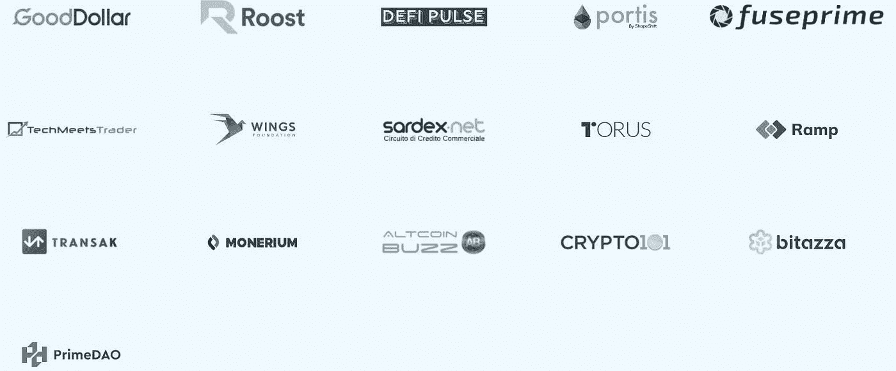

# 保险丝网络(Fuse)概述

> 原文：<https://medium.com/coinmonks/an-overview-of-the-fuse-network-fuse-679c1ff3422d?source=collection_archive---------2----------------------->

## *Fuse Network 正致力于为现有的数字支付带来一种快速、分散和低成本的替代方案，可以轻松地与日常支付活动集成。*

## 成立于 2019 年的[融合网络](https://fuse.io/)旨在革新传统的支付和交换系统。该网络正在努力设计一种快速和低成本的支付解决方案，以简化日常活动，而无需任何第三方的参与。

保险丝链作为[以太坊](https://ethereum.org/en/)网络的侧链运行。Fuse 令牌在以太网上生成，然后在网桥的帮助下移动到 FUSE 网络。然后，用户将接触到广泛的功能和业务插件，这将有助于他们执行日常支付活动。

该网络使用 [DPoS(委托利益证明)](https://en.bitcoinwiki.org/wiki/DPoS)作为共识机制，并由一组验证器支持，这些验证器运行节点来验证网络交易并执行智能合同。为了成为验证者，感兴趣的组织、公司或用户需要在 Fuse consensus 契约地址中加入至少 100K 个 FUSE 令牌。其他网络用户可以将他们的令牌委托给验证器。验证者和删除者接收融合令牌作为对标记他们的令牌的奖励。

**验证器**

Fuse 网络由许多验证器支持，这些验证器运行网络节点来验证网络事务并执行智能合约。这些验证器遍布世界各地。他们可以是任何建立在网络上的公司、提供服务的第三方服务提供商，如 KYC、交易所、信用评分提供商、贷款人或 Fuse 上的任何社区运营商。

验证人员应配备所有必需的硬件和软件以及技术知识，以顺利执行基础程序。他们还持有用于验证网络交易的熔丝区块链的副本。每当网络对事务进行分组和广播时，验证器就相互竞争来验证和签名链的状态。作为回报，验证者会得到一笔奖励(每块 X ),每年通货膨胀 5%,在所有验证者之间分配。

Fuse 网络本质上是开源的，可以公开访问。服务提供商可以轻松定制代码库，将他们的产品与 Fuse 网络集成在一起。之后，他们可以让用户使用他们喜欢的货币支付、兑换或使用任何金融服务。这些服务提供商向网络验证者支付费用以验证交易。并且验证者或其委托者接收奖励形式的 FUSE 令牌(Fuse)。

## **成为验证者的基本要求**

*   用户需要持有至少 100K 的 FUSE tokens。这可以是验证器地址上的标记令牌和委托令牌的总数。为了赌注，用户需要将令牌从验证器地址发送到 Fuse Consensus contract 地址。
*   运行完整节点所需的必要硬件和软件。
*   ETH 支付[的燃气费](https://www.altcoinbuzz.io/cryptocurrency-news/blockchain-technology/ethereum-becomes-a-pain-in-the-gas-as-layer-2-demand-surges/)。
*   运行和维护指定活动的基本技术知识。

## **代表团**

网络用户可以将他们的 FUSE 令牌委托给验证者，以便间接有助于网络活动的平稳运行。您所需要做的就是选择一个验证器，并将您的 FUSE 令牌委托给它们。对于授权，没有这样的最低令牌余额标准。您可以委托任何数量的代币。

您可以[阅读我们之前的指南](https://tulip311bit.medium.com/fuse-network-how-to-stake-and-delegate-fuse-tokens-d5d2e4a96468)了解如何下注或委托 FUSE 代币。

## **撤回**

赌注者或验证者可以在任何时候撤回他们的令牌。当任何委托人提取时，提取的金额将从验证人的账户中扣除。如果它变得小于最小赌注要求，那么验证器将从网络的验证器列表中移除。

## **共识方法**

Fuse 网络基于委托利益证明(DPoS)共识模型。引入这种方法是为了最大限度地降低入门级标准，以便令牌余额低的用户可以参与网络活动。小代币持有者将把他们的代币以及投票和验证权力委托给满足强制性要求(软件、硬件等)以适合该职位的验证者。验证器验证网络交易，作为回报，所有参与方都会收到奖励。

## **保险丝令牌**

熔丝令牌是平台的本地令牌。这是一个 ERC-20 令牌，可以使用网桥在以太坊和熔丝网络之间轻松移动。

令牌有多种实用程序:

*   **网络费用—** 用于支付批准交易的网络费用。
*   **标记—** 持有至少 10 万个 FUSE 令牌并且能够管理其他硬件或软件要求的用户可以通过标记他们的令牌成为网络验证者。
*   **委托** —持有不到 100k 的用户可以将他们的 FUSE 令牌委托给验证器并获得奖励。委托功能已于 2020 年第三季度激活。
*   **投票** —令牌持有者可以参与治理活动(网络升级/其他治理变更)。用户持有的代币越多，他们的投票权就越大。

## **合作伙伴**

## **社交场合**

[网站](https://fuse.io/)

[中等](https://medium.com/fusenet)

[推特](https://twitter.com/fuse_network)

[电报](https://t.me/fuseio)

[不和](https://discord.com/invite/jpPMeSZ)

[Github](https://github.com/fuseio)

## **结论**

Fuse Network 是一个独特的项目，旨在弥合加密和现实世界之间的差距。该平台有自己的功能和令牌，将帮助您创建一个加密经济，而不是其他现有的平台，这些平台使用并接受第三方服务提供商的帮助来集成支付解决方案。他们已经在区块链生态空间呆了很长时间。Fuse 也在努力升级其产品的功能。

除了赌注和授权，其生态系统中还有其他产品可供用户使用。例如，您可以使用 Fuse Cash 创建您自己的令牌，您可以在您的社区中使用该令牌作为具有货币价值的令牌来支付服务和功能。您可以使用 Fuse Studio 来管理社区内的支付。该平台还向用户提供钱包，但目前正在进行版本升级。

**资源:** [融合网络文档](https://docs.fuse.io/)

**阅读更多:** [Blank:一款注重隐私的浏览器扩展钱包](/coinmonks/blank-a-privacy-focused-browser-extension-wallet-114c7e4dd816)

***注:*** *本帖首发* [*此处*](https://www.altcoinbuzz.io/reviews/altcoin-projects/an-overview-of-the-fuse-network-fuse/) *上*[***altcoinbuzz . io***](http://www.altcoinbuzz.io/)*。*

**通过我的推荐加入**

[Crypto.com](https://binance.com/en/register?ref=E8PCD3AF)——[币安](https://platinum.crypto.com/r/sut3pd9bzn)

跟我来吧

**👉** [推特](https://twitter.com/rumadas123)

**👉**[**Linkedin**](https://www.linkedin.com/in/ruma-das-a1439320/)