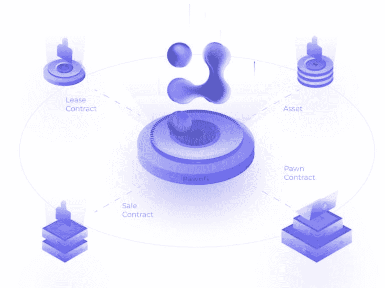

# 纵观最新的 CoinList 项目，DeFi 和 NFT 仍然占据主导地位

> 原文：<https://medium.com/coinmonks/an-overview-of-the-latest-coinlist-projects-defi-and-nft-still-dominate-5c3b769154df?source=collection_archive---------8----------------------->

> CoinList 的大多数最新项目仍处于测试阶段。其中，Injective Protocol 孵化的去中心化拍卖协议 Burnt Finance 和数据生态系统 Swash 最近分别完成了 300 万美元和 700 万美元的融资。

本周，CoinList 从 500 多个加密创业项目中选出 8 个作为最新的秋季项目。相比前几批，一个重要的趋势是多链，比如 Solana，Terra，Polygon，或者为 Filecoin 矿工提供软件解决方案。此外，DeFi 和 NFT 仍然占据主导地位，8 个项目中有 5 个属于这一类别，3 个是社交令牌平台和数据基础设施。

CoinList Seed 由 CoinList 于 2020 年推出，旨在帮助早期加密初创公司进行第一轮融资，并将该项目与大多数投资者联系起来。由于发射的相对公平性、财富效应、项目的质量以及一些项目的出现，它们赢得了加密领域知名风险投资家的青睐，它们获得了极大的关注。本文将介绍当前的 CoinList seed 项目。

# 人才协议:分散的人才市场

人才协议(Talent Protocol)是一个去中心化的人才市场，允许用户发放与其职业潜力密切相关的个人代币。支持者或投资人如果看好用户的职业发展潜力，可以投资。Talent Protocol 创始人兼 CTO，也是儿童编码学校 SHARKCODERS 的创始人。

与传统的职业雇佣网络相比，人才协议相对公平，更具包容性，允许令牌化和赋能用户未来的职业潜力，以及帮助用户创建忠诚的支持者社区，不仅可以更好地激励人才，还可以密切实践人才和支持者，从而实现人才和支持者的双赢。

Talent Protocol operation mode

因此，需要资金来加速职业发展并希望建立支持者社区的用户可以推出个人代币来满足当前的资金或社区需求，而无需任何技术要求，并且看好某人职业发展的用户可以购买相关的个人代币投资，还可以解锁相关福利，如加入个人不和谐服务器，对用户的职业决策进行投票等。，想象你是 Vitalik Buterin 的下一个早期投资人？

人才协议的表征是 TAL (ERC-20 标准)。TAL 将在协议操作模式下的个人代币购买中发挥重要作用。此外，它还具有协议治理等功能。人才协议将奖励一些代币给积极参与网络的人才和支持者。

用于确定个人代币价格的计算方法将根据算法形成的以下联合曲线代币结合曲线(TBC)来确定。流动性越强，铸造新代币所需的 TAL 就越多。当然，人才协议在激励早期投资者方面将更加有力。具体来说，TBC 是每个天赋令牌的智能合约(相当于投资组合)。它就像一个 AMM。当支持者用法币或其他加密货币购买天赋令牌时，会自动转换为 TAL 并锁定在智能合约中。换取天赋令牌，同时提高天赋令牌的价格。在出售时，TAL 从智能契约中解锁，同时天赋令牌被销毁。此外，Talent Protocol 不从 talent tokens 的销售、购买和交易中收取平台费用。

Talent token price curve

> 订阅 [**Coinmonks Youtube 频道**](https://www.youtube.com/c/coinmonks/videos) 获取每日加密新闻。

# Swash:数据就是收入

Swash 于 2019 年作为浏览器插件开始，吸引了许多用户，使用户能够通过汇集、安全共享和货币化数据的价值来释放数据的潜在价值。Swash 正在向数据民主化、去中心化和非垄断的数据生态系统扩展。

Swash 核心团队成员和顾问团队包括 DIA 协会 CSO 首席问题官 CSO 礼萨·纳耶尼(Reza Schmidt)、Streamr 创始人兼首席执行官亨利·皮卡拉(Henri Pihkala)、海洋协议创始人布鲁斯·彭(Bruce Pon)等。Swash 最近还完成了一轮 700 万美元的私募股权融资，投资者包括 Outlier Ventures、Streamr 和 KuCoin。

具体来说，当用户使用 Swash 时，他们的在线数据将与其他用户的数据聚合到数据联盟中。当买方从数据联盟购买数据时，联盟成员可以分享收入。Swash 团队也会收取一小部分费用。同时，Swash 还允许用户控制和选择分享自己的数据，用户决定对外分享哪些数据。另一方面，数据购买者可以根据这些数据做出商业决策和进行研究。Swash 目前使用 Streamr 的数据令牌作为支付方法，稍后将推出自己的治理令牌 SWASH 作为支付和数据交易方法。

数据联盟会过滤掉用户的敏感数据，然后一起收集其他数据。但是用户分享的数据不会和用户的身份绑定，也就是说，用户的唯一标识符是以太坊地址和随机唯一匿名标识符。

目前，Swash 可用于 Firefox、Chrome 和所有基于 Chromium 的 web 浏览器的桌面版本，如 Chromium、Microsoft Edge Insider、Brave、UC 浏览器和 Opera。目前正在扩展到 Android 和 iOS。

# Creaticles: NFT 定制平台

Creaticles 是一个可定制的 NFT 平台，可以为想要特定艺术品的买家和有才华的艺术家牵线搭桥。它在今年 8 月推出了以太坊 Ropsten testnet。它将于本季度部署到 mainnet，还将计划推出 Polygon。

在 Creaticles 上，买家提交 NFT 艺术品需求，并设置奖励金额、奖励数量和时间期限。艺术家探索完需求列表后，针对感兴趣的需求提交作品，Creaticles 会收取 10%的佣金。申请成为 Creaticles 认证艺人后，可以参加平台上所有的 NFT 比赛。

CRTL 是创世的本土象征，具有支付、奖赏、承诺、治理等功能。

# 波恩菲:多链借贷平台

Pawnfi 是一个非标资产的多链抵押贷款、租赁和交易市场。除了主流资产，它还支持 NFT、LP 代币、流动性较差的替代币、代币化的实物资产以及代币化的非标准资产，如保险、债券、票据和衍生品。资产持有人可以启动典当、租赁和转售等活动，以最大限度地提高资本效率。

与其他大多数交易协议和借贷协议相比，波恩菲将资产所有权、使用权、收益权分离，资产持有人可以在不丧失资产所有权的情况下，同时获得贷款资金和租赁收益。，挖掘奖励等收入。

波恩菲于 2020 年 12 月推出了第一个内部测试版，并于今年 9 月完成了波恩菲 EVM 版的最终测试。波恩菲 EVM 版本首先支持 ETH、BSC、Polygon、Arbitrum 和 Moonbeam。此外，波恩菲将于近期推出公测。

# 燃烧的金融:由内射协议孵化的分散拍卖协议

Burnt Finance 是一个基于 Solana 的分散式拍卖协议，允许用户铸造、交易和拍卖各种资产。可以拍卖的资产类型包括合成资产、非功能性资产、数字资产等。用户可以举行各种类型的拍卖，如英国拍卖，荷兰拍卖，联合曲线拍卖。不仅艺术家可以出售自己的作品，新项目也可以使用 Burnt 的平台筹集资金。

Burnt Finance 由 Burnt 班克斯发起，将著名街头艺术家班克斯(班克斯)的作品烧毁，投往 NFT，通过 Injective Protocol 孵化。它还在今年 5 月完成了 300 万美元的融资。投资方是内射协议和 Multicoin。资本、机制资本、阿拉米达研究、迪法恩斯资本、斯巴达集团、哈什基资本等。

烧毁金融的治理令牌被烧毁。除了治理之外，BURNT 还可以用作抵押品，为股票、商品和指数铸造合成资产集。此外，使用 BURNT 购买 NFT 时，可以享受佣金优惠。

# tiik:Terra 推出的一站式数字钱包

Tiiik 是 stablecoin project Terra 推出的一站式数字钱包。具有储蓄、消费、创收等功能。它将首先提供给澳大利亚的用户。今年 8 月，Tiiik 宣布成为该公司对澳大利亚金融业务许可证(AFSL)持有者的授权代表，对澳大利亚批发投资者开放，随后将提供给散户投资者。

关于 tiiik 的平台运营模式，当用户将资金存入 tiiik 时，tiiik 会与受监管的金融合作伙伴合作，将这些资金转换成稳定的 coin，并转移给第三方托管合作伙伴。tiiik 将收取用户收入的一小部分。此外，今年 4 月，Terraform Labs 联合创始人 Do Kwon 在 Twitter 上表示，该服务将提供 20%的可编程回报率。

# CID gravity: Filecoin 采矿业务定价解决方案

CID gravity 主要为 Filecoin 矿业业务提供软件解决方案，即允许矿商定制定价和客户管理服务。矿工可以在几十分钟内部署解决方案，为他们的客户创建有针对性的定价模型，并将特定的例外和定价模型与一个或一组客户关联起来。

# Masa:分散信贷协议

Masa 是一个分散的信贷协议和无担保贷款协议。它已经在 8 月份向部分用户推出了封闭测试版，此前表示将在 10 月份公开发布。V1 版本将启用个人金融基金管理仪表板，包括 CeF 和 DeFi 账户、分散信用评分和无担保贷款。其中，信用评分系统将用户的财务数据与他们的传统信用报告相连接，并通过自动贷款池(ALP)实现无担保 USDC 贷款。

另一方面，投资者或机构可以在自动贷款池(ALP)中抵押 USDC 资产获得无担保贷款，以充当流动性提供者，赚取 USDC 利息，并从采矿奖励中获得玉米(Masa 协议令牌)令牌。麦思平台也有两个角色:支持流动性提供者(BLP)和验证节点运营商。BLP 将从自动贷款池中购买违约或违约债务，然后使用 Masa 的收款 API 通过传统的链外收款进行收款。支付过程用于向借款人收取债务；验证节点操作员(需要抵押玉米代币)将向 ALP 提供实时财务数据传输，帮助实现无担保贷款。

此外，Masa 还将在本季度正式推出时支持 NFT 抵押贷款，目前正与一些创作者合作，允许用户借用 NFT 作为抵押。

## 另外，阅读

*   如何在 Uniswap 上交换加密？ | [A-Ads 审查](https://blog.coincodecap.com/a-ads-review)
*   [WazirX vs coin dcx vs bit bns](/coinmonks/wazirx-vs-coindcx-vs-bitbns-149f4f19a2f1)|[block fi vs coin loan vs Nexo](/coinmonks/blockfi-vs-coinloan-vs-nexo-cb624635230d)
*   [本地比特币评论](/coinmonks/localbitcoins-review-6cc001c6ed56) | [加密货币储蓄账户](https://blog.coincodecap.com/cryptocurrency-savings-accounts)
*   [比特币基地评论](/coinmonks/coinbase-review-6ef4e0f56064) | [德里比特评论](/coinmonks/deribit-review-options-fees-apis-and-testnet-2ca16c4bbdb2) | [FTX 评论](/coinmonks/ftx-crypto-exchange-review-53664ac1198f)
*   [n ave 零点回顾](/coinmonks/ngrave-zero-review-c465cf8307fc) | [Phemex 回顾](/coinmonks/phemex-review-4cfba0b49e28) | [PrimeXBT 回顾](/coinmonks/primexbt-review-88e0815be858)
*   最佳[区块链分析](https://bitquery.io/blog/best-blockchain-analysis-tools-and-software)工具| [赚比特币](/coinmonks/earn-bitcoin-6e8bd3c592d9)
*   [币安 vs 比特邮票](https://blog.coincodecap.com/binance-vs-bitstamp) | [比特熊猫 vs 比特币基地 vs Coinsbit](https://blog.coincodecap.com/bitpanda-coinbase-coinsbit)
*   [如何购买 Ripple (XRP)](https://blog.coincodecap.com/buy-ripple-india) | [非洲最好的加密交易所](https://blog.coincodecap.com/crypto-exchange-africa)
*   [非洲最佳加密交易所](https://blog.coincodecap.com/crypto-exchange-africa) | [胡交易所评论](https://blog.coincodecap.com/hoo-exchange-review)
*   [eToro vs robin hood](https://blog.coincodecap.com/etoro-robinhood)|[MoonXBT vs Bybit vs Bityard](https://blog.coincodecap.com/bybit-bityard-moonxbt)
*   [有哪些交易信号？](https://blog.coincodecap.com/trading-signal) | [Bitstamp vs 比特币基地](https://blog.coincodecap.com/bitstamp-coinbase)
*   [ProfitFarmers 回顾](https://blog.coincodecap.com/profitfarmers-review) | [如何使用 Cornix 交易机器人](https://blog.coincodecap.com/cornix-trading-bot)