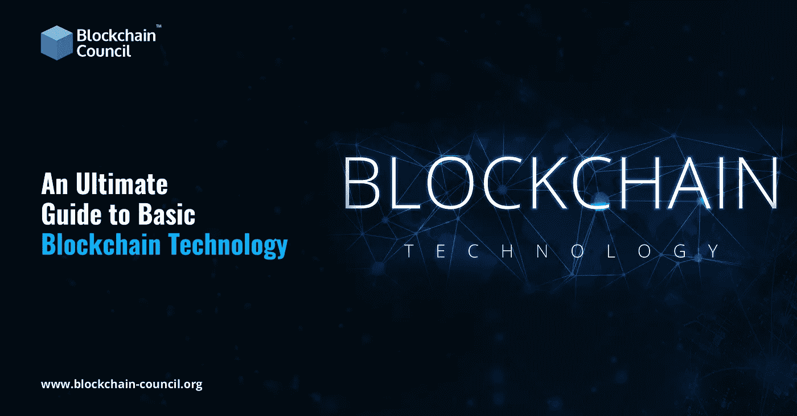
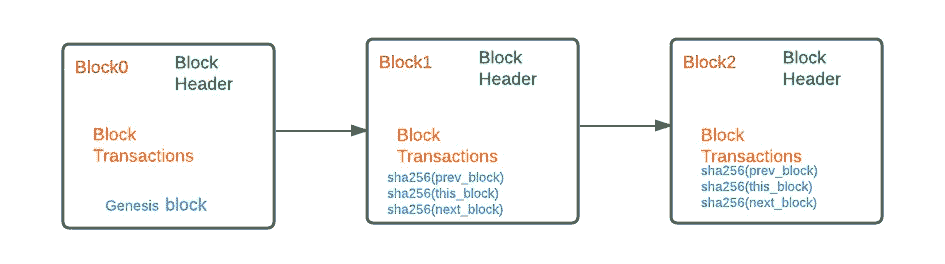
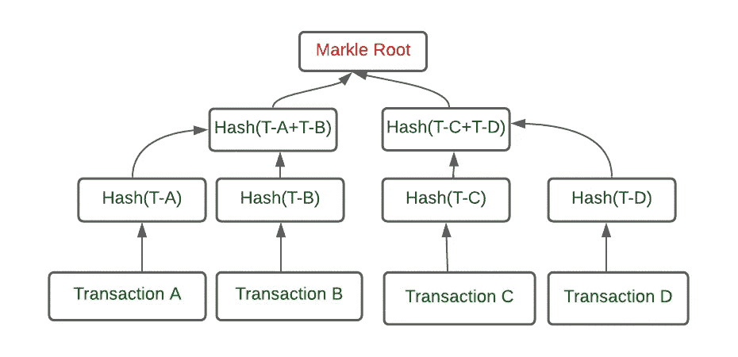
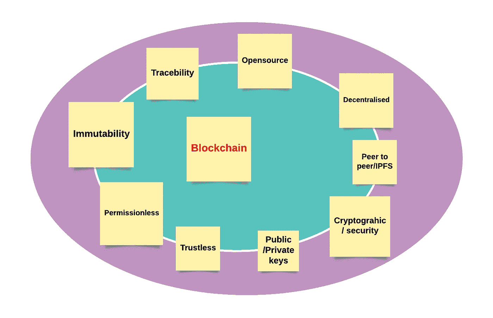
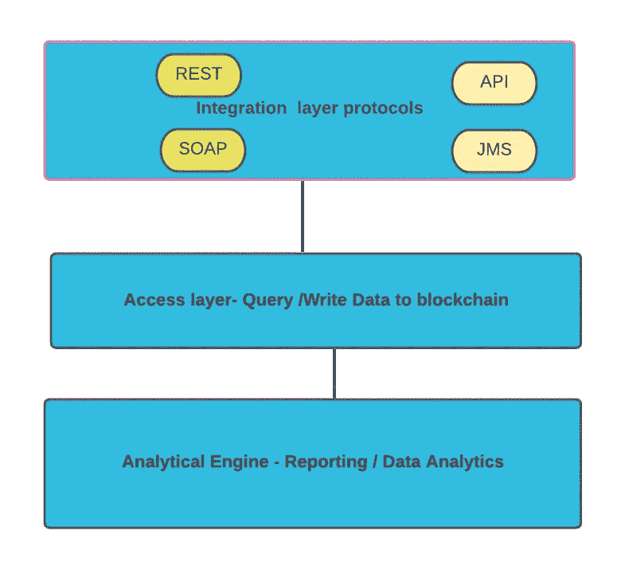

# 基础区块链技术终极指南

> 原文：<https://medium.com/coinmonks/an-ultimate-guide-to-basic-blockchain-technology-77bf57525a83?source=collection_archive---------6----------------------->

# 1.了解区块链

他的文章解释了什么是区块链，区块链是由什么组成的，并探讨了有助于更好地理解这项技术的概念。

*   区块链是一种能够在分散的分类账/数据库中以块的形式存储数据的技术。它不同于传统数据库，在传统数据库中，客户端访问存储在一个位置的数据。而在区块链，数据被复制到构成区块链网络的多台计算机或节点中。
*   区块链是一种分布式、去中心化的账本，运行在网络上的计算机节点上。分散式，因为区块链网络中的所有节点平等地共享软件、数据，并且所有节点都完全自主地读写区块链事务。
*   区块链上的交易是导致状态改变的任何事情。例如，如果甲给乙 5 美元，那就是一笔交易。区块链的一笔此类交易可能会引发多笔其它交易。提交给区块链的每笔交易都必须经过验证并且有效。
*   相互连接的板块构成了区块链。一个块有交易的头和散列，存储为 Markle 根。区块链分类帐是一个条目表，其中的键/值映射到事务处理。在区块链中，连接到网络的每个节点中都有一个分类帐。
*   事务一旦提交就不可变(不会改变)。
*   区块链的目标之一是消除传统模式中存在的中间商。在传统模式中，中间人可以收取一定费用，或者采取有利于某些当事人的行动。区块链努力减少对中间人的依赖，用复杂的计算算法取代中间人提供的仲裁。
*   区块链存储和跟踪数字资产。比特币和以太坊就是使用区块链的加密货币的例子。
*   区块链类似于一本书，其中的积木就像书中的书页。页码跟踪一本书中的页面，同样，唯一的 nonce 和其他标头值一起代表块。一个块上的事务就像书里的条目。丢失一本书的一页将会导致页面失序，同样，篡改一个块将会导致块不同步。
*   区块链中的节点使用对等网络连接，交互通过 IPFS(星际文件系统协议)进行。
*   比特币是第一种使用区块链存储数字交易的去中心化加密货币。比特币是由一群名叫中本聪的人或假名发现的。

> 订阅 [**Coinmonks Youtube 频道**](https://www.youtube.com/c/coinmonks/videos) 获取每日加密新闻。

# 2.区块链中的区块是什么—区块概念

*   块是一个存储桶，用于保存单个用户进行的事务。块将包含块头、块体。创世纪区块是区块链的起点区块。
*   使用前一个块的散列和下一个块的散列来链接区块链中的块。前一块的散列由标题 SHA256(prev_block)表示，下一块的散列由标题 SHA256(next_block)表示。
*   块的标题由以下属性组成:
*   由标记根表示的块的事务
*   Nonce(由矿工计算的复杂唯一值)
*   时间戳
*   难度信息
*   事务计数(块中发生了多少事务)
*   仅使用块头来计算块的散列。块头具有 Markle 根，它是块中所有事务的散列。随着事务的增长，用所有事务构建散列在计算上是复杂的，仅使用块头来计算散列提供了更好的性能。图中显示了方框的简化表示。

# 创世街区

区块链中的第一个数据块是 Genesis 数据块，后续数据块基于使用第一个数据块创建的数据构建。创世纪区块也叫 Block0。Genesis 块从一些初始头设置开始。Genesis 块初始化的几个值是标记根、块版本、块时间和随机数。

# 复杂性随机数

*   随机数是一个唯一的随机数，它以多个零开始，需要由区块链的矿工在提交有效区块之前进行计算。计算随机数是验证提交给区块链的事务的关键。
*   nonce 是一个非常大的数字，计算 nonce 值的计算量非常大。nonce 值由 2 的 68 次幂表示，它用许多前导零初始化，这是一个非常大的值。计算出的 nonce 应该是唯一的，并且小于以前的 nonce 值。随着区块链的增长，计算随机数的复杂性也在增加。一旦 nonce 被计算，它在被提交给区块链之前被节点的所有参与者验证。

# 共识算法—功率、位置

*   工作证明(POW)是比特币或以太坊加密货币在向区块链提交交易之前使用的共识算法，作为交易有效性的规则。矿工们使用区块链的工作证明，试图解开这个复杂的谜。工作证明遵循最长链规则，以验证一个区块。成功求解随机数取决于挖掘器/节点可用的计算资源(GPU)。
*   POW 使用大量计算能力来计算唯一随机数，并且这种能力需求随着区块链复杂度的增长而增加。
*   为了抵消 POW 的高能量需求，有另一种算法正在进行中，即 POS(利益证明)。利益一致证明算法基于用户或采矿者在区块链中拥有的利益数量，用户可以将其作为区块链中的完整节点或验证节点。

# 马克根

*   Markle root 是块中各个事务的所有散列的最终散列值。Markle 根是一棵二叉树，每个事务形成二叉树的叶子。
*   区块链不会以纯文本形式存储交易，算法会计算哈希，并且只存储一个区块中所有交易的哈希。在计算散列之前，块中的事务被分成组。Markle 根将是事务的最终散列。下面是马克尔根的图示。更改单个事务值将会更改哈希值。这将对后续区块造成连锁影响。

# 区块链的特色

*   **区块链**不可信。这意味着什么，它不是信任人类或任何由人类管理的组织来执行和验证区块链上的交易，而是使用复杂的加密算法来散列交易，并且通过签名的非对称密钥(私钥和公钥)来交换消息。
*   **智能合同**——智能合同是用兼容的编程语言预先编写的一套指令，以满足一项协议。一旦智能合约成功执行，交易就完成并提交。智能合约使用 **if-then-else** 语句嵌入一些逻辑或条件来满足协议。
*   区块链使用的不同智能合约使用编程语言，如以太坊(solidity)、Cardano (Haskell)和 python。以太坊、Hyperledger fabric、Solana、Cardano、Multichain、Chia Blockchain 和 Quorum 是市场上几种不同的区块链。
*   区块链可以是公立的也可以是私立的区块链。根据使用案例，企业可以构建私有区块链。
*   可用性、健壮性、信任事务、去中心化、一致性算法都是区块链的核心特性。
*   什么是最长链规则共识算法:

# 分散的

去中心化是区块链技术的核心原则。去中心化的目标是建立一个不受团体、企业或公司控制的系统。在分散式网络中，计算机/节点网络在它们之间共享数据(分类帐)和处理能力。这种设置是可能的，因为具有一些技术背景的普通消费者可以获得计算资源，并且他们将使用这些资源。而在集中式网络中，高可用性架构中的单个服务器或一小组服务器提供后端服务或呈现数据。集中式网络架构基于请求/响应或客户端-服务器模型。这种模式的缺点是，如果一台或所有服务器停机，服务将不可用。

区块链功能

在一个分散的模型中，失败的服务几乎是不可能的。然而，分散式网络的发展需要更多的计算能力和复杂的算法来支持无信任/无许可模型。

# 对等网络

区块链中的节点通过对等网络连接。所有节点共享软件和工作负载，并拥有同等权限。对等网络中的参与者是完整节点或验证节点。这些节点使用星际文件系统(IPFS)协议相互通信。每个节点在其本地存储中都有一份完整的区块链总账副本。

# 星际文件系统(IPFS)

在对等网络中，节点通过 IPFS 协议相互通信。胡安·贝内，也是协议实验室的创始人，创造了 IPFS。《IPFS 议定书》有以下职能组成部分。

让我们来看看 IPFS 和 HTTP 协议之间的一些区别

*   HTTP 基于请求/响应数据传输协议。
*   IPFS 是一个基于文件的协议系统，基于散列值的地址表示内容。在基于内容的地址系统中，DHT 使用计算散列来存储内容。计算哈希表的集合被称为有向无环图(DAGs)
*   Markle DAG 是一个表，其中标识符的值是它所表示的内容的散列(SHA256)。使用分布式哈希表和 Markle DAG 提供了 IPFS 的性能。

# 通过加密算法实现安全性

为了计算区块链中交易的散列值，使用了不同的散列算法。其中一些是 SHA256、SCRYPT 和椭圆曲线算法。对于比特币挖矿，在提交给区块链之前验证交易需要大量的 GPU 能力。

# 私钥和公钥

公钥和私钥用于在区块链中签署和验证交易。加密算法使用发送方的私钥对交易进行签名。接收者使用与发送者的私钥相匹配的公钥来验证交易。数字钱包是一个可以接收和发送数字货币的在线地址。公钥和私钥是钱包之间成功传输交易的中心。在加密算法中使用公钥和私钥使区块链更加安全。私钥由发送方保留，不共享。接收方使用公钥解密消息。

# 非对称或对称密钥加密

1.  对称密钥加密使用共享密钥。与非对称密钥相比，这种方法速度更快。对称密钥中的密钥与公钥相同。
2.  非对称密钥加密使用公钥和私钥。与对称密钥加密相比，这更加安全。在非对称加密中，发送方保留私钥，接收方得到公钥。我们可以从私钥生成公钥，但不能从公钥生成私钥。
3.  SHA1 (1024)和 SHA2 /SHA256 (2048)是私钥和公钥加密的例子。其他密码算法有 ECC ->椭圆曲线密码(ECC) & RIPEMD 160。

# 不可靠的

任何节点都可以加入区块链网络而无需身份证明，这是可能的，因为用于计算交易和验证块的高度安全的算法。被误导的节点对事务的改变将是透明的并被跟踪。

# 未经许可

要加入区块链网络，你不需要特别的许可。区块链支持去中心化设置。公共区块链要求您下载/配置软件，连接到节点网络(点对点),并开始作为挖掘器节点或验证器节点工作。

# 不变

不变性意味着不能改变。区块链中交易的不变性是因为修改区块链分类账中的一个块或改变其内容所涉及的复杂性。一旦采矿者核实了交易并向区块链提交了独特的区块，要改变它几乎是不可能的。任何事务的修改都将改变所有相关块的散列，这将对所有剩余块造成连锁效应，并且这样的操作在区块链网络中在计算上是不可能的。

# 开放源码

区块链代码是开源的，开发者可以下载、修改和增强。开源模型有助于开发 Dapp(分散式应用程序)。开源促进了一种开放的文化，没有政府或组织控制区块链技术的使用。一个这样的例子是以太坊区块链代码库，以太坊 Geth(Go-以太坊)。

# 可追踪性

我们可以追踪区块链的每一笔交易的源头。矿工在将块(交易)提交给区块链之前，在网络中验证交易。对一个块的任何更改都会影响所有其他块。SHA256 或 SCRYPT 等算法用于计算事务的哈希。如果我们可以跟踪一个块(成功的事务)，那么就很容易跟踪区块链中的前一个块和下一个块，因为这些块是通过头值到前一个块和下一个块的散列链接来互连的。

# 全球分散分类账

写入区块链的块作为存储在分类帐中的已提交事务的键/值对进行跟踪。该分类帐被复制到参与 P2P 区块链网络的每个节点的所有本地持久性存储中。

# 智能合同

智能合同是用特定编程语言预先编写的一组指令，以满足协议或匹配区块链中的业务用例。智能合约开发完成后，将被转换为字节码，并在区块链的虚拟机上运行。一旦在 testnet 区块链中成功执行，开发者将智能合同提交给区块链。这些合同将在区块链中，可以重复使用，以执行预编程的指令来履行合同。

传统合同系统和智能合同之间的区别在于，在传统系统中，律师或法律专业人员编写智能合同，并通过与最终用户合作来履行这些合同，而智能合同是使用编程语言编写的，并具有一组 if-else- then 语句，这些语句被编码以满足协议。

支持编写智能合约的编程语言有 solidity(以太坊)、Cardano (Haskell)等。

# 公共区块链 vs 私有区块链

公共区块链对任何拥有计算资源的人开放，加入区块链，并有一个更复杂的共识算法来验证每个块或在达成共识之前。在公共区块链中，计算唯一随机数所需的计算能力非常大。公共或私人区块链使用智能合同来履行合同协议。
一个[私人区块链](https://www.blockchain-council.org/blockchain/private-blockchain-how-it-is-different-from-public-blockchain/)并不对所有人开放，一个被提名的管理者，作为仲裁者，控制着注册。在私人区块链中，当出现冲突时，由决定最后一块工作的仲裁人来解决。私有区块链的维护成本较低，共识算法也不太复杂。
要成功运营一家私人区块链，需要签署并达成一份法律合同。与私人区块链相比，公众对数据访问和权限有不同的要求。在专用区块链中，区块链管理员被授予授予和撤销对特定节点的访问权限的权限。区块链的矿工被授予可执行特权，以验证有效块并将其写入区块链。某些操作只需要读取权限，这允许从区块链读取数据。

区块链是全球网络上区块的去中心化、不可变的交易存储。区块链中的节点之间的交互是通过对等模型进行的。区块链上的交易是不可变的(不可改变的)，这是可能的，因为加密算法用于计算所有交易的散列，并且区块链将该散列存储在分类帐中。对事务值的任何更改都会改变散列。
nonce 是一个计算困难的值，是一个 2 的 68 次方的数值，这个值对于一个块是唯一的。无信任和无许可是区块链技术的其他一些特征。

# 1.区块链架构(简化)

不同的层使得节点可以访问区块链架构，并允许节点操作区块链上的数据。这些层是:

1.  集成层，
2.  区块链接入层&
3.  分析层。

集成层用于与区块链层交互。集成层包括 REST API、SOAP、Java 消息服务协议和其他核心功能，如身份管理、治理和数据智能。
区块链层提供访问区块链数据和写入数据的功能&并执行查询事务。应用程序通过区块链层访问区块链的核心功能。
分析层提供报告和仪表板功能。

**阅读更多关于 IAM 的文章&安全@**[**【https://iamblockc.medium.com/】**](https://iamblockc.medium.com/)

*原载于 2021 年 8 月 6 日 https://www.blockchain-council.org**[*。*](https://www.blockchain-council.org/blockchain/an-ultimate-guide-to-basic-blockchain-technology/)*

> *加入 Coinmonks [电报频道](https://t.me/coincodecap)和 [Youtube 频道](https://www.youtube.com/c/coinmonks/videos)了解加密交易和投资*

## *另外，阅读*

*   *[什么是保证金交易](https://blog.coincodecap.com/margin-trading) | [美元成本平均法](https://blog.coincodecap.com/dca)*
*   *[支持卡审核](https://blog.coincodecap.com/uphold-card-review) | [信任钱包 vs 元掩码](https://blog.coincodecap.com/trust-wallet-vs-metamask)*
*   *[Exness 回顾](https://blog.coincodecap.com/exness-review)|[moon xbt Vs bit get Vs Bingbon](https://blog.coincodecap.com/bingbon-vs-bitget-vs-moonxbt)*
*   *[如何开始通过加密贷款赚取被动收入](https://blog.coincodecap.com/passive-income-crypto-lending)*
*   *[BigONE 交易所评论](/coinmonks/bigone-exchange-review-64705d85a1d4) | [电网交易机器人](https://blog.coincodecap.com/grid-trading)*
*   *[新加坡十大最佳加密交易所](https://blog.coincodecap.com/crypto-exchange-in-singapore) | [购买 AXS](https://blog.coincodecap.com/buy-axs-token)*
*   *[投资印度的最佳加密软件](https://blog.coincodecap.com/best-crypto-to-invest-in-india-in-2021) | [WazirX P2P](https://blog.coincodecap.com/wazirx-p2p)*
*   *[7 个最佳零费用加密交易平台](https://blog.coincodecap.com/zero-fee-crypto-exchanges)*
*   *[分散交易所](https://blog.coincodecap.com/what-are-decentralized-exchanges) | [比特 FIP](https://blog.coincodecap.com/bitbns-fip)*
*   *[用信用卡购买密码的 10 个最佳地点](https://blog.coincodecap.com/buy-crypto-with-credit-card)*
*   *[加拿大最佳加密交易机器人](https://blog.coincodecap.com/5-best-crypto-trading-bots-in-canada) | [Bybit vs 币安](https://blog.coincodecap.com/bybit-binance-moonxbt)*
*   *[火币加密交易信号](https://blog.coincodecap.com/huobi-crypto-trading-signals) | [Swapzone 审查](/coinmonks/swapzone-review-crypto-exchange-data-aggregator-e0ad78e55ed7)*
*   *最佳[密码交易机器人](https://blog.coincodecap.com/best-crypto-trading-bots) | [购买索拉纳](https://blog.coincodecap.com/buy-solana) | [矩阵导出评论](https://blog.coincodecap.com/matrixport-review)*
*   *[Coldcard 评论](https://blog.coincodecap.com/coldcard-review) | [BOXtradEX 评论](https://blog.coincodecap.com/boxtradex-review)|[uni swap 指南](https://blog.coincodecap.com/uniswap)*