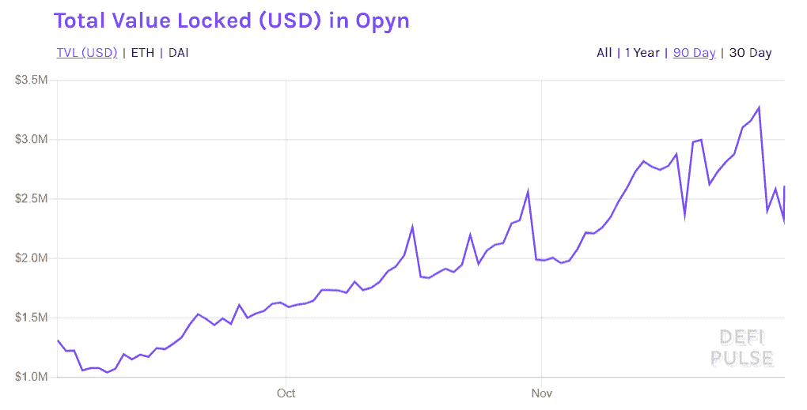

# 更新“分散期权平台的比较”

> 原文：<https://medium.com/coinmonks/an-update-of-a-comparison-of-decentralized-options-platforms-91b14d3a6170?source=collection_archive---------0----------------------->

## 下一个最大的 DeFi 机会

> 对于想了解 DeFi options 流动性解决方案更多信息的读者，请查看 2021 年 2 月 18 日发布的[文章。](https://coinmarketcap.com/alexandria/article/a-deep-dive-into-pooled-liquidity-in-defi-options-finnexus)

自从我和 [Nicholas Krapels](https://medium.com/u/a8e1eb410fb0?source=post_page-----140b1421c71c--------------------------------) 完成关于分散期权平台的最后一篇[对比文章](/coinmonks/a-comparison-of-decentralized-options-platforms-140b1421c71c)以来，已经过去了 5 个多月，我称之为“下一个大的 DeFi 机会”DeFi 的发展速度令人难以置信，过去几个月发生了很大变化。几乎所有 DeFi 资产的价格，包括我们自己的 [FinNexus (FNX)代币](https://www.coingecko.com/en/coins/finnexus)，都在八月底达到顶峰。虽然寿司剧确实阻止了行业的价格势头，但这并没有抑制 DeFi 项目的发展势头。如果有什么不同的话，我们已经看到了比旧的 DeFi 夏季食品代币更大、更大胆的项目宣布，这些代币只不过是一种单一资产奖励代币合同，推出了表情符号支持的加密货币。 [APY.finance](https://apy.finance/) 、 [Barnbridge](https://barnbridge.com/) 和 [Hegic](https://www.hegic.co/) 都在 [DeFi](https://blog.coincodecap.com/the-ultimate-guide-to-defi-decentralized-finance) 行业留下了自己的印记。在提供一套健壮的、可组合的 DeFi 基础层协议方面，每一种协议都以自己的方式代表了重大的进步。

然而，DeFi 期权行业的发展速度和增长已经走在了 DeFi 行业的前列。新的 DeFi options 模型和项目不断涌现。因此，应读者的要求，同时也是出于对 DeFi 用户的一般教育目的，本文将作为之前由 [CoinMonks](https://medium.com/coinmonks) 发表的比较分析的更新。建议先浏览一下[上一篇文章](/coinmonks/a-comparison-of-decentralized-options-platforms-140b1421c71c)再跳太深进入本次更新。

下面列出的 DeFi 选项平台没有特定的顺序。

# 预览

(表格制作于 2020 年 11 月 25 日)

# 赫吉奇

Hegic 是过去几个月所有分散期权市场的明星平台。它在 2020 年 9 月成功完成了价值 10 亿美元的海格国利代币销售，使用了独特的 IBCO 机制。Hegic v888 模型于 2020 年 10 月 10 日上线，代表了 Hegic 协议的里程碑式转变。以前，流动性池分为卖出池和买入池，戴作为 ETH 卖出池的抵押品，而 ETH 本身作为 ETH 买入池的抵押品。v888 模式将流动性池的角色完全改变为双向池，这使得 ETH 可以作为 ETH 买入和卖出的抵押品。这种新机制还使得为 WBTC 看涨和看跌期权建立流动性池变得更加容易。此外，美元霸权代币的引入使得用不仅仅是池本身的利润和损失来激励这些流动性池成为可能。凭借慷慨的流动性挖掘奖励和假名首席 solo 开发者的积极社区参与 [0MOLLY WINTERMUT3](https://twitter.com/0mllwntrmt3?s=21) ，Hegic protocol 自推出 v888 以来，在不到 2 个月的时间里，其两个抵押品池锁定了超过[7500 万美元](https://defipulse.com/hegic)。

## 黑格尔派 IBCO

IBCO 代表初始[粘合曲线提供](https://defiprime.com/bonding-curve-explained)。Hegic 团队通过智能合约部署了线性债券曲线，保证所有发行参与者的结算价格相同。这种机制为代币提供了底价，并且随着参与者的数量线性地增加代币价格。bonding curve 产品的目的是防止大多数 Uniswap 初始产品中普遍存在的前期运行问题。

这次象征性的销售相当成功，在 IBCO 过程中筹集了 31，000 ETH。

## 海格 v888

虽然莫莉的团队保持匿名，但 v888 的命名可能会泄露他们的起源(只是一个大胆的猜测)。随着新版 Hegic 于 10 月 10 日在 mainnet 上首次亮相，基本的集合流动性模型仍然沿用了之前版本的协议，但管理这些流动性池如何运行的机制发生了一些戏剧性的变化。

以下是基本差异的概要。

1.  Hegic v888 有双池模式。之前的 DAI 和 ETH 资金池被终止，同时创建了新的 ETH 和 WBTC 流动性资金池。
2.  v888 包括以太网和 WBTC 选项，而以前只有以太网选项可用。
3.  Hegic 的流动性池现在是双向的，这意味着看跌期权和看涨期权可以由同一个池提供动力，分别以 WBTC 和联邦储蓄银行作为基础资产。以前版本的协议允许 ETH puts 由 DAI 池支持，ETH calls 由 ETH 池支持。
4.  以 rHEGIC 计价的非常有吸引力的采矿奖励承诺为抵押品池提供流动性，rhe gic 是一种象征，以后可以转换为 HEGIC。
5.  Hegic 现在是一个 DeFi 原语，其他开发团队建立在 Hegic 的协议之上，如 [ZlotFinance](https://zlot.finance/) 和 [Hegic Staking](https://www.hegicstaking.co/) 。
6.  期权不需要像黑格尔的上一个版本那样进行物理结算。WBTC 和瑞士法郎现在是现金结算的基本货币。

## 到目前为止 Hegic v888 中的数字

据 DeFipulse 报道，Hegic v888 中的 TVL 自诞生以来一直在急剧上升。

(TVL in Hegic from 11th Oct 2020 to 30th Nov 2020)

此外，截至 2020 年 11 月 18 日，交易了 880 份期权，总交易额达到 38，000，000 美元。事实上，黑格尔的第一个月有点像“对冲魔术”。

更多信息可以在 Hegic 仪表板上找到[这里](https://explore.duneanalytics.com/dashboard/hegic-v2)沙丘分析。

## 黑格尔的美

Hegic 在其协议中使用对等池选项模型。流动性池是所有期权的交易对手，有各种各样的条款，从池中写出。所有买家共同分享流动性，零价格滑动。这个模型也为期权作者提供了更多的灵活性。请阅读[上一篇文章](/coinmonks/a-comparison-of-decentralized-options-platforms-140b1421c71c)以深入了解其优势。

Hegic v888 使用双向流动性池。以前，看跌期权池和看涨期权池是分开的，确保从池中卖出的期权总是完全抵押和实物结算的。然而，在这个旧模型中，每个不同资金池的流动性提供者都面临着片面的风险。例如，DAI 池只能写看跌期权。因此，当市场走向下行时，流动性提供者更有可能亏损，因为池中的所有期权都是货币。换句话说，维持独立的资金池意味着风险只是部分分散，损害了流动性提供者经风险调整后的回报。聪明的流动性提供者当然可以对冲这些单边风险，但这种保护性的多样性并没有像 v888 那样被纳入协议中。

使用 Hegic v888 中的双向池，看跌期权和看涨期权同时由同一个池提供动力。如果看跌期权亏损，看涨期权将会盈利。这种双向性降低了只有单一类型选项的组合的风险，因为它进一步分散了风险。

此外，霸权代币持有人赚取有吸引力的赌注奖励，而资金池贡献者获得丰厚的流动性挖掘奖励。期权买家也享受 Hegic 的奖励，有点像回扣。请参考 Hegic 文档或其网站了解更多详细信息。

## 关于黑格尔的一些担忧

**抵押不足**

在以前的 Hegic 模型中，资金池的逻辑是建立在期权的实物结算上的，这就不用担心资金池是否会被抵押不足。但是，在 v888 中，情况就不同了。池是双向的，可以写买入和卖出。

我们以 v888 ETH 池为例。对于买入期权，这没有问题，因为资金池仅由 ETH 组成，因此当买入期权持有者行使其期权时，无论市场价格如何变动，总可以交割。换句话说，为流动性提供的抵押品，因为它是以 ETH 计价的，也随着 ETH 价格的上涨而升值。

但对于看跌期权来说，双向性可能是个问题。看跌期权赋予期权持有者以一定的美元价格出售 ETH 的权利，比如保护或保险。在 Hegic 的模型中，如果期权持有者行使看跌期权，期权池需要交付市场价格和执行价格之间的差额，该差额以美元计算，但以 ETH 代币交付。在 v888 中，这被称为期权的现金结算。在以前版本的 Hegic 协议中，它是物理解决的。

现在假设 ETH 价格一周内下跌 30%。池中的 ETH 值也减少了 30%,这削弱了池的性能。在极端情况下，如果池中有 4 周的全价(ATM)看跌期权，并且 ETH 市场价格在这 4 周内下跌 50%，池将被清空。如果下降超过 50%，该池将无法运行。

就目前而言，Hegic 并未在其文件中规定当前的抵押率要求，但将抵押率保持在 100%以上或根据市场情况进行动态调整会更安全。

**期权定价**

Hegic 为期权定价应用了一个特殊的简化定价模型，不同于传统模型，隐含波动率(IV)参考 skew.com 手动更新。

该协议规定了 1 个月的自动柜员机 IVs。每当该参数在 Skew.com 上变化-10%或+10%时，在 Hegic 智能合约中手动调整 IV 参数。此外，Hegic v888 对购买期权收取 1%的额外费用，这些费用全部分配给赌注持有人。

与其他平台相比，这两种机制导致期权的价格相对较高，尤其是价外(OTM)期权，尽管事实上它们通过交易挖掘回扣得到补偿。如果市场变得更加拥挤，Hegic 和其他期权市场之间的套利机会可能会出现。

**池内风险**

由于在期权定价中没有价格滑动，理想的看涨看跌期权平衡很难维持。

例如，在 2020 年 11 月 21 日，在 ETH 池中，约有 75%的 ETH 调用占总期权量。这一 1:3 的看跌/看涨比率使得该基金的风险高度偏高。WBTC 游泳池的情况类似。资金池参与者可能不得不手动对冲市场大幅上涨的潜在风险，即使是资金池参与者。然而，作为资金池流动性提供者的潜在损失通过采矿激励得到了很好的补偿。

## 摘要

Hegic 现在是分散期权的领导者，拥有最高的市场资本总额和锁定的总价值(TVL)。分散期权市场潜力巨大，而且刚刚起步。

# 芬尼苏斯

自从我们上一篇文章的简要介绍以来，FinNexus 已经取得了很大的进步。选项(FPO)1.0 版的 FinNexus 协议正式上线[这里](http://options.finnexus.io)。最整洁的方面是它是一个同时存在于以太坊和 Wanchain 上的 Dual Dapp。如果您安装了 Metamask 和 Wanmask，您可以从同一个网站访问这两个链！更多信息可以在 [FinNexus 文档](https://www.docs.finnexus.io/)网站上找到。

## 通用期权平台

FPO 1.0 版是一个分散的点对点期权模型，建立在汇集流动性的基础上。与 Hegic 一样，汇集流动性的妙处在于它同时自动地从所有市场参与者那里积累流动性。风险和溢价也在整个流动性提供者群体中平均分担，因此没有任何个人参与者处于高风险中，所有参与者都可以分享回报。

FinNexus 称 FPO 为通用期权平台。之所以这么叫，是因为这些池可以支持任何基础层区块链上的任何底层资产。

FPO 1.0 版的独特之处如下:

1.  它可以与不同的连锁店合作。现在 FPO 在以太坊和万链上有了联合界面。稍后，它可能会来到埃尔隆德，卡尔迪亚链和更多。
2.  FPO 1.0 版支持根据流动性池中持有的抵押品创建和交易任何类型基础资产的期权。现在，FPO 1.0 版支持 BTC，瑞士联邦理工学院，MKR，链接，SNX 选项。底层甚至可能不限于加密资产。像黄金、石油、股票或指数这样的现实世界的金融资产可以很容易地被整合。事实上，由于 FinNexus 与 Chainlink 合作，如果他们有价格，FinNexus 可以将其纳入我们的期权流动性池。
3.  期权购买者的选择非常灵活，可以根据他/她的需求进行定制。

## MASP 机制

MASP 主张多资产单池模式，是 FPO 平台的核心机制和创新点。多资产意味着 FPO 支持多种资产作为期权的基础，以及那些有助于抵押品的资产。单一池表示期权 live 由联合流动性提供动力，这并不一定意味着只有一个流动性池。以太坊上目前有两个泳池，一个是 USDC 泳池，一个是 FNX 泳池。Wanchain 上还有一个 WAN/FNX 混合池，双重支持已发行的期权。

下面是以太坊上 USDC 池中 MASP 机制的例子:

## 期权定价

FPO 1.0 版中的期权根据 [Black-Scholes 期权定价模型](https://www.investopedia.com/terms/b/blackscholes.asp)定价。当购买 FPO 1.0 版期权时，它们由植入智能合约的布莱克-斯科尔斯公式定价。定价期权的关键参数包括基础资产价格，如 BTC/美元、瑞士联邦理工学院/美元、林克/美元、MKR/瑞士联邦理工学院和 SNX/美元。这些计算中最关键的是 IV 的来源。与 Hegic 需要基于 skew.com 数据的手动输入相反，FPO 使用来自 Deribit 的实时反馈来为 FPO 1.0 版智能合约提供这些关键数据点。Hegic 的另一个与众不同之处是，定价公式中增加了一个调整系数，使资金池在风险方面更加平衡。

此外，通过 USDC 池，期权以稳定的硬币进行交易和结算，这更接近期权交易员的交易惯例，更容易与不同的收益率追逐策略合作，其财务表现通常以美元衡量。

## 附加安全机制

除了对 FPO 模型的基本介绍外，还有几个为安全目的精心设计的机制。以下几点强调了 FPO 固有的安全机制，这是当今 DeFi 世界需要考虑的一个重要问题。

1.  **最低抵押品要求。** FinNexus 引入了资金池的最低抵押比率(MCR)要求。这是一个创新的机制，旨在控制池的总期权敞口的大小。MCR 确保期权总是超额抵押。
2.  **调价调整系数。** FinNexus 引入了定价调整系数，通过增加期权定价系数来缓解集中度。它会自动阻止购买股票组合中权重已经过高的期权。简而言之，如果看涨期权比看跌期权多，那么看涨期权就更贵，反之亦然。
3.  **一小时冷藏时间。**为了防范 FPO 1.0 版中可能出现的闪贷漏洞，我们设计了一种称为“冷却时间”的特殊机制，在此期间，期权购买者不能出售或行使期权，池参与者也不能从池中提取资产。“冷却时间”设置为一小时。
4.  **移动平均 IV 和 IV 曲面映射。** FinNexus 应用市场上最具流动性的期权的平均 IV，即 1 天、2 天和 7 天的按价 IV，并通过小时移动平均线将其输入 FPO 1.0 版。然后，该协议使用该数据点作为 DeFi 期权市场的“锚 IV”。基于此锚 IV，FPO 1.0 版应用[随机波动率启发(SVI)](https://www.math.kth.se/matstat/seminarier/reports/M-exjobb14/140909.pdf) 参数化模型，并导出[波动率矩阵或波动率表面](https://www.investopedia.com/articles/stock-analysis/081916/volatility-surface-explained.asp)。

《FPO》于 11 月 4 日在以太坊和 11 月 11 日在 Wanchain 上线。到目前为止，FPO 在其智能合同中已经看到了最高 170 万美元的 TVL。

## 摘要

FinNexus 是分散期权市场的一颗新星。其 FPO 是一个分散的对等池期权模型，类似于 Hegic，但有一些鲜明的特点。它的通用设计使得它有希望在其分散期权模型中包括任何加密资产甚至真实世界的资产。与其他项目和市场战略合作的潜力是非常令人兴奋的。编码的定价机制更加动态，可以自动平衡池中的风险。另外，FinNexus 的市值相对较低。

# 奥普恩

自从我们上次讨论以来， [Opyn](https://opyn.co/#/) 及其凸性协议的基础保持不变。然而，它的产品种类已经有了很大的改进。以前用户只能通过 ETH put，现在用户可以选择 7 个 ETH put 和 2 个 ETH calls，以及选择 [DPI](https://www.coingecko.com/en/coins/defipulse-index) 、WBTC、UNI 和 YFI 选项。

根据 defipulse，自 2020 年 8 月以来，奥普恩的 TVL 如下所示。

（TVL in OPYN till 30th Nov 2020）

Opyn 期权是美式期权，这意味着它们可以在到期前的任何时候出售或行使。美式期权的意义在于，它们给予持有者更多对冲的灵活性。在某些情况下，卖出看跌期权比行使看跌期权更有利可图。看跌期权的价值随着你所持标的资产价值的下降而上升，让你可以卖出它，降低整体投资组合的下跌风险。

对于 OPYN 团队来说，一个令人兴奋的进展是他们即将推出 OPYN v2。OPYN v2 将会有一些独特的更新，尽管一些功能还没有最终确定。我将在这里重点介绍其中的一些进步。

1.  **到期后自动行使 ITM 期权。** Opyn 期权可在到期时自动结算。
2.  抵押品存放在保证金金库。该机制允许 Opyn 保留所有必要的抵押品，以完全支持他们的看涨期权和基于最大潜在损失的看跌期权差价。当采用复杂的期权组合策略时，资本效率更高，也更灵活。
3.  **更大的利润灵活性。**未来的更新可能会考虑到灵活的利润和清算。同样，这将提高资本效率。
4.  **担保品的多样化。**使用收益或附息代币作为抵押品允许期权卖方维持两个回报来源。他们可以赚取利息，以及任何挖掘的治理令牌，同时从出售期权溢价中获利。Opyn v2 将允许像复合 cTokens 这样的收益资产作为期权的抵押品(如 ETHUSDC 看跌期权的 cUSDC)。卖方将为他们的抵押品赚取利息和报酬。在流动性充足的情况下，渴望的货币内(ITM)期权可以以现金结算，并与基础资产分开。对于期权购买者来说，与非收益性资产支持的期权相比，具有收益性抵押品的期权的期权费可能更低。
5.  **暂时抵押不足的金库。**它可以实现更复杂的互动和更高的资本效率。它可能类似于期权中的闪电交易。

奇怪的是，尽管 DeFi 协议令牌自今年夏天以来取得了巨大的成功，但目前还没有用于 Opyn 的协议令牌。

## 摘要

Opyn 是 Uniswap 的第一个具有自动做市商(AMM)流动性的分散期权项目。Opyn 期权是令牌化的，可以很容易地与各种策略结合起来，既用于购买也用于出售期权。与 Hegic 和 FinNexus 的对等池模型不同，期权卖方只能在流动性池中被动工作，Opyn 期权卖方和卖方可以根据自己的条件出售期权。Opyn v2 的升级预计将很快推出，可能会给这个领域带来一些新的创新。

# 鸦片

正如我们在上一篇文章中介绍的，Opium 正在构建一个具有更广阔梦想的衍生协议。鸦片不仅仅局限于选择。

## 带各种衬垫的选项

鸦片以其多种多样的选择产品而闻名。Opium 在气价上有[期权，允许用户对冲以太坊气价。Opium 有多种 ZEPO，这是一种针对不同基础资产的欧式零履约看涨期权，履约价格设置为零，复制了基础加密资产。在传统金融中，执行价格为零的欧式看涨期权通常在可能存在资产转让障碍的地方交易。期权的购买者肯定会行使它，所以这与拥有基础资产是一样的，卖方在基础资产的价格中有完全的抵消参与。](https://docs.opium.exchange/standard-contract-specification/weekly-call-option-on-gas-price)

此外，Opium 还开发了具有不同基础资产的期权产品，如 BAL、BZRX、COMP、NXM、YFI 等。它还对一些奇异的期权进行了尝试，比如 COMP 上的二元期权，这是一种要么兑现要么不兑现的二元期权。如果期权在 ITM 到期，卖方支付一定数量的现金，而买方向卖方支付约定的溢价。鸦片交易所是交易这些期权产品的场所，它为用户提供了订单流动性。担心的是目前流动性还不够深。

## DeFi 的第一张 CD

2020 年 8 月，鸦片与 Aave 合作，在 DeFi 推出了首个信用违约互换(CDS)产品。CDS 是一种保险产品，也是一种金融衍生品，为借款人的违约提供保护。例如，如果贷款人担心借款人会拖欠贷款，贷款人可以使用 CDS 来抵消或互换这种风险。为了规避违约风险，贷方从另一个投资者那里购买 CDS，该投资者同意在借方违约的情况下偿还贷方。

它的工作原理如下:

Opium 还开发了 WBTC/BTC 和 USDT/USDC 价格贬值的 CDS 合约。CDS 产品可在[鸦片交易所](https://trade.opium.exchange/)交易，具有订单簿流动性。

## 掉期利率平台

利率互换是世界上最重要和最大的衍生品市场之一。[据介绍，互换。RATE](https://swaprate.finance/) 是一个平台，在这个平台上，你可以对冲或利用违约借贷中的利率波动。在 DeFi 中首次引入了最广泛使用的金融衍生品之一的分散利率互换(IRS)。IRS 是一种合同，在这种合同中，一个未来利息支付流根据指定的本金金额交换为另一个。

例如，通过使用国税局，用户可以固定你的存款或贷款的浮动利率。IRS 就像一个特殊的保险合同，将在到期时支付承诺的固定利率和实际利率之间的差额。

在掉期交易中。费率，可以选择支付浮动领取固定费率，也可以选择支付固定领取浮动费率。随着流动性越来越深，鸦片团队将引入实时互换曲线。IRS 是传统金融中一个强大而庞大的衍生市场。我们很高兴鸦片把它引进了 DeFi。

目前没有鸦片的协议令牌。

## 摘要

鸦片是一个去中心化的衍生协议，不仅仅是期权。它开发了各种基础资产的期权，如 ETH GAS、BAL、BZRX、COMP、NXM、YFI 等。以及 ZEPO 和 binary 选项。它推出了首个分散式 CDS 和 IRS 产品。鸦片衍生品的流动性是基于订单的。观察这些创新将如何发展是一件有趣的事情。

# 奥克特斯

ACO 是一个分散的非托管期权协议，允许用户进行无信任交易、铸造和行使看涨和看跌期权。ACO 协议将看跌期权和看涨期权合约令牌化，创建 ERC20 令牌，用户可以发送、交易或甚至将 ACO 令牌集成到其他 DeFi 项目中。自从我们的介绍性作品并于 2020 年 11 月正式更名为 Auctus 以来，ACO 已经进行了许多创新。

## uui 增强和选项丰富

Auctus 将 uui 增强为更简单明了的界面。而对于高级交易者，你可以随时进入高级界面。右上角有一个开关。

Auctus 在 2020 年 8 月下旬对 SNX 和 YFI 进行了一些试验，并在 2020 年 9 月对寿司进行了试验。然而，目前只有 WBTC 和瑞士联邦理工学院的选项在其平台上运行。

## 选项编写器池

除了订单簿流动性，Auctus 还通过引入集合流动性增强了其协议，目前在 2020 年 11 月推出测试版。流动性提供者可以通过自动出售备兑期权获得溢价。

正如这里提到的，Auctus 的目标是允许创建定制的流动性池，这意味着期权作者可以决定他们愿意创造和出售的履约价格和到期日的范围，以及决定他们愿意出售的最小隐含波动率(IV)。IV 根据池的利用率进行调整。

从 2020 年 11 月 19 日的 UI 开始，Auctus 在 ETH-USDC 和 WBTC-USDC 对中维持 4 个池作为看跌期权和看涨期权，作为期权的卖方，具有执行价格范围和到期范围。这些池受到更多限制的控制，并不时更新。汇集的流动资金最终流向当前基本模式用户的市场，随后可能会包括在订单簿中。因此，Auctus 集合流动性模型与 Hegic 和 FinNexus 的集合流动性模型的工作方式不同。

## 奥克特斯拱顶

2020 年 11 月，Auctus 在市场上推出了第一批保险库策略。

金库代表了一种结合了生息协议和期权的被动投资策略。一些保险库提供资金保护，因此可以适应所有的风险状况。尽管一些金库提供本金保护，但它们仍面临智能合约的风险。金库通过社会化天然气成本和自动化分配策略使用户受益。

Auctus 上的第一个金库是 [3POOL-ETHCALL](https://docs.auctus.org/vaults/vaults) 。它为 ETH 暴露提供主要保护。从养殖的 CRV 治理代币产生的收益被自动用于购买 ETH 看涨期权。

后来，它可能会推出其他金库，如看涨或看跌策略或 IL 对冲策略。

## 摘要

Auctus 期权以订单簿流动性进行标记。然而，它为作家创造了流动性池，他们将通过自动出售备兑期权获得溢价。有趣的是，Auctus 正在用不同的策略创建金库，其选项高度复杂。在各种投资策略中，期权可以成为保险和投机的有力工具。让我们拭目以待，看看这些金库将提供什么，以及期权将如何与金库协同工作。

# 原始的

在过去的几个月里，Primitive 取得了进展。之前，Primitive 对于流动性池的利用率作为 IV 的代理有一些非常独特的想法，正如我们在上一篇文章中介绍的那样。那是 Primitive 的第一个原型模型。显然，这个创新的想法已经被放弃了。IV 是一块难啃的骨头，但它是打开一个有效的分散期权市场的钥匙。2020 年 10 月，Primitive 在以太坊的 Rinkeby testnet 上推出了新的界面和选项模型。

Primitive 更新后的 testnet 模型似乎有点类似于 Opyn。它正在用两个可替换的令牌测试期权工具本身:一个长期权和一个短期权 ERC20。创建期权需要存放基础资产，这意味着每个期权都是 100%抵押的。创建期权时，发起交易的一方将收到长令牌和短令牌。然后，该方可以出售任何一个(或两个)代币，只对期权(多头或空头)进行单一敞口。

Uniswap 流动性将用于期权代币的交易。计划在稍后阶段，Uniswap 池将被一个用于交易期权的“更好的池机制”所取代。也许一些创新的方法来解决时间衰减和非永久性损失的问题。Primitive 模型和文档还在构建中，看看 Primitive 会给 DeFi 市场带来什么将会很有趣。

目前，Primitive 没有平台令牌。

# 赫吉特

Hedget 是一个新的分散平台，在筹集了 50 万美元的种子资金后，于 2020 年 8 月问世。2020 年 9 月，它完成了公开发售，并在多家交易所上市。Hedget 目前正在开发中，alpha 演示版将在 hedget.com(T1)推出。但是您需要下注 HGET 代币才能参与。

据 Hedget 网站称，该公司采用了一种总部位于克劳莉娅的 L2 解决方案，处理交易、跟踪合约所有权，并通过以太坊智能合约促进进行结算所需的沟通。此外，Hedget 宣布，它将利用币安智能链的一个版本的 Hedget 平台，与币安分散交易所的资产。

尽管 Hedget 的产品尚未上市，但根据他们的产品结构，它最有可能是一种完全抵押的点对点分散期权模型。它将支持欧式期权，这意味着期权只能在到期时结算。期权可能会在 Hedget 的交易场所进行令牌化和交易。

# Powertrade

PowerTrade 是一个比特币期权交易平台，它提供移动优先的交易体验。2020 年 9 月，PowerTrade 在一轮私人代币预售中筹集了 470 万美元。同月晚些时候，该公司发行了 PowerTrade Fuel (PTF)股票，并在多家交易所上市。目前，PowerTrade 团队正在 testnet 上测试一个内部 alpha，它在 exchange testnet 上运行交易。据该团队称，该平台将于 2020 年第四季度推出。

# 分离舱

自从我们上次介绍以来，最近几个月我们没有听到太多来自 Pods 的消息，但是它正在积极地扩大它的团队。他们的平台仍处于测试阶段，希望它能给市场带来一些有趣和不同的东西。

目前没有用于 pod 的协议令牌。

# 结论

随着我们进入 2020 年 12 月，我们对分散期权市场的总结到此结束。在 DeFi 行业，项目和代码变化极快。几个月后，当我再次更新这篇文章时，Andre Cronje 很可能已经启动了三个新项目，而 YFI 将已经吸收了全部 DeFi 平台的一半。

然而，从 30，000 英尺的高度来看，有时更容易看出某个行业的发展方向。因此，跟踪这 9 个 DeFi 选项平台，以及其他上线的平台，将是最有趣的观察。每个平台都略有不同。但是创新想法的集合推动了整个空间的发展。

很高兴能参与未来协议的开发。

# 关于芬尼苏斯

[FinNexus](http://finnexus.io/) 率先推出了一项跨链 DeFi 协议，为单一抵押品池内的多项资产提供期权敞口。这种突破性的多资产单一池(MASP)方法用于分散的点对点期权平台，使任何人在任何地方都可以利用或对冲他们在各种加密资产中的头寸。FinNexus 目前在以太坊和 Wanchain 上运行，它打算很快将其区块链不可知的 FinNexus Protocol for Options (FPO)带到埃尔隆德和 Kardiachain。

[***通迅***](https://mailchi.mp/9c15712d2bbf/finnexus-newsletter)***|***[***白皮书***](https://finnexus.github.io/Pdfs/FinNexus_Whitepaper_en.pdf)***|***[***电报***](https://t.me/FinNexusOfficial)***|***[***推特***](https://twitter.com/fin_nexus)***|***

**

# *另外，阅读*

*   *最好的[密码交易机器人](/coinmonks/crypto-trading-bot-c2ffce8acb2a)*
*   *[德里比特评论](/coinmonks/deribit-review-options-fees-apis-and-testnet-2ca16c4bbdb2) |选项、费用、API 和 Testnet*
*   *[FTX 密码交易所评论](/coinmonks/ftx-crypto-exchange-review-53664ac1198f)*
*   *最好的比特币[硬件钱包](/coinmonks/the-best-cryptocurrency-hardware-wallets-of-2020-e28b1c124069?source=friends_link&sk=324dd9ff8556ab578d71e7ad7658ad7c)*
*   *[加密复制交易平台](/coinmonks/top-10-crypto-copy-trading-platforms-for-beginners-d0c37c7d698c)*
*   *最好的[加密税务软件](/coinmonks/best-crypto-tax-tool-for-my-money-72d4b430816b)*
*   *[最佳加密交易平台](/coinmonks/the-best-crypto-trading-platforms-in-2020-the-definitive-guide-updated-c72f8b874555)*
*   *最佳[加密贷款平台](/coinmonks/top-5-crypto-lending-platforms-in-2020-that-you-need-to-know-a1b675cec3fa)*
*   *[莱杰纳米 S vs 特雷佐 one vs 特雷佐 T vs 莱杰纳米 X](https://blog.coincodecap.com/ledger-nano-s-vs-trezor-one-ledger-nano-x-trezor-t)*
*   *[block fi vs Celsius](/coinmonks/blockfi-vs-celsius-vs-hodlnaut-8a1cc8c26630)vs Hodlnaut*
*   *Bitsgap 评论——一个轻松赚钱的加密交易机器人*
*   *为专业人士设计的加密交易机器人*
*   *[PrimeXBT 审查](/coinmonks/primexbt-review-88e0815be858) |杠杆交易、费用和交易*
*   *HaasOnline 评论享受九折优惠*
*   *Bitmex 的[保证金交易指南](/coinmonks/the-idiots-guide-to-margin-trading-on-bitmex-dbbd7742c6fc?source=friends_link&sk=7bfa99d2a181142510c8442c8ddb0786)*
*   *[eToro 评论](/coinmonks/etoro-review-78807ddeb33c) |交易股票、密码、交易所交易基金、差价合约和商品*
*   *[BlockFi 评论](/coinmonks/blockfi-review-53096053c097) |赚取高达 8.6%的加密利息*
*   *[面向开发人员的最佳加密 API](/coinmonks/best-crypto-apis-for-developers-5efe3a597a9f)*
*   *[最佳区块链分析工具](https://bitquery.io/blog/best-blockchain-analysis-tools-and-software)*
*   *[加密套利](/coinmonks/crypto-arbitrage-guide-how-to-make-money-as-a-beginner-62bfe5c868f6)指南:新手如何赚钱*
*   *顶级[比特币节点](https://blog.coincodecap.com/bitcoin-node-solutions)提供商*
*   *最佳[加密制图工具](/coinmonks/what-are-the-best-charting-platforms-for-cryptocurrency-trading-85aade584d80)*
*   *了解比特币的[最佳书籍有哪些？](/coinmonks/what-are-the-best-books-to-learn-bitcoin-409aeb9aff4b)*

> *[直接在您的收件箱中获得最佳软件交易](/coinmonks/newsletters/coinmonks)*

**