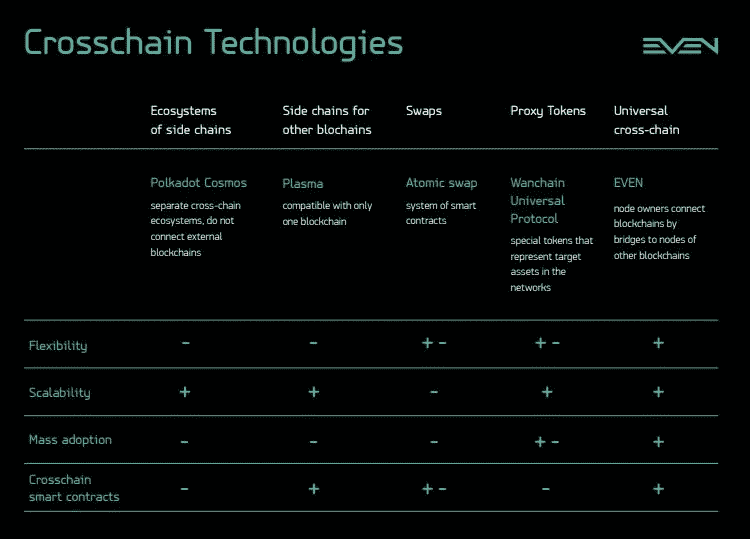

# 跨链平台分析

> 原文：<https://medium.com/coinmonks/analysis-of-crosschain-platforms-3389f10247e?source=collection_archive---------3----------------------->

## 区块链之间的互操作性变得必要

N *ew 区块链项目每天都有公布。技术多样性、快速创新和现有区块链的问题带来了新的挑战。跨链解决方案将行业引领到一个新的水平，并有助于实现大规模采用。*

随着区块链之间的互操作性变得必要，许多项目开始寻找解决方案。EVEN 团队进行了市场调查，以了解不同的项目已经取得了哪些成果。为了比较它们，我们提出了几个问题。

**灵活性。**这种解决方案可以与其他区块链一起使用吗？

**可扩展性。不管有多少用户，它是否足够快和高效？**

**大规模采用。**好用吗？

**跨链智能合约。**他们有这样的技术吗？

# **侧链生态系统**

波尔卡多特和宇宙从零开始开发新的生态系统。在这些系统中，任何人都可以创建私有或公共的侧链。主链中的子链(或副链，或区域)可以无缝地相互交互。

现有的独立区块链平台必须符合要求，才能成为生态系统的一部分。由于需求包括特定的共识算法和其他主要技术特征，统一可能导致区块链的硬分叉。

**灵活性。**这些解决方案构建了独立的跨链生态系统，而不是连接其他区块链。这不是一种灵活的方法，也不能解决行业问题。虽然无法实现多个现有区块链之间的互操作性，但其他特征并不重要。

# **现有区块链的侧链**

互操作性将最终解决现有区块链的可伸缩性问题。等离子技术旨在通过将密集计算转移到侧链来增强以太坊。解决方案允许进行所谓的链外交易，然后在以太坊主链中广播它们。

**灵活性。**血浆是作为一种仅兼容一种区块链的解决方案开发的，这种解决方案就是以太坊。虽然技术可能解决可扩展性问题，但它与以太坊到其他区块链的连接无关。如果等离子体与其他区块链系统兼容，它将提高它们之间传输数据的效率。

# **互换**

原子交换和类似的开放协议是 P2P 交换服务。它们基于一个智能合约系统，该系统能够安全、自主地执行跨链操作。为了理解它是如何工作的，想象你有两个保险箱，其中一个就像有一条缝的邮箱。两个保险箱有相同的锁密码。你让你的搭档把他的资产放在有狭缝的保险箱里，而你把你的资产放在另一个保险箱里。然后，你公开输入密码到有狭缝的保险箱，取出资产。你的搭档看到了密码并打开了另一个保险箱。如果你没有从第一个保险箱里取钱，它会在 24 小时内自动打开，让你的搭档取走他的资产。

**灵活性。**一般来说，掉期是安全的，适用于许多支持智能合约的平台。

**伸缩性。**交换速度非常慢，并且依赖于它们所连接的区块链。

**大规模收养。**技术需要高级的认知水平，不适合一般用户。

**跨链智能合约**不适用于仅限于资产交换的技术。

# **代理令牌**

Wanchain、Universal Protocol 和 Cosmos Ethereum Peg Zone 引入了代表其网络中目标资产的特殊令牌。这些网络会冻结区块链本土的资产，并释放相应数量的代理令牌。当资产通过智能合约解锁时，这些系统会刻录代理令牌。

**灵活性。**这些项目可能会为许多区块链部署解决方案。但是每次他们都必须发布定制的代理令牌。

**可扩展性**和效率是这种方法的优势。

**大规模采用**受到支持的区块链数量和项目用户数量的限制。

**跨链智能合约**不是该技术的一部分。

# **通用十字链**

EVEN 开发了通用的跨链解决方案，可以轻松连接现有甚至未来的区块链技术。我们应用代理令牌方法，添加类似于血浆和掉期的跨链智能合约，以及我们独特的技术。在跨链操作期间，网络使用由系统锁定的资产进行操作。甚至节点所有者也通过桥将区块链与其他区块链的节点连接起来，这些节点也由他们管理。

**灵活性。**只要网络中有人运行相应的节点，你要交换什么样的资产并不重要。

**可扩展性。** EVEN Network 使用高效安全的额定 DAG。

区块链的大规模采用是 EVEN 平台的目标。跨链运营无缝便捷。

**跨链智能合约**由偶网提供。

> T he 解决方案是开源的，请跟随我们上 [GitHub](https://github.com/evenfound/even-network) 率先试用。

> **区块链的观点是什么？跨链会像互联网一样颠覆行业吗？欢迎讨论！**

> [直接在您的收件箱中获得最佳软件交易](https://coincodecap.com/?utm_source=coinmonks)

