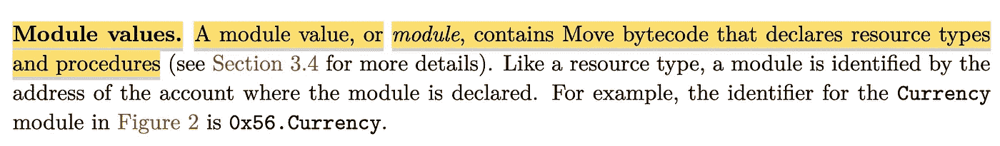

# Libra 区块链分析——第二部分

> 原文：<https://medium.com/coinmonks/analysis-of-libra-blockchain-part-2-9550d53892ad?source=collection_archive---------0----------------------->

你好！第一部分，[脸书天秤座](/@feulf/analysis-of-libra-facebook-cryptocurrency-part-1-cb20fbf798b1)的分析，是关于天秤座白皮书的。第二部分是关于 **Libra 区块链**白皮书，也称为黄皮书。我要突出我认为重要的东西，并加以解释。所以我们走吧！

# 第一页

这不是你的典型的充满狗屎的加密白皮书。它有 45 名作者、产品经理、工程师、研究人员和经济学家。令人惊讶的是，他们中只有少数人有在区块链工作的经历。奇怪。

Libra 是一个分散的、可编程的数据库。啊！不是区块链！？不不是，我们一会儿会看到。

完整的节点被称为验证器。

验证器保持数据库与 Libra 协议同步。DB 存储资源的分类帐，例如 Libra 硬币。

两种类型的实体使用 Libra 协议进行交互:验证者和客户。

验证者轮流作为领导者来验证事务。

客户可以保留一份账本。他们能用它做什么？我想没有，因为客户没有治理权。在比特币中，每个人都可以是一个完整的节点，成为治理的一部分。天秤座显然不是这样。

# 账本

所有数据都存储在一个版本化的数据库中。每个事务都是连续的。这基本上意味着真理只有一个来源。仍然不清楚 Libra 如何管理网络分区和分叉。区块链/数据库重组如何发生以及如何解决。

Libra 使用基于帐户的数据模型，就像以太坊一样。这种数据模型比比特币的 UTXO 模型简单，后者侧重于安全性。

生成私钥和公钥的一些技术细节。这里没什么新鲜的。

哦，妈的！天秤座和比特币或者以太坊一样是伪匿名的。好吧，除非你创建了一个通过 Calibra 连接到脸书的钱包，否则你就不是匿名的，你很可能会取消与你交易的人的匿名。

# **资源和模式**

在 Libra 中，令牌(资源)和智能合约(模型)是分离的，并且都是第一公民。

模块定义了资源的行为。天秤座智能合同是用 Move 写的。

如果你想知道，是的，以太坊弄错了。

模型是不可变的(目前)

# 处理

改变区块链状态的唯一方法是执行一个事务。没什么奇怪的。

Libra 的所有核心组件在创建状态中被定义为移动模型和资源。例如 Libra 硬币、账户逻辑、交易验证和验证器选择。

基本上，Libra 核心组件是在智能合约级别定义的，而比特币是在核心级别定义的。

事务是确定性的:Libra 是一个状态机。

天秤座交易是有手续费成本的，就像以太气模型一样。这是为了避免 DOS 攻击。我由此假设天秤座是图灵整机，像以太坊一样。而不是比特币。

费用是根据一次行动的成本和当时的天然气价格计算的。

## **交易结构**

可能不值得一读，但我还是会贴在这里。

## **执行交易**

一样。如果你感兴趣，读一读。但简而言之，这里没有什么新东西。

# 移动编程语言

噢该死！Libra 团队决定创造一种新的编程语言。它有什么酷的？正如我们将看到的，令牌和智能合约之间的明显区别。

交易脚本是 Libra 协议中的主要过程。事务是一个移动脚本。这意味着你可以给 Libra coin 编程，让它在每笔交易中向你的钱包支付 0.1%的捐赠——我真的很感激。

模块和资源之间的关系类似于类和对象之间的关系。

这读起来就像“去你的以太坊。我们做对了。”

## 移动虚拟机

Move 虚拟机基本上是一个将 Move 编译成字节码的解释器。

这部分展示了 Libra 如何使用 Merkle 树签署每笔交易。

事实上，这里解释了分类帐如何使用单个 Merkle 树来提供历史记录。

因为历史是一棵 Merkle 树，它可以被修剪以减少必要的存储。

# Libra 一致性算法

Libra consensus 算法使用 HotStuff BFT 协议。

Libra 工程师评估了不同的基于 BFT 的协议，并决定使用 HotStuff BFT，因为它简单且模块化。因为在早期的实验中是有希望的。这意味着天秤座以后可能会改变它。

我总是害怕过于聪明的句子。这基本上就是说验证器的选举是由 Move 模块管理的。

验证器的每次变化都被称为新时代。

# 建立工作关系网

太长了，读不下去。简而言之，Libra 节点通过 TCP 对等连接。

Libra 协议每秒可以管理 1000 笔支付/交易。有 10 秒钟的终结时间以确保它们不可逆转。考虑到半集中式验证系统，对我来说这是一个合理的数字。

## **验证器要求**

验证器需要 40 MBps 的互联网连接。老实说，这不算多。还需要 16TB 的 SSD 存储。空间很大。

# **天秤座矜持**

区块链论文为什么要讲准备金。因为，这关系到对验证者的激励。我们很快就会看到。

该保护区由天秤座协会管理。创始成员的封闭团体。在未来，这应该是开放的，它可能需要不同的市场激励。这里的作者承认，利益相关证明可能存在一些治理问题，我们需要探索保护较小的利益相关者和服务提供商的机制。**这意味着:PoS 是一个实验。**

我们正与 Libra 协会合作推出 Libra 区块链

# **天秤座区块链——我的想法(二)**

我发现天秤座是一个迷人的项目。为什么？8 年前，我要求我的首席技术官用比特币支付我的工资。我被嘲笑了。每年都有一个同事(你知道你是谁)告诉我“比特币已死。只是 ded。”。

今天，世界上最大的公司之一脸书正在创造自己的加密货币。想想吧。

从技术角度来看，Libra 并不是一个突破——它是一个分散的数据库——但却很有趣，因为它的 DNA 为我们提供了脸书战略的线索。

天秤座被设计成伪匿名。虽然 Calibra 可能可以取消使用 libra 的 FB 帐户的匿名化。

LibraBFT 旨在通过 Libra 基金会分散治理。脸书知道监管者会试图阻止它。分散负债、合规、KYC/反洗钱、准备金等。IMHO 试图绕过监管机构。同时保持对区块链的间接控制。

天秤座是一个非常有趣的项目。我最喜欢天秤座的地方是它确认了比特币。事实上，比特币在论文的最后也被引用了。

喜欢与否。天秤座是走向全球经济变革的重要一步。比特币已经存在了！

> [在您的收件箱中直接获得最佳软件交易](https://coincodecap.com/?utm_source=coinmonks)

