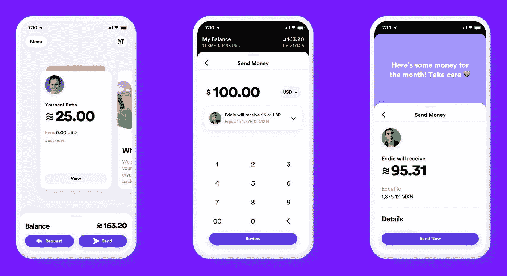
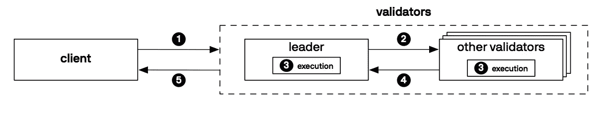
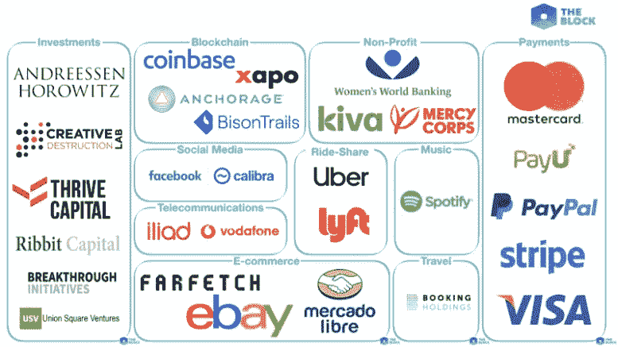
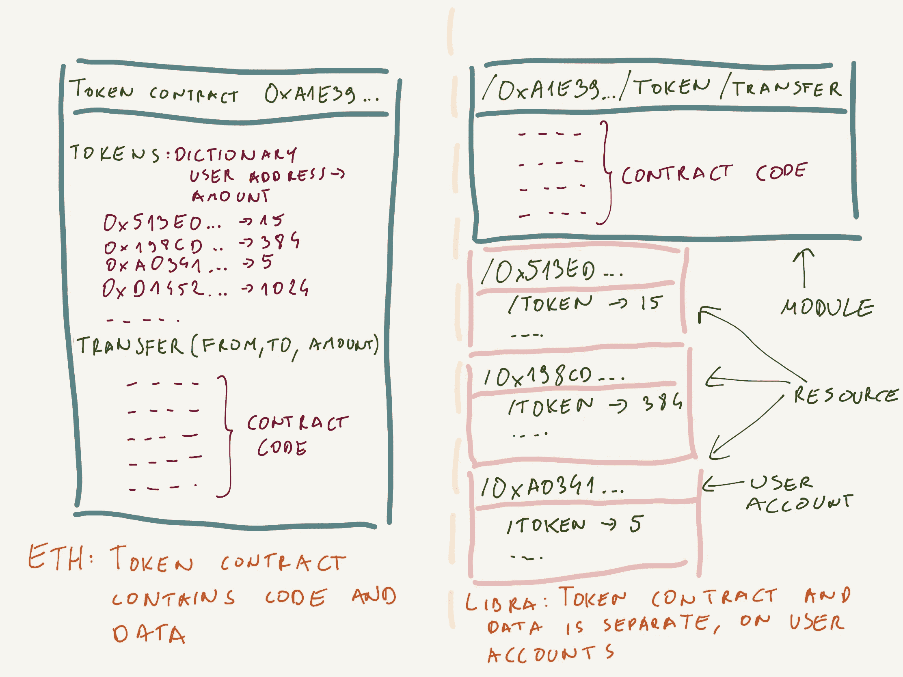

# 脸书天秤座分析——神秘货币——第一部分

> 原文：<https://medium.com/coinmonks/analysis-of-libra-facebook-cryptocurrency-part-1-cb20fbf798b1?source=collection_archive---------0----------------------->


关于天秤座的计划有很多需要掩盖的地方，也有很多需要揭示的地方。我会一步一步来。在第一篇博客文章中，我将分析天秤座的项目，并做一个 10 英尺的介绍——分享我对它的一些想法。

# 什么是天秤座

天秤座是脸书创造的可编程稳定星座。稳定来自于一篮子法定货币和其他低波动性资产支持的储备。天秤座由 3 部分组成:

1.  **块链**，保存交易历史。
2.  **储备，保持货币稳定的货币。**
3.  **天秤座协会**，负责治理和铸造/燃烧货币。

# **为什么选择天秤座？**

脸书希望为 17 亿没有银行账户的人提供经济机会。至少这是 libra.org 网站的使命。我认为，脸书的总体规划是进入一个数万亿美元的全球市场。我的猜测是，天秤座和天秤座基金会下放储备托管权是一个非常明智的尝试，因此将 KYC/反洗钱授权给了各自国家的每个成员。基本上，绕过监管的一种方式。

正如你可能知道的，脸书石油是用户数据。但是，天秤座是假匿名的，这意味着你可以创建一个钱包，并保持匿名。介绍 Calibra，天秤座的钱包。有了 Calibra，脸书将能够把用户身份和钱包联系起来，追踪所有的交易。非常聪明。



Calibra. Libra Facebook wallet.

# **区块链**

天秤座的区块链来自于能人。一种基于领导者共识机制，它使用验证器模型，通过标记和投票(PoS)来接受交易。天秤座不是区块链。这是 DLT。交易是用会计模型(想想 Excel)存储的。交易历史记录保存在一棵默克尔树中。



Overview of the Libra protocol.

# 保护区

天秤座的价值是由一篮子法定货币和其他低波动性资产创造的，比如(稳定国家的)央行债券和其他未指明的资产。天秤座实际上是一张借据。天秤座网站称，每个成员都将保留全部储备——审计并不容易。因此，事实是，用不了多久，储备就会变成小数。

# 天秤座协会

天秤座协会的成员将投入初始储备，并成为验证者节点。验证器节点负责铸造/燃烧硬币。加入该协会的动机是显而易见的:铸币、返还费用以及潜在的资金再投资以获得更多回报。



# **移动:可编程货币**

Libra 实现了一种新的编程语言。Move 清楚地将数据从代码中分离出来，特别是资源和模型。资源代表数据，比如令牌和验证器列表。模块是资源的容器，它定义了那些资源的规则。有趣的是模块是可扩展的，这意味着你可以为天秤座的行为创造角色。

下面是一个代码示例:

```
module Currency {
   resource Coin {value: u64}
   // ...
}
```

在白皮书中，没有提到移动被图灵完成，但每个命令都将有一个气体成本，就像在以太坊。



[ERC20 vs Libra Resources/Modules](https://blog.softwaremill.com/comparing-ethereum-and-the-libra-blockchain-64bec7dd70c0)

# **结论**

脸书分享了大量关于天秤座的资源。Libra 项目的一部分是开源的。另一个关门了。

区块链、Move 语言和 Libra 客户端都是开源的。白皮书为未来的研究和改进留下了一些细节。例如，Libra 没有解决以太坊和其他区块链仍在努力解决的可伸缩性问题。

项目的验证者、储备和其他细节是私有的。留给我们许多未解决的问题:

*   天秤座基金会将如何运作？
*   谁将负责 KYC/反洗钱？
*   监管者在想什么？
*   什么货币和资产将成为篮子的一部分？比特币或其他加密货币会被纳入篮子吗？
*   是全额准备金还是部分准备金？
*   1 天秤座的价值会是多少？
*   脸书将如何从中获利？是通过 Calibra 钱包项目吗？如果是，是如何实现的？
*   Libra 会向用户提供什么样的激励来推动采用？
*   在俄罗斯干涉美国大选和《剑桥分析》灾难之后，最紧迫的问题是:我们能信任脸书吗？

> [在您的收件箱中直接获得最佳软件交易](https://coincodecap.com/?utm_source=coinmonks)

[](https://coincodecap.com/?utm_source=coinmonks)