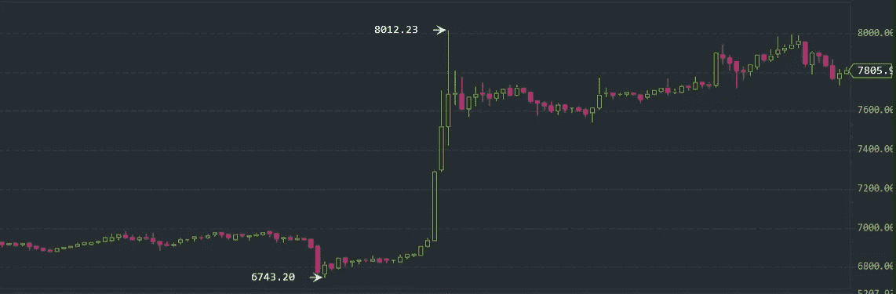
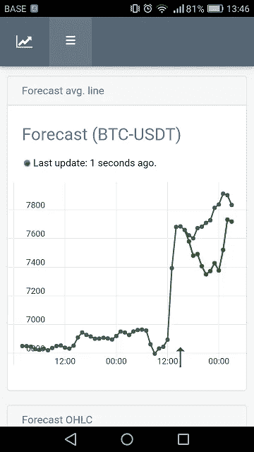
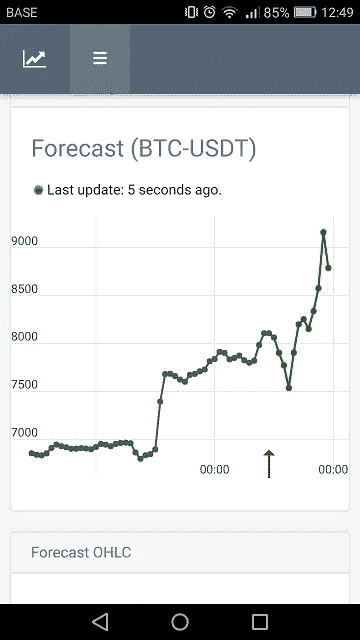
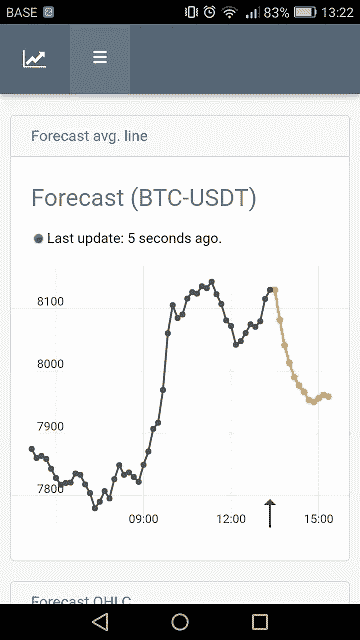
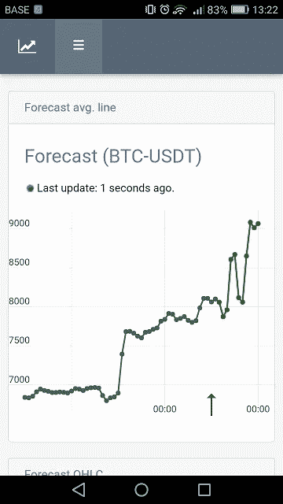
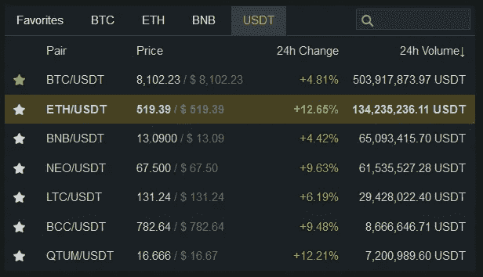
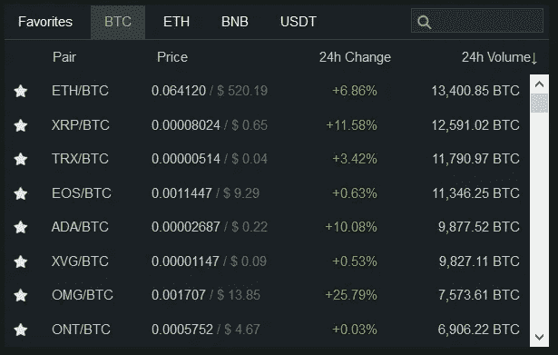

# 加密浪涌的分析第一部分

> 原文：<https://medium.com/coinmonks/analysis-of-the-crypto-surge-pt-1-4dec51b642cf?source=collection_archive---------5----------------------->

在过去的 48 小时里，我们非常幸运，因为加密货币的增长非常快。例如，比特币在短短 1 至 2 小时内增长了 10%以上！这种飙升不仅限于 BTC 美元市场，但几乎每个主流市场都受到了影响。

Bitcoin price surge as of April 12

更重要的是，我们的人工智能系统对这些浪涌有什么反应？随着 BTC 的价格上涨并达到 7600 美元，我们的人工智能系统不断告诉我们价格将再次下降(回到 7400 美元或更低):

但是随着每一个新的小时，它都在不断提高产量，因为在许多小时里，价格一直在上涨，并保持在 7500 美元以上。现在已经远远超过了 8000 美元——所以这个系统已经适应了自己，并且正在做出新的预测:

**每小时预测(从一小时前开始):**

**这些是 10 分钟间隔的预测(所以是非常短期的):**

**每小时预测:**

如你所见，短期内预测显示价格会下降，也就是说在接下来的几个小时内，价格可能会下降到 7800 美元。但在一天中，也就是未来的 12-24 小时内，价格可能会达到 9000 美元的新高度。我渴望看到我们的预测在未来 12-24 小时内会如何发展，以及他们的预测会有多准确。

如引言中所述，这种加密浪潮并不仅限于 BTC，几乎每个市场都受到这种浪潮的影响:

请继续关注第 2 部分！:)
——伊利亚·内沃林