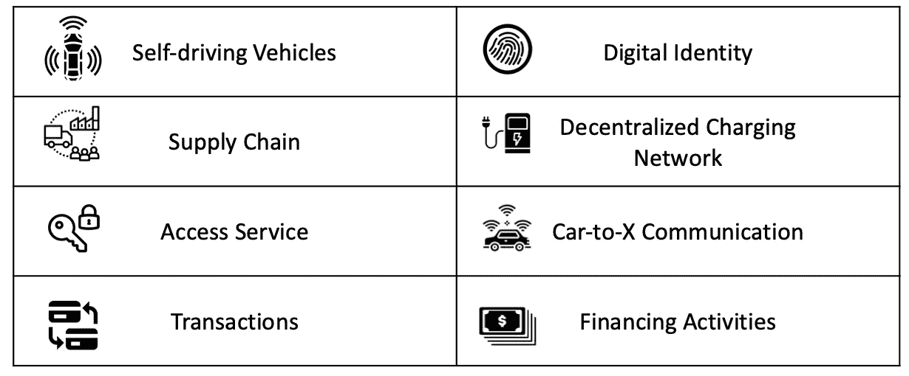

# 区块链技术在德国汽车工业中的应用现状和未来可能性分析

> 原文：<https://medium.com/coinmonks/analysis-of-the-current-use-and-future-possibilities-of-blockchain-technology-in-the-german-a291b5c2f98c?source=collection_archive---------2----------------------->

# 1.*简介*

汽车工业是德国最大和最重要的工业部门之一。约 1/10 的德国员工直接或间接在该部门工作(Statista，2019)。因此，德国原始设备制造商(OEM)必须仔细评估技术发展，并自己创造创新的解决方案，以便最终能够为客户提供更好的产品或服务。随着电动汽车、自动驾驶汽车或物联网(IoT)等新兴技术的出现，汽车行业需要灵活地调整企业战略以适应这些新技术。区块链技术是那些具有巨大潜力的创新之一，可以改变组织中当前的业务流程，并为客户提供新的服务。

在本文中，我将简要介绍[区块链技术](https://blog.coincodecap.com/tag/blockchain/)对德国原始设备制造商的优势，并展示由于[区块链](https://blog.coincodecap.com/tag/blockchain/)的新的独特性能，他们可以解决哪些问题。之后，我将列出德国原始设备制造商的大多数众所周知的区块链项目。在本文的最后，我将对这一领域的可能发展做一个简短的展望，并谈谈区块链应用在德国汽车工业中目前面临的挑战和机遇。

# 2.*区块链技术的优势*

在汽车行业，许多不同的使用案例都适用于区块链应用，例如各种类型车辆信息的防篡改存储，如当前车主或不可更改的里程表。然而，为了本章的目的，我将把这项技术的好处限制在一个特定的领域进行更详细的分析。我选择关注区块链技术在供应链应用方面的优势，因为这是 OEM 最重要的商业活动之一。众所周知，汽车行业拥有世界上最高效、最大的供应链之一(Serdarasan，2013)。对于一个原始设备制造商来说，与来自世界各地的许多不同的供应商合作来实现准时生产是再正常不过的事情了。尽管有高水平的效率和全球合作，引进区块链技术可以进一步改善目前的供应链流程，消除目前的一些问题。第一个主要问题是缺乏信任，特别是在新的供应商之间，因为在不同的国家有大量的供应商。在这种情况下，与传统应用程序相比，区块链技术可以创建更高级别的信任。由于潜在加密规则的功能，在不了解或不信任业务伙伴的情况下，可以进行交互或创建智能合同(Devetsikiotis 和 Christidis，2016)。当不同方在区块链上签署[智能合同](https://blog.coincodecap.com/tag/smart-contact/)时，参与该合同的每一方都将看到该合同，并且他们以后不能更改该合同。

另一个问题是，一些人可能伪造一些文件或合同，这将导致昂贵和耗时的法律诉讼。区块链的不变性可以很容易地解决这种类型的模糊合同，因为在大多数情况下，区块链上的历史记录是不可能改变的，因为每笔交易都是基于上一笔交易进行加密的(Karinsalo 和 Halunen，2018)。结合物联网传感器，可以跟踪每一件材料，并在区块链上创建不可更改的记录。因此，可以减少各种各样的供应商之间的复杂供应链过程中的诸如延迟和复杂的交货瓶颈检测或预测的问题。在以前的研究中，技术的高度透明性已被证明可用于确定任何材料的来源，并预测供应链中的潜在瓶颈(Xu 等人，2018)。例如，有可能在早期阶段就认识到供应商将无法提供足够的初级产品。因此，原始设备制造商应及早雇用第二个供应商，以避免生产延误。

# 3.*德国汽车行业的区块链项目*

在从理论角度展示了区块链技术解决德国汽车行业现有问题的潜力后，我现在将重点介绍大多数众所周知的应用或试点项目。在介绍具体应用之前，我想先介绍一下汽车行业最具影响力的跨公司组织，该组织致力于积极影响区块链技术在该行业的发展。这个组织的名字是“移动开放区块链倡议”(MOBI)。这是一个非营利性的智能移动联盟，旨在与各种利益相关者合作，为移动行业的区块链技术制定标准和指南。除了一些德国原始设备制造商，许多其他全球性公司也参与了这个财团，包括福特、IBM 和 FutureMove Automotive。

基于对文献、公司网站和行业专家的详细研究，我现在介绍 15 个最令人兴奋的项目。所有这些都将由一家德国原始设备制造商领导。我将这个项目分为八个不同的类别，如下表所示。

Blockchain categories in the German automotive industry

下表列出了宝马、大众、保时捷和戴姆勒的所有项目。

Blockchain projects from BMW, Volkswagen, Porsche

Blockchain Project Daimler and BMW

# 4.*讨论&展望*

分析表明，所有原始设备制造商都试验了区块链技术，并试图建立他们的第一个原型。他们发现分散的方法在不同的领域有一些优势，并试图从中受益。透明度和信任度的可能提高对于未来的供应链和物流过程尤为重要。今天，区块链技术面临的最大挑战之一是将这一激动人心的技术与直观易用的用户界面相结合，并将其完全集成到业务流程和中央 it 系统中。由于其中许多解决方案需要与大型合作伙伴公司合作，因此该解决方案的实际实施可能需要一些时间。然而，航运业已经表明，使用区块链解决方案可以创造真正的商业价值(Tradelens，2020)。有趣的是，大多数原始设备制造商与科技公司或创业公司合作，因为他们似乎缺乏自己对这项新技术的了解。

# 参考

克里斯蒂斯、康斯坦丁诺斯；Devetsikiotis，Michael (2016):物联网的区块链和智能合同。IEEE Access 4，第 2292–2303 页。DOI:10.1109/access 2016 . 256666563667

安妮的卡琳萨罗；哈卢宁，金莫(编辑。)(2018):面向移动即服务生态系统的智能合同。2018 IEEE 软件质量、可靠性和安全性伙伴国际会议(QRS-C): IEEE。

Serdarasan，S. (2013 年)。供应链复杂性驱动因素综述。计算机与工业工程，66(3)，533–540。

Statista. (2019) Available online at: [https://de。statista.com/statistics/data/study/30703/调查/汽车行业采购数量/](https://de.statista.com/statistik/daten/studie/30703/umfrage/beschaeftigtenzahl-in-der-automobilindustrie/.)

徐,Xiwei; Pautasso,Cesare;朱,Liming;作者 : Lu, QinghuaWeber,Ingo(2018):基于区块链的应用程序的模式集合。未知(Ed。): 第 23 届欧洲计划模式语言会议记录 — EuroPLoP ’18。the 23rd European Conference. Irsee, 德国, 04。2018-07-08.07.2018 纽约,纽约,美国:ACM 出版社,第 1-20 页。

## 项目信息

 [## 区块链如何改变移动性 | BMW.com

### 区块链技术解决了许多问题。Find out here 区块链如何工作 - 以及汽车行业如何...

www.bmw.com](https://www.bmw.com/en/innovation/blockchain-automotive.html)  [## 大众汽车(Volkswagen AG)Blockchain

### 区块链,比特币,分布式账本:大众汽车集团如何测试加密技术的应用...

www.volkswagenag.com](https://www.volkswagenag.com/de/news/stories/2018/08/putting-blockchains-on-the-road.html)  [## 通用汽车,宝马正在寻找将自动驾驶车辆数据放在区块链上

### 通用汽车和宝马正在考虑使用区块链技术作为移动开放区块链的一部分。

finance.yahoo.com](https://finance.yahoo.com/news/gm-bmw-looking-put-autonomous-144131983.html)  [## IOTA 和大众在 2019 年推出区块链汽车

### 10.09.2018, 08:04 | 21063 | 0 | 德国区块链平台 IOTA 宣布即将发布...

www.wallstreet-online.de](https://www.wallstreet-online.de/nachricht/10848720-iota-vw-2019-blockchain-faehige-autos-markt)  [## 保时捷首次将区块链引入汽车

### 这家跑车制造商正在与柏林初创公司 XAIN 合作,直接在车辆中测试区块链应用程序。

newsroom.porsche.com](https://newsroom.porsche.com/de/digital/porsche-blockchain-panamera-xain-technologie-app-bitcoin-ethereum-daten-smart-contracts-porsche-innovation-contest-14901.html)  [## 戴姆勒汽车公司在马可波罗区块链贸易网络上的首次交易 - CoinDesk

### 汽车制造商戴姆勒已经在基于区块链的马可波罗贸易融资网络上完成了第一笔交易。那 The...

www.coindesk.com](https://www.coindesk.com/daimler-carries-out-first-transaction-on-marco-polo-blockchain-trade-network)  [## 未来技术试点项目:梅赛德斯 - 奔驰汽车首次开发区块链原型...

### 未来技术试点项目:梅赛德斯 - 奔驰汽车首次开发区块链原型

未来技术试点:梅赛德斯 - 奔驰汽车首次开发区块链原型 media.daimler.com](https://media.daimler.com/marsMediaSite/de/instance/ko/Pilotprojekt-mit-Zukunftstechnologie-Mercedes-Benz-Cars-entwickelt-erstmals-Blockchain-Prototyp-fuer-nachhaltige-Lieferketten.xhtml?oid=42611781)  [## 最佳实践:smartVIN | Daimler Mobility AG

### 戴姆勒移动(Daimler Mobility)中密集开发的区块链用例的一个具体例子是...

www.daimler-mobility.com](https://www.daimler-mobility.com/de/innovationen/blockchain/smartvin/)  [## 戴姆勒和杜尔通过区块链平台与 LBBW 开展贸易业务

### 国际贸易融资网络马可波罗在另一项试点交易中具有实用性...

www.lbbw.de](https://www.lbbw.de/artikelseite/pressemitteilung/daimler-und-duerr-wickeln-handelsgeschaeft-mit-lbbw-ueber-blockchain-ab_94uvbu6js_d.html) 

[https://news room . Porsche . com/de/unternehmen/Porsche-venture-venture-capital-star Porsche-ventures-venture-capital-startups-startups-investigation en-1.5 亿元-kuenstliche-intelligenz-区块链-虚拟-增强现实-gap less-way ray-anagog-miles-home-IX-rimac-16147 . htm](https://newsroom.porsche.com/de/unternehmen/porsche-ventures-venture-capital-starporsche-ventures-venture-capital-startups-start-ups-investitionen-150-millionen-kuenstliche-intelligenz-blockchain-virtual-augmented-reality-gapless-wayray-anagog-miles-home-ix-rimac-16147.html)l

> [在您的收件箱中直接获得最佳软件交易](https://coincodecap.com/?utm_source=coinmonks)

