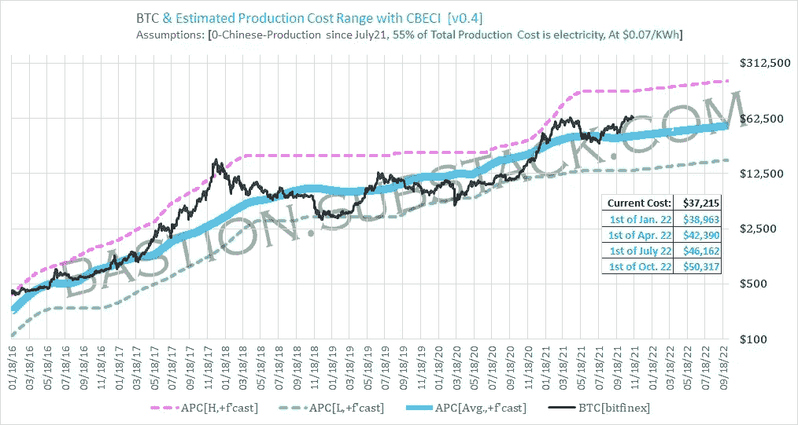
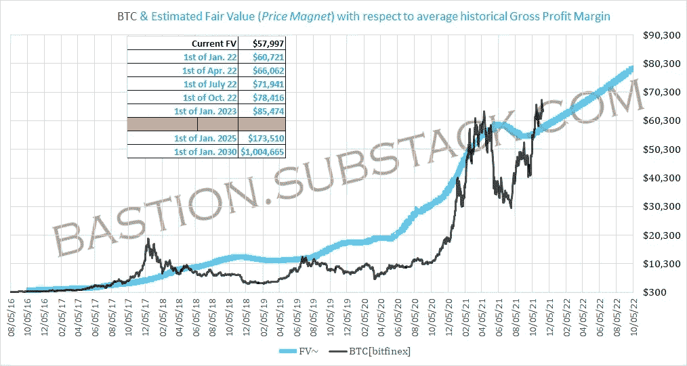

# 分析“Stock2Flow”，有意义吗？

> 原文：<https://medium.com/coinmonks/analyzing-stock2flow-does-it-make-sense-7ce071c800e3?source=collection_archive---------13----------------------->

这是关于 [PlanB 的“存量到流量”](/@100trillionUSD/modeling-bitcoins-value-with-scarcity-91fa0fc03e25)估值理论。在很长一段时间里，它对我来说毫无意义，尽管此时此刻，我认为它的某些部分可以解释它如何以及为什么与标准能源商品公平估价相一致。

# 它的主旨是什么？

他/她所谓的库存和流量，实际上就是“[总供应量](https://www.yourarticlelibrary.com/economics/elasticity-of-supply/supply-of-a-commodity-meaning-function-law-assumptions-and-other-details/37041)和“生产率”。我们此后可以称之为 S2F 比率。

> ***SF =存量/流量***
> 
> *库存是现有库存或储备的规模。流量是每年的产量。人们也用供给增长率(流量/存量)来代替 SF。注意 SF = 1 /供给增长率。*

(从技术上讲，他可能误用了“库存”这个术语，正如这里的[所解释的那样](https://www.yourarticlelibrary.com/economics/elasticity-of-supply/supply-of-a-commodity-meaning-function-law-assumptions-and-other-details/37041)，商品库存意味着只能满足即时需求的短期供应。)

*这让我很困惑，原因如下:*

*   *机构投资者只看这个比率来估计单个采矿作业的寿命。*
*   *该比率与估值没有内在联系，从未用于机构间定价，包括示例中提到的产品:黄金、白银等。*

接下来，提出线性回归来拟合比特币价格与记录的 S2F 比率。

> *对数据进行线性回归拟合，证实了肉眼可见的结果:SF 和市场价值之间存在显著的统计关系(95% R2，显著性为 F 2.3E-17，斜率的 p 值为 2.3E-17)。*

*我的问题:*

*   在定量金融中，这被认为是曲线拟合。可靠性有限的 [*归纳方法*](https://www.indeed.com/career-advice/career-development/inductive-reasoning) *。*
*   *有一百万个随机变量，例如*[*【SPX】*](https://bastion.substack.com/p/btc-eth-spx-correlations)*，或者*[*log*](https://tutorial.math.lamar.edu/Classes/Alg/LogFunctions.aspx)*/*[*多项式*](https://www.calculushowto.com/types-of-functions/polynomial-function/) *函数，任何人都可以应用它们来产生历史上更好的拟合。*

# 最后有意义的部分，有点

S2F 比率实际上是[平均生产成本](https://bastion.substack.com/p/bitcoin-production-cost-fair-value)的倍数，它是交易最活跃的商品的 [**内在价值**](https://www.investopedia.com/terms/i/intrinsicvalue.asp)；任何变量除以生产率(或“流量”)都是生产成本的倍数。由于高精度预期是不实际的，只要它在大概范围内，它就有意义，因为它很好地符合 BTC 价格(统计上)。

为什么原木合适？我认为 PlanB 应用了复利回报的假设，我在某种程度上完全同意。不过，我认为过去十年的最初几年恰逢需求爆炸式增长(这使得指数拟合特别“好”)；虽然我认为增长需求仍将增加，但不太可能重复 2020 年前的速度。

*我认为 S2F 逻辑调整可以改进的地方:*

*   随着 BTC 供应面的成熟，生产成本的增加变得更加稳定和可预测，降低了生产成本增加的假设。
*   我们可以采用自上而下[的演绎方法](https://www.indeed.com/career-advice/career-development/deductive-reasoning)来推导更可靠、更容易理解的估值，而不是对价格进行曲线拟合。

# 演绎生产成本、公允价值预测

由于已经可以估计当前[平均生产成本](https://bastion.substack.com/p/bitcoin-production-cost-fair-value)，即[内在价值](https://plato.stanford.edu/entries/value-intrinsic-extrinsic/)由 [CBECI](https://cbeci.org/) 得出，我们可以采用以下方法根据已知指标估计生产成本的预期收益:

*   由于 [halvenings](https://www.bitcoinblockhalf.com/) 每 4 年生产成本增加一倍，我们可以得出年收益预计约为 25%，即约为+0.068%/天。
*   我们可以使用美国 M2 最近 5 年的平均变化来得出美元购买力的平均损失，此时大约是 9.1%/年，或 0.025%/天。

如上所述，我们可以通过应用上述估计的成本收益以及每日复利，将现有生产成本估计值外推至 1 年后:

## 平均生产成本/内在价值预测:

## 提议的长期公允价值/价格磁铁

这是基于历史平均价格溢价，然后根据美元通货膨胀和[将](https://www.investopedia.com/bitcoin-halving-4843769)实施减半的预期增长进行调整。

*本文最初发表于 https://bastion.substack.com

> 加入 Coinmonks [电报频道](https://t.me/coincodecap)和 [Youtube 频道](https://www.youtube.com/c/coinmonks/videos)了解加密交易和投资

## 也阅读

 [## 最佳加密交易所| 2021 年十大加密货币交易所

### 编辑描述

blog.coincodecap.com](https://blog.coincodecap.com/crypto-exchange)  [## 2021 年 10 大最佳加密贷款平台| CoinCodeCap

### 编辑描述

blog.coincodecap.com](https://blog.coincodecap.com/crypto-lending)  [## 2021 年最佳免费加密交易机器人

### 2021 年币安、比特币基地、库币和其他密码交易所的最佳密码交易机器人。四进制，位间隙…

medium.com](/coinmonks/crypto-trading-bot-c2ffce8acb2a)  [## 最佳 4 个加密交易信号电报通道

### 这是乏味的找到正确的加密交易信号提供商。因此，在本文中，我们将讨论最好的…

medium.com](/coinmonks/best-crypto-signals-telegram-5785cdbc4b2b)  [## 5 个最佳社交交易平台[2021] | CoinCodeCap

### 编辑描述

blog.coincodecap.com](https://blog.coincodecap.com/best-social-trading-platforms)  [## BlockFi 评论 2021:利弊和利率| CoinCodeCap

### 编辑描述

blog.coincodecap.com](https://blog.coincodecap.com/blockfi-review)  [## 如何在印度购买比特币？2021 年购买比特币的 7 款最佳应用[手机版]

### 如何使用移动应用程序购买比特币印度

medium.com](/coinmonks/buy-bitcoin-in-india-feb50ddfef94)  [## 加密税务软件——五大最佳比特币税务计算器[2021]

### 不管你是刚接触加密还是已经在这个领域呆了一段时间，你都需要交税。

medium.com](/coinmonks/best-crypto-tax-tool-for-my-money-72d4b430816b)  [## 存储比特币的最佳加密硬件钱包[2021] | CoinCodeCap

### 编辑描述

blog.coincodecap.com](https://blog.coincodecap.com/best-hardware-wallet-bitcoin)  [## Pionex 评论 2021 |免费加密交易机器人和交换

### Pionex 是为交易自动化提供工具的后起之秀。Pionex 上提供了 9 个加密交易机器人…

medium.com](/coinmonks/pionex-review-exchange-with-crypto-trading-bot-1e459d0191ea)