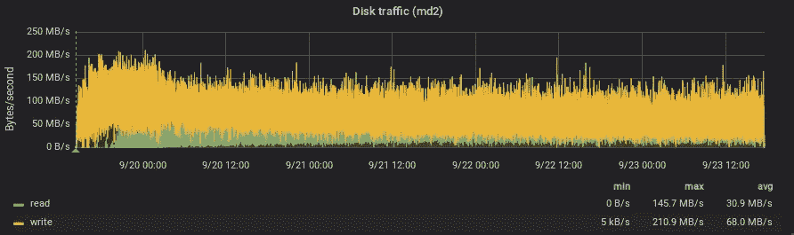
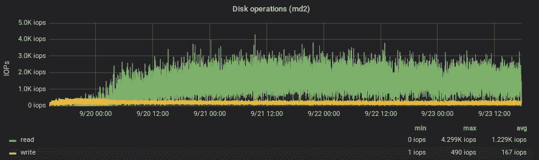
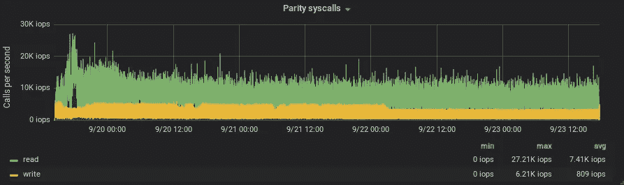
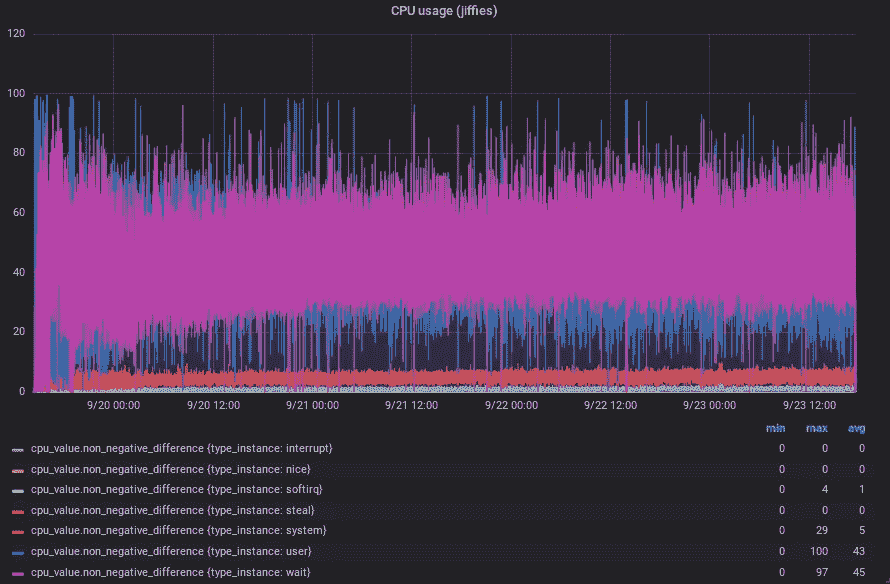
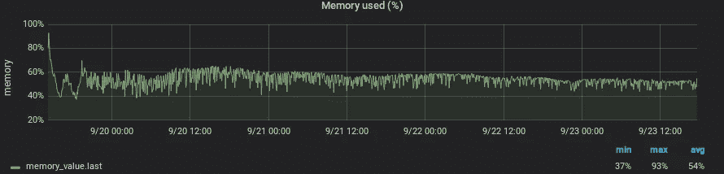
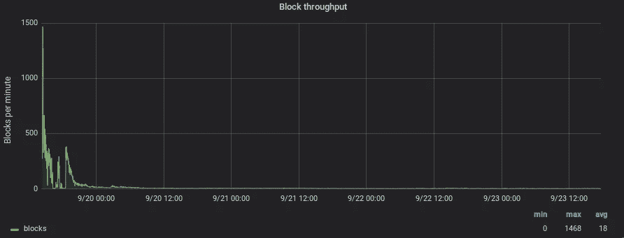
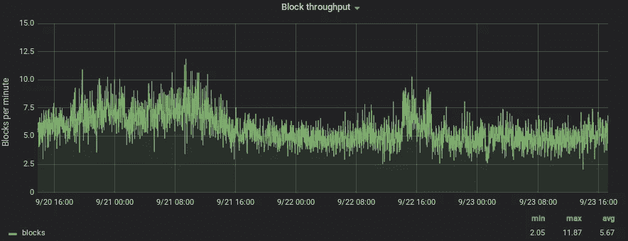

# 分析成为以太坊完全验证节点的硬件要求

> 原文：<https://medium.com/coinmonks/analyzing-the-hardware-requirements-to-be-an-ethereum-full-validated-node-dc064f167902?source=collection_archive---------0----------------------->

## 不要相信。核实

加密的*咒语*之一是:

> *不信任。验证*

但是，*验证*是什么意思呢？当我们谈到区块链时，它意味着从区块链(创世纪块)的起点开始，并从与您连接的对等体中提取块上记录的每个事务。然后，执行每一个交易来计算中间状态(比特币中的 UTXO 或以太坊中的 accounts 状态)并重复它，直到到达最新的块。这个过程称为完全验证(比特币中的完全节点)节点的同步。

您可以删除旧的状态和块(修剪模式),并且仍然是完全验证的节点，因为您已经验证了所有区块链以达到最新状态。你没有相信过任何人。

最近，由于 DoS 攻击和任意代码的部署(为了从一个状态转移到另一个状态，必须执行智能合约)，这个过程对于以太坊来说非常昂贵。那么，运行一个完全有效的以太坊节点，并且能够在不信任任何人的情况下执行验证，在硬件方面需要什么要求呢？

## 监控同步过程

我选择了奇偶校验，因为它是唯一能够验证完整区块链并即时删除旧状态的客户端(并避免存储+1TB 的数据)。Geth 正在努力，但还没有完成。

执行的命令行是:

> 奇偶校验-无偏差缓存-大小= 4096-db-压缩= SSD-规模-验证器-验证器数量=2

同步过程开始于:2018 年 9 月 19 日 14 时 13 分 22 秒
同步过程结束于:2018 年 9 月 23 日 17 时 38 分 24 秒

大约 4 天来验证所有的以太坊区块链。没那么多。但是…硬件消耗是多少？

我已经使用 Collectd + Influxdb + Grafana 来监控这种消耗。

Consider it random writes!

可以看到最小值，最大值，平均值。

We can see that Parity makes an intensive use of syscalls

每秒有大量的系统调用(CPU 中断)。

Intel(R) Core(TM) i7–2600 CPU @ 3.40GHz

尽管有系统调用，但 CPU 似乎还可以。如果客户机与他人共享 CPU 资源，可能会有问题(事实上，由于 CPU 中断滥用，我不得不从 LPAR 云提供商迁移过来)。

From a total of 16GB

(y 轴标签不正确。**是每秒块数**。刚开始的时候，比率很高。如果我们得到去除一阶矩的平均速率:

(y 轴标签不正确。它是每秒块数)。如果以太坊中的每个方块平均每 14 秒被开采一次，这意味着每分钟 4.29 个方块。我的平均速度是每秒 5.67 个数据块(每分钟 340.2 个数据块)，所以**我希望用更少的资源同步一个完整的验证节点，但花费更多的时间**。

## 结论

*   为了在不存储+1TB SSD 的情况下获得完整验证的以太坊节点，我们目前必须使用奇偶校验，因为它是唯一允许在同步完整区块链时进行修剪的客户端
*   它大量使用随机写入磁盘。对于固态硬盘来说，这已经算很多了
*   它大量使用经常中断 CPU 的系统调用
*   固态硬盘能够执行:平均每秒 68 MB 的随机写入和每秒 30.9 MB 的随机读取。+112GB 的容量(2018 年 9 月 24 日)。
*   13–14GB 内存
*   能够处理大量中断的 CPU
*   **这些要求并不是最低要求**。使用上述硬件，您将获得平均每分钟 340.2 次的块同步。你最终会同步到 4.29 或更高的速率，但这需要更多的时间
*   以太坊社区意识到了这些需求，并试图构建一个更高效的客户端。查看阿列克谢·阿克洪诺夫[https://www.youtube.com/watch?v=kJi77aV7Fk0](https://www.youtube.com/watch?v=kJi77aV7Fk0)和[https://medium . com/@ akhounov/turbo-geth-beta-constantinopole-tests-FDA 38 CBE 87 a](/@akhounov/turbo-geth-beta-constantinopole-tests-fda38cbe87a)的作品

## 未来的工作

这项工作的主要目标是了解运行一个完整的经验证的节点所需的最低硬件要求。我已经分享了一个有效的配置开始。但是，我会限制这些资源以获取最小值，并再次共享结果。(第二部发布:[此处](/@albpalau/analyzing-the-hardware-requirements-to-be-an-ethereum-full-validated-node-ii-415b8457c6e8))

> 加入 Coinmonks [电报频道](https://t.me/coincodecap)和 [Youtube 频道](https://www.youtube.com/c/coinmonks/videos)获取每日[加密新闻](http://coincodecap.com/)

## 另外，阅读

*   [复制交易](/coinmonks/top-10-crypto-copy-trading-platforms-for-beginners-d0c37c7d698c) | [加密税务软件](/coinmonks/crypto-tax-software-ed4b4810e338)
*   [网格交易](https://coincodecap.com/grid-trading) | [加密硬件钱包](/coinmonks/the-best-cryptocurrency-hardware-wallets-of-2020-e28b1c124069)
*   [密码电报信号](http://Top 4 Telegram Channels for Crypto Traders) | [密码交易机器人](/coinmonks/crypto-trading-bot-c2ffce8acb2a)
*   [币安交易机器人](/coinmonks/binance-trading-bots-d0d57bb62c4c) | [OKEx 审查](/coinmonks/okex-review-6b369304110f) | [阿塔尼审查](https://coincodecap.com/atani-review)
*   [最佳加密交易信号电报](/coinmonks/best-crypto-signals-telegram-5785cdbc4b2b) | [MoonXBT 评论](/coinmonks/moonxbt-review-6e4ab26d037)
*   [如何在 Bitbns 上购买柴犬(SHIB)币？](https://coincodecap.com/buy-shiba-bitbns) | [购买 Floki](https://coincodecap.com/buy-floki-inu-token)
*   [CoinFLEX 评论](https://coincodecap.com/coinflex-review) | [AEX 交易所评论](https://coincodecap.com/aex-exchange-review) | [UPbit 评论](https://coincodecap.com/upbit-review)
*   [十大最佳加密货币博客](https://coincodecap.com/best-cryptocurrency-blogs) | [YouHodler 评论](https://coincodecap.com/youhodler-review)
*   [最佳加密交易所](/coinmonks/crypto-exchange-dd2f9d6f3769) | [印度最佳加密交易所](/coinmonks/bitcoin-exchange-in-india-7f1fe79715c9)
*   开发人员的最佳加密 API
*   最佳[密码借贷平台](/coinmonks/top-5-crypto-lending-platforms-in-2020-that-you-need-to-know-a1b675cec3fa)
*   [免费加密信号](/coinmonks/free-crypto-signals-48b25e61a8da) | [加密交易机器人](/coinmonks/crypto-trading-bot-c2ffce8acb2a)
*   [杠杆代币的终极指南](/coinmonks/leveraged-token-3f5257808b22)