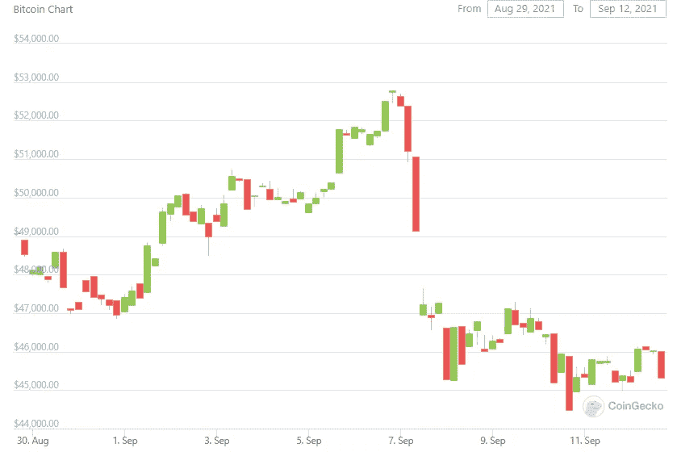
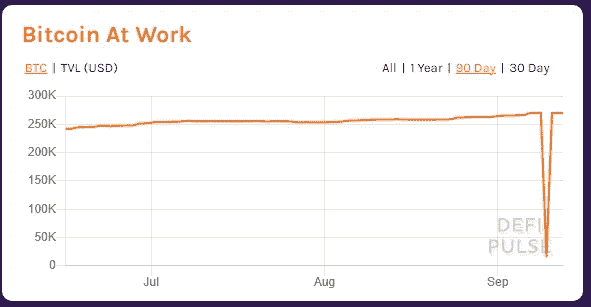
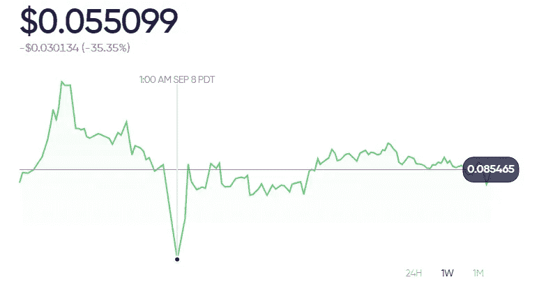

# 剖析闪电崩盘

> 原文：<https://medium.com/coinmonks/anatomy-of-a-flash-crash-79249cdf9d7e?source=collection_archive---------3----------------------->

在这个领域，我主要关注的是“基本面”。偶尔我会参考一些特定的协议或者做一些更深入的研究，但是我大多忽略了“新闻”并且远离了一些 crypto 的最大趋势。显然，如果我紧跟潮流，我可以更快地吸引更多的读者，那么这些乏味的东西是怎么回事呢？

拥有一套枯燥的“基础知识”让我们有能力更深入地了解其他正在发生的事情。它能让我们随波逐流，而不是让我们的脸被回流撕裂。

周二，crypto 发生了负面事件，许多代币的价格暴跌。发生了什么事？

知道闪电崩盘的触发事件并不总是容易的。在不成熟的市场中，单个个人的行为就可能导致这种情况。鲸鱼的行为会产生突然的、意想不到的影响。但是即使不知道最初的导火索，*我们也能知道接下来会发生什么。*

# 订单上的压力

订单簿中的大部分深度由做市商提供。正如我们在“[订单簿和做市商](https://www.savagecorner.io/p/order-books-and-market-makers)”中看到的，现货价格 2%以内的交易量有时会小得令人难以置信。一只鲸鱼可以通过在现货 2%的范围内交易所有可用的流动性，有意地(或无意地，在“胖手指”错误的情况下——当交易者错误地按下两个键而不是一个键，并且它们的总数比他们预期的大 10 倍或更多)给订单簿施加压力。

两周前，我写了**[**做市商时间框架非常短期**，长时间持有某些东西被抓住被认为是‘库存风险’](https://www.savagecorner.io/p/what-kind-of-trader-are-you)。**

**为了保护自己免受库存风险，许多做市商会设置“隐藏止损点”。这些订单不会出现在订单簿上，而是由价格达到一定范围而触发。这些可以通过交易者查看订单簿(或图表)并在关键支撑点下方设置[止损单](https://www.savagecorner.io/p/who-da-boss-take-charge-of-your-trades)来手动设置，也可以通过交易者的算法自动计算。不管怎样，当鲸鱼给市场施加足够大的压力时，做市商就会退出。离事件发生前的“正常”价格越远，继续提供流动性的做市商就越少。**

**像做市商一样，精明的投机者使用止损单来保护自己免受损失，或者在交易开始对他们不利时锁定收益。这些给订单带来了更大的压力。**

# **清算**

**当你有一个微小的“优势”时，你用大量的杠杆放大它。投机者和套利者通常在他们的风险模型允许的情况下尽可能多地交易。由于套利在理论上是“无风险”的头寸，这意味着在允许的范围内尽可能多的杠杆…**

**施加足够的压力，杠杆交易者开始面临追加保证金的要求。在传统金融领域，经纪人通常会在平仓前给交易者提供增加资本的机会。面临的损失越大，经纪人就越有可能开始平仓，而不给交易者任何存入更多资金的机会。**

**在加密协议中，有担保要求，当要求被违反时，清算程序通常会自动触发。这可能导致立即清算，或清算“拍卖”,即头寸被没收并出售给出价最高的投标人。**

**这些清算事件给已经很薄的订单簿带来了更大的压力，有时市场只是…有点…不稳定？这是一次闪电崩盘。**

****

**[https://defipulse.com/btc](https://defipulse.com/btc)**

**集中的流动性(订单簿或 UniV3)更难导致蓄意的闪电崩盘，但分散的流动性(大多数流动性池)更容易吸收随后的清算。集中流动性和分散流动性的混合可能是最健康的市场结构——而 DeFi 在提供这种流动性混合方面做得非常好……它只是还不够大，不足以对抗恶霸鲸。**

# **采取行动**

**知道这些事件还会继续发生，怎么保护自己？或者更好的是，你如何准备利用这些事件？**

**一、[你是哪种交易者](https://www.savagecorner.io/p/what-kind-of-trader-are-you)？由于比特币定期减半，加密的长期市场周期往往是 4 年左右。如果你的预期 hodl 时间框架不是至少 4 年，你可能需要像一个投机者而不是投资者那样思考！*如果你是一名长期投资者，那么在股市崩盘时买入股票可能是一个绝佳的机会*。我看到 2020 年春季的崩盘被描述为“代际”机会——投资于大幅下跌的罕见机会可以带来出色的回报……这种回报可以创造代际财富。**

**第二，考虑[均值回复 v 趋势](https://www.savagecorner.io/p/mean-reversion-vs-trend)。由于闪电崩盘会改变普遍情绪，它可能成为第一张多米诺骨牌，让泡沫市场陷入长期下跌。知道你是更擅长均值回归交易还是趋势交易，以及你的系统如何受到闪电崩盘的影响。**

**第三，[你还在用市价单](https://www.savagecorner.io/p/who-da-boss-take-charge-of-your-trades)吗？如果你提前计划好保护自己和利用闪电崩盘的方法，你可以开始使用更复杂的交易类型。你可以使用止损单来保护自己(或者复杂的[交易程序](https://bitsgap.com/?ref=9f41b6f-bot)，当你的条件满足时，它会代表你提交订单)。您可以向 dex 聚合器提交低价订单，如 [matcha.xyz](https://matcha.xyz/) 。如果出现流动性事件，您的低价订单最终将作为市价订单提交给受影响最大的 Dex，您将在大甩卖中获得大幅折扣的硬币，即使您正在睡觉！**

****

**[https://matcha.xyz/markets/1/0x2d94aa3e47d9d5024503ca8491fce9a2fb4da198](https://matcha.xyz/markets/1/0x2d94aa3e47d9d5024503ca8491fce9a2fb4da198)**

**我发现在不同的时间框架内交易很有帮助。我持有带有敏感止损的短期头寸，这使我在清算周期的早期离场观望。随着闪电崩盘加深，我增加了长期头寸。当闪电崩盘结束，新的趋势变得清晰时，我把我的短期资金撤出场外，重新开始积极交易。我的部分反应是事先计划好的，如上面第 3 步所述。**

**由于我现在是全职加密员，我的大部分方法都是被动的…当事情开始发生时，我的自动交易开始行动，我的手机发出警报。我希望我的电脑开始评估市场，寻找新趋势出现的地方(或者长期趋势完好无损的地方，我认为我可以安全地交易反转，然后乘着它进入下一个上升趋势)。我希望进入一些争论，看看什么协议被打破，在哪里清算可能会导致更多的机会。实际上，我正试图主动将每一次闪电崩盘转变为一个世代的事件。**

# **结论**

**了解市场上正在发生的事情有助于我们做出更好的决策。我们参考了几个星期的“基本面”讨论，以规划闪电崩盘时会发生什么，如何保护自己，以及如何从中获利。**

**我希望你能明白为什么我如此关注基本面。如果任何一段对你来说没有意义，点击之前的文章，先回顾一下。如果你还在纠结，请评论，让我知道哪些点还不够清楚。**

**我热爱金融，我喜欢帮助别人理解和欣赏它的复杂性！如果这对你有任何帮助，请订阅并与他人分享，这样我们就可以一起从 DeFi 中致富。**

*****不是财务或税务方面的建议。*** *本简讯具有严格的教育意义，并非投资建议或购买或出售任何资产或做出任何财务决策的建议。这份简讯不是税务建议。和你的会计师谈谈。自己做研究。***

*****披露。*** *我可能会不时地在本简讯中添加我使用的产品的链接。如果你通过这些链接之一购买，我可能会收到佣金。此外，野蛮角落作家持有加密资产，并在某些市场积极交易。***

> **加入 Coinmonks [电报频道](https://t.me/coincodecap)和 [Youtube 频道](https://www.youtube.com/channel/UCbyDhTbOiKh2iUMKBi4-4Zg)了解加密交易和投资**

## **另外，阅读**

*   **[什么是保证金交易](https://blog.coincodecap.com/margin-trading) | [美元成本平均法](https://blog.coincodecap.com/dca)**
*   **[BigONE 交易所评论](/coinmonks/bigone-exchange-review-64705d85a1d4) | [电网交易 Bot](https://blog.coincodecap.com/grid-trading)**
*   **最佳[密码交易机器人](https://blog.coincodecap.com/best-crypto-trading-bots) | [购买索拉纳](https://blog.coincodecap.com/buy-solana) | [矩阵导出评论](https://blog.coincodecap.com/matrixport-review)**
*   **[Coldcard 评论](https://blog.coincodecap.com/coldcard-review) | [BOXtradEX 评论](https://blog.coincodecap.com/boxtradex-review)|[unis WAP 指南](https://blog.coincodecap.com/uniswap)**
*   **[莱杰 vs n rave](/coinmonks/ledger-vs-ngrave-zero-7e40f0c1d694)|[莱杰 nano s vs x](/coinmonks/ledger-nano-s-vs-x-battery-hardware-price-storage-59a6663fe3b0) | [币安评论](/coinmonks/binance-review-ee10d3bf3b6e)**
*   **[Bybit 交易所评论](/coinmonks/bybit-exchange-review-dbd570019b71) | [Bityard 评论](https://blog.coincodecap.com/bityard-reivew) | [CoinSpot 评论](https://blog.coincodecap.com/coinspot-review)**
*   **[3 commas vs crypto hopper](/coinmonks/3commas-vs-pionex-vs-cryptohopper-best-crypto-bot-6a98d2baa203)|[赚取加密利息](/coinmonks/earn-crypto-interest-b10b810fdda3)**
*   **最好的比特币[硬件钱包](https://blog.coincodecap.com/best-hardware-wallet-bitcoin) | [BitBox02 回顾](/coinmonks/bitbox02-review-your-swiss-bitcoin-hardware-wallet-c36c88fff29)**
*   **[block fi vs Celsius](/coinmonks/blockfi-vs-celsius-vs-hodlnaut-8a1cc8c26630)|[Hodlnaut 审核](/coinmonks/hodlnaut-review-best-way-to-hodl-is-to-earn-interest-on-your-bitcoin-6658a8c19edf) | [KuCoin 审核](https://blog.coincodecap.com/kucoin-review)**
*   **[币安期货交易](https://blog.coincodecap.com/binance-futures-trading)|[3 comas vs Mudrex vs eToro](https://blog.coincodecap.com/mudrex-3commas-etoro)**
*   **[如何购买 Monero](https://blog.coincodecap.com/buy-monero) | [IDEX 评论](https://blog.coincodecap.com/idex-review) | [BitKan 交易机器人](https://blog.coincodecap.com/bitkan-trading-bot)**
*   **[CoinDCX 评论](/coinmonks/coindcx-review-8444db3621a2) | [加密保证金交易交易所](https://blog.coincodecap.com/crypto-margin-trading-exchanges)**
*   **[Bookmap 评论](https://blog.coincodecap.com/bookmap-review-2021-best-trading-software) | [美国 5 大最佳加密交易所](https://blog.coincodecap.com/crypto-exchange-usa)**
*   **[如何在 FTX 交易所交易期货](https://blog.coincodecap.com/ftx-futures-trading) | [OKEx vs 币安](https://blog.coincodecap.com/okex-vs-binance)**
*   **[CoinLoan 评论](https://blog.coincodecap.com/coinloan-review) | [YouHodler 评论](/coinmonks/youhodler-4-easy-ways-to-make-money-98969b9689f2) | [BlockFi 评论](https://blog.coincodecap.com/blockfi-review)**
*   **[CoinFLEX 评论](https://blog.coincodecap.com/coinflex-review) | [AEX 交易所评论](https://blog.coincodecap.com/aex-exchange-review) | [UPbit 评论](https://blog.coincodecap.com/upbit-review)**
*   **[AscendEx 保证金交易](https://blog.coincodecap.com/ascendex-margin-trading) | [Bitfinex 赌注](https://blog.coincodecap.com/bitfinex-staking) | [bitFlyer 审核](https://blog.coincodecap.com/bitflyer-review)**
*   **[AscendEx Staking](https://blog.coincodecap.com/ascendex-staking)|[Bot Ocean Review](https://blog.coincodecap.com/bot-ocean-review)|[最佳比特币钱包](https://blog.coincodecap.com/bitcoin-wallets-india)**
*   **[火币交易 Bot](https://blog.coincodecap.com/huobi-trading-bot) | [如何购买 ADA](https://blog.coincodecap.com/buy-ada-cardano) | [Geco？一次回顾](https://blog.coincodecap.com/geco-one-review)**
*   **[币安 vs 比特邮票](https://blog.coincodecap.com/binance-vs-bitstamp) | [比特熊猫 vs 比特币基地 vs Coinsbit](https://blog.coincodecap.com/bitpanda-coinbase-coinsbit)**
*   **[如何购买 Ripple (XRP)](https://blog.coincodecap.com/buy-ripple-india) | [非洲最好的加密交易所](https://blog.coincodecap.com/crypto-exchange-africa)**
*   **[非洲最佳加密交易所](https://blog.coincodecap.com/crypto-exchange-africa) | [胡交易所评论](https://blog.coincodecap.com/hoo-exchange-review)**
*   **[eToro vs robin hood](https://blog.coincodecap.com/etoro-robinhood)|[MoonXBT vs Bybit vs Bityard](https://blog.coincodecap.com/bybit-bityard-moonxbt)**
*   **[交易信号是什么？](https://blog.coincodecap.com/trading-signal) | [Bitstamp vs 比特币基地](https://blog.coincodecap.com/bitstamp-coinbase)**
*   **[ProfitFarmers 回顾](https://blog.coincodecap.com/profitfarmers-review) | [如何使用 Cornix Trading Bot](https://blog.coincodecap.com/cornix-trading-bot)**
*   **[如何在势不可挡的域名上购买域名？](https://blog.coincodecap.com/buy-domain-on-unstoppable-domains)**
*   **[印度的加密税](https://blog.coincodecap.com/crypto-tax-india) | [altFINS 审查](https://blog.coincodecap.com/altfins-review) | [Prokey 审查](/coinmonks/prokey-review-26611173c13c)**
*   **[Blockfi vs 比特币基地](https://blog.coincodecap.com/blockfi-vs-coinbase) | [BitKan 评论](https://blog.coincodecap.com/bitkan-review) | [Bexplus 评论](https://blog.coincodecap.com/bexplus-review)**
*   **[南非的加密交易所](https://blog.coincodecap.com/crypto-exchanges-in-south-africa) | [BitMEX 加密信号](https://blog.coincodecap.com/bitmex-crypto-signals)**
*   **[MoonXBT 副本交易](https://blog.coincodecap.com/moonxbt-copy-trading) | [阿联酋的加密钱包](https://blog.coincodecap.com/crypto-wallets-in-uae)**
*   **[雷米塔诺审查](https://blog.coincodecap.com/remitano-review)|[1 英寸协议指南](https://blog.coincodecap.com/1inch)**
*   **[购买 PancakeSwap(蛋糕)](https://blog.coincodecap.com/buy-pancakeswap) | [俱吠罗评论](/coinmonks/coinswitch-kuber-review-1a8dc5c7a739)**