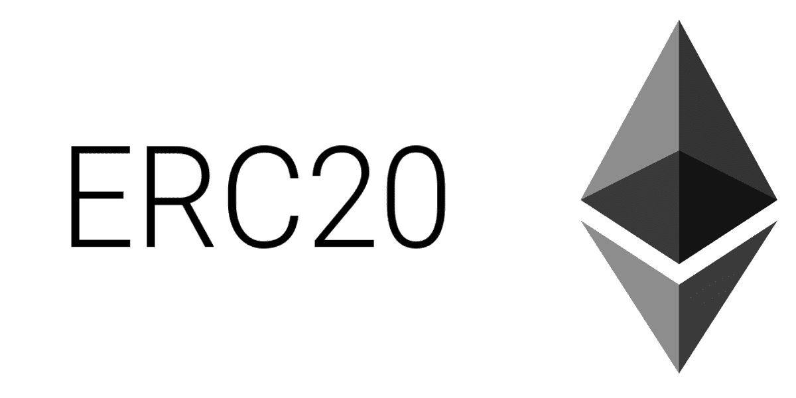
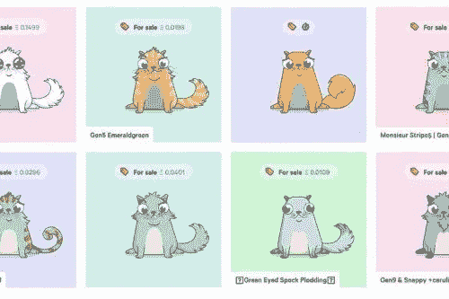

# 解剖 ERC:详尽的调查

> 原文：<https://medium.com/coinmonks/anatomy-of-an-erc-an-exhaustive-survey-8bc1a323b541?source=collection_archive---------4----------------------->

合著者:哈维尔·卡萨诺瓦(卫生部顾问)

在 Minsait，我们最近一直在从事一些令牌化项目，**当你想到令牌化时，首先想到的是以太坊的 ERC**，特别是广为人知的 ERC20 标准。但是，*这个 ERC20 是以太坊令牌化标准的全部吗？*答案是否定的，由于我的同事 [Javier](https://www.linkedin.com/in/javicasanova/) 的工作，我将分享一份关于 ERC 标记化标准的详尽调查，这份调查是我个人最近一直缺少的，它将使你成为*“标记王”*(或者至少我希望如此)。让我们开始吧。

## 什么是 ERC？

**ERC(以太坊征求意见稿)**是以太坊智能合约开发者使用的技术文档。他们定义了一套为以太坊生态系统实现令牌所需的规则。这些文档通常由开发人员创建，它们包含有关协议规范和合同描述的信息。在成为标准之前，ERC 必须通过 EIP(以太坊改进提案)进行修订、评论并被社区接受。实际上，ERC 只是 EIP 的一种特殊类型。ERC 是应用级的约定和标准，它们可以是不同的类型(令牌、注册名、URI 方案、库、包等)。)

**EIP 可能以四种不同的状态存在** : *草案*(开放审议，如 ERC721 不可替代令牌标准)*接受*(计划立即采用)*最终*(实施 EIP，作为 ERC20 令牌标准)*延期*(EIP 暂时被驳回，将来可能会考虑)。

## **以太坊令牌标准**

现在让我们快速浏览一下以太坊生态系统中的主要令牌标准。

## ERC20 令牌标准

它允许实现一个**标准 API，以确保令牌之间的互操作性**。它提供了转移令牌、获取帐户余额、获取令牌总量以及允许令牌批准的基本功能。要定义 ERC20 令牌，您需要:

*   合同的地址
*   可用令牌的数量。

但是，附加信息还有其他可选值，例如:

*   名称，例如" *Minsait Token"*
*   符号，如*【MNST】*
*   小数，或者你能把代币分成多少。您可以选择 0 到 18 个十进制值。

ERC20 定义了两种类型的事件，`Transfer(),`在令牌转移时触发，`Approve(),`用于每次成功调用`approve()`方法。这个令牌可能还包括诸如`allowance(), approve(),` 和`transferFrom()`之类的功能，以提供高级功能并授权其他以太坊地址代表您使用您的令牌。这个以太坊地址可能是一个智能合约，用于处理令牌或只是另一个帐户。

参考: [EIP 20](https://github.com/ethereum/EIPs/issues/20)

## ERC223 令牌标准

创建此令牌是为了解决 ERC20 的*“丢失令牌”*问题，其中**如果用户错误地将令牌发送到未设计为处理它们的智能合约，令牌会被卡住或烧毁**。对此，ERC223 允许开发者管理(接受或拒绝)到达的令牌。当代币被转移到智能合约时，该合约的特殊功能`tokensFallback(),`允许代币的接收者拒绝代币。如果没有实现该功能，则交易失败，发射方支付所有气费。在许多情况下，我们可能会使用这个函数来代替`approve().`。这个标准的实现是为了向后兼容。

让我们看一个 ERC223 如何工作的例子。如果我们对与 ERC20 不兼容的合同执行 ERC20 令牌转移，令牌不会被拒绝，因此会丢失/烧毁，而如果我们使用 ERC223，如果交易不兼容，交易将被自动拒绝。

与 ERC20 相比，ERC223 的优势在于:

*   用一次交易代替两次交易，节省了汽油费用。
*   消除令牌被烧毁/丢失的问题。
*   允许开发人员管理传入的事务。

参考: [EIP 223](https://github.com/ethereum/EIPs/issues/223)

## 用于增减电源的 ERC621 令牌标准扩展

它是 ERC20 标准的扩展。**增加了增加和减少流通代币总量的两个功能**。简而言之，它提出`totalSupply`是可以改变的。ERC20 仅允许合同所有者在创建期间定义的单个令牌发射事件。使用 ERC621，可通过功能`increaseSupply()` 和`decreaseSupply().`定义新的`totalSupply`，建议这些功能仅由合同所有者或受信任的用户访问。为了增强 ERC621 的功能和安全性，并避免潜在的错误，应实施溢出检查、合同属性修改和受限权限的附加功能。

参考: [EIP 621](https://github.com/ethereum/EIPs/pull/621)

## ERC667 传输和呼叫令牌标准

它旨在将 ERC20 和 ERC223 合并为一个单一标准。其背后的想法是在 ERC20 标准**中引入一个`transferAndCall()`函数，确保与 ERC20 令牌的向后兼容性。** ERC667 通过 ERC20 的`transfer()`函数传递令牌，并触发事件。当交易完成并且事件被注册时，令牌使用发送方、批准的金额和一个附加参数在接收方调用`transferAndCall()`。

让我们通过一个例子来说明 ERC667。如果 Sam 想转移 20 个令牌给 Tom，发射器调用 ERC667 令牌的`transferAndCall(tom, 20, data)`。在内部，契约从 ERC20 的标准调用`transfer(tom, 20)`。当转账完成时，除了触发`Transfer()`事件之外，函数`tokenFallback(sam, 20, data)`被发送到转账金额的接收方。`data`字段用于发送有关转账的附加信息，如交易目的。

参考: [EIP 677](https://github.com/ethereum/EIPs/issues/677)

## ERC721 不可替换令牌标准

与 ERC20 一起，它正在成为最知名的标志之一，也是最受关注的标志之一。你没听说过心爱的*crytpokites*吗？

**ERC721 描述了一种不可替代的代币(NFT)** ，即一种在你使用时不能被消耗的资产。目前，ERC721 还处于草案阶段，但是人们已经在使用它了。每个 ERC721 令牌都是独一无二的，它们都是不同的，根据其所有者的不同，它们甚至可能具有不同的值。它们可能代表对实物或数字资产的所有权，比如房子、艺术杰作、贷款等等，为什么不呢？小猫。

每个 NFT 通过一个`uint256` ID 来识别。它们可以通过两种不同的功能进行转移:

*   **安全转移**功能`safeTansferFrom()`，其验证`msg.sender,`即触发该功能的用户是令牌的所有者或被允许转移令牌的授权用户。
*   没有初步授权验证的**非安全传输**T3。令牌开发人员负责在该函数中实现一段代码，以验证负责调用该函数的已被授权这样做。在这个函数中，调用它的用户还必须验证接收者有权接收令牌。如果不执行这些验证，令牌可能会永远丢失。

ERC721 令牌必须实现提议的 ERC165 接口。该标准允许检测由契约实现的接口。这真的很有用，因为它允许检测令牌实现的接口，并因此调整方法/代码以与之交互。

参考: [EIP 721](https://github.com/ethereum/EIPs/blob/maste r/EIPS/eip-721.md)

## 新的高级令牌标准 ERC777

它定义了**代表另一个地址、合同或常规账户发送令牌所需的所有函数。**为此，它使用了 ERC820 标准。ER820 的使用支持在智能合约中注册元数据，以便向后兼容以前版本的令牌实现。ERC777 包括授权、撤销、转移和检查功能。

*   `authorizeOperator(address operator)`授权第三方代表令牌的所有者发送令牌，即`msg.sender.`如果该功能成功，则发送`AuthorizedOperator(address operator, address tokenHolder)`事件，其中`tokenHolder`是维护和管理令牌的用户的地址。
*   `revokeOperator(address operator)`取消第三方的令牌转移授权。因此，运营商将无法再代表其所有者转移令牌。
*   `isOperatorFor(address operator, address tokenHolder)`检查运营商的地址是否允许转让`tokenHoler.`保留的令牌
*   `operatorSend(address from, address to, uint256 amount, bytes userData, bytes operatorData)`从一个地址向另一个地址发送一定数量的令牌。如果交易成功，就会触发一个`Sent()`事件。

参考资料: [EIP 777](https://github.com/ethereum/EIPs/issues/777) ， [EIP 820](https://github.com/ethereum/EIPs/issues/820)

## ERC827 令牌标准(ERC20 扩展)

ERC827 是可与 ERC223 匹敌的标准。它可用于**解决 ERC223 解决的相同问题，但具有更高的灵活性，**允许数据传输和令牌传输。最近，这个标准相对于 ERC223 越来越受欢迎。它允许第三方消费令牌的转移和批准。它与 ERC20 完全兼容，增加了三个新功能。

*   `transfer(to, value, data)`将一定数量的代币转移到目的地址。完成时触发`Transfer()`。我们可以看到它是如何包含一个用于附加信息的`data`字段的。
*   `transferFrom(from, to, value, data)`将一定数量的代币从特定地址转移到目的地址。再次，它在调用后触发`Transfer()`。
*   `approve(spender, value, data)`允许`_spender`从账户中提取`value`中的金额。

参考: [EIP 827](https://github.com/ethereum/EIPs/issues/827)

## 如何实现我自己的基于 ERC 的令牌？

在所有上述参考资料中，您都详细解释了实现基于 ERC 的令牌的所有要求。然而，这项任务可能很难，你可能会忽略一些安全问题。但是你不需要担心， [OpenZeppelin](https://openzeppelin.org) 已经考虑到了这一点，他们**提供了一个可重用和安全的智能合约的开放框架，在 Solidity 中实现。**

使用 OpenZeppelin 和 Truffle 将使你成为 ERC 的智能合同主开发者。要开始开发 ERC 令牌，您只需要导入一个 OpenZeppelin 的 ERC 模板，并开始为您的特定用例或令牌修改它。但是我们现在就到此为止，我不想过多地让你感到厌烦。在以后的帖子中，我们可能会修改这个问题，并分享如何实际实现一个基于 ERC 的令牌。

## 最后但同样重要的是，令牌标准不包括以太坊吗？

实际上不是，其他区块链平台正在开始开发(或改编)他们自己的令牌标准实现。例如，NEO d **开发人员开始发布他们自己的令牌标准，即所谓的 nep**(因此，他们的标准等同于以太坊的 ERC 20[nep 5](https://github.com/neo-project/proposals/blob/master/nep-5.mediawiki))。