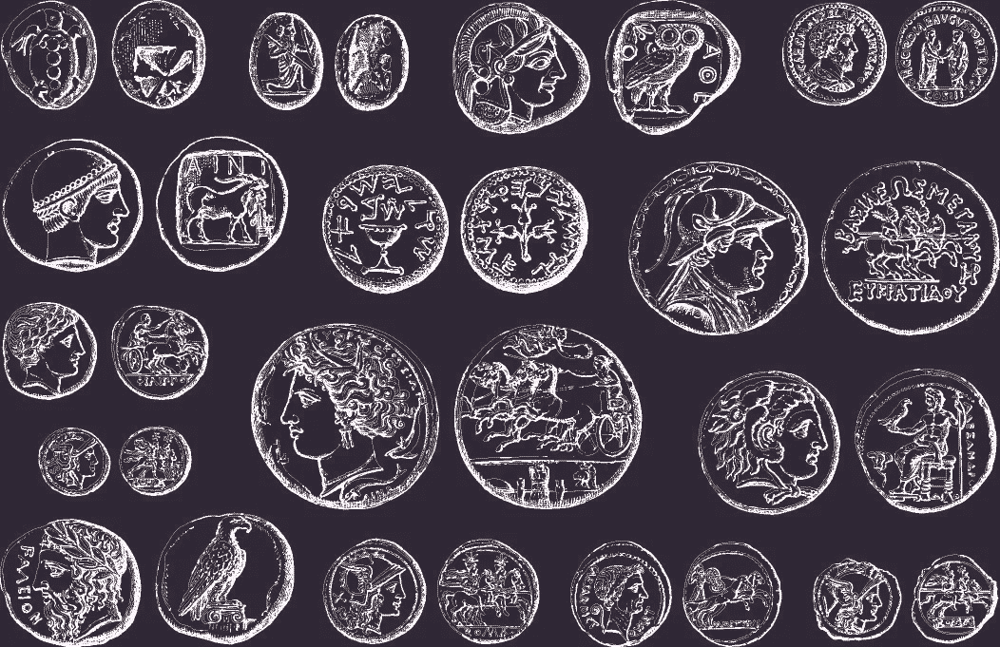
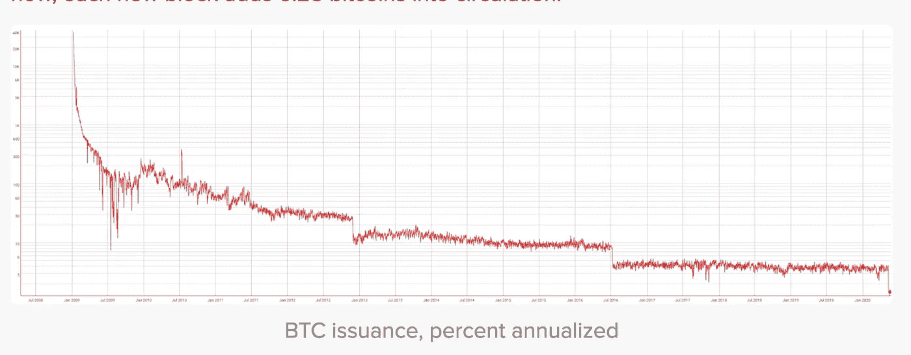

# 古罗马的秘密预言

> 原文：<https://medium.com/coinmonks/ancient-romes-crypto-prophecy-95a14685641b?source=collection_archive---------0----------------------->

## 全球经济正处于危机之中。从历史上看，政府试图用完全相同的方式从金融灾难中恢复——通过印更多的钱。我们探索这如何只会产生更多的问题…以及为什么加密货币会永远改变我们存储、交换和感知财富的方式。

财政刺激。

这是政府和中央银行用来描述货币印刷的官方术语。

据 Investopedia 报道，今年 3 月和 4 月，美国宣布了 2.8 万亿美元的经济刺激计划。

欧洲中央银行宣布了近 10 亿欧元的欧洲刺激计划。

从香港到英国，各国政府都在争相推出自己的紧急刺激措施，国际货币基金组织(IMF)也是如此。

债券购买计划、经济刺激、印钞——这些庞大的计划意味着同样的事情:

货币贬值。

根据经济学，价值是稀缺性的函数。

越稀有的资产越有价值。

越稀有的资产价值越低。

这意味着，随着世界各国政府和金融机构急于减轻新冠肺炎疫情的经济后果…

他们正在减少已经在系统中流通的货币的价值——在钱包中，在银行账户中，在房地产中，在股票中，你能想到的都有。

随着世界上的钱变得越来越少，它变得越来越不值钱。

这个问题已经导致了几千年来经济和帝国的崩溃。

这也是一个问题，最新形式的货币——加密货币——可以解决这个问题，因为世界正在摆脱自大萧条以来最大的全球金融危机和自大约 100 年前的西班牙流感以来最严重的健康危机。

为了解释这个问题并说明为什么加密货币可能提供金融史上前所未有的东西，我们需要回到过去。

# **罗马的教训:货币贬值是
丧钟，即使是最强大的帝国**

在其鼎盛时期，罗马帝国控制了欧洲、非洲和中东的大片地区。

罗马人创造了既复杂又广阔的文明，几乎在社会的每个领域都取得了巨大的发展。

罗马帝国因贸易而繁荣。

这种贸易的核心是银币。

Roman coins

当它第一次进入流通时，银币含有约 4.5 克纯银，使帝国的公民和组织能够做生意，接受商品和服务的付款，并为未来储存财富。

这些硬币有价值，因为里面的银很少。

事实上，如此稀缺，以至于随着时间的推移，罗马开始耗尽制造硬币的白银。

那么他们做了什么？

他们开始铸造更多含银较少的硬币。

一个世纪以来，银币的纯银含量从 75%下降到只有 5%。

政府印制了越来越多面值相同的纸币，而最初赋予纸币价值的金属却越来越少。

虽然这创造了系统中有更多货币的假象，但现实是罗马货币的贬值转移了公民的财富，导致他们不得不使用越来越多的硬币。

另一个词是通货膨胀。

当罗马帝国在 476 年崩溃时，它几乎面临着各方面的入侵，猖獗的政治和社会动荡以及瘟疫的爆发。

历届政府剥夺了罗马公民交换和储存财富的权力，罗马帝国也不再有力量或凝聚力来维持自身。

根据视觉资本家的说法，罗马通过贬值货币来扩大货币供应的实验创造了“*恶性通货膨胀、税收飙升和无价值的货币……解散了罗马的大部分贸易*”。

这使帝国的经济陷入瘫痪，并使其走向崩溃。

这让你想起了什么？

什么样的*现代*帝国在过去的一个世纪里打了多次战争…

遭受政治动荡…

经历着日益扩大的贫富差距和不断膨胀的政府债务…

并试图通过向其经济注入数万亿美元来解决所有问题？

## **2008 年信贷危机:美国帝国试图
用罗马方法**摆脱困境

2008 年，世界遭遇了我们现在所说的全球金融危机(GFC)。

2000 年代初，美国的投资银行家深深陷入了“次贷”(低质量/高风险)抵押贷款支持证券的交易。

换句话说，他们在交易房地产市场上数十亿美元的高风险债务。

这助长了房地产泡沫，泡沫破裂后，数百万美国人突然债台高筑，无家可归。

交易这些债务的银行家留下的金融工具突然变得一文不值。

房地产市场和股票市场双双崩溃，拖累了世界各地的市场(我们生活在一个美元主导的世界，就像罗马帝国生活在一个银币主导的世界一样)。

美国政府及其中央银行美联储打算如何摆脱这种局面？

通过印更多的钱。

在 2008 年最后一个季度，英国银行、欧洲央行和美联储从各自政府购买了总计 2.5 万亿美元的坏账和问题资产。

当中央银行救助政府时，政府救助了零售银行系统、制造商和其他企业。

他们创造了新的货币，并将其注入金融体系。

仅美国在 2008 年和 2009 年就向该体系注入了约 1 万亿美元的新资金。

所有这些涌入金融体系的新资金做了和罗马人尝试时完全一样的事情。

它通过货币贬值剥夺了人们的购买力。

GFC 和随后的大萧条已经过去 10 多年了，数据显示我们的购买力比以往任何时候都要低。

要想清楚地了解美元在过去一个世纪里贬值了多少，请看这张来自视觉资本家的信息图。

在 20 世纪的第一个十年，美国流通的货币总量约为 70 亿美元。

一美元可以给你买一双崭新的漆皮皮鞋。

到 20 世纪 50 年代，有 1510 亿美元在流通。

一美元买不到一双漆皮鞋。它可以买一个土豆头先生玩具。

快进到 20 世纪 80 年代，金融系统中有将近 1.6 万亿美元。

一美元现在只能买到一瓶亨氏番茄酱。

在新千年的第一个十年，货币供应量激增至近 5 万亿美元。

现在，一美元只能买一个温蒂汉堡。

到 2017 年，货币供应量已经增长到超过 13 万亿美元——几乎是千年之交的五倍。

一美元可以给你买一双一百多年前的崭新的漆皮鞋？

它现在只在 iTunes 上购买一首歌曲。

因此，你可以看到，增加更多的美元货币供应可能会造成繁荣增加的假象。

但是当你衡量对购买力的影响时，你会发现——就像在古罗马一样——这个过程侵蚀了购买力和财富。

这让我们想到了 2020 年世界面临的形势。

## **各国政府和中央银行在对新冠肺炎的金融反应中延续了这一趋势**

据[雅虎财经](https://finance.yahoo.com/news/coronavirus-covid-19-ubs-government-spending-financial-crisis-2009-123141055.html)报道，全球金融对新冠肺炎疫情的反应“以占世界 GDP 的百分比衡量，现在已经超过了金融危机期间最大的一年”。

我们将面临货币贬值的又一次加速和购买力的又一次打击。

政府和央行继续向金融体系注入新的资金，掠夺那些在财富体系中生活、赚钱、储蓄和消费的人。

如果今天一美元在 iTunes 上给你买了一首歌，那么 10 年、20 年、50 年后它会给你带来什么？

我们所知的这个体系什么时候会崩溃，就像罗马帝国扩大货币供应时那样？

关于这一点有很多观点，从“你疯了才会认为系统会崩溃”到“你没有一个装满不易腐烂的东西和金银财宝的末日地堡是什么意思？”。

我们并不是说这个系统即将崩溃，或者建议你在自己的土地上建造一个地下避难所，以应对世界即将滑向野蛮状态。

我们在说，就货币的价值而言，历史表明我们的财富在不断地被削弱。

对当前疫情的经济反应证明了这一趋势仍在继续。

加密货币是一种新的金融创新，它可能会结束，甚至逆转货币贬值和经济通胀这一根深蒂固的古老趋势。

# **一种随着时间的推移越来越值钱的新货币**

Investopedia 对加密货币的定义如下:

*加密货币是一种受加密技术保护的数字或虚拟货币，这使得伪造或重复消费几乎不可能。许多加密货币都是基于区块链技术的分散式网络——由不同的计算机网络执行的分布式账本。加密货币的一个显著特征是，它们通常不是由任何中央机构发行的，这使得它们在理论上不受政府干预或操纵*。

比特币——最初且仍占主导地位的加密技术——有两个内在特征，可以防止贬值和通货膨胀。

首先，BTC 矿商必须消耗现实世界的资源——时间、电力和计算机处理能力——来增加新硬币的供应量。

相比之下，央行基本上可以凭空创造新的货币。

其次，BTC 的供应量是有限的。

编码到它的算法中的是硬币的最大数量。

这意味着，当最后一批 BTC 被开采并加入供应时，就不会再有了。

大约每四年，一名矿工因消耗一定量的能量而获得的 BTC 量减半。

你可能听说过这在密码界被称为“halvening”。

最近一次是在今年 5 月。

BTC 的采矿奖励将继续减半，直到我们达到最大供应量——2100 万英镑。

该图表显示了加密的发布率随着时间的推移而下降。

[https://www.buybitcoinworldwide.com/how-many-bitcoins-are-there/](https://www.buybitcoinworldwide.com/how-many-bitcoins-are-there/)

并不是所有的密码都有这种特性。

但是还有大约 300 家公司以类似的方式运作。

但是当你考虑到这种内在的、日益增加的稀缺性时，你就会明白为什么加密货币有可能成为法定货币的激进替代品。

这是否意味着世界将进入一个新的密码主导的货币范式？

一些非常有影响力的人预测密码只会越来越受欢迎。

在 [*日经亚洲评论*](https://asia.nikkei.com/Spotlight/Cryptocurrencies/Bitcoin-halving-to-boost-its-appeal-as-inflation-hedge) 中引用，对冲基金都铎投资的亿万富翁创始人保罗·都铎·琼斯在给客户的一份报告中说:

*比特币让我想起了 1976 年我刚入行时的黄金。如果让我来预测，我认为(最好的资产)将是比特币(T5)*

这些内在特征意味着密码可以提供第一个可行的交易媒介，它的价值会增加，而不是减少。

这种可能性得到了一个事实的支持，即 BTC 和其他加密公司今天在不变的区块链进行交易——分散的网络(理论上)不受任何中央当局的干预。

当然，请记住，中央政府的干预是古罗马货币贬值的原因，今天在美国和世界各地仍是如此。

# 历史表明，随着时间的推移，政府会让货币贬值，而货币也会进化

罗马人做到了。现在，美国、欧洲和世界其他地方都在这么做。

金融系统中流通的钱一年比一年贬值。

密码为这个古老的问题提供了一个潜在的解决方案。

如果你更愿意将加密货币视为一种时尚，那么考虑一下这个。

十万年前，[人类已经在交易](https://en.wikipedia.org/wiki/History_of_money)。

他们用牲畜换粮食，用陶罐换工具。

从那以后，我们可能会进入“礼物经济”，人们会互相赠送有价值的物品，并期望在未来得到类似价值的回报。

在公元前 9000 年到 6000 年之间，人们可能开始使用牲畜和植物作为货币。

这些东西很有用，可以重复使用。人们提供的越多，他们从交易中得到的就越多。

大约公元前 3000 年，美索不达米亚文明开始使用“商品货币”——一种约定重量的大麦。

巴比伦人创造了债务的概念。埃及人开始使用金条。

在公元前 1000 年到公元 400 年之间，中国的周朝发明了第一枚硬币。

早期的地中海帝国紧随其后，在经济中引入了各种硬币——罗马人就是其中之一。

11 世纪，中国人再次创新，引入了纸币。

欧洲人创造了贸易汇票，一种早期的信用形式，而中东的先驱经济学家开始尝试支票、储蓄账户、贷款、汇率等等。

大约从 1450 年开始，英国人开始在银行业和中央集权货币管理方面取得进步。

他们的金匠在中央金库储存黄金，并可以发行期票和支票账户，成为基于信用的货币的先驱。

1971 年，美国总统尼克松取消了美元兑换黄金的能力，结束了我们所说的“金本位制”。

美元——今天仍然是世界储备货币——现在自由浮动，不再与它曾经代表的贵金属挂钩。

同样在 20 世纪，人类创造了计算机。

到 20 世纪 90 年代，美国中央银行和商业银行之间的所有资金转移都是通过电子方式完成的。

随着数字货币的好处——主要是速度和便利——变得越来越明显，我们开始远离实物现金。

2012 年，美国可能有超过一半的交易是电子交易。

想想你的交易中有多少是电子交易，而不是实物交易。

现在考虑一下，对于公元前 9000 年的一个农民来说，这个想法是多么的奇怪和不可捉摸。

将这段历史与我们今天探讨的货币贬值趋势进行对比，问问你自己:

加密货币是互联网白日梦吗…

还是人类数千年金融进化中合乎逻辑的下一步？

> [在您的收件箱中直接获得最佳软件交易](https://coincodecap.com/?utm_source=coinmonks)

