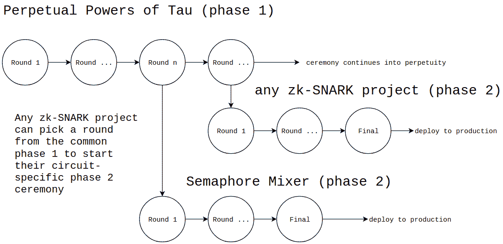

# 宣布 Tau 仪式的永久权力使所有 zk-SNARK 项目受益

> 原文：<https://medium.com/coinmonks/announcing-the-perpetual-powers-of-tau-ceremony-to-benefit-all-zk-snark-projects-c3da86af8377?source=collection_archive---------1----------------------->

以太坊社区对我们关于 Semaphore 的技术博客文章做出了积极的回应，Semaphore 是一个基于以太坊的零知识信号小工具。这篇文章是关于我们下一个主要步骤的更新:我们称之为*Tau 仪式*的永久权力的多方信任设置的启动。

Passing a baton. Image source: [Wikimedia Commons](https://commons.wikimedia.org/wiki/File:BXP135677.jpg)

# 为什么这是必要的？

任何将 zk-SNARK 电路用于生产的人都必须执行一个被称为[可信设置](https://z.cash/technology/paramgen/)的计算，以便生成证明密钥和验证密钥。不幸的是，这一过程还产生了一种被称为*有毒废物*的数据，这种数据必须被丢弃，因为它可以被用来制作假证明，从而破坏系统的安全性。为了解决这个问题，可以使用特殊的加密仪式来执行可信设置，其中多个参与者轮流执行计算。

所有计算的最终结果都是可信的，只要有一个参与者确保他们安全地丢弃了有毒废物。Zcash 加密货币项目在 2017 年举行了一次著名的仪式，并且[解释了](https://www.zfnd.org/blog/powers-of-tau/)这种属性如何增强其可信度:

> Tau 仪式的力量依次进行，每个参与者一次……然后每个计算的结果被添加到一个公开的抄本中，这样整个协议可以被公开验证。只要有一个参与者成功地破坏了他们的随机性，那么最终得到的参数就是安全的。随着越来越多的参与者加入进来，对手已经不太可能危及所有人的安全。这一点尤其如此，因为参与者在采取应对措施时有很大的灵活性。

请注意，每个 zk-SNARK 项目都需要两个阶段的参数生成，并且 Tau 的永久幂只能替换所有项目的第一个阶段。第二阶段是特定的赛道，由各个车队负责。然而，每个仪式都需要时间，协调起来也很繁琐。此外，基于以太坊的 zk-SNARK 项目由于特殊的密码不兼容性，不能使用 Zcash 仪式生成的参数。因此，有必要举行一个新的仪式。

# 解决方案

解决方案是为整个社区运行一个新的第一阶段仪式，从而减少所有团队的负担，包括 zk-SNARK 扩展解决方案(如 [iden3 rollup](https://github.com/iden3/rollup) 、 [Matter Network](https://matter-labs.io) 和 [Loopring](https://loopring.org) )和类似 [Tornado Cash](https://tornado.cash/) 的混合器。此外，这个仪式将是*永久的*——也就是说，对所需的参与者人数没有限制，任何 zk-SNARK 项目都可以选择仪式的任何一点开始他们的电路特定的第二阶段。

我们已经开始仪式，并积极寻求参与者加入。

每个参与者将收到一个*挑战*文件，并且必须以安全和诚实的方式生成一个*响应*文件。只要有一个参与者在这个过程后丢弃有毒废物，整个仪式就可以信任。

每一轮大约需要 24 小时，需要 97G 下载和 49G 上传。我们认识到这对于许多人来说是麻烦的，而且也比其他的 Tau 仪式更需要时间和空间。然而，我们希望支持尽可能多的 zk-SNARK 电路，包括那些有大量约束的电路。具体来说，roll up 需要超过 2.6 亿个约束；因此，仪式必须计算 2 ^的 28 次方τ，这解释了为什么它是如此沉重。

有一个中央协调员(我自己)与 [Kobi Gurkan](https://kobigurk.com) 和 [Barry WhiteHat](http://github.com/barryWhiteHat/) 一起管理后勤，确定参与者的顺序，并维护所有贡献的记录。虽然协调者对整个过程有很大的影响力，但是他们不需要被完全信任。任何人都可以验证仪式的公开副本，这是每个参与者的一整套挑战文件、响应文件和加密签名证明。然而，协调者可以审查参与者，社区应该监视他们以确保他们没有。这就是为什么有一个公开的[邮件列表](https://groups.google.com/a/ethereum.org/forum/?hl=en#!forum/perpetual-powers-of-tau-ceremony-group)，感兴趣的各方可以在那里协调安排他们的参与。

我们在这个 Github 库的[上托管认证和参与说明。感兴趣的社区成员应该加入邮件列表参与进来。我们很高兴继续 Tau 仪式的永久力量，我们提前感谢所有人的帮助。](https://github.com/weijiekoh/perpetualpowersoftau)