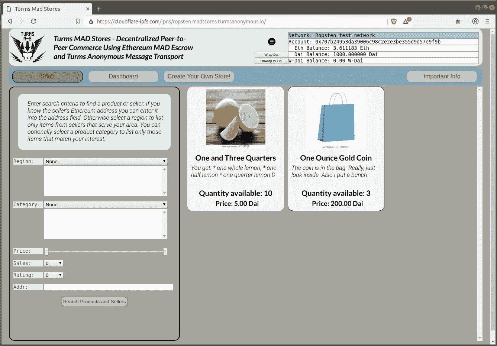
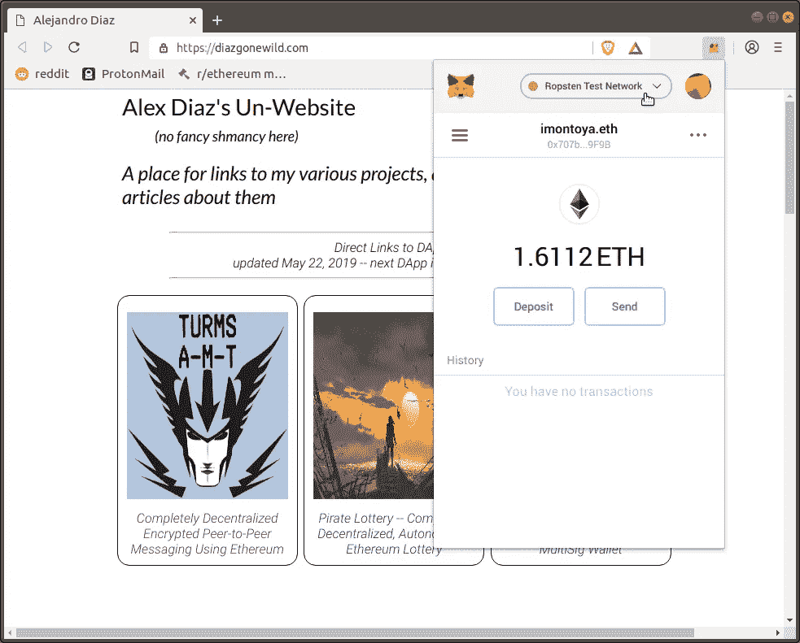

# 宣布 Turms MAD Stores:一个使用以太坊智能合约的完全分散的匿名市场

> 原文：<https://medium.com/coinmonks/announcing-turms-mad-stores-a-completely-decentralized-anonymous-marketplace-using-ethereum-738c58e72ccd?source=collection_archive---------0----------------------->

我在疯狂商店工作了一年多。这是一个完全去中心化的在线市场，根本没有后端服务器。我很高兴地宣布，我已经有了一个概念验证版本，可以在 Ropsten testnet 上进行测试。你可以在 [github](https://github.com/AlejandroDiaz666/mad-stores) 上查看所有源代码。这些合同也在 etherscan.io [这里](https://ropsten.etherscan.io/address/0x19626b86bac95a5f6671f91b51dbf6dc08f9266f#code)和[这里](https://ropsten.etherscan.io/address/0x2195b7ff79b24806a239747cf21a95d455966d7d#code)发布。

## 关于疯狂商店

MAD Stores 是一个像 ebay 或亚马逊一样的在线市场，但它是完全分散的——所以没有中央机构管理、监督或控制市场。ebay 和 MAD Stores 的另一个区别是卖家可以保持匿名，或者至少是假名；也就是说，买家和卖家只知道他们的以太坊地址(或 ENS 名称)。买家和卖家之间的所有通信都是通过 [Turms 匿名消息传输](/@ananyaagarwal_42559/turms-anonymous-message-transport-step-by-step-9729ce829697)进行的。关于一个分散的匿名市场，一个显而易见的问题是，我们如何阻止骗子欺骗人们，因为没有一个中央机构来约束人们或解决纠纷——你甚至可能没有其他方的任何联系信息(除了他们的以太坊地址，你可以通过 Turms 匿名消息传输来发送消息)。

答案是*疯代管*

## 疯狂托管

MAD 代表互相确保毁灭。在每一笔购买交易中，双方都将债券存入托管账户。如果任何一方作弊，那么双方都失去了存款！

当你在 MAD 商店购买一件商品时，你将把价格的 150%存入一个托管账户。卖家还会自动将一笔相当于购买价格 50%的保证金存入托管账户。当买方确认产品交付令人满意时，所有资金将从 MAD 托管中释放。如果产品不像广告宣传的那样，或者如果没有交付，那么鼓励买方和卖方使用 Turms 匿名消息传输进行沟通，以制定出令人满意的解决方案。如果无法达成解决方案，买方可以选择“烧掉”托管协议。也就是说，销毁托管的所有资金。关于 MAD Stores 如何工作，以及现实生活中可能出现的所有边缘情况，还有很多要说的。我将发布一篇更深入的文章来讨论这些话题。但是现在，我鼓励任何感兴趣的人在 Ropsten testnet 上尝试一下。(DApp 包括简介和常见问题)。

## 怎么试出来！

MAD Stores 在 Ropsten testnet 上发布供测试。要试用它，请遵循以下步骤:

Set Metamask to use the Ropsten testnet

1.  **设置 MetaMask 以使用 Ropsten testnet**:
    Ropsten testnet 以太网空闲。它专门用于测试 DApps，无需使用昂贵的真实 ETH。要使 MetaMask 能够使用 Ropsten testnet，单击 MetaMask 对话框顶部的`Main Ethereum Network`并选择`Ropsten Test Network`。
2.  **获取一些 Ropsten 测试以太网** :
    只需前往[https://faucet.ropsten.be/](https://faucet.ropsten.be/)并输入您的以太网地址。或者你可以去[https://水龙头. metamask.io](https://faucet.metamask.io/) ，点击
    `request 1 ether from faucet`按钮。等待几秒钟，然后打开 MetaMask 对话框，确认您已收到测试 ETH。
3.  **在 Turms AMT 的 *Ropsten 版本*上创建一个 Turms AMT 账户** :
    我创建了一个在 Ropsten testnet 上工作的 Turms 匿名消息传输版本。即使你已经在以太坊主网上使用 Turms AMT，你也需要在 Ropsten 版本上创建一个新帐户。这只是为了测试疯狂商店。例如，您可以在:
    [cloud flare-ipfs . com/ipns/Ropsten . message transport . turmsanonymous . io/](https://cloudflare-ipfs.com/ipns/ropsten.messagetransport.turmsanonymous.io/)
    或
    [ipfs.io/ipns/ropsten.messagetransport.turmsanonymous.io/](https://ipfs.io/ipns/ropsten.messagetransport.turmsanonymous.io/)
    访问 rops ten 版本，确保 MetaMask 解锁并设置为 Ropsten testnet。
4.  **获得一些 rops ten**[***ween us***](https://github.com/bokkypoobah/WeenusTokenFaucet)**代币** :
    当真正的疯狂商店在以太坊主网上发布时，它会在[制造者](https://makerdao.com/en/)戴那里为所有东西定价；但是为了在 Ropsten 上进行测试，我们使用 Weenus 来代替 DAI。在 DApp 中，您的 Weenus 天平将显示为阿呆天平。要获得 1000 威努斯，只需向[威努斯代币契约](https://ropsten.etherscan.io/address/0x101848D5C5bBca18E6b4431eEdF6B95E9ADF82FA#code)发送零个 Ropsten。(你可以在这里阅读更多关于 Weenus [的内容](https://github.com/bokkypoobah/WeenusTokenFaucet)。顺便说一句，衷心感谢 BokkyPooBah 做了腊肠！)
5.  **点燃 DApp 的疯狂商店**:
    DApp 的疯狂商店在 IPFS，例如在:
    [cloud flare-ipfs . com/ipns/ropsten . madstores . turms anonymous . io/](https://cloudflare-ipfs.com/ipns/ropsten.madstores.turmsanonymous.io/)
    或
    [ipfs.io/ipns/ropsten.madstores.turmsanonymous.io/](https://ipfs.io/ipns/ropsten.madstores.turmsanonymous.io/)
    开头有一个很好的小介绍，会让你开始。随意购买你看到的任何待售物品——它们实际上不会被交付——因为这只是为了测试目的而假装的。或者你可以创建自己的商店，出售任何你能想到的虚拟产品。
6.  请将您的意见发送给我！MAD Stores 仍在开发中。如果您有任何问题或建议，请发邮件至 Alejandro.Diaz.666@protonmail.com。请务必提供您的以太坊地址，因为我们将为 10 条最佳评论奖励 1000 个 Turms 代币。

## 摘要

分散式商业是以太坊的杀手 DApp。Turms MAD Stores 仍在测试中，我们需要以太坊社区的一些投入，但它将成为有史以来最实用的 DApps 之一。请试一试，贡献你的建议！

亚历杭德罗·迪亚兹

> [在您的收件箱中直接获得最佳软件交易](https://coincodecap.com/?utm_source=coinmonks)

