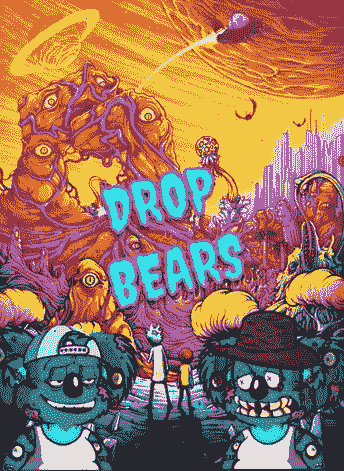

# 又是一天，又是一个 NFT，但这次可能会持续很久

> 原文：<https://medium.com/coinmonks/another-day-another-nft-but-this-one-might-be-in-it-for-the-long-haul-2574ffba7a77?source=collection_archive---------4----------------------->

不可替代代币(NFT)今年出现了爆炸式增长。尽管它们从 2014 年就已经存在，但现在却越来越臭名昭著。生态系统已经见证了从班克斯画作的[焚烧和皮普尔的](https://theconversation.com/nft-art-the-bizarre-world-where-burning-a-banksy-can-make-it-more-valuable-156605#:~:text=A%20blockchain%20company%20has%20bought%20a%20piece%20of,the%20screen%20print%20from%20a%20New%20York%20gallery.)[天天拍:前 5000 天](https://en.wikipedia.org/wiki/Everydays:_the_First_5000_Days#:~:text=Everydays%3A%20the%20First%205000%20Days%20is%20a%20digital,images%20created%20by%20Winkelmann%20for%20his%20Everydays%20series.)艺术品在现在著名的佳士得拍卖会上获得 6900 万美元的炒作。

所有这些都进一步巩固了 NFTs 作为区块链宇宙中一个相关部门的地位。有史以来第一批 NFT 是一系列 PFP 或个人资料图片，用作社交媒体账户的头像。虽然从金融角度来看，收藏品没有内在价值，但考虑到买家对项目、艺术和围绕项目构建的用例的个人感受，它可能具有一些内在价值。正如许多人多年前在成长过程中对交易卡的感觉一样，收藏 NFT 可以说是投资股票和艺术品的一种混合

> *与艺术市场相比，基于 PFP 的非艺术信托有很多怀旧情绪。*

# #为什么对 PFP NFTs 的需求如此之高，以及我对“落熊”的喜爱:

对于任何成功的 NFT 项目来说，重要的是他们如何建立一个引人注目的品牌故事，或者他们如何区分他们 NFT 的主题。这可能是有史以来第一个 8 位 NFT 艺术或怀旧美学风格的漫画。

一个特定的主题吸引了一个拥有者群体，因为他们把一种个性与提醒他们自己或他们想成为什么样的人联系在一起。对我来说，流行的都市传说“落熊”将我带入了“落熊”NFT 项目。拥有“掉落的熊”让我觉得我是流行的城市传说民间传说的一部分。

当代澳大利亚民间传说中的落熊是一种食肉的考拉。虽然考拉是典型的温顺食草动物，但落熊被描述为异常巨大和邪恶的有袋动物，它们栖息在树梢上，并通过从上面落下来袭击从它们下面走过的毫无防备的人。

*Image credit: ‘DropBearWoky’ — Drop Bears community member.*

从小到大，感恩节和家人坐在一起聚餐，曾经是我最喜欢的童年时光，尤其是长辈们分享都市传说的部分。分享它们提供了一种娱乐来源和一种重要的社交方式。

随着时间的推移，城市传说的复述确保了它们成为公共记录的一部分并广为人知。常见的例子包括“血腥玛丽”——如果你叫她，她会在镜子里露脸。胡克曼和落水熊是其他著名的传说。

“掉熊”项目的创造者从这个流行的民间传说中获得灵感，并将它们永远留在了区块链。与交易卡类似，它们如何根据主题的受欢迎程度和稀缺性来获取价值，该系列有 1 万张由算法生成的落熊(考拉)画像，使用智能合约，其中包含极其罕见的类型——杜里皇冠和黄玉毛皮类型出现了几次。

目前，[Drop Bears](https://www.dropbears.io/)NFT 由超过 3600 名用户(或钱包)拥有，这是一个备受尊重的统计数据，表明了艺术的受欢迎程度和需求。除了图像的知识产权，拥有 Drop Bears 将使持有者获得该项目的未来 NFT drops 的免费通行证。

此外，它还为所有者提供了专属的会员特权，如 PFP photo booth，允许所有者将他们的背景更改为自定义艺术家创作的变体，更重要的是，加入充满活力、充满乐趣的 drop bears 支持社区。

我是一个关心文化、价值观和历史的人，拥有“[落熊](https://www.dropbears.io/)”让我觉得我是这个流行的城市传说民俗的一部分。现在我的 Twitter PFP 是一只“滴熊”，我希望让这个传说流传下去，并在我的朋友圈内分享民间传说。在我关于这个项目的第一条推文发布后不久，我就受到了“Drop Bear”社区的欢迎，他们戴着眼镜或从他们的乳头射出激光束。这群考拉亲民爱好者在聊天，在关注，在互相支持。

如今，许多收藏家通过计数来评估 NFT 社区，但他们忘记了一个重要的方面——他们订婚了吗？。我在 Twitter 上的成长是对这个充满活力的有趣的 Drop Bears 社区的见证。正如一位社区成员“DropBearWoky”所说，“博根家族太强大了。了不起的社区。神奇的一家人”。

*Duck race gamification — unique concept to keeping the community active in discord*

社区也很活跃不和谐。由于该项目的聪明和有趣的“鸭子比赛”游戏化，每天有多达 100 名参与者在线争先恐后地参加比赛(随机激活)并赢得掉落的熊或 ETH。

**又是一天，又是一个 NFT 的项目，但由于“落熊”背后与主题、艺术和社区的紧密联系，它可能会持续很久。**

请注意，创始团队生活在受到澳大利亚 2019 年黑色夏季丛林大火严重影响的地区，这场大火摧毁了野生动物栖息地，特别是树袋熊的既定树木。Drop Bears 已经与麦格理港考拉医院建立了联系，该项目正在积极寻找其他避难所和基金会来帮助考拉。迄今为止，该团队已经向考拉野生动物保护区捐赠了 5 万美元，并将继续从二级销售中向澳大利亚其他考拉保护区捐赠[(目前为 2 万澳元)。](https://opensea.io/collection/dropbearsnft)

收藏家经常在 Twitter 上向 NFT 大师寻求投资建议，因为这些人预计会预测市场上表现良好的项目。NFT 大师和推特影响者 [BoredChairman](https://twitter.com/Realm_of_Crypto) 说:

> *“drop bears NFT 是一个我很乐意购买的项目，因为我知道筹集的资金将有一部分用于拯救考拉。艺术很有趣，团队和社区也很棒。加入到日常的不和谐的革命竞赛中来”。*

> 加入 Coinmonks [电报频道](https://t.me/coincodecap)和 [Youtube 频道](https://www.youtube.com/channel/UCbyDhTbOiKh2iUMKBi4-4Zg)了解加密交易和投资

## 另外，阅读

*   [尤霍德勒 vs 科恩洛 vs 霍德诺特](/coinmonks/youhodler-vs-coinloan-vs-hodlnaut-b1050acde55a) | [Cryptohopper vs 哈斯博特](https://blog.coincodecap.com/cryptohopper-vs-haasbot)
*   [币安 vs 北海巨妖](https://blog.coincodecap.com/binance-vs-kraken) | [美元成本平均交易机器人](https://blog.coincodecap.com/pionex-dca-bot)
*   [新加坡十大最佳加密交易所](https://blog.coincodecap.com/crypto-exchange-in-singapore) | [购买 AXS](https://blog.coincodecap.com/buy-axs-token)
*   [投资印度的最佳密码](https://blog.coincodecap.com/best-crypto-to-invest-in-india-in-2021) | [HitBTC 评论](/coinmonks/hitbtc-review-c5143c5d53c2)
*   [加拿大最好的加密交易机器人](https://blog.coincodecap.com/5-best-crypto-trading-bots-in-canada) | [赌注加密](https://blog.coincodecap.com/staking-crypto)
*   [如何在印度购买比特币？](/coinmonks/buy-bitcoin-in-india-feb50ddfef94) | [瓦济克斯评论](/coinmonks/wazirx-review-5c811b074f5b)
*   [比特币主根](https://blog.coincodecap.com/bitcoin-taproot) | [Bitso 回顾](https://blog.coincodecap.com/bitso-review) | [排名前 6 的比特币信用卡](/coinmonks/bitcoin-credit-card-bc8ab6f377c6)
*   [最佳免费加密信号](https://blog.coincodecap.com/free-crypto-signals) | [YoBit 评论](/coinmonks/yobit-review-175464162c62) | [Bitbns 评论](/coinmonks/bitbns-review-38256a07e161)
*   [OKEx 评论](/coinmonks/okex-review-6b369304110f) | [Kucoin 交易机器人](/coinmonks/kucoin-trading-bot-automate-your-trades-8cf0ca2138e0) | [期货交易机器人](/coinmonks/futures-trading-bots-5a282ccee3f5)
*   [AscendEx Staking](https://blog.coincodecap.com/ascendex-staking)|[Bot Ocean Review](https://blog.coincodecap.com/bot-ocean-review)|[最佳比特币钱包](https://blog.coincodecap.com/bitcoin-wallets-india)
*   [霍比评论](https://blog.coincodecap.com/huobi-review) | [OKEx 保证金交易](https://blog.coincodecap.com/okex-margin-trading) | [期货交易](https://blog.coincodecap.com/futures-trading)
*   [Godex.io 审核](/coinmonks/godex-io-review-7366086519fb) | [邀请审核](/coinmonks/invity-review-70f3030c0502) | [BitForex 审核](https://blog.coincodecap.com/bitforex-review)
*   [Crypto.com 费用](/coinmonks/binance-fees-8588ec17965) | [僵尸加密审查](/coinmonks/botcrypto-review-2021-build-your-own-trading-bot-coincodecap-6b8332d736c7) | [替代品](https://blog.coincodecap.com/crypto-com-alternatives)
*   [有哪些交易信号？](https://blog.coincodecap.com/trading-signal) | [Bitstamp vs 比特币基地](https://blog.coincodecap.com/bitstamp-coinbase) | [买索拉纳](https://blog.coincodecap.com/buy-solana)
*   [ProfitFarmers 回顾](https://blog.coincodecap.com/profitfarmers-review) | [如何使用 Cornix 交易机器人](https://blog.coincodecap.com/cornix-trading-bot)
*   [MXC 交易所评论](/coinmonks/mxc-exchange-review-3af0ec1cba8c) | [Pionex vs 币安](https://blog.coincodecap.com/pionex-vs-binance) | [Pionex 套利机器人](https://blog.coincodecap.com/pionex-arbitrage-bot)
*   [我的加密副本交易经历](/coinmonks/my-experience-with-crypto-copy-trading-d6feb2ce3ac5) | [比特币基地评论](/coinmonks/coinbase-review-6ef4e0f56064)
*   [CoinFLEX 评论](https://blog.coincodecap.com/coinflex-review) | [AEX 交易所评论](https://blog.coincodecap.com/aex-exchange-review) | [UPbit 评论](https://blog.coincodecap.com/upbit-review)
*   [AscendEx 保证金交易](https://blog.coincodecap.com/ascendex-margin-trading) | [Bitfinex 赌注](https://blog.coincodecap.com/bitfinex-staking) | [bitFlyer 审核](https://blog.coincodecap.com/bitflyer-review)
*   [麻雀交换评论](https://blog.coincodecap.com/sparrow-exchange-review) | [纳什交换评论](https://blog.coincodecap.com/nash-exchange-review)
*   [加密货币储蓄账户](/coinmonks/cryptocurrency-savings-accounts-be3bc0feffbf) | [加密交易机器人](https://blog.coincodecap.com/best-crypto-trading-bots)
*   [BigONE 交易所评论](/coinmonks/bigone-exchange-review-64705d85a1d4) | [CEX。IO 审查](https://blog.coincodecap.com/cex-io-review) | [Swapzone 审查](/coinmonks/swapzone-review-crypto-exchange-data-aggregator-e0ad78e55ed7)