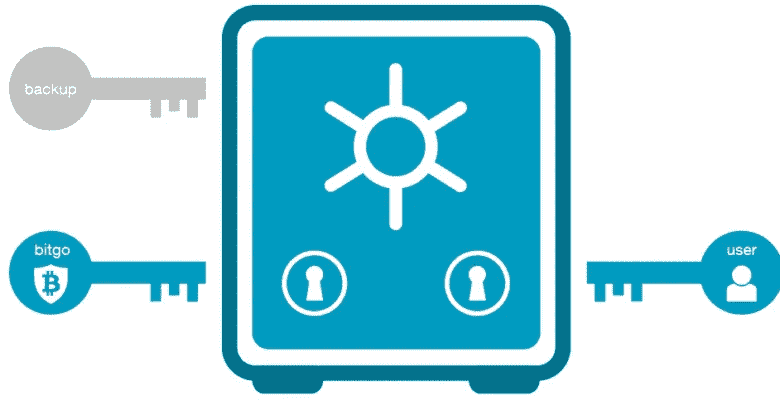
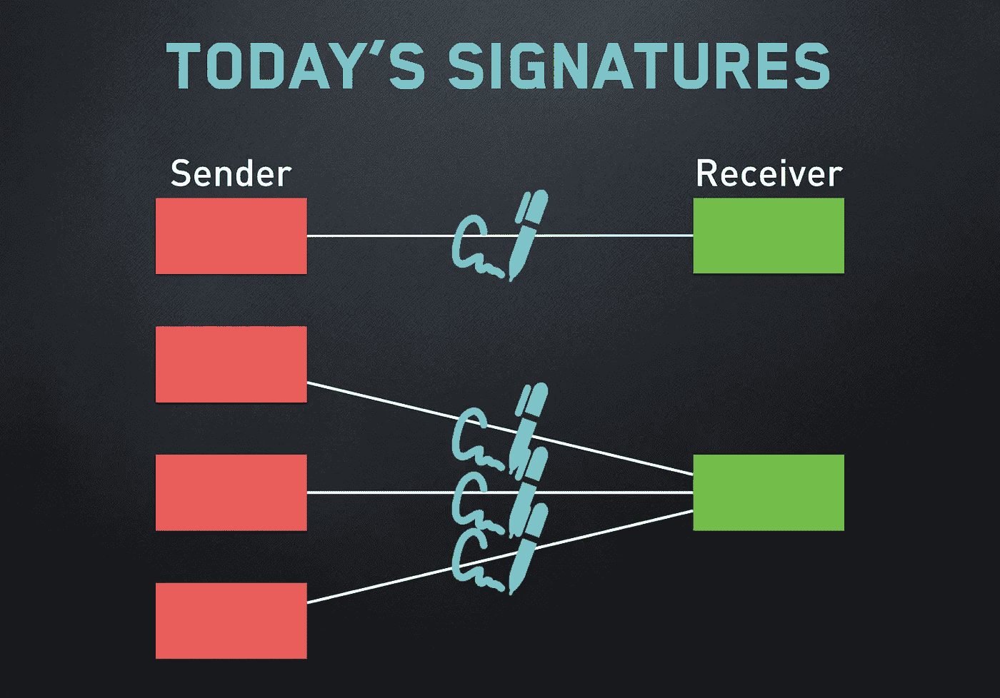

# 另一项新的技术改进是加入比特币网络

> 原文：<https://medium.com/coinmonks/another-new-technical-improvement-is-adding-to-bitcoin-network-22f689715269?source=collection_archive---------12----------------------->

上周，有影响力的比特币开发商 [Pieter Wuille](https://medium.com/u/26e8b98f325a?source=post_page-----22f689715269--------------------------------) 在 github 上发布了一篇[帖子](https://github.com/sipa/bips/blob/bip-schnorr/bip-schnorr.mediawiki)，向公众介绍了一个全新的技术先进的更新，名为 Schnorr。

由于比特币网络长期以来一直遭受可扩展性和隐私问题的困扰，开发人员一直在寻找各种解决方案来解决这些问题，包括隔离见证(SegWit)，将见证从交易数据分离到分叉；闪电网络(LN)，一种将交易从主链转移到第二层渠道的支付协议；forks，这将创建附加到原始链的第二个链。目前，Schnorr 签名与隔离签名一样，也是一项技术更新，旨在修复隐私和可销售性方面的漏洞。

# 什么是 Schnorr 签名&签名与多重签名有什么区别

目前，在实施多重签名作为其签名方案的比特币区块链上，对于一个用户，比如说彼得，从 4 个账户向他的朋友发送总额为 1 BTC 的付款，这意味着每个账户 0.25 BTC，那么彼得需要签名 4 次。而随着 Schnorr 签名的实现，他只需给出一个签名就可以完成交易。理论上，该签名方案旨在通过与多重签名相结合来简化过程并节省区块链空间。

据估计，在比特币中加入 Schnorr 后，网络处理速度提高了 25%。

# 关于施诺尔签名的争论

然而，据说签名算法仍处于早期阶段，这种技术在实际应用中还需要很长时间。此外，该应用还引发了比特币社区的辩论，就像当时 SegWit 的实施一样，这引起了人们对比特币的纯度和下降的[价格的关注。Coindesk 的一篇文章中提到，“实际上，这将 Schnorr 设定为比特币的下一个重大变化，这意味着这将是自隔离见证(SegWit)以来最大的代码变化”。](https://citicoins.com/bitcoin/charts)