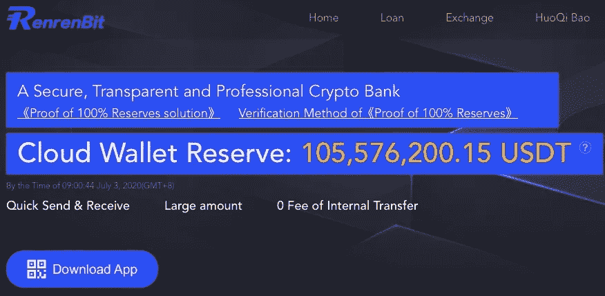
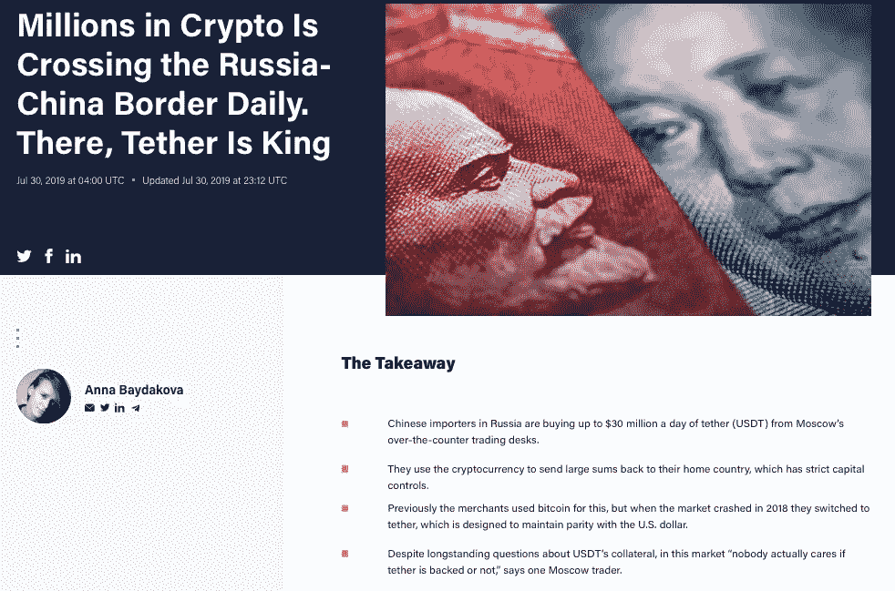
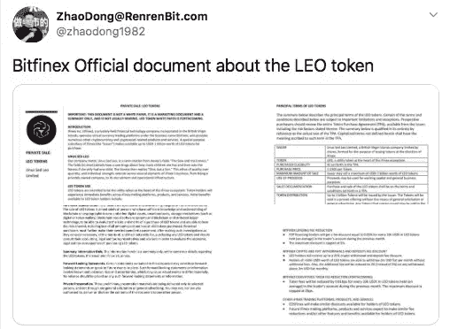

# 另一个用例失败了

> 原文：<https://medium.com/coinmonks/another-usecase-bites-the-dust-e64ba9b95c6?source=collection_archive---------2----------------------->

中国流传着一个关于赵东的谣言，中国人称他为“董叔叔”赵东是一名场外交易商和加密货币交易商，他创立了 Renrenbit，这是一家总部位于中国的加密货币交易所，承诺“100%储备证明”。

The homepage for Renrenbit, claiming a, “cloud wallet reserve of 105,576200.15 USDT”

赵东自 2013 年以来一直参与比特币，除了创建 Tether (Tether Yuan 目前的市值约为 2350 万美元，仅 330 万美元)，他还是 Bitfinex 推出的 ICO'ed(初始硬币)的关键投资者。这是说董大爷既是有钱人，又是国内加密货币社区的重要组成部分。

Zhao Dong

据推测，上周赵东从日本旅行回来时被中国当局拘留。自那以后，赵东就杳无音信，尽管人人网的 CMO 否认赵东已被拘留。

尽管如此，赵东不能为自己说话的事实已经说明了一切。人人网的电报——无论是英文还是中文——基本上是沉默的，除了一些人发布简短的中文新闻文章，讲述赵东被拘留的情况，以及员工大谈党的路线。文章宣称，当赵东抵达中国时，他因涉嫌金融犯罪(即洗钱或欺诈)而被拘留，并且“正在配合当局的工作”。

**需要澄清的是:**被拘留并不等同于被逮捕。他可能明天就被释放，只需要一次严厉的谈话。或者不是。

# 为什么这很重要？

也许不会。但如果赵东犯了某种金融渎职行为，被 CCP 当场抓住，他无疑就有麻烦了。然后，人们一定会想，一个被如此公然承认和吹捧的用例，是否真的是一个用例。

Anna Baydakova covered the use of Tether in cross border transactions and by Russian and Chinese OTC traders in a fantastic [article for Coindesk](https://www.coindesk.com/tether-usdt-russia-china-importers).

几乎没有理由怀疑场外交易柜台、加密货币交易所，甚至可能是某些俄罗斯和中国公民，依赖 Tether 作为逃避资本管制和维持表面稳定的手段，尽管加密货币市场存在波动。但是，中国目前采取的打击方式——他们追捕 og 和做市商——已经很久没有出现过了。中国公民可能有充分的理由担心持有区块链元或人民币衍生品——特别是如果他们一次转移数千万美元的比特币或 USDT。

赵东很重要，尤其是如果人人网真的有超过 1 亿美元的资金。一位首席执行官不会因为他称之为家的公司而被拘留或逮捕，因此如果赵东最终真的入狱，这对人人网来说可能是个非常坏的消息。但这还不是全部，伙计们。

# 赵东爱 Bitfinex

赵东长期以来一直是 Bitfinex 和 Tether 的粉丝。这是他很久以前与泰瑟公司首席财务官吉安卡洛·德瓦西尼的合影:

Devasini (left), Zhao Dong (middle) — picture circa January 2018

作为 Finex 的大力支持者，赵东一直站在两个 Finex 相关项目的最前沿。

2019 年 5 月，赵东是第一个“泄露”有关 UNUS SED LEO 令牌的官方文件的人，该令牌是 Bitfinex ICO，旨在弥补 gubmint 在他们银行账户上留下的 8.5 亿美元的缺口。他通过成为受欢迎的投资者获得了这些文件。

[Zhao Dong’s Twitter “leak” of the LEO token on May 4th](https://twitter.com/zhaodong1982/status/1124688103313002497)

接下来，在 2019 年 8 月，他帮助建立了 Tether Yuan 一种在以太坊区块链基于人民币的加密货币衍生品。这一概念立即被认为是不明智的，并从那以后没有获得多少关注。尽管如此，已经发行了超过 300 万美元的人民币，其中大部分在赵东或人人网手中。

# 中国不会到处乱搞

在美国有一个关于“正义”的程序。通常，这是不公平和不公正的，但我们仍然有一套程序，允许罪犯为自己辩护。我们并不完美，但至少存在“无罪权利”的幻觉

中国就不一样了。如果 CCP 认为你在税收上欺骗了他们，或者“虚报”了你的数字，这不是一个小小的警告和罚款，或者多年的审判和保释，而是“告诉我们一切”。现在，否则。”

因此，可以有把握地假设，当新闻报道说赵东“与当局合作”时，他确实是在与当局合作。如果他们有任何有形的证据拘留他，期待更广泛的分歧，如果没有，我们会很快发现。不管怎样，现在有理由警惕 Tether/Finex 的支持者了。

一个响亮的中国加密货币交易商至少暂时沉默了。这很容易。赵东曾多次为 Bitfinex 和 Tether 担保，并帮助他们的产品在大陆赢得了观众，他目前被中国当局拘留，他所要做的就是让他的飞机降落在中国的停机坪上。

当然，Finex 和 Tether 不在中国，所以冻结赵东的所有账户几乎不会影响他们的底线。然而，这对 Finex 留下的任何声誉都是一个打击:它们不仅是由一个法国骗子建立的庞氏骗局，由一个出售假冒微软产品的意大利罪犯收购，并倾向于在没有合同的情况下将钱交给连续欺诈者(见:Crypto Capital Corp)，而且现在唯一在大陆为它们担保的人甚至不能出去发推特。

保持怀疑，朋友们。