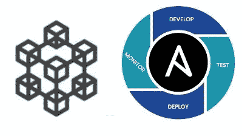

# Ansible 区块链开发者部署的最佳工具

> 原文：<https://medium.com/coinmonks/ansible-the-best-tool-for-blockchain-developers-to-deploy-dba9d2b9eb58?source=collection_archive---------3----------------------->

作为一名区块链开发人员，我的大部分工作是为初创公司做 MVP，为学术研究做 POC，或者为政府机构做内部系统。有人让我做真人制作网络，我就觉得有点紧张。如何处理部署？如何使其具有可扩展性？我应该创建多少个节点？处理区块链网络需要许多配置、文件和命令——这就是为什么我要介绍一个很棒的工具来管理您的区块链 DevOps 周期。



# 什么是 Ansible？

Ansible 是一个开源管理工具，用于使用`playbook`自动执行任务。playbook 是一个. yaml 文件，即使您不知道 YAML 文件的语法，您也可以用一种简单的方式将代码编写为块。例子

```
---
- name: Automate some tasks
  hosts: centos  
  become: yes
  tasks:
    - name: Create A New Directory
      file:        
        path: /opt/newDirectory         
        state: directory        
        owner: root        
        mode: "777"        
        recurse: yes
    - name: Copy File    
      copy:        
        src: ./run.py     
        dest: /opt/newDirectory/run.py       
        mode: a+x
```

就是这样！我不认为我需要解释它很容易阅读。您可以在任何正在运行的实例上部署此代码。我将它用于 amazon ec2 实例。此外，Ansible 有角色。角色是一组任务，用于完成诸如在部署的实例上安装 Java、配置一些指导节点(如 Prometheus 或 Grafana)之类的任务。您可以在这里找到要使用的角色列表[。Ansible 可以用于您的区块链的 CI/CD，因为我们没有太多用于区块链的工具。如果自动执行智能合约迁移/部署任务，您可以节省这样的时间。对于修改区块链网络也是如此，比如添加新的对等点、新的节点等等](https://galaxy.ansible.com/home)

# 可与区块链兼容

我第一次发现 Ansible 是用 IBM 区块链平台。我不得不使用 Ansible playbook 进行内部部署。通常，要部署 IBM 区块链平台，您需要创建 12 个 YAMLs 文件并修改它们。你可以在这里找到详细的手动安装[。然后，你定制你的区块链可能比开始使用 IBM 平台 GUI 构建你的网络要花一个多小时，这对我来说是一个枯燥的任务，要不停地点击和保存凭据。如果您不熟悉，在 hyperledger fabric 中设置默认网络(一个对等点、一个渠道、一个订单、一个组织)可能需要一个多小时。这里](https://cloud.ibm.com/docs/blockchain-sw-25?topic=blockchain-sw-25-deploy-ocp)可以找到详细步骤[。另一方面，ansible 只用一行命令行安装 IBM 平台。使用`playbook.yaml`(在这里](https://cloud.ibm.com/docs/blockchain?topic=blockchain-ibp-console-build-network)找到 Openshift 和 Kubernetes 的剧本文件[。)](https://ibm-blockchain.github.io/ansible-collection/tutorials/installing.html#installing-the-ibm-blockchain-platform)

```
**---**
- **name**: Deploy IBM Blockchain Platform custom resource definitions
  **hosts**: localhost
  **vars**:
    **state**: present
    **target**: k8s
    **arch**: amd64
    **namespace**: ibpinfra
    **image_registry_password**: <image_registry_password>
    **image_registry_email**: <image_registry_email>
    **wait_timeout**: 3600
  **roles**:
    - ibm.blockchain_platform.crds

- **name**: Deploy IBM Blockchain Platform console
  **hosts**: localhost
  **vars**:
    **state**: present
    **target**: k8s
    **arch**: amd64
    **namespace**: <namespace>
    **image_registry_password**: <image_registry_password>
    **image_registry_email**: <image_registry_email>
    **console_domain**: <console_domain>
    **console_email**: <console_email>
    **console_default_password**: <console_default_password>
    **wait_timeout**: 3600
  **roles**:
    - ibm.blockchain_platform.console
```

对于 Hyperledger 结构网络也是如此，您可以使用行动手册创建订购服务

```
---- name: Create components for an ordering organizationhosts: localhostvars:state: presentorganization_name: "{{ ordering_org_name }}"organization_msp_id: "{{ ordering_service_msp }}"vars_files:- common-vars.yml- ordering-org-vars.ymlroles:- ibm.blockchain_platform.ordering_organization
```

在此找到所有 hyperledger fabric 组件自动化[。这些脚本可以在 IBM 区块链平台中实现。您可以根据需要修改剧本，并保留您的自动化任务，以便在未来的项目中节省时间。在使用 hyperledger fabric 之前，我有一个使用 hyperledger besu 的项目。使用 IBFT2 进行生产部署是如此复杂，我不知道 ansible than。我写了一篇关于 IBFT2 生产部署的](https://github.com/IBM-Blockchain/ansible-collection/tree/master/tutorial)[文章](/coinmonks/setting-up-hyperledger-besu-on-amazon-web-services-using-ibft2-fa8d5f3a1aa3)。幸运的是，Hyperledger besu 有一个简单的方法来使用 ansible 进行生产部署。Hyperledger besu 是我最喜欢的区块链之一，因为他们使用权威共识算法的证明。用于生产的区块链网络需要两个启动节点和其他六个节点进行验证。详情可以从官方[文档](https://besu.hyperledger.org/en/stable/Tutorials/Private-Network/Create-IBFT-Network/)中阅读。所有的任务都可以使用 Ansible 自动完成。

要了解 Ansible 的更多信息，我推荐这些教程:

*   黑客服务器[教程](https://serversforhackers.com/c/an-ansible2-tutorial)
*   Ansible [路演](https://github.com/RedHatNordicsSA/ansible-roadshow)
*   负责官员[文件](https://github.com/RedHatNordicsSA/ansible-roadshow)
*   然后可以查看一些真实使用的场景[案例](https://docs.ansible.com/ansible/latest/scenario_guides/guides.html)。

Ansible 不是一个主要为区块链设计的工具。它用于自动化。总的来说，我们可以使用它来自动化我们工作中的任何复杂任务，而不是将它作为一个角色来共享，以使我们的生活更加轻松。

> 加入 Coinmonks [Telegram group](https://t.me/joinchat/EPmjKpNYwRMsBI4p) 学习加密交易和投资

## 另外，阅读

*   [学习以太坊和 Web3 开发](http://blog.coincodecap.com/go/learn)
*   最好的[加密交易机器人](/coinmonks/crypto-trading-bot-c2ffce8acb2a)