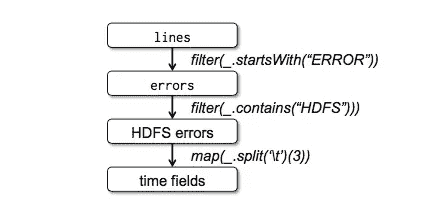

# Apache Spark 和 RDDs:ML 的分布式弹性内存抽象

> 原文：<https://medium.com/coinmonks/apache-spark-and-rdds-fault-tolerant-distributed-in-memory-data-processing-7e5a763d3236?source=collection_archive---------1----------------------->


## 介绍

如今，许多应用程序依赖于繁重的数据处理，并使用迭代算法，如梯度下降或运行交互式数据挖掘查询。这些技术广泛应用于机器学习、数据分析等领域。提供这种能力的流行框架之一是 Apache Spark。Spark 的基础构建块是一个容错的分布式内存抽象，称为 [RDDs](https://www.usenix.org/system/files/conference/nsdi12/nsdi12-final138.pdf) (弹性分布式数据集)。这种抽象和基于它构建的框架在 ML、数据挖掘算法方面比 Hadoop 等现有基础设施高出 20 倍。让我们在本帖中回顾这篇论文。

## 设计目标

有许多算法，如 K-means 聚类、基于梯度下降的回归，其中算法在同一数据集上迭代操作。这同样适用于交互式数据挖掘查询，在这种情况下，最终用户会对相同的数据子集持续运行不同的查询。过去发明的框架，如 MapReduce，使并行数据处理成为可能，但没有为这种数据重用提供有效的机制。在这些框架中执行数据重用的常见方式是将这些数据写入磁盘，然后重用它们。当处理大型数据集时，这可能有点昂贵。

RDD 的设计目标是:

1.  为分布式共享内存提供通用的高效抽象
2.  粗粒度的数据访问，即我们感兴趣的是优化和处理一批数据，而不是数据集中的特定键值对，就像在分布式数据库或分布式共享内存(DSM)系统中所做的那样。
3.  高效容错。这来自最后一颗子弹。在细粒度的 DSMs 中，容错是昂贵的，并且通过记录键值访问或通过复制大量数据来实现。对于大型数据集来说，这是非常低效的。
4.  控制数据分区，以实现高效的并行数据重用和局部性。

从上面可以看出，这些目标导致应用程序的解决方案可以从面向批处理的使用中受益——特别是批处理写入，不适合细粒度写入，如修改数据库中的单个值。

## RDD

Spark 实现这些目标的方式是提供一个叫做 RDD 的抽象。rdd 在较高层次上代表一批数据，可以通过跟踪其谱系来重新创建。RDD 是通过对输入数据进行某种解析，然后对该数据进行映射或过滤转换，从输入数据集创建的，这就形成了 RDD 的谱系。如果此 RDD 丢失，则可以通过对输入数据重新运行地图/过滤器转换来重新创建。因此，rdd 只能通过在磁盘数据上运行转换或通过转换其他 rdd 来创建。这些转变联系在一起，形成了任何给定 RDD 的谱系。关键点是:在失败后不能通过跟踪谱系图重新创建的 rdd，在这个系统中也根本不能被引用。此外，为了提高效率，用户可以控制如何将数据划分到不同的机器上。

**rdd 的编程接口:**程序员使用 Scala 中面向对象的接口来访问 rdd。他们可以使用地图、过滤、连接功能来创建 RDD 对象。然后，他们可以调用“操作”，如“计数”或“保存”，然后返回这些值。spark 中的所有 rdd 都是在执行一个动作时惰性填充的。程序员可以调用“persist”方法，将数据保存到 RAM 中，如果没有足够的 RAM，就将数据换出到磁盘中。此外，一些特定的数据可以优先考虑持久性。

## RDDs 和图形谱系

让我们看看一个简单的 spark 程序如何被转换成一个构建 RDD 谱系的图。本文中的以下示例从包含 hdfs 相关错误的所有行中返回第三个字段(时间戳)。

```
lines = spark.textFile(logfile)
errors = lines.filter(_.startsWith("ERROR"))
errors.persist()
errors.filter(_.contains("HDFS")).map(_.split("\t")(3)).collect()
```

这就是这个项目中 RDD 家族的形成过程:



time_fields RDD getting created from input log lines. Map and filter transformations along the way extract from the loglines and finally an action is taken to “collect” all the values into time_fields

当需要收集 time_field 值时，即延迟收集时，Spark 会将这些转换发送到节点，其中一些 rdd 可能已经缓存在内存中。现在，希望这能清楚地说明容错是如何工作的。如果与“错误”相关的 RDD 丢失，那么可以通过再次计算“行”上的滤波器变换来容易地恢复。此外，如果程序想要访问 time_fields，那么它可能不需要担心“错误”RDD 的失败，如果 HDFS 错误 RDD 仍然可用。

还要注意的一个关键点是，RDD 是不可变的，这使得恢复更容易—系统不需要担心维护操作日志，该日志跟踪 RDD 中的单个更改。

虽然 rdd 是不可变的，并且适合面向批处理的写操作，但是它们决不会妨碍更细粒度的高效读操作。人们总是可以使用 RDD 作为阅读的查找表。

## RDD 的主要组件

rdd 通常使用以下主要组件表示:

1.  *分区:*分区包含数据集的原子子集。
2.  *首选位置(分区):*对于优化而言，将分区放在特定位置(如节点)会更有效
3.  *依赖关系:*父 rdd 上的一组依赖关系。依赖关系有两种类型:窄依赖关系和宽依赖关系。窄依赖关系进行从父到子的一对一映射，例如在使用“映射”转换时。而广泛的依赖性是由诸如“连接”之类的转换产生的。这些表可能有一对多类型的依赖关系，因为两个表的连接可能导致更多的分区。
4.  *迭代器(分区，父依赖):*通过遍历父上的依赖返回分区的元素。
5.  *分区器:*对 RDD 进行分区的功能。

**RDD 创作的一些例子**

下面是 rdd 之间在经历某种转换时不同类型的依赖关系的一些例子。


Each blue box is an RDD enclosed in partitions represented by rectangles

## 集群上的 RDD 调度

在高层次上，当用户启动一个程序时，会创建一个驱动程序。驱动程序将启动工作线程，并为 RDD 使用的不同节点上的工作线程安排任务。


Workers reading data blocks and then creating RDDs that get persisted to memory.

更详细地讨论调度，当在 RDD 上调用“计数”或“收集”这样的动作时，调度就开始了。它为这个程序计算 rdd 的谱系图。然后，它尝试构建阶段，使每个阶段包含尽可能多的 rdd，这些 rdd 具有狭窄依赖性的流水线转换，以实现更好的协同定位。如果有任何广泛的依赖性，那么这意味着需要另一个阶段。然后，调度程序启动任务来计算每个阶段缺失的 RDD 分区。这一直持续到从给定阶段获得必需的 rdd。

我们来举个例子。如下图所示，蓝色和灰色填充的矩形是构成相应 rdd 的分区。灰色分区已经在 RAM 中，所以不需要重新创建。首先，所有狭窄的依赖关系被映射到阶段 1 到 3。要在 G，B 上执行操作，需要 RDD。但是 B 已经在 RAM 中，所以调度程序可以转到阶段 2。然后，它将计算缺失的分区，以得到 RDD f。E 中的一个分区已经可用，因此不需要创建它。一旦创建了 F，就会执行导致阶段 3 的宽依赖(连接)。


A scheduling that illustrates A-G RDDs with action to be run on RDD G

现在需要将任务映射到机器上。通常，如果任何节点对于给定的 RDD 具有可用的数据分区，则任务被发送到那里。如果对于给定的 RDD 有任何“优选位置”，那么任务被发送到那里。对于广泛的依赖性，调度程序尝试将 rdd 放在父 rdd 附近。详细的调度算法在这篇[论文](https://cs.stanford.edu/~matei/papers/2010/eurosys_delay_scheduling.pdf)中有所涉及。这种延迟调度算法高级目标是:

1.  使用[最小-最大公平调度](https://en.wikipedia.org/wiki/Max-min_fairness)维护来话任务的资源公平。这通常是关键问题，也是需要处理的问题——当一份新工作到来时，该怎么办？我们如何以及何时为其分配资源？如果集群被两个任务占据，每个任务使用 50%或资源，并且有一个新的任务进来，那么理想的情况是，这三个任务都应该得到 1/3 或资源。但是，既然任务已经在运行，我们应该终止任务还是等待它完成？像在内核调度器中一样，在大型分布式系统中，抢占是很昂贵的——节省状态不是小事。上面提到的论文更详细地描述了在有限的时间内等待工作完成(稍微放松一下公平性)是如何工作的，也有助于将任务放在包含数据的节点上。
2.  使用数据局部性，将任务放置在数据所在的位置，以实现高效的执行模式

显然，有些任务可能无法运行，或者可能因为早期的失败而被阻止。在这种情况下，问题会回到为谱系中失败的 rdd 重新提交任务。

## 检查点

正如我们之前提到的，rdd 是不可变的，并且它们可以从谱系图中恢复。在一些使用 RDD 范式的例子中，谱系图可以增长很多。考虑一个像 PageRank 这样的迭代例子。在 PageRank 中，在每次迭代中，都会对输入文件进行解析，以从中获取链接。然后，它向其链接的文档发送稿件。然后根据收到的稿件计算每份文件的排名。这就是 PageRank 算法的谱系图在 Spark 中的样子:


Page Rank’s graph lineage grows with every iteration as RDDs are immutable and new ranks, contribs RDDs get created

对于这种情况，检查一些特定的 RDD 以加快恢复速度可能会有所帮助。对于具有琐碎谱系图的应用程序，检查点是不必要的。由于 rdd 的不变性，检查点实现更容易——在后台编写。在进行检查点操作时，人们不需要担心 rdd 的锁定和更改。潜在地，调度程序也可以基于它所拥有的关于 RDD 计算的知识来进行检查点操作。

## rdd 和使用它表达现有范例

让我们看看 RDD 有多普遍，它如何表达一些现有的范式。

**MapReduce:** Flatmap 和 group/by-key reduce 可以表达这一范式

[**DyradLINQ**](https://www.microsoft.com/en-us/research/project/dryadlinq/)**:**我以前对这个框架没有太多的了解。但是它允许人们使用 SQL 来表达对跨多个集群的大型数据集的查询。它主要支持对可以用 rdd 表示的大数据进行批量操作。

**Pregel:** Pregel 对于基于图形的算法很有用，比如 PageRank 和最短路径。在每一步中，Pregel 将相同的函数应用于由 pregel 图中的顶点表示的数据。所以每个顶点数据可以用 rdd 来表示，然后函数可以被映射到变换。

**迭代 MapReduce:** 这些应用程序对相同的数据运行多次 map-reduce 迭代。这非常符合 RDD 模式。Spark 作者能够用 200 行代码实现 HaLoop。

**批量流处理:**许多应用使用最近几分钟的状态来更新模型的当前状态，例如使用最近窗口的点击流数据来进行实时广告决策。这些系统对相同的数据进行转换，然后将其存储在磁盘上。他们可以通过将这些中间结果存储在 RDD 中，使用 RDD 模型进行更快的处理。

## 结论

虽然 rdd 看起来因为不变性和批量操作依赖性而受到根本限制，但这些是在数据繁重的并行集群计算系统中使用的基本原语。所以 rdd 非常适合这一点。内存中的计算对于加速来说是显而易见的，但是基于图谱系的方法有助于容错机制，这对于严重依赖内存操作的系统来说是必需的。

> [直接在您的收件箱中获得最佳软件交易](https://coincodecap.com/?utm_source=coinmonks)

[](https://coincodecap.com/?utm_source=coinmonks)