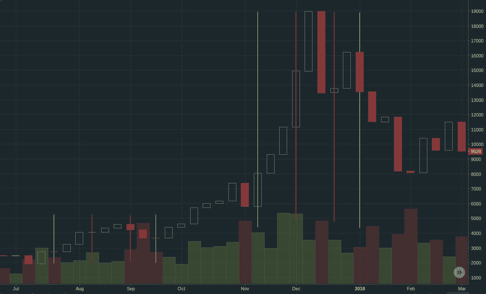
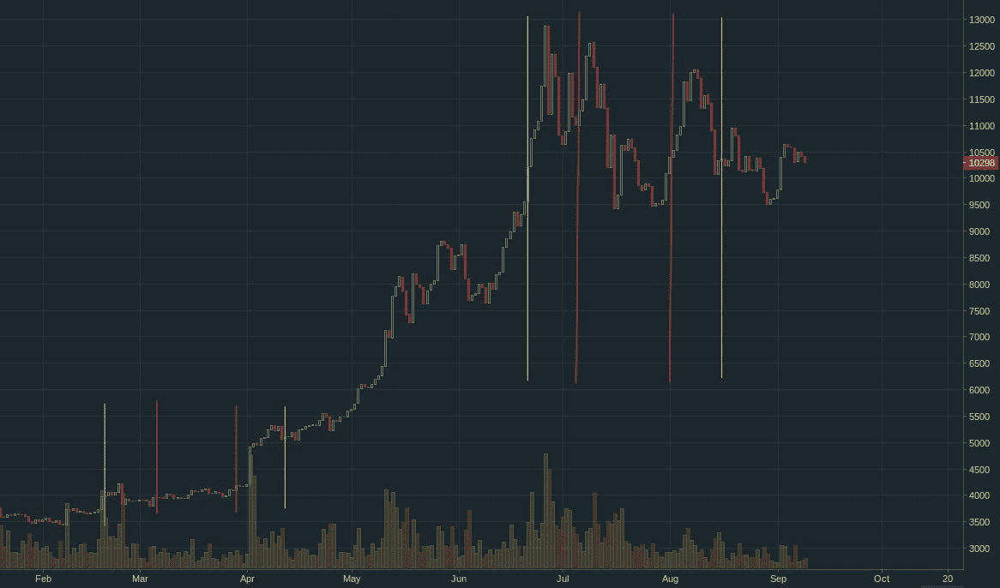
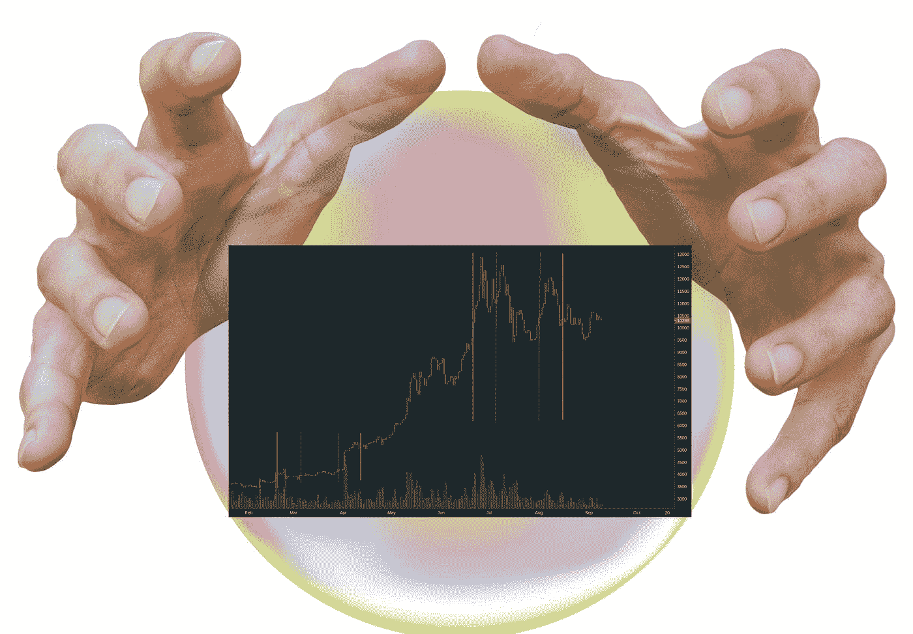

# 水星逆行——将占星术应用于加密货币交易

> 原文：<https://medium.com/coinmonks/applying-astrology-into-cryptocurrency-trading-mercury-retrograde-8d896235d29e?source=collection_archive---------0----------------------->

## 介绍

*要求:如果* ***占星*** *一词引发强烈判断，请暂停，直到你完整阅读文章。*

这篇文章混合了天文学、占星术、技术分析师和加密货币图表的基本面分析。简而言之，天文学研究行星、恒星和星系的运动。占星术研究行星和星座对我们人类的影响。技术分析着眼于股票或加密硬币的价格变动。基本面分析监督与股票或加密硬币相关的资产、业务或项目的新闻和实质。

本文研究了占星学中已知的事件“水星逆行”与一种特定加密货币比特币对美元的定价和交易量之间的时间相关性。

这只是一个巧合，还是在加密货币的交易方式中存在天体运动的实际影响，这取决于你——读者。

## 什么是「水星逆行」？

水星围绕太阳每 87.9 个地球日自转一周，地球和水星围绕太阳向同一个方向运动。然而，由于水星绕太阳的速度比地球快，从我们地球的角度来看，水星可能会减速，然后向后移动，然后加速。

在占星术中，感知到的减速/倒退/加速运动的时间被标记为“水星逆行”。地球围绕太阳旋转一周(一个地球年)，这一事件大约发生 3 次。

完整的逆行期大约为 8 周，包括大约 2 周的“前阴影”阶段、大约 4 周的“逆行”阶段和大约 2 周的“后阴影”阶段。

根据古罗马神话，墨丘利不仅是财神和幸运之神，也是诡计和盗贼之神。

在占星学中，水星逆行阶段以不注意细节、错误的假设以及沟通错误而闻名。其中大多数是由一个人在“前阴影”阶段发起的，在“逆行”阶段进行并完成，然后这个人在“后阴影”阶段承担后果。

我听到的一个介绍说，行星重组不是行动的好时机，而是用“重组”做大多数事情的好时机，比如反思、重新思考、重新评估等等。

## 2017 年水星在星盘上逆行

2017 年对于加密货币交易来说非常重要，因为在今年下半年，几乎所有的加密货币都达到了有史以来的最高估值。

请注意 2017 年**BTC-美元**对的图表，其中上半部分显示价格运动，绿色蜡烛表示价格上涨，红色蜡烛表示价格下跌，下半部分显示成交量运动，绿色棒线表示买入主导，红色棒线表示卖出主导。

图表还有如下附加标记——阴影前时期(黄线到红线)、“逆行”时期(红线之间)和“阴影后”时期(红线到黄线)。

**— —前影— —逆行— —后影..2017..** [大视野](https://arstech.biz/img/hackernoon/retrogr-17.jpg)

*   7 月 24 日—8 月 12 日…8 月 13 日—9 月 5 日…..9 月 6 日至 9 月 19 日
*   11 月 15 日至 12 月 1 日....12 月 2 日至 12 月 23 日……12 月 24 日至 1 月 10 日

如图所示，图表显示，在两个事件中，价格在影子前和影子中持续上升，在影子后或影子后下降。

## 2019 水星在一张图上逆行

2019 年对于加密货币交易来说意义重大，因为 2018 年和 2019 年初发生的“加密冬天”结束并退出。

**— —前影————逆行————后影……2019……**[大图](https://arstech.biz/img/hackernoon/retrogr-19.jpg)

*   2 月 19 日—3 月 5 日…..3 月 6 日—3 月 28 日…..3 月 29 日至 4 月 16 日
*   6 月 20 日—7 月 7 日……7 月 8 日—8 月 1 日……..8 月 2 日至 8 月 15 日
*   10 月 11 日—10 月 30 日…..10 月 31 日至 11 月 20 日…11 月 21 日—12 月 7 日(即将到来)

第一个事件——2019 年 2 月至 3 月的前影子事件之前，价格长期保持不变，几乎没有上下波动。在事件开始时和后影子事件期间，在后影子事件结束时有 2 次显著的价格上涨和一次小的下跌。

此外，图表上的第二个事件显示，在影子之前和期间，价格持续上涨，在影子之后或之后，价格下跌，类似于 2017 年的逆行事件。

下一次也是即将到来的水星逆行事件是——2019 年 10 月 11 日至 12 月 7 日。你对逆行之前/期间/之后加密货币的价格走势有何预测？

## 还有哪些占星上的重大事件？

水星逆行是第二个最常见的占星重要事件。最频繁发生的占星重要事件是月相——新月到满月。金星逆行事件持续大约 40 天，每 18 个月发生一次。

太阳系中的其他行星——火星、木星、天王星、海王星——比地球离太阳更远。随着这些行星的移动，它们有时会离地球更近或更远——用地球和特定行星之间的直线来衡量。根据占星术，在这段时间里，行星对人们产生了特殊而独特的影响。

过去，金融市场上的大多数交易都是由专业交易员完成的。很有可能这些交易者中的一部分确实选择了在他们的日常交易中寻找和使用关于占星重要事件的信息。

随着加密货币的出现，创造了一个新的加密交易市场，其中大多数交易者是首次或小规模的非专业交易者。

这篇文章和即将发表的“占星学”相关文章揭示并带来了普通密码交易者手中的秘密或模糊的交易决策工具。

## 参考

[太阳系](https://en.wikipedia.org/wiki/Solar_System)

[水星](https://en.wikipedia.org/wiki/Mercury_(planet))

[水星神话](https://en.wikipedia.org/wiki/Mercury_(mythology))

> [直接在您的收件箱中获得最佳软件交易](https://coincodecap.com/?utm_source=coinmonks)

