# 对比特币的历史数据应用线性回归

> 原文：<https://medium.com/coinmonks/applying-linear-regression-on-bitcoins-historical-data-94d986010283?source=collection_archive---------5----------------------->

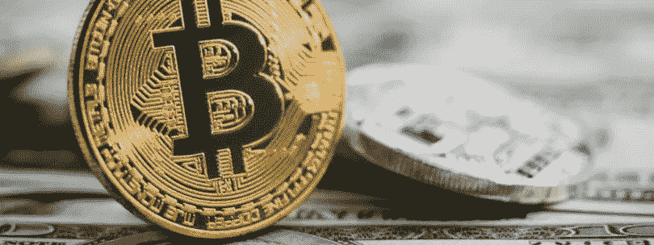

嗨伙计们！在这篇文章中，我将与你分享我在通往人工智能的道路上的另一次学习经历:我如何使用线性回归模型，试图根据比特币的历史数据预测其价格。

你认为可能吗？让我们在文章中看到。

# **一般方法**

首先，我正在使用一个过程(一组问题),这是一种解决机器学习问题的“通用方法”,我在 codecademy 的课程“用 Python 构建机器学习模型”中学到了这一点。事情是这样的:

*   **我们想回答什么？**根据比特币的历史数据预测其明天的价格。
*   **有哪些相关数据可以帮助我们回答这个问题？**雅虎财经提供的 BTC 历史数据，如开盘价、收盘价、成交量等。计划是利用这些数据来预测比特币第二天的价值。
*   **可以做哪些数据清洗和特征工程？**去除空值，特征归一化，可能添加二次特征。
*   **哪个模型最符合问题？我将使用线性回归模型，因为它是我的研究对象。**
*   **我们的成功标准是什么？我们是在寻找准确性吗？精度？多少钱？我还不知道..😎我想我将使用平均绝对误差来评估模型的预测，任何低于 100 美元的平均值都将被视为成功。**
*   **使用模型并展示结果。**好了，我们来编码吧！

# 项目存储库

你可以在[https://github.com/marciojmo/stock-price-predictor.git](https://github.com/marciojmo/stock-price-predictor.git)检查项目

# 入门指南

好的，我做的第一件事是从雅虎财经获取数据。我已经使用了 **pandas_datareader** 库直接从互联网上获取数据(太酷了)，我们也可以改变股票代码并获取任何我们想要的股票数据。之后，我使用了熊猫数据框*。head()* 把我们得到的东西形象化的方法。

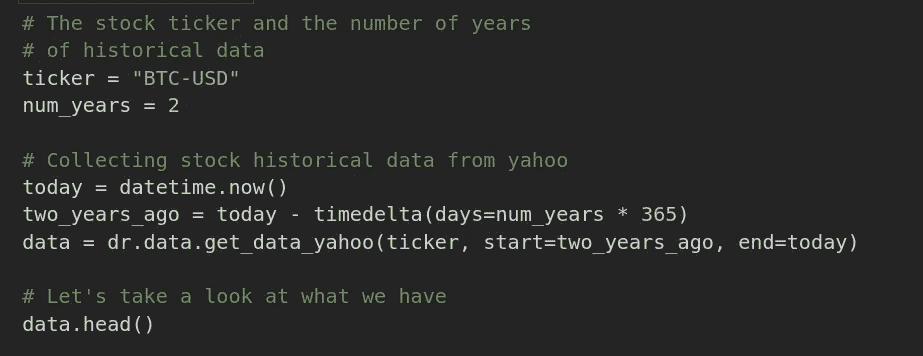

Grabbing data from yahoo finance using pandas_datareader library.

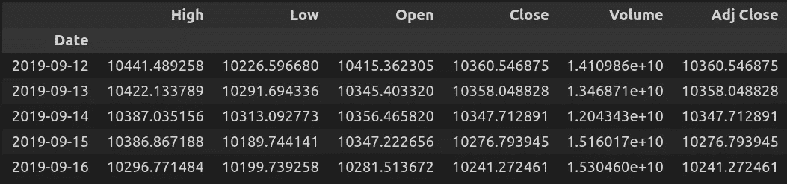

Taking a look at the data we got.

# 目标

因为我的目标只是用这些数据来预测比特币的明天价格，所以我添加了一个名为“预测”的新列，它是“收盘”列的副本，上移了一个位置。这样，数据集中的每一行都将有一系列特征(包括收盘价)映射到比特币第二天的收盘价。

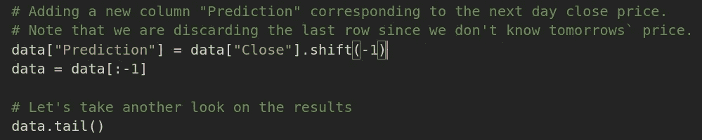

Adding a new column to the data (Prediction)

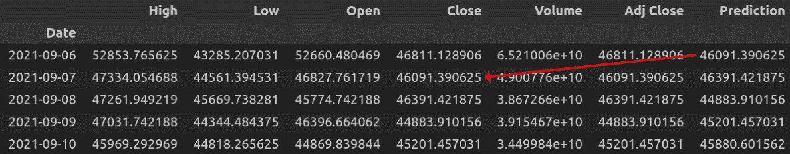

Prediction value added. Note that it matches the Close price of the next day.

# 数据可视化

一切都准备好了，是时候绘制一些相对于预测价格的值了，看看它们是否有某种线性关系(视觉上)。我使用了一个 for 循环来迭代所有自变量，并根据预测值(本例中为因变量)绘制它们。

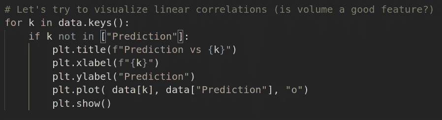

Plotting all independent variables against the dependent variable

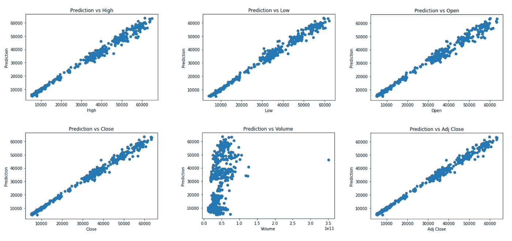

Visualizing data relationships

# 清理和规范化特征

在可视化数据后，我决定将体积列从等式中去掉，因为它似乎没有提供与预测价格的良好线性关系。

我还使用 dataframe *isin()* 函数移除了空值，并使用 scikit 预处理模块中的 *MixMaxScaler* 对独立变量进行了规范化。

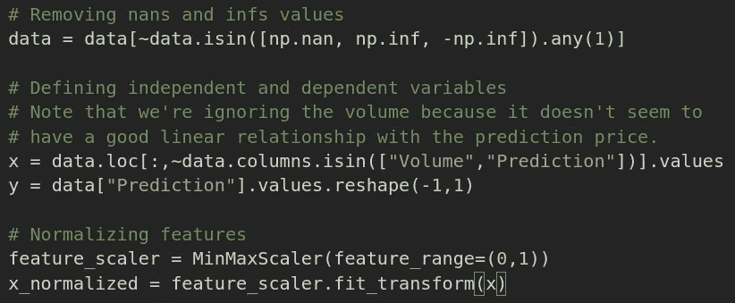

Cleaning and normalizing features: removing nans and infs and scaling.

# 培训和测试

有了我们的 x 和 y 的集合，是时候根据数据训练和测试我们的模型了。

我使用 scikit model_selection 模块中的 *train_test_split()* 函数将数据集分成训练(70%)和测试(30%)。然后我从 scikit linear_model 模块创建了一个 *LinearRegression* 模型，并使用 *fit()* 方法在训练集上训练该模型。

之后，我根据测试数据测试了模型，并使用 scikit metrics 模块中的 *r2_score()* 和 *mean_absolute_error()* 函数来评估模型的性能。

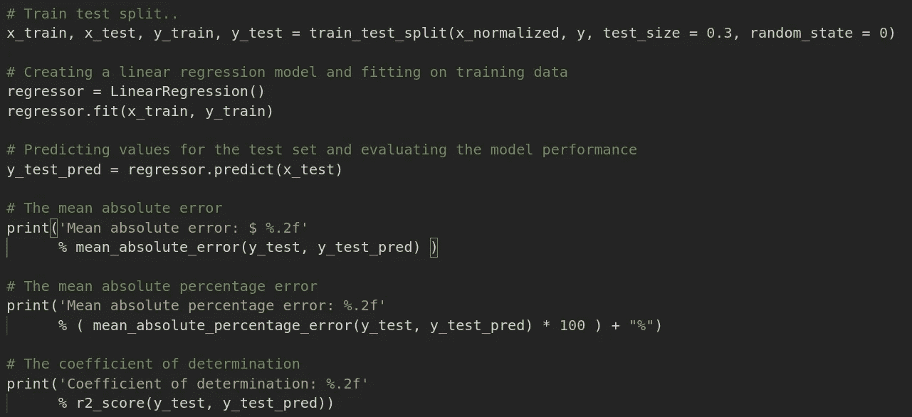

Training and testing the Linear Regression model.

```
Mean absolute error: $ 632.79
Mean absolute percentage error: 2.53%
Coefficient of determination: 1.00
```

# 结果

如上图，模型错过了明天的预测价格，平均绝对误差为 632.79 美元(2.53%)。我真的不知道为什么在这种情况下*决定系数*是 1，我会让统计人员帮我解释。

我还对最后一个数据行运行了模型，以预测明天的价格，下面是我们得到的结果:

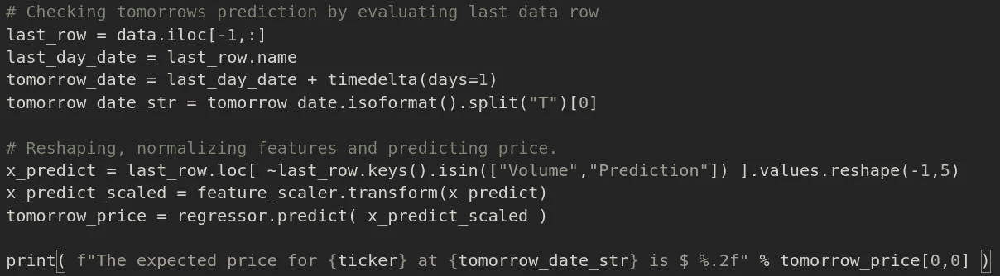

Predicting BTC-USD tomorrows price

```
The expected price for BTC-USD at 2021-09-11 is $ 45074.05
```

让我们来看看雅虎财经网站..

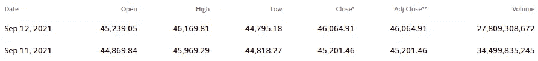

BTC-USD data from Yahoo finance

很接近了，嗯？你会把钱押在这个算法上吗？我不会。哈哈。最好继续学习。再见！

> 加入 Coinmonks [电报频道](https://t.me/coincodecap)和 [Youtube 频道](https://www.youtube.com/channel/UCbyDhTbOiKh2iUMKBi4-4Zg)了解加密交易和投资

## 另外，阅读

*   [尤霍德勒 vs 考尼洛 vs 霍德诺特](/coinmonks/youhodler-vs-coinloan-vs-hodlnaut-b1050acde55a) | [Cryptohopper vs 哈斯博特](https://blog.coincodecap.com/cryptohopper-vs-haasbot)
*   [币安 vs 北海巨妖](https://blog.coincodecap.com/binance-vs-kraken) | [美元成本平均交易机器人](https://blog.coincodecap.com/pionex-dca-bot)
*   [如何在印度购买比特币？](/coinmonks/buy-bitcoin-in-india-feb50ddfef94) | [WazirX 评论](/coinmonks/wazirx-review-5c811b074f5b) | [BitMEX 评论](https://blog.coincodecap.com/bitmex-review)
*   [比特币主根](https://blog.coincodecap.com/bitcoin-taproot) | [Bitso 回顾](https://blog.coincodecap.com/bitso-review) | [排名前 6 的比特币信用卡](/coinmonks/bitcoin-credit-card-bc8ab6f377c6)
*   [双子座 vs 比特币基地](https://blog.coincodecap.com/gemini-vs-coinbase) | [比特币基地 vs 北海巨妖](https://blog.coincodecap.com/kraken-vs-coinbase) | [CoinJar vs CoinSpot](https://blog.coincodecap.com/coinspot-vs-coinjar)
*   [印度加密交易所](/coinmonks/bitcoin-exchange-in-india-7f1fe79715c9) | [比特币储蓄账户](/coinmonks/bitcoin-savings-account-e65b13f92451) | [Paxful 审核](/coinmonks/paxful-review-4daf2354ab70)
*   [杠杆令牌](/coinmonks/leveraged-token-3f5257808b22) | [最佳加密交易所](/coinmonks/crypto-exchange-dd2f9d6f3769) | [AscendEX 评论](/coinmonks/ascendex-review-53e829cf75fa)
*   [Godex.io 审核](/coinmonks/godex-io-review-7366086519fb) | [邀请审核](/coinmonks/invity-review-70f3030c0502) | [BitForex 审核](https://blog.coincodecap.com/bitforex-review) | [HitBTC 审核](/coinmonks/hitbtc-review-c5143c5d53c2)
*   [Crypto.com 费用](/coinmonks/binance-fees-8588ec17965) | [僵尸加密审查](/coinmonks/botcrypto-review-2021-build-your-own-trading-bot-coincodecap-6b8332d736c7) | [替代品](https://blog.coincodecap.com/crypto-com-alternatives)
*   [有哪些交易信号？](https://blog.coincodecap.com/trading-signal) | [Bitstamp vs 比特币基地](https://blog.coincodecap.com/bitstamp-coinbase) | [买索拉纳](https://blog.coincodecap.com/buy-solana)
*   [ProfitFarmers 点评](https://blog.coincodecap.com/profitfarmers-review) | [如何使用 Cornix Trading Bot](https://blog.coincodecap.com/cornix-trading-bot)
*   [MXC 交易所评论](/coinmonks/mxc-exchange-review-3af0ec1cba8c) | [Pionex vs 币安](https://blog.coincodecap.com/pionex-vs-binance) | [Pionex 套利机器人](https://blog.coincodecap.com/pionex-arbitrage-bot)
*   [我的密码交易经验](/coinmonks/my-experience-with-crypto-copy-trading-d6feb2ce3ac5) | [比特币基地评论](/coinmonks/coinbase-review-6ef4e0f56064)
*   [CoinFLEX 评论](https://blog.coincodecap.com/coinflex-review) | [AEX 交易所评论](https://blog.coincodecap.com/aex-exchange-review) | [UPbit 评论](https://blog.coincodecap.com/upbit-review)
*   [AscendEx 保证金交易](https://blog.coincodecap.com/ascendex-margin-trading) | [Bitfinex 赌注](https://blog.coincodecap.com/bitfinex-staking) | [bitFlyer 点评](https://blog.coincodecap.com/bitflyer-review)
*   [麻雀交换评论](https://blog.coincodecap.com/sparrow-exchange-review) | [纳什交换评论](https://blog.coincodecap.com/nash-exchange-review)
*   [加密货币储蓄账户](/coinmonks/cryptocurrency-savings-accounts-be3bc0feffbf) | [赌注加密](https://blog.coincodecap.com/staking-crypto) | [加密交易机器人](https://blog.coincodecap.com/best-crypto-trading-bots)
*   [BigONE 交易所评论](/coinmonks/bigone-exchange-review-64705d85a1d4) | [CEX。IO 审查](https://blog.coincodecap.com/cex-io-review) | [交换区审查](/coinmonks/swapzone-review-crypto-exchange-data-aggregator-e0ad78e55ed7)
*   [最佳比特币保证金交易](/coinmonks/bitcoin-margin-trading-exchange-bcbfcbf7b8e3) | [比特币保证金交易](https://blog.coincodecap.com/bityard-margin-trading)
*   [加密保证金交易交易所](/coinmonks/crypto-margin-trading-exchanges-428b1f7ad108) | [赚取比特币](/coinmonks/earn-bitcoin-6e8bd3c592d9) | [Mudrex 投资](https://blog.coincodecap.com/mudrex-invest-review-the-best-way-to-invest-in-crypto)
*   [WazirX vs coin dcx vs bit bns](/coinmonks/wazirx-vs-coindcx-vs-bitbns-149f4f19a2f1)|[block fi vs coin loan vs Nexo](/coinmonks/blockfi-vs-coinloan-vs-nexo-cb624635230d)