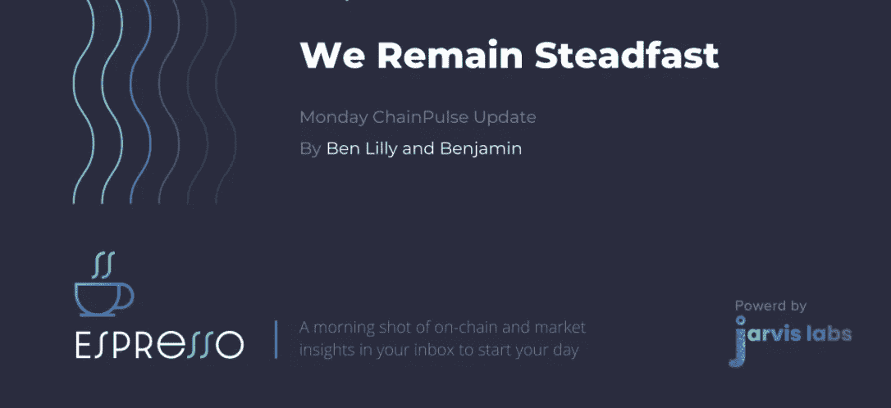
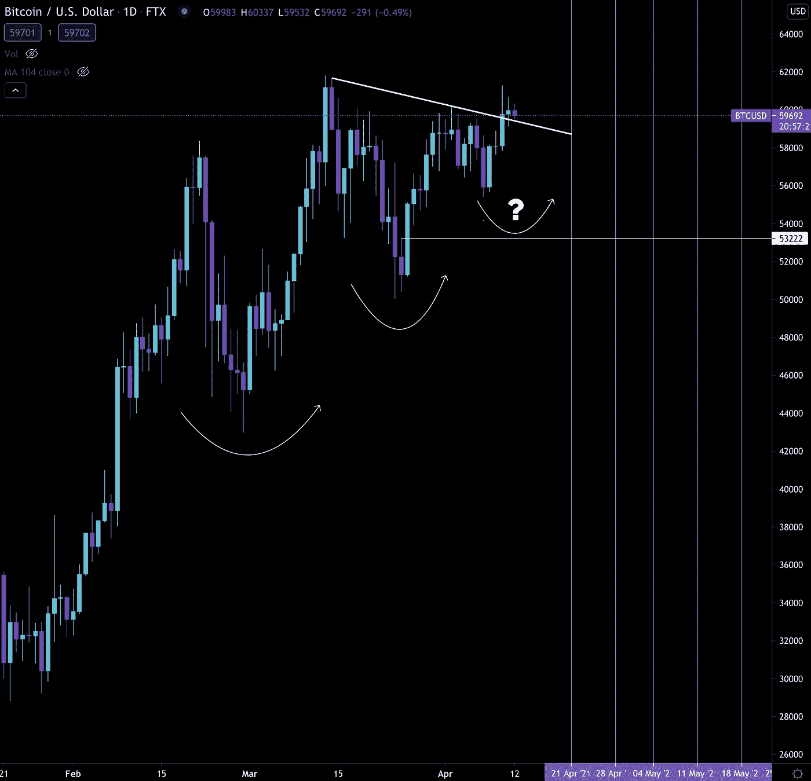
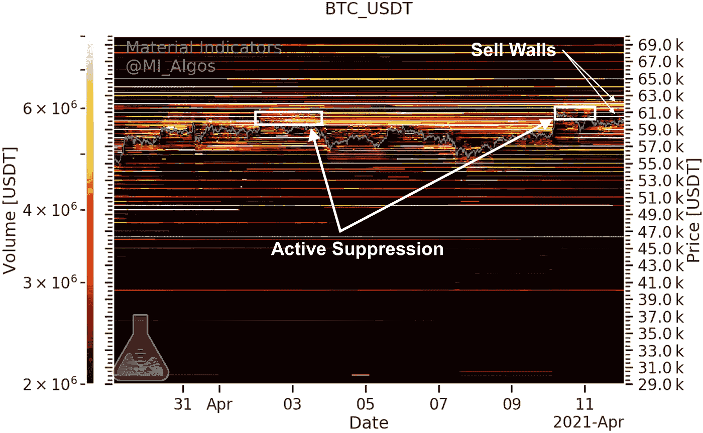
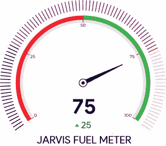
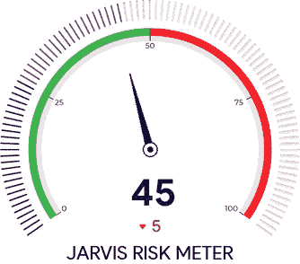
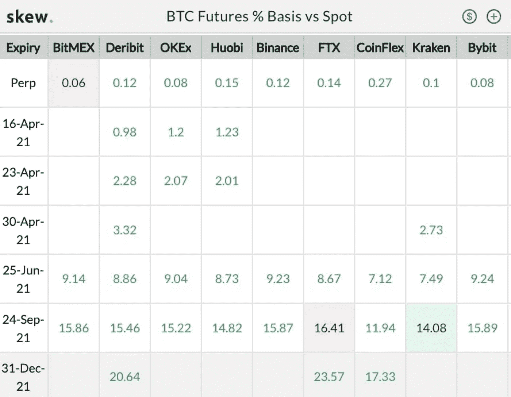
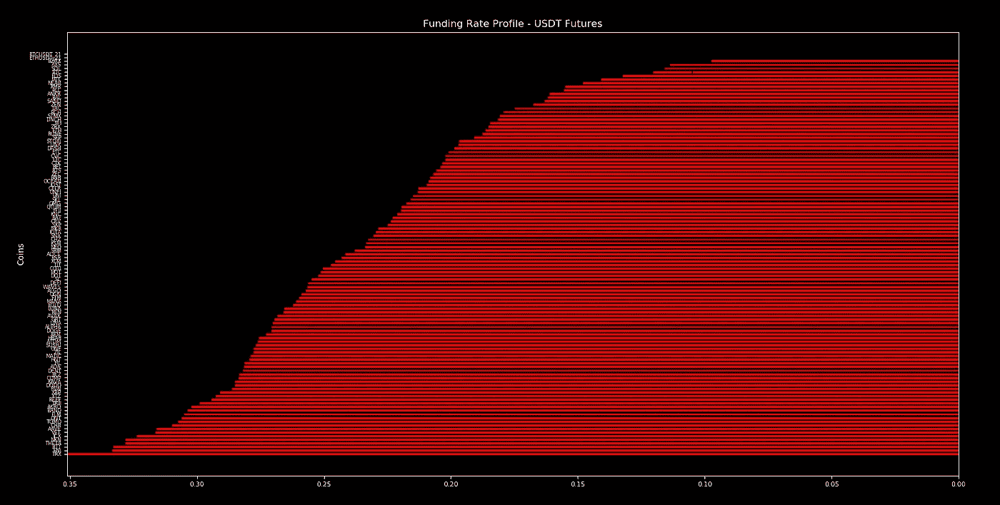
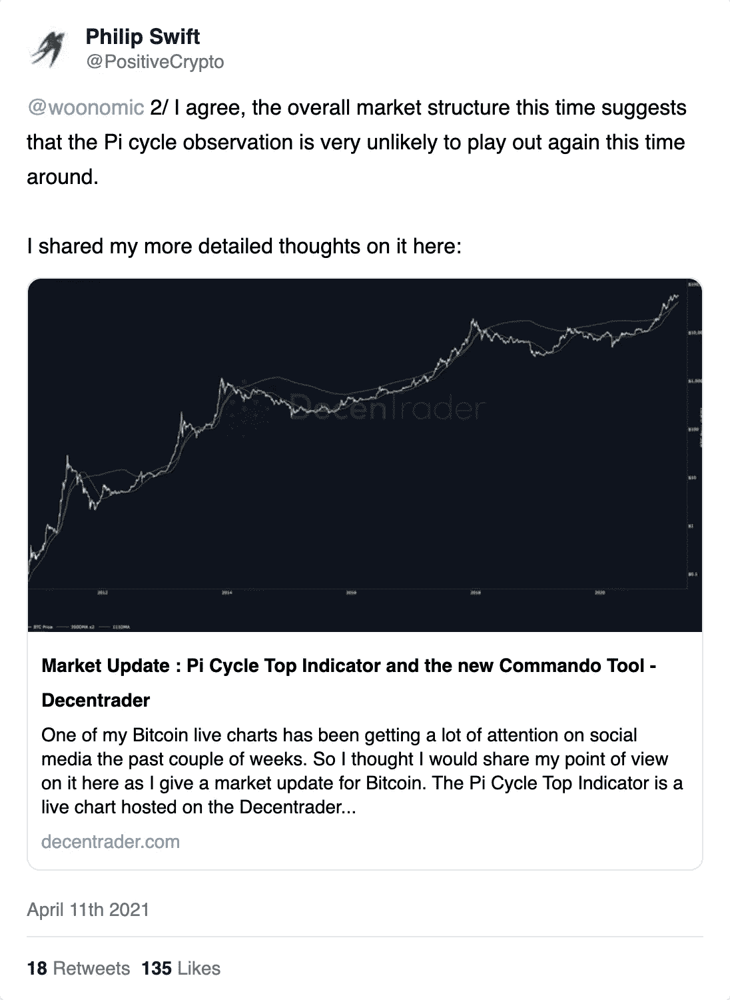

# 长期整合:4 月 12 日市场更新

> 原文：<https://medium.com/coinmonks/april-12-market-update-ac22b5aa1bb5?source=collection_archive---------9----------------------->

## 我们仍然坚定不移:周一链脉冲更新

长期巩固。它带来了无聊，随之而来的是……熊。

当我们继续横向移动时，看跌图开始出现。我甚至目睹一些受欢迎的分析师开始看跌。

这正是你想看到的。

随着盘整阶段接近尾声，许多看涨的交易者开始看跌。FOMO 被清除出市场。衍生品开始对微妙的市场波动越来越不敏感。

这就是市场能够让人们大吃一惊的原因。

我们必须承认。我们也不能幸免于这种现象。当有太多的时间去思考时，我们——就像其他人一样——会开始怀疑我们认为正确的事情。

但是我们没有犹豫，而是回到工具箱，决定我们的前提是否仍然成立。这就是我们周末所做的。周三我们将解释为什么我们持续看涨的前提依然存在。

现在，我们将简单地提到，在未来几周内，很有可能欣快回归。融资利率会高到足以让你考虑向高利贷借钱，而不是交易所。由于波动性上升，期权价格将会翻倍。

有很多值得兴奋的事情。

今天，我们将重点关注 ChainPulse 更新…

在过去的几天里大约有 50，000 BTC 被买走了。大约是 30 亿美元。这些举动背后的实体并不小。

虽然许多关注这类动向的人都期待着类似于 MicroStrategy 或特斯拉宣布购买比特币的方式的重大公告，但我们需要认识到，发布公告的时机就是一切。

一旦比特币开始攀升，我们可能会看到一些玩家出来透露之前的购买情况。

这是因为如果比特币价格上涨，可以给他们的股票带来积极的关注。当资产横向交易或在一些人质疑的市场顶部价格区间交易时，公司宣布购买比特币没有什么好处。

虽然没有任何重大消息宣布，但毫无疑问，主要买家正在攻击每一次下跌。这是我们看到一系列更高低点的部分原因..

注意:我们已经几周没有调整弯曲的白线了。我们把它们留在那里是为了帮助在所用的图表上创造每周的一致性。第三个更高的低点看起来已经发生了——比我们预期的要快一点。

就我们而言，价格跌破 54，000 美元(准确地说是 53，450 美元)——我们认为这是一个重要的价格点——的机会变得非常低。

同样，我们计划在周三深入探讨这个问题。

目前，我们的价格再次测试历史高点。为了了解订单簿的情况，让我们快速浏览一下材料指标图表。

在下面的图表中，我指出了当前的卖出墙。它们不像以前那么厚了。

更重要的是，账面上的主动打压不见了。我知道在这张图片上很难看到，但是这些小散列是非常短暂的。这些弹出然后开始上下移动订单簿，在某种程度上真的可以是另一层抑制。

我们现在还没有看到。这是 BTC 攻击剩余销售墙的好迹象。

就比特币拥有另一种燃料而言，我们的燃料表位于 75。有足够的弹药来打破墙壁。

风险是相当中性的，因为它位于 45。

另一方面，期货变得有点疯狂。截屏时，12 月期货交易价格比现货价格高 17-23%。

市场开始为比特币下一阶段的上涨定价。正如我们在周五发现的那样，波动性仍然相对较低，就利用杠杆而言，期权仍然是一个更好的押注。这和期货是对立的。坦率地说，如果我们突破这个交易区间向上走，我们预计未来几个月都不会平静。

这是我们期待在周三触及的另一个话题…在融资利率持续高企的情况下，市场会有怎样的表现？你会怎么做？

现在，让我们开始适应更高的融资利率，并假设它们在未来几个月是一个均值回归信号。

作为起点，这里是融资利率的概况。

总结一下今天的问题…

比特币正在创造一系列更高的低点。大量的积累正在发生。燃料和风险看起来有利于更高的高点。订单簿显示出对比特币价格的压制不那么积极了。如果你已经跟踪了一段时间，你会知道连锁效应和灰度效应都在大脑中描绘乐观偏见。

我们仍然坚定地认为，比特币目前的市场结构将在未来几周内达到更高的高点。

你的脉搏在加密。

本·莉莉

[立即订阅每日更新](https://email.mg1.substack.com/c/eJxVUdtuGyEQ_ZrlLStuZs0DD5Gi_saKgbFDy7IWDEm3X19sR6kqoZGYOaNzmeAJr3s93G1vxO5lpeOGruBny0iElfWGdU3RSWOtOFvJouOLDAuw1NZLRdx8yo7dOuQUPKW9PNCLVaeFvbsFjOYA3EsrTuEiL0KDsAgKvAK16Cep7zFhCejwA-uxF2TZvRPd2qReJ_ljvJ--fqSWPbS5dWjkw6857NuY3L-hJsBJDaDptK0bxtS3Sb09xH01295rGKC374WXzxSvSF_zsBfCQgOgTlwZM6wmJ7kUXItROBdqFjMARiu51qARrBFCca5OZ6Wt4YDBTJpvV_GfRlYdYJlzyvkY46eTl4eV38efe3KDe9t6SXSsWDxkjI5qR0bPuzxcrFcsWMe94urJCSPOUgpjFivEM8OR-rfwQR_3sVXcv9z-AvbMpRM)

注:我们在上周周三的问题上就 Pi 指标进行了卓有成效的讨论。这些评论是对我们团队的回应，尽管该指标即将发出市场可能见顶的警告信号，但我们的团队基本上将该指标搁置一边。

我(本)的分析是，这一次这一指标将不再有效。我选择的证明方式有点走捷径，我为此道歉。我想我可以用几个句子来证明我的观点，而不是一整篇文章。

虽然我的观点没有改变，但我使用的分析本可以更好。

不管怎样，有趣的是创作者本人(菲利普·斯威夫特)周五在他的时事通讯中发表了这篇文章，

> “我目前对比特币的近期市场前景是中性看涨，因此我个人认为，当 Pi 周期指标移动平均线在几天后交叉时，这很可能不是比特币的市场周期顶部。”

昨天他又在推特上说:

我们的推理相当相似。但更重要的是，我认为我们都应该给予菲利普足够的尊重，因为这一次提到他的创造可能不成立。这不是一件容易的事。

想知道 Jarvis AI 能为你做什么？贾维斯实验室为零售、家族理财室和对冲基金提供解决方案。我们甚至与 DeFi 项目合作。

如有任何问题，请访问[网站 www.jarvis-labs.xyz](http://www.jarvis-labs.xyz/) 并点击右下角的聊天图标提问。或者发邮件到 [askus@jarvis-labs.xyz](mailto:askus@jarvis-labs.xyz) 给我们。

如果你想知道更多关于贾维斯人工智能的价格，请使用下面的电报链接。

[订阅选项](https://email.mg1.substack.com/c/eJwlkEtuxCAMQE8z7BrZkJBhwaKbXgPx8UxpCYmATJuevsxEsuyFP09-3ja6r-XQ21obeybTjo10pp-aqDUqbK9UTAyaS6XwqjgLGmbuZ8diNbdCtNiYNNt2l6K3La75NT0rMc3sU-PshAqcTyinK0i4OQkTSMHHcHPgpxNq9xApe9L0oHKsmVjSn61t9SLeL_yjRxsW6uXLlkfn2mjq7oxbG4uaA0cYsScAFAMOzlFQHMbRjeSURBQAYrqKUUlw5OVlhOWOQ79Qm_Xfg18XVrSjPKSY0tHbJ-YtWVeH3-Pv-Z3pU8ueYzsMZesSBd3KTqyd7l4azJ0yle40GNs0SrxyjlLOCvH8s5sREwgpu8eOD2vfyvqkPWH_a1KEVA)

> 加入 Coinmonks [Telegram group](https://t.me/joinchat/Trz8jaxd6xEsBI4p) 并了解加密交易和投资

## 另外，阅读

*   [什么是融资融券交易](https://blog.coincodecap.com/margin-trading)
*   最好的[密码交易机器人](/coinmonks/crypto-trading-bot-c2ffce8acb2a) | [网格交易](https://blog.coincodecap.com/grid-trading)
*   [3 商业评论](/coinmonks/3commas-review-an-excellent-crypto-trading-bot-2020-1313a58bec92) | [Pionex 评论](/coinmonks/pionex-review-exchange-with-crypto-trading-bot-1e459d0191ea) | [Coinrule 评论](/coinmonks/coinrule-review-2021-a-beginner-friendly-crypto-trading-bot-daf0504848ba)
*   [AAX 交易所评论](/coinmonks/aax-exchange-review-2021-67c5ea09330c) | [德里比特评论](/coinmonks/deribit-review-options-fees-apis-and-testnet-2ca16c4bbdb2) | [FTX 交易所评论](/coinmonks/ftx-crypto-exchange-review-53664ac1198f)
*   [n 零复习](/coinmonks/ngrave-zero-review-c465cf8307fc) | [Phemex 复习](/coinmonks/phemex-review-4cfba0b49e28) | [PrimeXBT 复习](/coinmonks/primexbt-review-88e0815be858)
*   [Bybit Exchange 审查](/coinmonks/bybit-exchange-review-dbd570019b71) | [Bityard 审查](/coinmonks/bityard-review-7d104239be35) | [CoinSpot 审查](https://blog.coincodecap.com/coinspot-review)
*   [3 commas vs crypto hopper](/coinmonks/3commas-vs-pionex-vs-cryptohopper-best-crypto-bot-6a98d2baa203)|[赚取加密利息](/coinmonks/earn-crypto-interest-b10b810fdda3)
*   最好的比特币[硬件钱包](/coinmonks/the-best-cryptocurrency-hardware-wallets-of-2020-e28b1c124069?source=friends_link&sk=324dd9ff8556ab578d71e7ad7658ad7c) | [BitBox02 回顾](/coinmonks/bitbox02-review-your-swiss-bitcoin-hardware-wallet-c36c88fff29)
*   [莱杰 vs n rave](/coinmonks/ledger-vs-ngrave-zero-7e40f0c1d694)|[莱杰 nano s vs x](/coinmonks/ledger-nano-s-vs-x-battery-hardware-price-storage-59a6663fe3b0) | [币安评论](/coinmonks/binance-review-ee10d3bf3b6e)
*   [密码本交易平台](/coinmonks/top-10-crypto-copy-trading-platforms-for-beginners-d0c37c7d698c) | [Coinmama 审核](/coinmonks/coinmama-review-ace5641bde6e)
*   [CoinLoan 审查](/coinmonks/coinloan-review-18128b9badc4) | [YouHodler 审查](/coinmonks/youhodler-4-easy-ways-to-make-money-98969b9689f2) | [BlockFi 审查](/coinmonks/blockfi-review-53096053c097)
*   最好的[加密税务软件](/coinmonks/best-crypto-tax-tool-for-my-money-72d4b430816b) | [硬币追踪评论](/coinmonks/cointracking-review-a-reliable-cryptocurrency-tax-software-5114e3eb5737)
*   最佳[加密借贷平台](/coinmonks/top-5-crypto-lending-platforms-in-2020-that-you-need-to-know-a1b675cec3fa) | [杠杆令牌](/coinmonks/leveraged-token-3f5257808b22)
*   [BlockFi vs 摄氏](/coinmonks/blockfi-vs-celsius-vs-hodlnaut-8a1cc8c26630) | [Hodlnaut 回顾](/coinmonks/hodlnaut-review-best-way-to-hodl-is-to-earn-interest-on-your-bitcoin-6658a8c19edf)
*   [Bitsgap 审查](/coinmonks/bitsgap-review-a-crypto-trading-bot-that-makes-easy-money-a5d88a336df2) | [Quadency 审查](/coinmonks/quadency-review-a-crypto-trading-automation-platform-3068eaa374e1) | [Bitbns 审查](/coinmonks/bitbns-review-38256a07e161)
*   [埃利帕尔泰坦评论](/coinmonks/ellipal-titan-review-85e9071dd029) | [赛克斯斯通评论](/coinmonks/secux-stone-hardware-wallet-review-15-discount-coupon-2020-7577032faa6e)
*   [本地比特币评论](/coinmonks/localbitcoins-review-6cc001c6ed56) | [加密货币储蓄账户](https://blog.coincodecap.com/cryptocurrency-savings-accounts)
*   最佳[区块链分析](https://bitquery.io/blog/best-blockchain-analysis-tools-and-software)工具| [赚比特币](/coinmonks/earn-bitcoin-6e8bd3c592d9)
*   [加密套利](/coinmonks/crypto-arbitrage-guide-how-to-make-money-as-a-beginner-62bfe5c868f6)指南| [如何做空比特币](/coinmonks/how-to-short-bitcoin-568a2d0b4ae5)
*   最佳[加密制图工具](/coinmonks/what-are-the-best-charting-platforms-for-cryptocurrency-trading-85aade584d80) | [最佳加密交易所](/coinmonks/crypto-exchange-dd2f9d6f3769)
*   [如何在印度购买比特币？](/coinmonks/buy-bitcoin-in-india-feb50ddfef94) | [瓦济克斯审查](/coinmonks/wazirx-review-5c811b074f5b)
*   [印度比特币交易所](/coinmonks/bitcoin-exchange-in-india-7f1fe79715c9) | [比特币储蓄账户](/coinmonks/bitcoin-savings-account-e65b13f92451)
*   [CoinDCX 评论](/coinmonks/coindcx-review-8444db3621a2) | [加密保证金交易交易所](https://blog.coincodecap.com/crypto-margin-trading-exchanges)