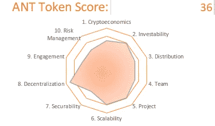

# 阿拉贡:为未来的组织构建工具

> 原文：<https://medium.com/coinmonks/aragon-building-tools-for-the-organizations-of-the-future-1f1fe52d95bb?source=collection_archive---------4----------------------->

# 摘要

可投资的、有价值的项目，具备扩大规模所需的基础。至今没有牵引力。导致在各种维度上得分较低，这是因为该网络尚未经过大量使用的压力测试。从而得到 50 分中的 36 分。

检查[审计](http://cryptojungle.io/wp-content/uploads/2020/02/ANT-Audit.pdf)

[PDF 格式的完整报告](http://cryptojungle.io/wp-content/uploads/2020/02/ANT-Report.pdf)

[*概述*](http://cryptojungle.io/wp-admin/post.php?post=677&action=edit) *加密丛林令牌审计方法。*

# 概观

Aragon 是一个(DAO)，分散的自治组织，作为组织，企业家和投资者的数字管辖区。寻求在传统法律体系之外做生意。支持无边界、无权限的实体创建和治理。

# 密码经济学(5 分中的 3.5 分)

Aragon 为包括 DAO 在内的区块链实体提供了一种治理机制。这些协议的当事人使用 Aragon 的网络令牌 ANT 作为担保。为代币持有者创造价值，作为这些协议的储备货币。

网络运营需要 ANT 令牌，因为解决争议的陪审员需要 ANT 参与并为所提供的服务赚取 ANT。陪审员受到激励，以诚信行事。如果他们参与对网络持续运行的敌对行为，他们可能会失去他们的 ANT。

最初的固定供应量为 3960 万安特，其中大部分已经流通。未来的稀缺性是不确定的。在某个时候，网络的货币政策可能会根据令牌持有者的判断而改变。

阿拉贡拥有坚实的增长潜力，网络的架构使未来的增长更有可能是线性的，而不是指数式的。签订新协议的组织不会增加 Aragon 网络对现有组织的价值。

# 可投资性(4/5)

阿拉贡有一个透明的由社区驱动的资本分配流程，迄今为止，该流程已经谨慎地使用了[项目的](https://transparency.aragon.org/#/)资金。采用减缓了对项目控制之外的市场因素的影响。

该项目获取价值的主要机制是汇总对分散法律服务的需求，并提供一批参与者来提供这些服务。从两者在网络上的互动中抽取一小部分。

阿拉贡有一个强大的品牌，与其积极的营销努力有关，以阐述道作为一个组织原则的潜力。将这一愿景与阿拉贡项目本身联系起来。获得主流媒体的关注，如福布斯将路易斯·库恩德列入 30 岁以下 30 人名单。

其独特的系统结合了湿和干来定义和解决法律安排，提供了抵御竞争项目的能力。哪一个在技术上更侧重于在缺少人的因素的情况下单独使用智能合同来提供法律服务？

# 分布(5 分中的 3.5 分)

Aragon 的创始人分配受制于该项目坚持的 2 年授权时间表。对早期投资者和顾问的额外优先股分配也受到授权的限制。

创始人的偏好是进行无上限销售，以优化代币的发行。紧随 DAO hack 而来的是这种方法存在的安全问题。他们妥协了，设立了一个隐藏的上限。确保销售安全，同时最大限度地向尽可能多的群体分发代币。

创始人选择将 16.5%的代币分配给自己，另外 20%给他们控制的基金会，1%给顾问和早期投资者。仅剩下 62.7%在 ICO 期间出售。

虽然按 ICO 的标准来说不算过分。鉴于他们对基金会的控制，他们已经放弃了。考虑到项目是预生产的，他们分配给自己的大量令牌是次优的。

约 1%流向内部人士，导致公开出售的分配在公平的条件下广泛分配。2403 个独特的买家参与了销售。

目前供应量限制在 3960 万。根据用于管理项目的机构群体管理流程的判断，可能会有所变化。

# 团队(5 分中的 3.5 分)

创始人有历史成就的记录，在开始阿拉贡之前共同创立了一个众筹平台。从历史上看，该团队的优势一直是技术技能，最近该协会做出了一些努力，利用项目资金尝试使贡献者的技能组合多样化。

该团队并不具备运行分散组织网络的独特资格。在他们的辩护中，考虑到这个概念是多么的新，没有人会真的这么做。他们在构建分布式计算系统方面经验丰富。有开发 P2P 和众筹平台的经验。

他们狂热地致力于透明，并且是我个人遇到的最透明的项目。

# 项目(5 项中的 4 项)

该项目是实时的，并且有现有的[用户](https://coinmetrics.io/charts/#assets=ant_left=AdrActCnt_zoom=1279411200000,1581033600000)。白皮书做得很好，但是很简短，没有提供其他高质量项目的较长白皮书的详细程度。

虽然有很好的理由将 ANT 令牌合并到网络中。没有它也能运转。该项目似乎低估了竞争对手分叉和移除 ANT 令牌的风险。

这是一个问题，因为该项目确实提供了一个独特的价值主张。将智能合同的强大功能与现实世界的裁决服务相结合。

使它成为一个吸引人的目标。因为一切都是开源的。

# 可扩展性(4.5 分，满分 5 分)

项目创始人不再直接参与。将治理责任移交给社区，将监督责任移交给协会。

创始人确实经营阿拉贡一号。一个致力于增强阿拉贡号能力的团队。

[至今已有四支队伍](https://github.com/aragon/flock/tree/master/teams)获得群体资助。与贡献者相比，团队获得的群体补助至少为 100 万美元。团队在接受资助前会接受协会的广泛审查。

全面的[路线图](https://aragon.org/en/project/roadmap)已经发布，其中频繁更新了实现路线图目标的进展情况。开发者工具在 Flock 团队和其他贡献者的努力下不断改进。

按照目前的烧钱速度，该项目有超过 25 年的可用资金。随着建设网络能力的资金增加，这一速度可能会加快。

尚不清楚世界各地的使用情况。

# 安全性(5 分之 3)

为了安全起见，阿拉贡被有意地建立在以太坊之上，而不是直接使用它自己的节点。由于担心以太坊即将到来的伊斯坦布尔升级。

阿拉贡最近资助了波尔卡多特帕拉链的开发。大多数使用阿拉贡 0x 区的大型项目仍然停留在以太坊，而向基于波尔卡多特的本地链的过渡才刚刚开始。

Bug 奖金定期运行，以识别和修复其代码的任何潜在安全问题。

目前，网络使用率很低，因此还没有出现广泛的赌注。奖励是不定期的，因为它是一个 ERC-20 令牌，它很容易安全地存储。

# 权力下放(5 分中的 4.5 分)

四个开发团队目前正在参与由该协会监管的 Flock grant 项目，并希望增加更多项目。

治理于 2018 年 7 月正式下放，最初的核心团队组成了 Aragon One，作为他们继续参与项目的工具。

所有权并不集中。大约 15%的 ANT 供应由项目金库持有。额外的大股东反映了主要交易所的综合头寸。最高个人持股 7.5%。似乎是项目创始人。

鉴于治理已经被分散，项目应该能够在没有创建者的情况下正常运行。目前，他们作为 Aragon One 的创始人继续发挥着突出的作用，Aragon One 是为该项目做出贡献的最大的开发组织。

Aragon 计划在全球范围内使用。需要更高的网络使用率来证实这一点。

# 参与度(5 分之 3)

随着各种合作伙伴将网络集成到他们的产品中，开发人员对该协议的采用一直很强劲。评论 [Reddit](https://www.reddit.com/r/aragonproject/) 频繁活跃。禁止价格讨论。

在创始人的积极参与下，在[聊天室](https://aragon.chat/)中进行持久的持续对话。Twitter 上的活跃度很低，情绪也很中性。在各种搜索词中，Google trends 上的活跃度极低*。

**由于共性，使用 Aragon 和 Ant 作为搜索词很难区分。向下搜索 Aragon network、Ant Token 等术语，不会显示太多活动。*

# 风险管理(5 分之 3)

Aragon 在发布前对其代码库进行了全面审计，并继续根据社区的意愿资助代码审查。由于网络活跃度低，无法评估抗脆性。

不到 3%的国债以菲亚特形式持有。由于是分散的，该项目似乎比大多数项目的监管风险要小。

想开始进行你自己的审计吗？在这里下载加密丛林审计模板[！](http://cryptojungle.io/wp-content/uploads/2019/10/CryptoJungle-Audit-Template.xlsx)

# 感谢阅读

注册我的[时事通讯](http://mpower365.com/newsletter-sign-up/)，了解我最新的加密资产研究。

> [直接在您的收件箱中获得最佳软件交易](https://coincodecap.com/?utm_source=coinmonks)

