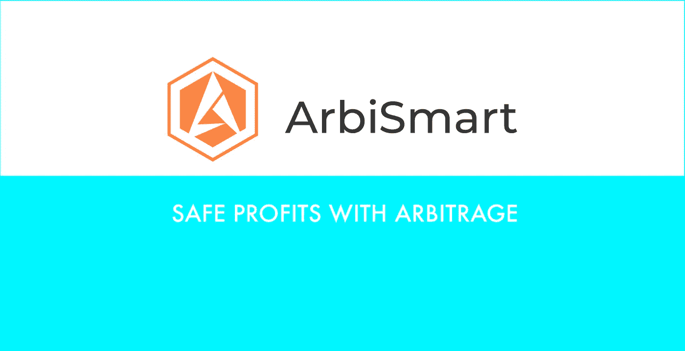

# ARBISMART:套利的安全利润——即使在市场下跌时

> 原文：<https://medium.com/coinmonks/arbismart-safe-profits-with-arbitrage-even-when-the-market-dips-3314c1496867?source=collection_archive---------5----------------------->

在最近的牛市中，一枚硬币悄悄地、稳步地建立了一个忠实的社区，同时保持在雷达下。ArbiSmart 平台背后的象征——RBIS，自推出以来的两年里已经上涨了 643%,并开始吸引人们的兴趣，因为**的分析师预测，到 2023 年，它将上涨到目前价值的 40 倍。**

Safe profits with Arbitrage — [Arbismart](https://medium.com/u/f4d0f22924c7?source=post_page-----3314c1496867--------------------------------), edited by the author