# 数字资产套利

> 原文：<https://medium.com/coinmonks/arbitrage-on-digital-assets-90b9c52892ca?source=collection_archive---------5----------------------->

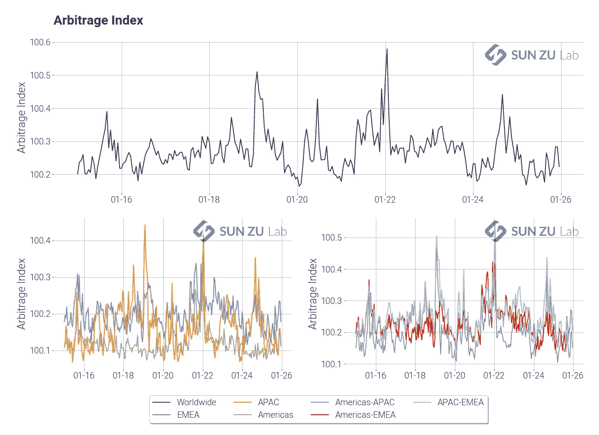

## 我们建立了一个市场整合的量化指标

在数字资产领域，有很多关于套利的讨论。神话还是现实？

我们在 [SUN ZU Lab](https://sunzulab.com) 想要提供必要的工具来检验这个问题并提供可靠的答案。因此，我们设计了一个量化指标来检测市场失去同步时的宏观套利机会。我们的目标是产生一个指标，捕捉同一资产在不同市场间价格差异的存在和范围。第二个目标是根据市场行为(如波动性)或地理位置(如地区)确定这些差异出现和消失的程度。

为此，我们建立了我们的指标，我们称之为“套利指数”(AI)，计算如下。设 amp(1 '，t)为 1 分钟成交量加权平均价格(VWAP)振幅:

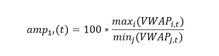

I 和 j 是市场指数。VWAP 是时间 t 时给定市场上的成交量加权平均价格。简单地说，amp(1 '，t)是给定 1 '时间间隔内所有包括的交易所中最高 VWAP 与最低 VWAP 的比率。套利指数(AI)是所有 amp(1 '，t)的小时平均值。

这个指标满足了我们的需求:

*   在两个市场之间没有价格差异的情况下，它们各自的 VWAP 在一定时期内非常接近，如果不是相等的话。在上面的公式中，这转化为:在任何时间点 amp(1') = 1。这个想法可以很容易地推广:增加更多以相同价格交易的市场将使 amp(1’)接近 1。
*   通过构造 amp(1') > 1，指数 AI 也是如此。价格的偏离会导致 AI 偏离 1。
*   因为 AI 是 1 小时内的平均值，所以短期偏差往往会被平均掉。为了使 AI 显著不同于 1，需要有短期的显著变化，或者持续的较小变化。该指标并不是要区分这两种情况，但它清楚地显示了价格不一致的情况。
*   该指数仅依赖于交易数据，而非订单数据。这很有帮助，因为订单簿数据(也称为第三级)很难获得。许多交换提供定期的“快照”,但是在处理这些快照时可能会出现棘手的问题，首先也是最重要的是它们不同步的事实。
*   跨空间比较市场整合相对简单:市场按地区分组，按结构分组，所有最小/最大比率仅限于组内比较。

市场专业人士会发现这个指标太“宏观”，不够精准。事实上，这种方法只能对现实生活中的价格差异进行粗略估计。基于逐笔分析的严格分析会产生更稳健的估计，因为它们会被活跃的交易者实时看到(顺便说一句，我们同意并将朝着那个方向前进！).然而，我们的指标在显示*相对*市场整合方面做得很好，无论是在空间上还是在时间上，这正是它的目标。

出于实际计算的目的，市场被分为三个区域:

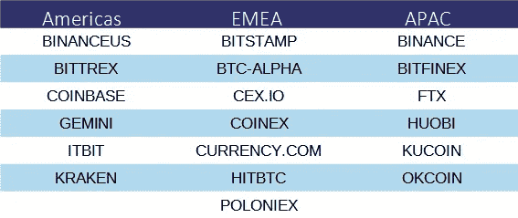

下图显示了全球指数(上图)、地区指数(左下图)和地区间指数(右下图):

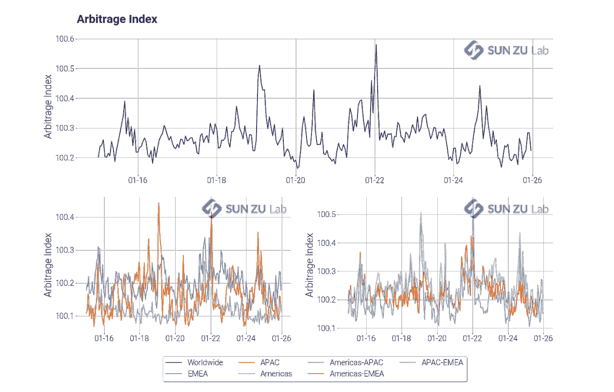

SUN ZU Lab’s Arbitrage Index

在此期间，该指数明显不同于 1，这清楚地表明市场远未紧密整合。

下图显示了波动性，以及指数和波动性之间的相互参照:

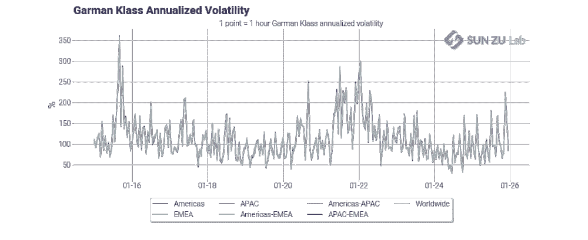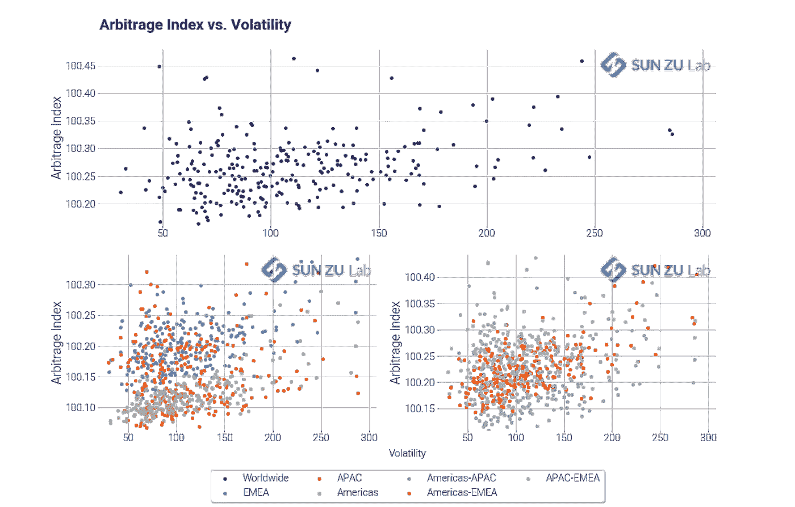

尽管这两者之间的关系似乎并不直接，但人们强烈感觉到，该指标确实会因价格波动而上升。与此同时，可以得出这样的结论:波动性不是导致价格不同步的唯一因素。

我们在分析中更进了一步，并根据我们发现的机会产生了一个“理论 P&L”。什么是机会？碰巧的是，加密交易为每笔交易提供了一个有用的指标:交易方(买价或卖价)。基于这一指标，就有可能分离出被参与者视为套利机会的价格差异。这是我们的方法:

*   对于每笔交易，我们知道价格、数量、交易方和时间戳。我们回顾了同一地区所有交易所在 500 毫秒窗口内发生的每一笔交易。这最后一个参数是任意固定的，但它意味着捕捉交易者识别和捕捉机会所需的“典型”时间窗口。例如，我们的[流动性报告](https://medium.com/p/667c22c09e20/edit)显示了不同交易所之间的平均交易时间，通常在 500 毫秒到 2 秒之间。对于一个交易者来说，要锁定一个套利交易，必须在价格异常被发现后立即同时发出至少两个订单。我们假设发布这些信息的延迟加上检测的延迟最多为 500 毫秒。在某些情况下，做市商可能已经出现在一侧的订单簿中，在这种情况下，只有一个订单要发送。我们非常注意我们对时间窗口的选择，进一步的研究可能会使我们改进我们的模型。
*   如果我们在之前的 500 ms 窗口中发现了一个相反的方向和更好的价格，我们认为机会出现了。例如，在一个交易所的报价中登记了一笔 1 BTC 的交易，价格为 10，000 美元(这是目前非常假设的价格)，我们扫描前面 500 毫秒的*出价*的交易，价格*高于 10，000 美元*。在这个时间框架内，这两笔交易的存在表明，在某个时候，一家交易所的出价严格高于另一家交易所的要价，从而创造了一个会被所有人*看到*并可能被抓住的机会。
*   当两个交易配对时，我们认为这两个交易的最小规模将被完成，并且不可用于随后的配对。这样，我们可以确保每笔交易的交易量不会包含在两个不同的机会中。然后我们增加几个计数器:机会数、理论 P&L 和可仲裁数量。
*   我们还过滤掉所有低于最小阈值(下图中为 15 bps)的机会，以控制噪音水平，并考虑执行环境中的巨大差异。例如，位于交易所附近的做市商可能享有相当低的交易成本和延迟。自然不可能考虑到各种各样的情况，因此排除小到非常小的差异是一种“强力”修正。这种调整显著减少了检测到的异常数量。

这种方法导致以下结果:

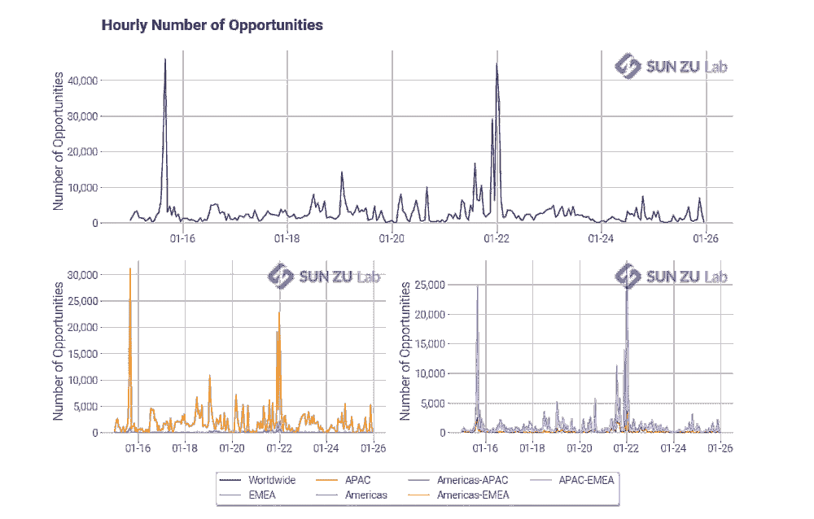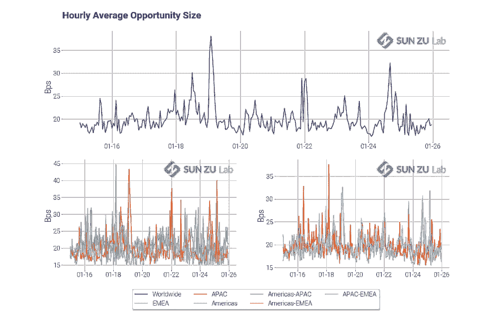

Hourly number and average size of opportunities

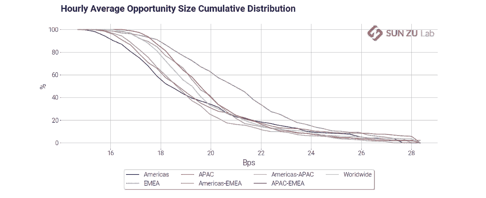

以及随后的以下理论 P&L:

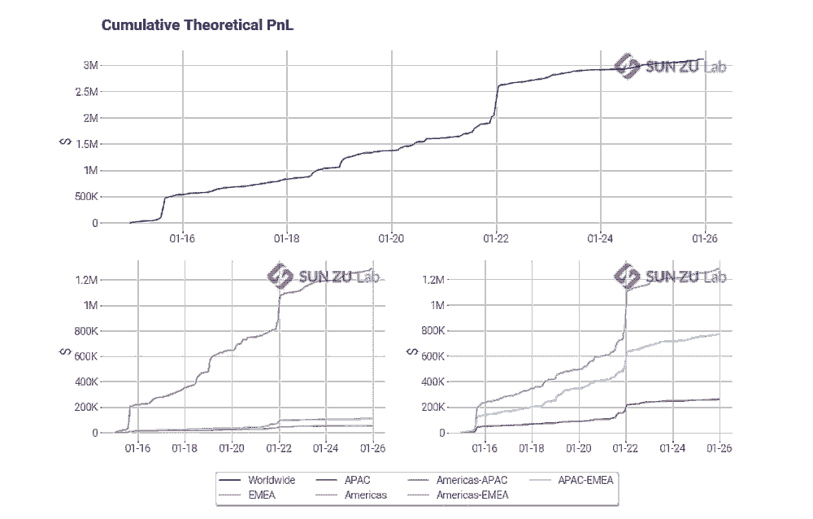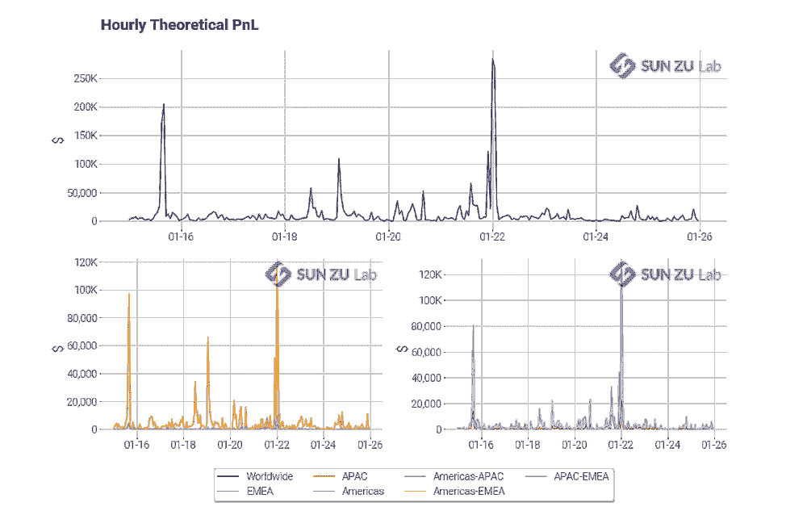

总的来说，我们相信我们的 AI 指标是市场整合的可靠和重要的衡量标准，我们将制作一份包含上述结果的双月报告(以及更多！)以及其他数字资产。对加密货币和数字资产非常好奇的投资者可能会发现，随着市场效率随着时间的推移和交易场所的变化，这是一种监控市场效率的方式。

要注册我们研究的 30 天免费试用，请访问我们的[网站](https://sunzulab.com/pricing/)或[联系我们](mailto:contact@sunzulab.com)。顺便说一下，反馈和评论总是受欢迎的！

> 加入 coin monks[Telegram group](https://t.me/joinchat/EPmjKpNYwRMsBI4p)学习加密交易和投资

## 另外，阅读

*   [什么是融资融券交易](https://blog.coincodecap.com/margin-trading)
*   最好的[密码交易机器人](/coinmonks/crypto-trading-bot-c2ffce8acb2a) | [网格交易](https://blog.coincodecap.com/grid-trading)
*   [3 商业评论](/coinmonks/3commas-review-an-excellent-crypto-trading-bot-2020-1313a58bec92) | [Pionex 评论](/coinmonks/pionex-review-exchange-with-crypto-trading-bot-1e459d0191ea) | [Coinrule 评论](/coinmonks/coinrule-review-2021-a-beginner-friendly-crypto-trading-bot-daf0504848ba)
*   [AAX 交易所评论](/coinmonks/aax-exchange-review-2021-67c5ea09330c) | [德里比特评论](/coinmonks/deribit-review-options-fees-apis-and-testnet-2ca16c4bbdb2) | [FTX 交易所评论](/coinmonks/ftx-crypto-exchange-review-53664ac1198f)
*   [n 平均零点评审](/coinmonks/ngrave-zero-review-c465cf8307fc) | [Phemex 评审](/coinmonks/phemex-review-4cfba0b49e28) | [PrimeXBT 评审](/coinmonks/primexbt-review-88e0815be858)
*   [by bit Exchange Review](/coinmonks/bybit-exchange-review-dbd570019b71)|[bit yard Review](/coinmonks/bityard-review-7d104239be35)|[coin spot Review](https://blog.coincodecap.com/coinspot-review)
*   [3 commas vs crypto hopper](/coinmonks/3commas-vs-pionex-vs-cryptohopper-best-crypto-bot-6a98d2baa203)|[赚取秘密利息](/coinmonks/earn-crypto-interest-b10b810fdda3)
*   最好的比特币[硬件钱包](/coinmonks/the-best-cryptocurrency-hardware-wallets-of-2020-e28b1c124069?source=friends_link&sk=324dd9ff8556ab578d71e7ad7658ad7c) | [BitBox02 回顾](/coinmonks/bitbox02-review-your-swiss-bitcoin-hardware-wallet-c36c88fff29)
*   [莱杰 vs n rave](/coinmonks/ledger-vs-ngrave-zero-7e40f0c1d694)|[莱杰 nano s vs x](/coinmonks/ledger-nano-s-vs-x-battery-hardware-price-storage-59a6663fe3b0)
*   [密码本交易平台](/coinmonks/top-10-crypto-copy-trading-platforms-for-beginners-d0c37c7d698c)
*   [CoinLoan 评论](/coinmonks/coinloan-review-18128b9badc4) | [YouHodler 评论](/coinmonks/youhodler-4-easy-ways-to-make-money-98969b9689f2) | [BlockFi 评论](/coinmonks/blockfi-review-53096053c097)
*   最好的[加密税务软件](/coinmonks/best-crypto-tax-tool-for-my-money-72d4b430816b) | [硬币追踪评论](/coinmonks/cointracking-review-a-reliable-cryptocurrency-tax-software-5114e3eb5737)
*   最佳[加密借贷平台](/coinmonks/top-5-crypto-lending-platforms-in-2020-that-you-need-to-know-a1b675cec3fa) | [杠杆令牌](/coinmonks/leveraged-token-3f5257808b22)
*   [BlockFi vs 摄氏](/coinmonks/blockfi-vs-celsius-vs-hodlnaut-8a1cc8c26630) | [Hodlnaut 回顾](/coinmonks/hodlnaut-review-best-way-to-hodl-is-to-earn-interest-on-your-bitcoin-6658a8c19edf)
*   [Bitsgap 审查](/coinmonks/bitsgap-review-a-crypto-trading-bot-that-makes-easy-money-a5d88a336df2) | [Quadency 审查](/coinmonks/quadency-review-a-crypto-trading-automation-platform-3068eaa374e1) | [Bitbns 审查](/coinmonks/bitbns-review-38256a07e161)
*   [埃利帕尔泰坦评论](/coinmonks/ellipal-titan-review-85e9071dd029) | [赛克斯斯通评论](/coinmonks/secux-stone-hardware-wallet-review-15-discount-coupon-2020-7577032faa6e)
*   [本地比特币评论](/coinmonks/localbitcoins-review-6cc001c6ed56) | [加密货币储蓄账户](https://blog.coincodecap.com/cryptocurrency-savings-accounts)
*   最佳[区块链分析](https://bitquery.io/blog/best-blockchain-analysis-tools-and-software)工具| [赚比特币](/coinmonks/earn-bitcoin-6e8bd3c592d9)
*   [加密套利](/coinmonks/crypto-arbitrage-guide-how-to-make-money-as-a-beginner-62bfe5c868f6)指南| [如何做空比特币](/coinmonks/how-to-short-bitcoin-568a2d0b4ae5)
*   最佳[加密制图工具](/coinmonks/what-are-the-best-charting-platforms-for-cryptocurrency-trading-85aade584d80) | [最佳加密交易所](/coinmonks/crypto-exchange-dd2f9d6f3769)
*   [如何在印度购买比特币？](/coinmonks/buy-bitcoin-in-india-feb50ddfef94) | [瓦济克斯审查](/coinmonks/wazirx-review-5c811b074f5b)
*   [印度比特币交易所](/coinmonks/bitcoin-exchange-in-india-7f1fe79715c9) | [比特币储蓄账户](/coinmonks/bitcoin-savings-account-e65b13f92451)
*   [CoinDCX 评论](/coinmonks/coindcx-review-8444db3621a2) | [加密保证金交易交易所](https://blog.coincodecap.com/crypto-margin-trading-exchanges)

> [在您的收件箱中直接获得最佳软件交易](/coinmonks/newsletters/coinmonks)

