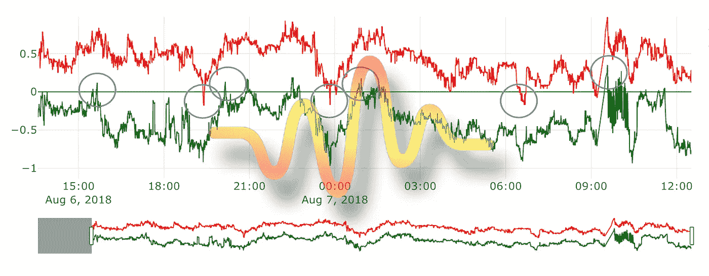
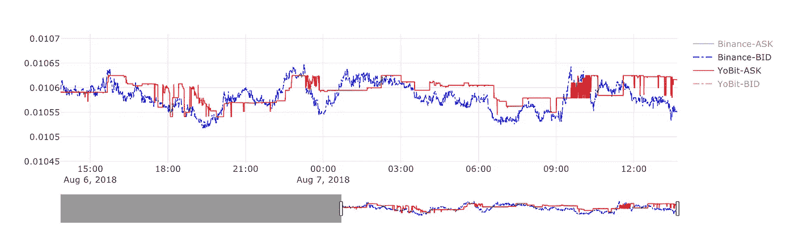
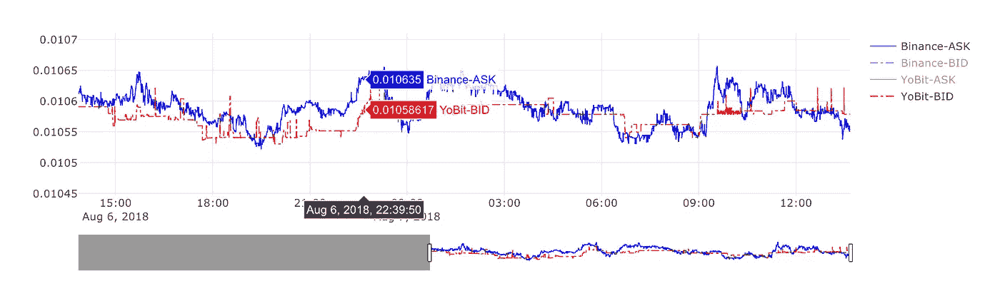
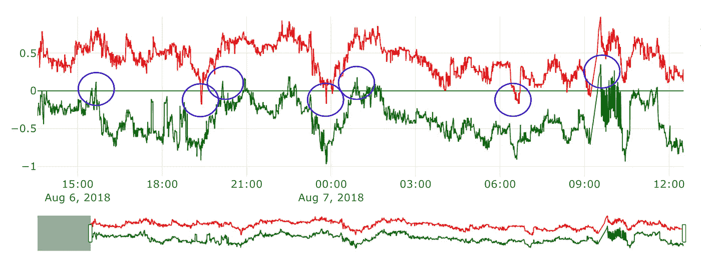
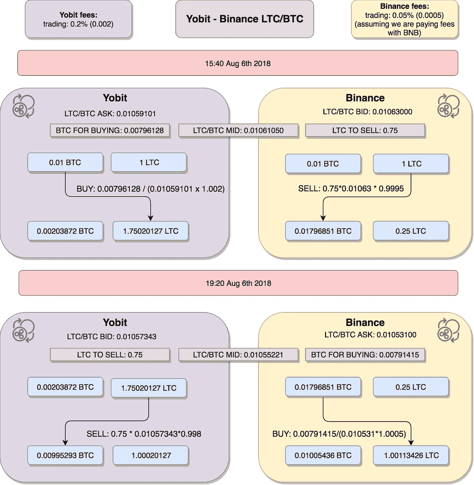
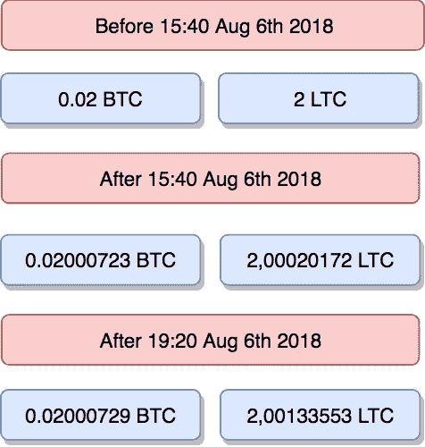

# 套利策略——第二部分——振荡指标

> 原文：<https://medium.com/coinmonks/arbitrage-strategies-part-ii-oscillator-f48e6ebec507?source=collection_archive---------1----------------------->

## 在这篇文章中，我将向你展示我称之为振荡器的套利策略。基本假设是，我们希望避免昂贵的提款，就像我们在循环套利中所做的那样

这是我的“套利策略”系列的第二部分。请看这里第一部分:[*https://medium . com/@ marcin . rabiej/cryptocurrency-arbitrage-strategies-part-I-20 e 9dd 327919*](/@marcin.rabiej/cryptocurrency-arbitrage-strategies-part-i-20e9dd327919)

在这篇文章中，我将向你展示我称之为振荡器的套利策略。基本假设是，我们希望避免昂贵的提款，就像我们在循环套利中所做的那样。当交易所 A 的价格低于交易所 B 的价格时，我们开始交易，等到交易所 A 的价格高于交易所 B 的价格时，我们以相反的方向进行交易。当交易所之间的价格变化很大，并且一天翻转几次时，振荡策略对牛市非常有用。

# 振荡器策略

请看看 2018 年 8 月 6 日至 7 日 YoBit 和币安的 LTC/BTC 价格图表。

*LTC/BTC Yobit ASK, Binance BID*

上图显示了币安上的股票买入价和 Yobit 上的股票卖出价。如果我们想在 YoBit 上买，在币安上卖，这很有意思。红线在蓝线以下的地方都是潜在的套利机会。这张图表没有显示佣金，也没有深入了解订单。

*LTC/BTC, Binance ASK, Yobit BID*

这个图表依次显示了 YoBit 上的买入价和币安上的卖出价。有趣的是，如果我们想在币安上买入，在 YoBit 上卖出——这与第一个分析方向相反。

现在让我们来看看这个代表套利分析的图表。

MultiTrader platform 已对一天内从约比特和币安收集的 LTC/BTC 的所有订单进行了[交叉交换订单匹配](https://www.multitrader.io/cross-exchange-order-book-matching/)。该分析假设交易规模为 0.75 LTC，即 50 美元左右。这个图表的 y 轴是套利交易的收益%.**绿色**线代表从 YoBit 到币安方向的**收益** %(在 YoBit 上买入，在币安上卖出)。**红色**线代表反向交易的**损失**值(在币安买入，在 Yobit 卖出)。

这有点棘手，所以让我们在这里停一下。MultiTrader platform 将亏损提取为正值，因为这对于另一种套利方法— [红凤凰](https://www.multitrader.io/arbitrage-strategies-part-iii-red-phoenix/)来说非常方便。多交易者套利分析图总是有两条线——一条代表我们选择的方向的收益百分比——在这个例子中，是在 YoBit 买入，在币安卖出。第二，红线代表收益百分比的负值——也就是亏损百分比——对于相反方向的交易。也就是说，在这种情况下，在币安上买入，在 YoBit 上卖出。因为相反方向的收益值通常是负的，所以我称之为损失。我称之为损失，我可以把它画成正值。这就是为什么红线在 0 以上。这只是意味着币安- >方向的所有交易的损失值都在 0 以上。如果红线低于 0，这意味着损耗为负，这实际上意味着币安- > YoBit 方向的增益为正！

因此，如果我们仔细观察，我们有以下收益(在图表上用蓝色圆圈标记)

*   8 月 6 日 15:40，优必选币安站的涨幅为 0.12%
*   8 月 6 日 19 点 20 分，币安——优比特的收益:0.15%
*   8 月 6 日 20 点 08 分，优必选币安的涨幅为 0.13%
*   8 月 6 日 23 点 49 分，币安股市上涨 0.17%
*   8 月 7 日 00:55，优必选币安站上涨 0.18%
*   8 月 7 日 06:39 分，币安股市上涨 0.12%
*   8 月 7 日 09:33，优必选币安站上涨 0.33%

这里需要记住的重要一点是，这个分析是针对 0.75 LTC 交易规模进行的。如果交易规模更大，套利机会就会更少。为了解决这个问题，MultiTrader 支持自适应振荡器策略，这将是另一篇文章的主题。基本上，MuliTrader 不是“全进”,而是只拿可用的——每笔交易的规模取决于可用的数量和收益。如果可行的话，它可以连续买入几次，而不是一次卖出，所以它不需要坚持一次“全进”买入，然后一次“全进”卖出的规则。

# 示例和分析

我们从每个交易所 0.01 BTC 和 1 LTC 开始。我们用 LTC 交易 BTC 或相反的方向，所以我们的 LTC 和 BTC 的总和在不断增长。使用中间价计算用于交易的金额。MultiTrader 使用预定义的值(机器人的参数)作为交易金额。在这种情况下，它是 0.75 LTC。利用中间价，MultiTrader 计算出应该交易的 BTC 量。要深入了解套利中的操作细节，请看下图:

以下是我们在每个时间点跨两个交易所的总资金汇总:

这些只是上面原始列表的前两步。正如你所看到的，我们的 BTC 和长期资本总额在每一步都在增长。值得注意的是，在 Yobit 上我们的 BTC 金额已经跌破了起点。其原因是 LTC/BTC 的价格波动，在 15:40 和 19:20 之间它已经下降。由于 MultiTrader 根据中间价计算 BTC 的金额，其中包含一些不变的 LTC 金额，因此 19:20 交易的 BTC 金额低于 15:40 交易的金额。这不是担心的理由——总的来说，我们一直都在起点之上。价格的波动是双向的，所以在几次交易后，平衡将会恢复。

请查看本系列的第三篇文章— [红凤凰—差价交易。](https://marcin-rabiej.medium.com/cryptocurrency-arbitrage-strategies-spread-trading-part-iii-db36fd9f5415)

> [在您的收件箱中直接获得最佳软件交易](https://coincodecap.com/?utm_source=coinmonks)

