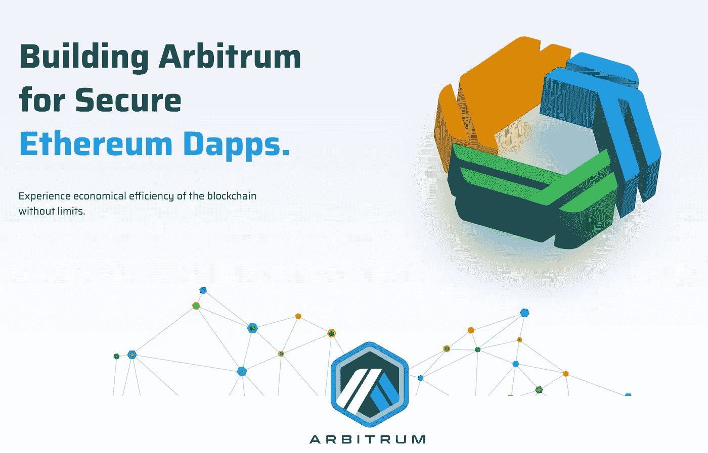

# 阿比特鲁姆:L2，AVM 和卷

> 原文：<https://medium.com/coinmonks/arbitrum-l2-avm-and-rollups-bfeae44a7f79?source=collection_archive---------7----------------------->

## 让我们来看看 Arbitrum，以太坊的第二层，使用 rollups 来提高可伸缩性，是怎么回事。它是这样工作的

可扩展性是区块链世界，尤其是以太坊生态系统中越来越热门的话题。正如在其他帖子中看到的，有几种解决方案可以提高区块链的可扩展性…