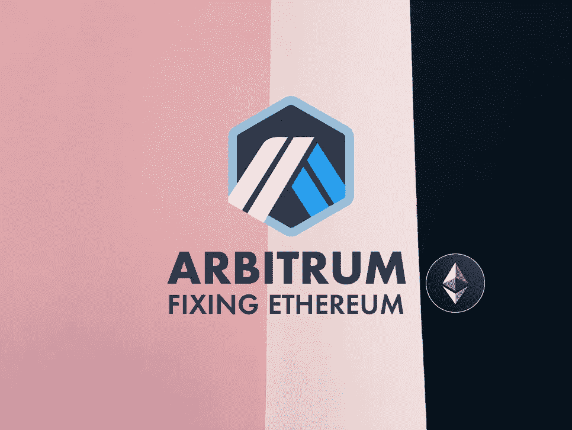

# Arbitrum:这个以太坊扩展解决方案得到了 Cuban 和 Reddit 的支持

> 原文：<https://medium.com/coinmonks/arbitrum-this-ethereum-scaling-solution-receives-support-from-cuban-and-reddit-2eb135b51caa?source=collection_archive---------8----------------------->

Arbitrum 是由 [Offchain Labs](https://offchainlabs.com/) 开发的一个项目，专门负责伸缩以太坊。与多边形不同，缩放解决方案依赖于所谓的**乐观汇总**。

Fixing ETH — Photo by [Jon Tyson](https://unsplash.com/@jontyson?utm_source=unsplash&utm_medium=referral&utm_content=creditCopyText) on [Unsplash](https://unsplash.com/?utm_source=unsplash&utm_medium=referral&utm_content=creditCopyText), edited by the author

# 固定以太网高昂的交易成本

乐观汇总将 ETH 网络中的多个事务合并到单个…