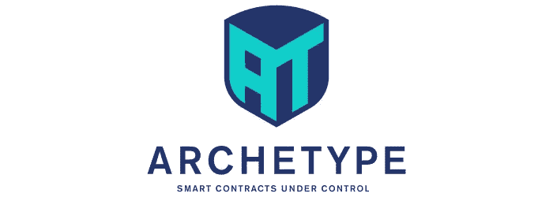

# Tezos 的 DSL 原型

> 原文：<https://medium.com/coinmonks/archetype-a-dsl-for-tezos-6f55c92d1035?source=collection_archive---------0----------------------->

[architect](http://archetype-lang.org/)是一种特定于领域的语言(DSL ),用于在 Tezos 区块链上开发智能合同，特别关注合同的正式验证。

原型由泰佐斯基金会资助，由[爱德华克拉](http://www.edukera.com)开发。

# 介绍

## 为什么要使用新的智能合同语言？

有两类智能合同语言:

*   通用语言，通常使用熟悉的语法(例如在 [LIGO](http://ligolang.org/) 的情况下使用 OCaml 或 Pascal，在 [smartpy](https://smartpy.io/) 的情况下使用 Python ),带有特定于系统的内置/库。它们给人的印象是，你可以像对任何程序一样开发一个智能合同。
*   特定于领域的语言(DSL ),它是特定于系统的算法，由定制的语法承载，具有有限的通用算法能力

需要 DSL 的智能合同有什么特定之处？

区块链不是为计算密集型计算(也不是为数据存储)而设计的。因此，任何所需的计算都应尽可能在链外*处理*，而仅在链上*检查。*例如，说一个过程需要 2 的平方根；与其让智能合约实现巴比伦算法，不如离线计算并提供给智能合约；智能合约只是检查所提供的值乘以自身是否足够接近 2...

智能合约是一个非常关键的软件，尤其是在处理货币时。智能合约中的漏洞导致了数百万美元的损失。被提供标准语言的全部算法能力增加了程序的潜在复杂性和错误的风险。相反，限制语言的算法能力通过设计提供了一种安全形式。例如，在原型中，递归调用是不被授权的。

## 为什么不只是迈克尔逊？

迈克尔逊是 Tezos 的原生智能合约语言。任何其他语言都以某种方式转换成迈克尔逊。

Tezos 的契约执行机是一个栈机，迈克尔逊语言提供了改变栈的指令(push，pop，…)。由于它的强类型方法和标准内存管理，它比 ethereum 的堆栈机器优越得多，这使它成为一种优秀的后端语言。

主要的缺点是，它使得契约很难写和读，因为你必须跟踪和想象栈的发展，以便弄清楚契约是关于什么的。如果“代码就是法律”，我们提出一种更明确的智能契约语言，更容易阅读、维护和形式化验证。

## 为什么要正式验证？

主要问题是智能合同中的一个错误会破坏整个业务流程。这就质疑了整个“区块链+智能合约”是一个不可信的系统，因为你需要信任开发者才能使用合约。

当谈到程序正确性的不可信保证时，形式验证是金标准:假设你有一个程序和该程序应该具有的特定属性；假设这个属性是用形式逻辑写的。程序验证在于找出一个**数学证明**程序具有该属性。

正式的数学证明是最可靠的保证，因为它可以被自动验证！

正式验证有限制吗？‌是的:

首先，你得到的担保仅限于你已经能够识别的财产。一个关键属性可能还是被遗忘了！

第二，你需要精通*形式化方法*来形式化契约属性，更需要证明它们，尤其是如果它们很复杂的话。

原型提供了编写契约应该具有的属性的可能性。然后，原型编译器生成 whyml 格式的契约，以便在 [Why3](http://why3.lri.fr) 中进行验证。

最后，关于上面提到的第二个限制点，注意 DSL 的使用，它限制了契约的算法复杂性，促进了验证过程(参见下面的“契约验证”部分)。

# 一些原型特征

在这一节中，我们将通过一些基本的例子来介绍这种语言的一些主要特性。在[https://docs.archetype-lang.org/](https://docs.archetype-lang.org/)可以找到这种语言更广泛的介绍

## 作为国家机器的契约

通过声明状态列表和这些状态之间的转换，可以将契约设计为状态机。

在下面的例子中，契约声明了一些由它们的地址标识的角色、在托管过程中要交换的 tez 价格值、5 个状态以及从一个状态到另一个状态的转换。

状态机设计的优点是容易获得流程图；例如，从上面的代码中导出转换图很简单，如下所示:

## 资产收集

数据被建模为资产的集合，与 Hyperledger 中的建模方式非常相似。

假设您想要建立一个管理营销忠诚度计划里程的合同。每个客户收集一组可以在到期日之前使用的里程(每个里程都有一个到期日)。

这个过程用两个资产建模，一个是“英里”资产，另一个是英里资产的“所有者”:

asset declaration

“数量”字段(第 3 行)用于存储优化；它可以累计具有相同到期日期的里程。例如，具有相同到期日期的 10 英里将合并为一英里，金额值设置为 10。

所有者通过“英里”分区拥有一个英里集合(第 9 行)。分割意味着任何一英里由一个且只有一个所有者拥有。

资产集合是指资产的名称。例如，下面的代码声明了一个名为“add”的协定条目，以向所有者添加一英里资产:

上面代码片段的第 4 行演示了所有者集合上的“get”方法。参数是所有者的地址。它返回与“ow”地址相关联的所有者资产。

第 6 行向集合中添加一个新的所有者(如果已经存在一个 id 为“ow”的所有者，那么它将失败)。

“英里”字段是一个分区，它防止直接向英里集合中添加一英里。它必须通过“所有者”资产来添加(和删除)。

## 资产不变量

我们对 mile 资产的“amount”字段使用了“int”类型(上面的第 3 行)。这里的问题是，这个场只有严格为正才有意义。

一个解决方案是在资产声明中制定积极属性，以确保在整个合同期内的属性:

第 6 行声明的属性“I”指定“amount”值必须总是严格为正。这样的性质叫做*资产* *不变量*。

这个属性现在应该在调用任何协定条目之前和任何协定条目之后保持。

验证框架的作用是在任何契约输入之后验证资产不变量是否成立。在这个例子中，在“添加”动作之后，资产不变量将不会被验证(如上所述)。事实上，新里程的“数量”场的积极性并没有得到任何保证。

解决方案是在新里程的“金额”字段中添加“要求”指令:

原型中没有无符号整数类型。每当你想让一个值为正，增加一个资产(或变量)不变量。

## 动作后置条件

我们看到了上面的“添加”动作。现在考虑“消费”动作，该动作必须删除一定数量的英里。这个过程比听起来要复杂一些，因为通过“数量”字段进行了存储优化。

里程消耗应首先删除最早的里程，直到删除的里程累积量等于正确的数量。可能需要减少最后一英里的金额值来考虑。

这里有一个实现的命题:

如何判定这个实现是否正确？

通常，我们希望确保“消耗”操作实际消耗了*数量*英里。

一个解决方案是将这个属性公式化为一个*后置条件*，这是一个关于动作应该对资产产生的影响的公式:

该公式表明，在执行“消费”之后的里程数总和*等于从*执行动作之前的里程数总和*中减去*数量*。*

验证框架的任务之一是验证实现是否具有该属性。

原来上面的实现没有验证后置条件！验证框架能够隔离第 9 行中的问题，当余数严格小于当前英里数时:余数应该仅在之后*被设置为零，当前“m”英里数减少余数…*

“消费”动作的正确版本可以在原型契约库中找到[这里是](https://docs.archetype-lang.org/contract-library/miles/miles-with-expiration)。

# 工作进展

原型目前正在开发中。我们希望在九月份发布第一个版本。该版本将提供:

*   编译程序
*   代码转换器到 CamLIGO 和 Whyml(用于验证)
*   VS 代码集成

不要犹豫，请访问 github 项目并参与其中！

 [## edu kera/原型-lang

### 此时您不能执行该操作。您已使用另一个标签页或窗口登录。您已在另一个选项卡中注销，或者…

github.com](https://github.com/edukera/archetype-lang) 

有关原型语言的更多详细信息，请访问文档网站:

 [## 什么是原型

### 是在。它们在 2015 年由以太坊推广开来。他们允许简单的读写…

docs.archetype-lang.org](https://docs.archetype-lang.org/) 

> [直接在您的收件箱中获得最佳软件交易](https://coincodecap.com/?utm_source=coinmonks)

