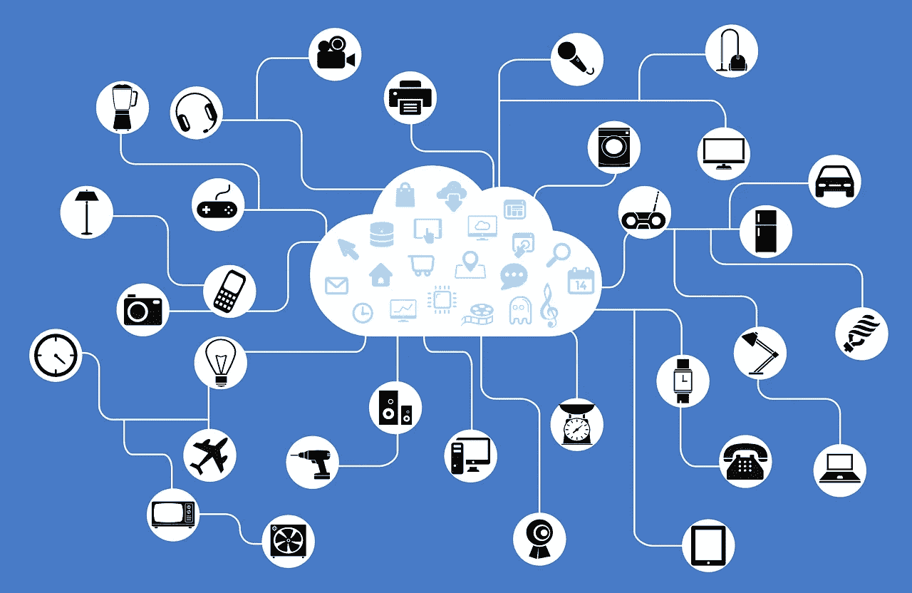
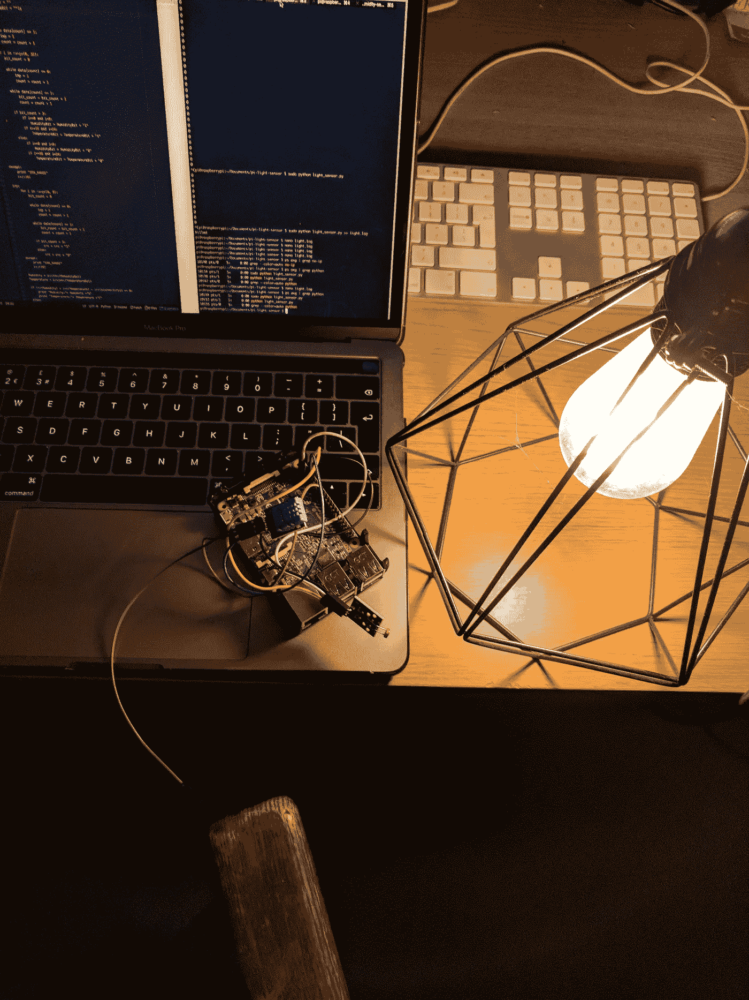
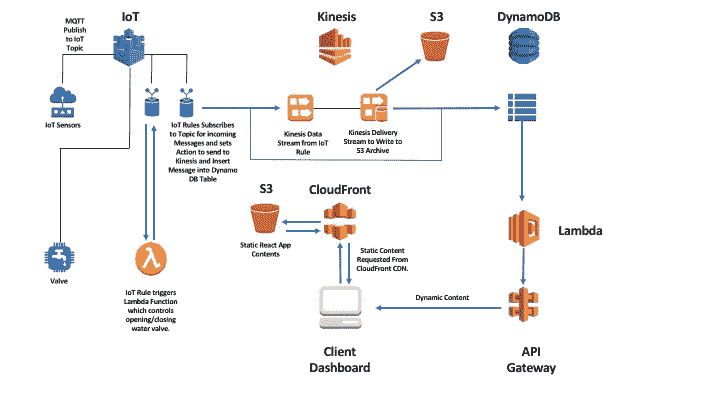
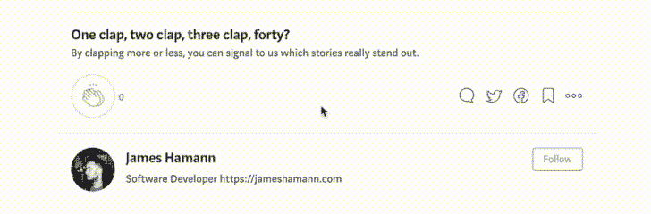

# 使用 Raspberry Pi 和 AWS 构建物联网应用

> 原文：<https://medium.com/coinmonks/architecting-your-iot-app-using-raspberry-pi-and-aws-b8b89e3ac39a?source=collection_archive---------1----------------------->

最近我在物联网传感器和 Raspberry Pi 方面做了很多工作，考虑到它越来越受欢迎，我想分享一下我是如何设计该应用的基础架构的，它可以应用于您可能正在使用的几乎任何物联网应用。虽然原则将适用于所有主要的云托管提供商，但我将讨论 AWS 特定的服务。

## 项目大纲

农场/植物的智能灌溉系统，由从物联网传感器和预测 API 获得的数据驱动。

## 使用的硬件

*   Raspberry Pi 3 型号 B 和加载了 Raspbian 的 SD 卡
*   母对母杜邦线
*   DHT11 温度/湿度传感器

上述内容显然仍处于原型阶段，这有望解释混乱。最终产品将装在防水外壳中。除了温度传感器，上面的图片还包含一个光敏电阻，它可以捕捉光线水平的信息，但目前没有被使用。

## 架构图

此图说明了所使用的所有组件以及它们之间的交互方式。让我们进一步分析一下，了解发生了什么。

首先，Pi 物联网传感器发布关于温度、湿度、土壤湿度和日照时间的原始数据。这是通过 MQTT 消息发送给 IoT 主题的。这是一个超轻量的发布/订阅消息协议，专门为网络带宽有限的位置的设备设计，非常适合物联网。接下来，创建一个 AWS IoT 规则和操作，它订阅传感器发布到的主题，并将这些消息发送到 Kinesis 数据流和 DynamoDB 表。

使用 Kinesis 完全是可选的，取决于你在建造什么。Kinesis 的好处是，它允许您选择为您的数据创建多个交付流。你可以有一个流传递给 Lambda 函数进行记录转换，该函数写入 DynamoDB，或者有另一个流传递给 Kinesis 的分析应用程序，甚至有一个传递流传递给 ElasticSearch 应用程序。它使您能够灵活地将数据传输到多个目的地以供多种用途。另一方面，它可能会使应用程序过于复杂，在某些情况下有点矫枉过正，但这是值得考虑的，并根据应用程序的要求做出最终决定。在本例中，Kinesis 交付流写入 S3 存储桶作为归档。

一旦进入 DynamoDB，这个应用程序看起来就像一个典型的无服务器应用程序。后端逻辑由 Lambda 和 API Gateway 处理，然后发送到客户端/Raspberry Pi。React 前端存储在 S3 桶中，并通过 CloudFront 分发到客户端。客户端将显示传感器数据，并能够手动控制水流。

为了实现自动浇水，来自传感器的数据将与来自预测 API 的数据一起进行评估，根据某些标准，应用程序将决定该地区是否需要水，如果需要，它将根据所有可用数据计算需水量。如果需要浇水，Lambda 将向 Raspberry Pi 发布另一个主题的消息，其中包含“打开阀门”消息以及保持阀门打开的时间。

为了增加交互性，可以包括聊天机器人，它将提示用户当前状态，并给用户提供交互的选项，查询过去的事件。除此之外，数据可视化工具可以用来创建仪表板，历史数据甚至可以加载到机器学习模型中，以预测浇水的可能性和最佳水量。有许多应用程序和方法可以让你将一个小项目扩展成更多的东西，从而获得使用新工具和技术的经验。

虽然该模型解释了该项目环境中的基础设施，但它可以轻松应用于您可能想到的任何其他物联网应用。将 Raspberry Pi 连接到云可以让它做更多的事情，并让你有机会构建新的不同的应用程序和探索不同的技术。

在另一篇文章中，我们将看看在 AWS 环境中设置它的细节，并在物联网控制台上连接一个 Raspberry Pi。

一如既往，感谢阅读，点击👏如果你喜欢你所读的，一定要关注并跟上未来的文章。

