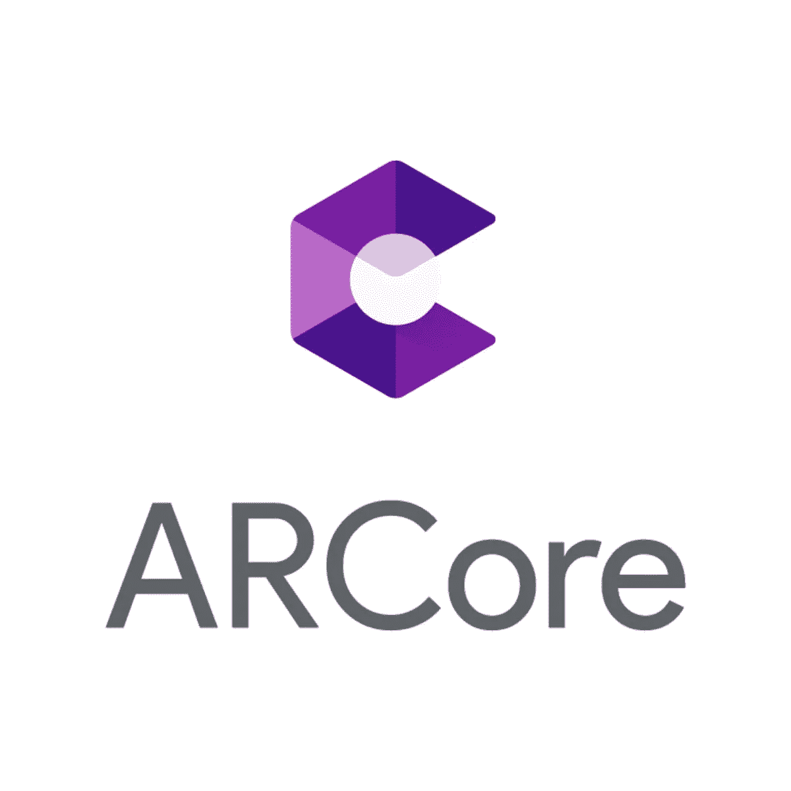

# ARCore，Sceneform 和增强图像#2 Android AR

> 原文：<https://medium.com/coinmonks/arcore-and-sceneform-2-android-augmented-reality-8108451cd484?source=collection_archive---------6----------------------->

场景形式和增强图像



credits : Google

大家好。这是 ARCore 和 Sceneform 系列的第 2 部分。我们将浏览 ARCore 中使用的 sceneform 和增强图像的一些核心 API。如果你想了解 AR 和 ARCore，请关注我的第一篇文章:

[第 1 部分—AR 和 ARCore 概述](/@neerajmoudgil/arcore-and-sceneform-1-android-augmented-reality-2580e7446748)

展望未来，我们将构建我们的 AR 应用:

*   [第 3 部分—使用 Sceneform 构建 ARCore 应用](/@neerajmoudgil/arcore-sceneform-augmented-images-3-android-ar-app-2c0990f65df2)

# 场景形式

**Sceneform** 是 Google 在 IO'18 推出的 3D 框架

sceneform 提供的 API 有助于快速轻松地开发 ARCore 应用程序，因为所需的大多数基本概念都在内部处理，如检测飞机和灯光估计都由 sceneform 处理。最好的部分是不需要学习 3D 图形或 openGL。

您将在大多数应用中使用的一些核心 API 包括:

*   `ArFragment` —可以像其他片段一样添加到 android 布局文件中的片段。它会自动检查设备中所需的 ARcore 版本，还会询问摄像头的运行时权限。

```
<FrameLayout xmlns:android="http://schemas.android.com/apk/res/android"
    xmlns:tools="http://schemas.android.com/tools"
    android:layout_width="match_parent"
    android:layout_height="match_parent"
   >
  <fragment android:name="com.google.ar.sceneform.ux.ArFragment"
      android:id="@+id/ux_fragment"
      android:layout_width="match_parent"
      android:layout_height="match_parent" />
</FrameLayout>
```

*   `ArSceneView` —渲染摄像机图像，并在 ARCore 检测到图像时高亮显示`Planes`。你可以在你的应用中直接使用`ArSceneView`，但是在这种情况下，你必须处理运行时检查和权限检查。
*   `ModelRenderable` —允许从指定路径加载一般为`sfb`格式的 3D 模型。它返回一个可以在屏幕上呈现的`Renderable`。

```
ModelRenderable.builder()
    .setSource(this, <Path of 3D model>)
    .build()
    .thenAccept(renderable -> myRedenderable = renderable)
```

*   `Node` —需要渲染的虚拟物体。它包含了 sceneform 渲染对象所需的所有信息，这些信息由`Pose` API 提供(位置和方向)。您可以变换，动画和旋转节点。你可以使用内置的`TransformableNode`来变换物体。

更多 API 可以参考[官方网站](https://developers.google.com/ar/develop/java/sceneform/)。

# 增强图像


credits : Google

它让你建立 AR 应用程序，可以检测 2D 图像，然后我们可以在上面渲染 3D 对象。使用这些 API，我们将开发我们的应用程序，将检测汽车 2D 图像，然后我们将在它上面渲染 3D 汽车模型。

您需要维护 ARCore 用来检测图像的图像数据库(`AugmentedImageDatabaset` API)。一旦检测到图像，您可以使用`AugmentedImage` API 使用图像信息。

现在，我们已经了解了场景形式和增强图像，我们将了解创建第一个 AR 应用程序的步骤。

**创建 sceneform AR App 的步骤:**

1.  导入 3D 资产
2.  配置 Sceneform 和 Sceneform 插件
3.  创建`sfa`和`sfb`文件。 **sfb** 文件捆绑成 apk。我们将在下一部分详细讨论这些文件。
4.  配置特定于 ARCore 应用程序的 Manifest.xml 文件
5.  初始化 ArFragment
6.  初始化增强图像数据库并将图像添加到数据库中
7.  检测[增强图像](https://developers.google.com/ar/develop/java/augmented-images/)
8.  在中心位置创建锚节点
9.  渲染模型

如果这里有任何术语不清楚，你一定会知道我们什么时候开始编码

# 下一步是什么？

我们将配置 Android Studio 来加载 sceneform 模型，并开始编写我们的第一个 **ARCore Sceneform 应用**。我知道你在等着编码:-p

[](/@neerajmoudgil/arcore-sceneform-augmented-images-3-android-ar-app-2c0990f65df2) [## ARCore，Sceneform 和增强图像#3 Android AR 应用程序

### 使用 Sceneform 创建 Android AR 应用

medium.com](/@neerajmoudgil/arcore-sceneform-augmented-images-3-android-ar-app-2c0990f65df2) 

**感谢阅读。如果你觉得这篇文章有帮助，用掌声鼓励我。传播并帮助他人学习。**


> [直接在您的收件箱中获得最佳软件交易](https://coincodecap.com/?utm_source=coinmonks)

[](https://coincodecap.com/?utm_source=coinmonks)