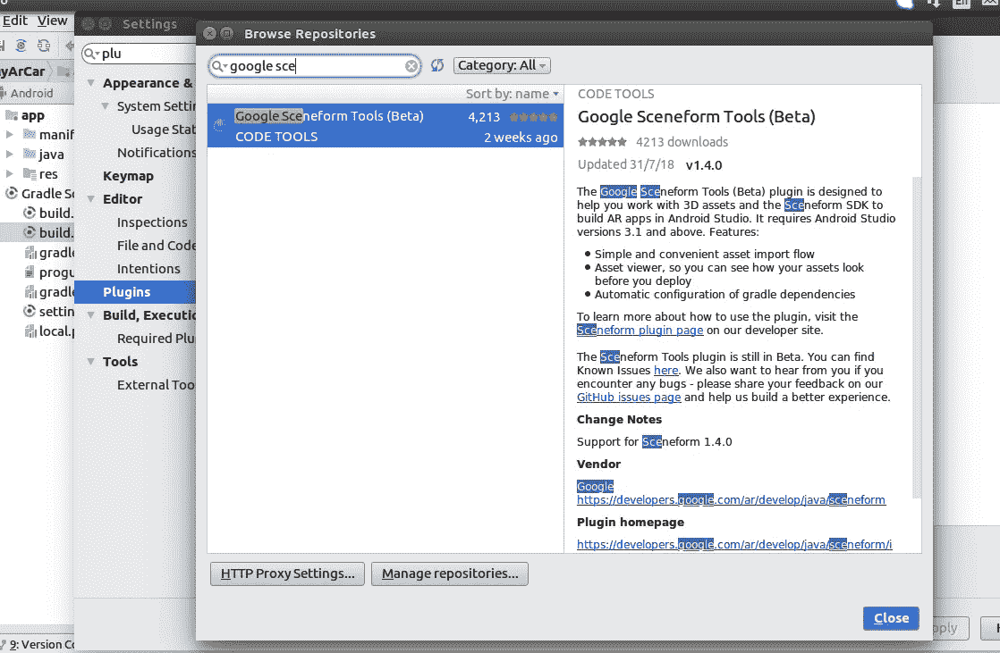

# ARCore，Sceneform 和增强图像#3 Android AR 应用程序

> 原文：<https://medium.com/coinmonks/arcore-sceneform-augmented-images-3-android-ar-app-2c0990f65df2?source=collection_archive---------2----------------------->

使用 Sceneform 创建 Android AR 应用


credits : Google

在接下来的系列中，我们已经了解了 ar、ARCore 和 Sceneform 的基础知识。你可以跟着这里的**走:**

*   [第 1 部分—AR 和 ARCore 概述](/coinmonks/arcore-and-sceneform-1-android-augmented-reality-2580e7446748)
*   [第 2 部分 Sceneform 增强图像及其核心 API 概述](/@neerajmoudgil/arcore-and-sceneform-2-android-augmented-reality-8108451cd484)
*   第 3 部分—使用 Sceneform 构建 ARCore 应用程序

# 我的 AR 应用

我们将建立一个 AR 应用程序，它将检测汽车图像，并在其上放置一个 3D 模型，用户应该能够转换和旋转。


让我们开始用这个酷东西弄脏我们的手吧——AR

## 步骤 1:导入 3D 资源

你可以使用谷歌的 [**聚**](https://poly.google.com/) 网站下载所需资产。还有其他网站也可以下载 3D 对象。

您可以搜索汽车对象并下载型号为 **OBJ** 的文件。

## 步骤 2:配置 Sceneform 和 Sceneform 插件

我们将在 Android Studio 中创建一个新项目，并设置`minimunSDK as version 7.0 (API level 24).`

**注**:使用的 Android Studio 版本应为版本`3.1 or higher`

在 gradle(应用程序级别)中，将 sceneform 插件依赖项添加为

```
classpath **'com.google.ar.sceneform:plugin:1.4.0'**
```

接下来我们需要将 ARCore 和 Sceneform 添加到我们的项目中。将以下库添加到 gradle 文件(项目级)

```
*//arcore* implementation **'com.google.ar:core:1.4.0'** implementation **"com.google.ar.sceneform:core:1.4.0"** implementation **"com.google.ar.sceneform.ux:sceneform-ux:1.4.0"**
```

将此添加到渐变底部以应用场景格式

```
apply **plugin**: **'com.google.ar.sceneform.plugin'**
```

## **第三步:将 3D 资产导出到项目— Sceneform 工具插件**

Android studio 为我们提供了插件 **Google Sceneform tools** ，它将帮助我们将资产导出到项目中。您可以在以下位置找到它:

【T2>`Plugins`>`Browse Repositories`



adding sceneform plugin to android studio

现在我们已经安装了下载的 3D 模型和插件，我们可以利用这个插件来创建`sfb`文件并将 3D 模型导出到我们的项目中。为此，请遵循以下步骤:

*   我们将把下载的 3D 模型保存到 Android Studio 提供的`sampledata`文件夹中`rightclick app > new sample directory.`这里存储的数据不会捆绑到 apk 中，而是仅用于开发目的。将下载的`.obj`和`.mtl`文件复制到此。
*   要导出模型，`right click on obj > Import sceneform asset.`
*   以上步骤将创建两个文件`.sfa` (Sceneform 资产定义)和 `.sfb` (Sceneform 二进制资产)文件。。sfa 文件是人类可读的定义。sfb 文件。它指向 3D 资源中的模型、材质定义和纹理。它是 json 格式的，你可以改变某些值来改变你的资产的外观和感觉。更多信息你可以点击这里查看[官方文件](https://developers.google.com/ar/develop/java/sceneform/sfa)
*   Gradle build 在这个过程中发生，构建中的必要更改由这个工具自动完成。

如果你看到成功的 gradle 同步，并且可以看到指定路径中的`.sfb`文件，那么是的！我们已完成将 3D 模型导入项目。接下来，我们将研究启动 AR 片段。

## 步骤 4-配置特定于 ARCore 应用程序的 AndroidManifest.xml 文件

接下来，我们需要配置项目的 Android 清单，以添加 ARCore 应用程序所需的一些元数据

```
//camera permission
<**uses-permission android:name="android.permission.CAMERA"** /> 
// application requires Arcore
<**uses-feature
    android:name="android.hardware.camera.ar"
    android:required="true"** />//inside application tag adds this
<**meta-data
    android:name="com.google.ar.core"
    android:value="required"** />
```

这些配置确保 AR 应用程序仅在支持 ARCore 的设备上运行，并指定所需的权限和功能。

## **步骤 5—初始化 ArFragment**

将 Arfragment 添加到主活动布局文件中

```
<FrameLayout xmlns:android="http://schemas.android.com/apk/res/android"
    xmlns:tools="http://schemas.android.com/tools"
    android:layout_width="match_parent"
    android:layout_height="match_parent"
   >
  <fragment android:name="com.google.ar.sceneform.ux.ArFragment"
      android:id="@+id/ar_fragment"
      android:layout_width="match_parent"
      android:layout_height="match_parent" />
</FrameLayout>
```

然后，您可以在您的主活动 java 文件中引用这个片段

```
**arFragment**= (ArFragment)  getSupportFragmentManager().findFragmentById(R.id.***ar_fragment***);

*// hiding the plane discovery* **arFragment**.getPlaneDiscoveryController().hide();
**arFragment**.getPlaneDiscoveryController().setInstructionView(**null**);
```

我们隐藏了平面检测，因为默认情况下它是真实的，对于我们正在做的特定示例，我们不需要检测平面，而是我们将在检测到的图像上渲染 3D 模型。我将在其他帖子中解释飞机上的渲染模型。

## 跑去试试

在 AR 支持的设备或模拟器中保存并运行应用程序。

如果你已经完成了这些步骤，那么你应该能够看到相机权限弹出窗口(注意，我们没有编写任何代码来处理权限，因为它是由`ArFragment`在内部处理的)。在这之后，你应该看到相机饲料在你的手机上运行。

# 摘要

*   我们能够添加插件，将 3D 模型导出到 Android studio 中
*   我们已经向 gradle 文件添加了必要的库和依赖项
*   我们对 AndroidManifest.xml 进行了必要的配置更改
*   初始化 ArFragment

# 下一步是什么？

接下来，我们将编写代码来完成剩余的步骤。

*   初始化增强图像数据库并将图像添加到数据库中
*   检测[增强图像](https://developers.google.com/ar/develop/java/augmented-images/)
*   在中心位置创建锚节点
*   渲染模型

[](/@neerajmoudgil/arcore-sceneform-augmented-images-4-android-ar-app-2a4890a9bb09) [## ARCore，Sceneform 和增强图像#4 Android AR 应用程序

### 使用 ARCore 和 Sceneform 构建 AR 应用程序

medium.com](/@neerajmoudgil/arcore-sceneform-augmented-images-4-android-ar-app-2a4890a9bb09) 

**感谢阅读。如果你觉得这篇文章有帮助，用掌声鼓励我。传播并帮助他人学习。**


> [在您的收件箱中直接获得最佳软件交易](https://coincodecap.com/?utm_source=coinmonks)

[](https://coincodecap.com/?utm_source=coinmonks)