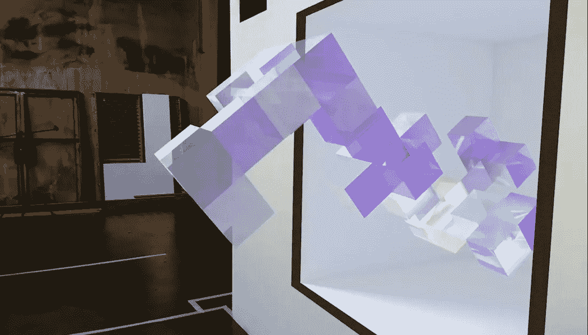
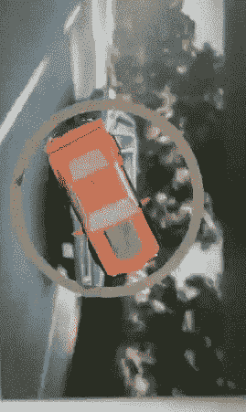
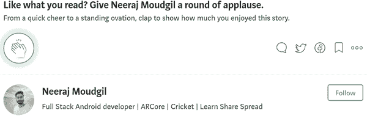

# ARCore，Sceneform 和增强图像#4 Android AR 应用程序

> 原文：<https://medium.com/coinmonks/arcore-sceneform-augmented-images-4-android-ar-app-2a4890a9bb09?source=collection_archive---------4----------------------->

使用 ARCore 和 Sceneform 构建 AR 应用程序



嘿大家好。在接下来的系列文章中，我们将介绍 ARCore、Sceneform 和 AugmentedImages 的概念

# 系列零件:

*   [第 1 部分—AR 和 ARCore 概述](/@neerajmoudgil/arcore-and-sceneform-1-an)
*   [第 2 部分 Sceneform 增强图像及其核心 API 概述](/@neerajmoudgil/arcore-and-sceneform-2-android-augmented-reality-8108451cd484)
*   [第 3 部分—使用 Sceneform 构建 ARCore 应用](/@neerajmoudgil/arcore-sceneform-augmented-images-3-android-ar-app-2c0990f65df2)
*   第 4 部分—继续构建增强现实应用程序—增强图像

这是第 4 部分，我们将继续第 3 部分留下的构建应用程序的步骤。

在第 3 部分[中，我们完成了以下步骤:](/@neerajmoudgil/arcore-sceneform-augmented-images-3-android-ar-app-2c0990f65df2)

1.  导入 3D 资产
2.  配置 Sceneform 和 Sceneform 插件
3.  创建`sfa`和`sfb`文件。
4.  配置特定于 ARCore 应用程序的 Manifest.xml 文件
5.  初始化 ArFragmen

接下来，我们有以下步骤:

## 步骤 6:初始化增强图像数据库，并将图像添加到数据库中

为了让我们的应用程序识别我们的汽车图像，我们需要创建一个图像数据库。这里有一些关于图像尺寸和质量的指南，可以在[这里](https://developers.google.com/ar/develop/c/augmented-images/)查看。对于这个应用程序，我只会在运行时添加我们的参考图像，但是你也可以使用 [Arcoreimg 工具](https://developers.google.com/ar/develop/java/augmented-images/arcoreimg)来创建数据库。

```
AugmentedImageDatabase imageDatabase = new AugmentedImageDatabase();
```

然后您需要将图像添加到数据库中。我使用了下面的图片，不过你可以随意使用任何图片，创造出身临其境的体验。


credits : [Unsplash](https://images.unsplash.com/photo-1533468659570-9cc9354310e4?ixlib=rb-0.3.5&ixid=eyJhcHBfaWQiOjEyMDd9&s=c7c619a149494f5c32f7581b5213b1d0&auto=format&fit=crop&w=877&q=80)

将图像保存在 assets 文件夹中，然后使用`.addImage()`方法将该图像添加到 AugmentedImageDatabase 中。它采取位图格式的图像。

现在我们的数据库已经准备好了，图像也添加进去了，我们可以开始检测图像了。

## 步骤 6:检测增强图像

我们可以通过在相机的 AR 场景上添加`updateListener`来跟踪 ARCore 的会话。这将持续跟踪帧，我们可以利用它来检测增强图像。

我们将在检测到的图像的中心渲染我们的模型。

## 步骤 7:检测增强图像

一旦我们检测到图像，我们必须渲染我们的 3D 模型(还记得我们导出的`.sfb`文件)。

```
**private void** renderObject(ArFragment fragment, Anchor anchor, **int** model){
    ModelRenderable.*builder*()
            .setSource(**this**, model)
            .build()
            .thenAccept(renderable -> addNodeToScene(fragment, anchor, renderable))
            .exceptionally((throwable -> {
                AlertDialog.Builder builder = **new** AlertDialog.Builder(**this**);
                builder.setMessage(throwable.getMessage())
                        .setTitle(**"Error!"**);
                AlertDialog dialog = builder.create();
                dialog.show();
                **return null**;
            }));

}

**private void** addNodeToScene(ArFragment fragment, Anchor anchor, Renderable renderable){
    AnchorNode anchorNode = **new** AnchorNode(anchor);
    TransformableNode node = **new** TransformableNode(fragment.getTransformationSystem());
    node.setRenderable(renderable);
    node.setParent(anchorNode);
    fragment.getArSceneView().getScene().addChild(anchorNode);
    node.select();
}
```

`ModelRenderable`负责加载我们的 3D 资产，然后我们创建`AnchorNode`并将其添加到在屏幕上呈现我们的对象的场景中。它定义了对象停留在特定的位置。对我们来说，位置是由`augmentedImage.getCenterPose()`给出的检测图像的中心

`Tranformable`节点就是可以旋转或变换的节点。然后我们将 renderable 设置为 TransformableNode。

终于！如果你一直跟踪到这里，那么你应该可以看到你的模型在现实世界中的图像上，就像这样:



MyARCar

# 完整的代码可以在这里找到:

[](https://github.com/NeerajMoudgil/MyARCar) [## NeerajMoudgil/MyARCar

### MyARCar -使用 ARCore 和 Sceneform 的 Android AR 应用程序

github.com](https://github.com/NeerajMoudgil/MyARCar) 

**如果你面临任何问题，请随时发表评论或通过**[**LinkedIn**](https://in.linkedin.com/in/neeraj-moudgil)**联系我。**

## 构建此应用程序时面临的挑战

*   配置 ARCore 和 scene form——您需要注意添加 gradle 中的依赖项和 AndroidManifest 中的特性。错过任何一个都会导致意想不到的行为。
*   生成的模型的规模可能太大。如果你正面临这个问题，那么将你的模型文件中的**比例改为较小的比例值:0.20000**

# 学完这个可能的应用:

您可以通过多种方式实现增强图像增强现实，例如

*   创建一个 live cards 应用程序，您可以使用打印的卡片，然后在上面渲染类似的 3D 对象
*   将此与机器学习相结合来检测对象，然后通过放置相应的 3D 模型来赋予检测到的对象生命
*   将动画应用于模型。你可以从这里开始[制作节点](https://developers.google.com/ar/develop/java/sceneform/build-scene#animate_nodes)动画。

# 资源:

*   [ARCore](https://developers.google.com/ar/)
*   [场景表单](https://developers.google.com/ar/develop/java/sceneform/)
*   [增强图像](https://developers.google.com/ar/develop/java/augmented-images/)
*   [聚](https://poly.google.com/view/7bF7UVAoYRG)感谢[克里斯·童](https://poly.google.com/view/7bF7UVAoYRG)带来的酷炫卡玛洛

感谢阅读。如果你觉得这篇文章有帮助，用掌声鼓励我。传播并帮助他人学习。



> [在您的收件箱中直接获得最佳软件交易](https://coincodecap.com/?utm_source=coinmonks)

[](https://coincodecap.com/?utm_source=coinmonks)