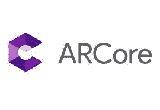

# 增强现实:谷歌的 ARCore 示例应用教程

> 原文：<https://medium.com/coinmonks/arcore-tutorial-21d67fce04dd?source=collection_archive---------2----------------------->



在完成 ARCore 之后，我不可能不写它。毫无疑问，这是最好的基于增强现实的库之一，我强烈建议你尝试一下。

在这篇文章中，我将概述 ARCore，并使用 Google 提供的 HelloAr 示例应用程序解释 ARCore 的功能。

# 概观

ARCore 是谷歌构建增强现实体验的平台。它是苹果开发的 ArKit 的替代产品，用于在 android 设备上构建基于增强现实的应用程序。ArCore 使用不同的 API，使开发人员能够感知环境、理解世界并与信息交互。

ARCore 提供的算法集 exposed APIs 是 Tango 项目的成果，由于一些原因，该项目无法公开。

ARCore 使用三种关键功能将虚拟内容与通过手机摄像头看到的真实世界相结合:

*   [**动作追踪**](https://developers.google.com/ar/discover/concepts#motion_tracking) 让手机了解并追踪自己相对于世界的位置。
*   [**环境理解**](https://developers.google.com/ar/discover/concepts#environmental_understanding) 允许手机检测所有类型表面的大小和位置:水平、垂直和有角度的表面，如地面、茶几或墙壁。
*   [**光线估计**](https://developers.google.com/ar/discover/concepts#light_estimation) 允许手机估计环境的当前光线条件

希望你对 ARCore 有个大概的了解。为了更好地理解该平台，让我们深入了解 HelloAR 示例应用程序。我将使用 unity 框架来解释该应用程序，但是这些知识可以扩展到所有其他框架。

# 辅导的

HelloAR 核心应用利用了一堆类，这些类在[这个](https://developers.google.com/ar/reference/)链接中有很好的记录。

一开始，应用程序启动一个名为 Session 的实例。GoogleARCore。Session 是处理应用程序与 ARCore 服务通信的类。每个会话在应用程序启动时启动,“SessionStatus”用于确定应用程序的跟踪状态。

该会话将处于跟踪状态，除非并且直到它能够从它已经检测到的点中找到平面。会话检测到的平面由

```
Session.GetTrackables<DetectedPlane>(temp); 
```

变量 temp 将保存会话能够找到的所有检测到的平面。

现在不用物理学。Raycast 是 Unity 框架提供的光线投射方法，googleARCore 使用自己的光线投射实现，可以通过以下方式访问

```
Frame.Raycast(
  float x,
  float y,
  [**TrackableHitFlags**](https://developers.google.com/ar/reference/unity/namespace/GoogleARCore.html#namespaceGoogleARCore_1a8da5a2395bdef6ffe411700df5a713ff) filter,
  out [**TrackableHit**](https://developers.google.com/ar/reference/unity/struct/GoogleARCore/TrackableHit.html#structGoogleARCore_1_1TrackableHit) hitResult
)
```


User touch for RayCast

这个特定的函数从一个点发送光线，该点由参数 x，y 指定，并转储对象的数量，具有网格过滤器的刚性对象，光线在其路径上命中，在真实世界场景中，在可跟踪的外部命中。

当用户手势通过轻击屏幕来选择现实世界中的位置时，使用上面的 API。然后，向用户触摸点的方向发送光线投射，并且只有当光线投射在 hitResult 上给出检测到的平面时，虚拟对象才被放置在该平面上。相同的代码如下所示:-

> TrackableHit 命中；
> trackable hit flags raycast filter = trackable hit flags。planewithpolygon | TrackableHitFlags。FeaturePointWithSurfaceNormal
> 
> 如果(帧。Raycast(touch.position.x，touch.position.y，raycastFilter，out hit))
> {
> //检查 out hit 是否为检测平面
> 如果((hit。trackable is detected plane)
> {
> //添加虚拟物体
> }
> 
> }

为了将对象添加到虚拟空间，您需要该对象在现实世界中的位置和旋转。利用光线在检测平面上的入射点可以容易地获得位置。

```
hit.Pose.position ; //Position of the incidence 
```

为了设置旋转，你需要自己做一些调整，这主要取决于想要的输出。但是，您可以访问相机的旋转，入射平面的旋转，平面的法线等。您可以使用这些旋转作为参考，然后相应地旋转对象。

```
hit.Pose.rotation; //Rotation of the incidence of the ray to plane//rotation of the plane on to which the ray cast hits.((DetectedPlane)hit.Trackable).CenterPose.rotation ; 
```

旋转是以四元数而不是欧拉角提供的，尽管您可以使用以下 API 将它们相互转换。

```
//For euler to quaternion
Quaternion.Euler(x, y,z ); // where x,y,z are euler angles//For getting euler angles from the quaternion variable
Quaternion q ; 
q.eulerAngles.x ; //get x rotation 
q.eulerAngles.y ; //get y rotation
q.eulerAngles.z ; //get z rotation
```

现在，一旦您在 AR 空间中实例化/创建了虚拟对象，您将需要确保即使当您移动时，该对象也相对于创建它的平面保持在相同的位置。此外，随着对空间理解的发展，保留以前的数据也很重要。使用锚，googleArCore 能够有效地解决这个问题。锚点用于创建虚拟对象和检测到的平面之间的链接。每当飞机在现实世界空间中显示时，物体总是与它相关联。

```
var anchor = hit.Trackable.CreateAnchor(hit.Pose);                     // Make Andy model a child of the anchor.                    andyObject.transform.parent = anchor.transform;
```


这些是 googleArCore 提供的 HelloAR 示例应用程序中使用的主要 API。为了更好地理解每个 API 和类，你可以在这里阅读详细的文档[](https://developers.google.com/ar/reference/unity/)*。另外，在开始开发之前，确保你有一部支持 ARCore 的手机，你可以在这里 找到支持手机的列表 [***。***](https://developers.google.com/ar/discover/supported-devices)*

# *缺点*

*我在使用 ARCore 时面临的唯一缺点是无法更改或调整用于特征跟踪和平面检测的算法参数。公开的 API 所使用的算法在任何地方都没有记录，而且开发人员也不能根据自己的问题调整参数。例如，特征点检测、表面检测、光估计是可以使用的不同功能，但是不能由开发者调整。然而，API 的执行和工作本身就非常强大，并且在许多不同的场景中都能很好地工作。*

*如果你对我的帖子或 ARCore 有任何疑问，请在下面评论。我会尽我所能帮助你。开发愉快:)。*

> *加入 Coinmonks [电报频道](https://t.me/coincodecap)和 [Youtube 频道](https://www.youtube.com/c/coinmonks/videos)获取每日[加密新闻](http://coincodecap.com/)*

## *另外，阅读*

*   *[复制交易](/coinmonks/top-10-crypto-copy-trading-platforms-for-beginners-d0c37c7d698c) | [加密税务软件](/coinmonks/crypto-tax-software-ed4b4810e338)*
*   *[网格交易](https://coincodecap.com/grid-trading) | [加密硬件钱包](/coinmonks/the-best-cryptocurrency-hardware-wallets-of-2020-e28b1c124069)*
*   *[密码电报信号](http://Top 4 Telegram Channels for Crypto Traders) | [密码交易机器人](/coinmonks/crypto-trading-bot-c2ffce8acb2a)*
*   *[最佳加密交易所](/coinmonks/crypto-exchange-dd2f9d6f3769) | [印度最佳加密交易所](/coinmonks/bitcoin-exchange-in-india-7f1fe79715c9)*
*   *[面向开发人员的最佳加密 API](/coinmonks/best-crypto-apis-for-developers-5efe3a597a9f)*
*   *最佳[密码借贷平台](/coinmonks/top-5-crypto-lending-platforms-in-2020-that-you-need-to-know-a1b675cec3fa)*
*   *[杠杆代币终极指南](/coinmonks/leveraged-token-3f5257808b22)*