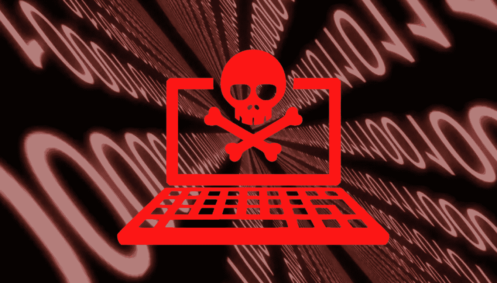

# 区块链可以被黑客攻击吗？

> 原文：<https://medium.com/coinmonks/are-blockchains-hackable-66fc9b8f0ef5?source=collection_archive---------3----------------------->

Source: [https://coincentral.com/can-bitcoin-be-hacked/](https://coincentral.com/can-bitcoin-be-hacked/)

使用区块链技术的一个关键属性和原因是，它是非常安全的，因为它使用军事级别的安全性。有充分的证据表明，交易所的钱被盗，迄今为止最大的抢劫案是 Mt Gox，丢失了 740，000 比特币。假设比特币的价格为 9500 美元，那么它的价值将超过 70 亿美元！然而，通过使用区块链来创建数字资产，例如…