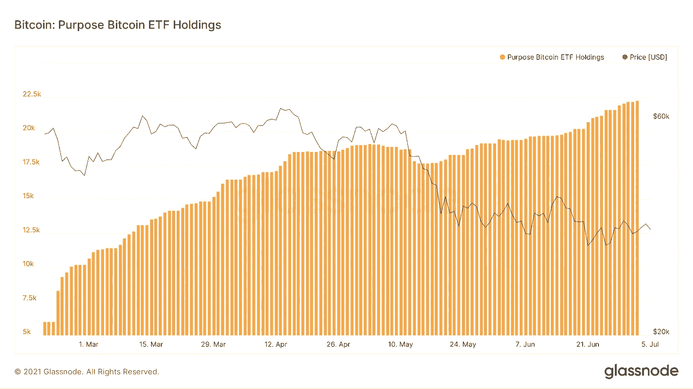
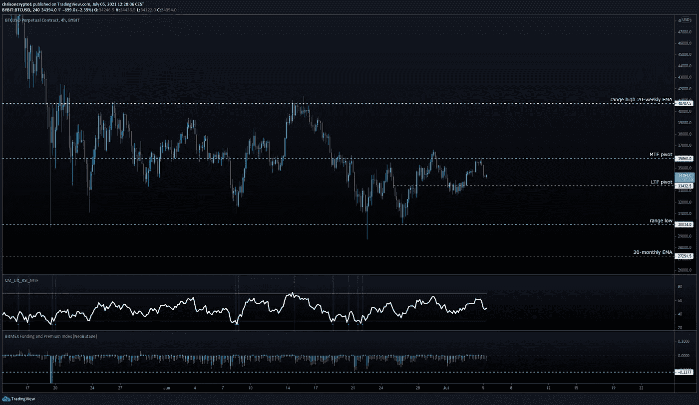
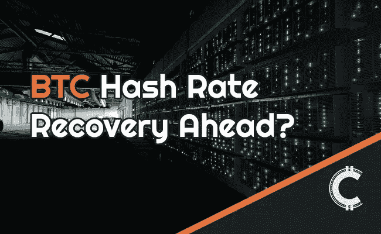

# 对灰度的 GBTC 解锁 7 月下旬的担忧被高估了吗？

> 原文：<https://medium.com/coinmonks/are-concerns-over-grayscales-gbtc-unlock-later-in-july-overrated-c1441a5093b9?source=collection_archive---------6----------------------->

随着历史上最大规模的网络调整顺利进行，比特币的阻塞时间恢复正常。碰巧的是，加拿大的目的 ETF 越过了 22，000 BTC 管理下(AUM)的里程碑，需求在低迷时期从历史高点显著增加。这些数字是几个数据点中的几个，这些数据点消除了对灰度在 7 月晚些时候的 GBTC 解锁的担忧。

我们来挖一下。

# 比特币网络经历史上最大难度调整

随着网络适应中国主导的散列率下降，比特币的挖掘难度已经跌落悬崖，下降了 27.9%。

这是自 2009 年该网络上线以来采矿难度的最大下降——比上周[的估计](https://chrisoncrypto.com/blog/f/bitcoin-hashrate-plummets-after-china-bitcoin-crackdown)还要高。

**查看** [全篇点击这里](https://chrisoncrypto.com/blog/f/bitcoin-network-undergoes-largest-difficulty-drop-ever-by-28%25) **！**

# 技术上来说

## 目的比特币 ETF 持仓量激增

Purpose 比特币交易所交易基金管理着超过 22，000 BTC，过去两周需求不断增加。

受监管的交易所交易基金(ETF)在最近的价格下跌中受益，随着比特币价格在 30，000 美元区域波动，积累加速。

从 5 月 15 日开始，从那时到周四，平均每天有 86.15 BTC 进入 ETF，总计 3446 BTC。目前，Purpose 总共持有 22，300 辆 BTC，价值约 7.65 亿美元。

目的是在 2021 年 2 月第一个这样的比特币交易所交易基金获得监管机构的批准。据[报道](https://chrisoncrypto.com/blog/f/bitcoin-etf-filings-inch-closer-to-unanimous-approval)，美国尚未做出回应，但如果金融产品最终获得批准，那么鉴于美国和加拿大市场规模的差异，其影响可能会大得多。

## 对潜在灰度抛售潮的担忧被高估了吗？

这一消息为比特币价格暴跌后面临的制度性考验提供了令人满意的反例，提醒人们市场力量存在于岛的两边。

未来几周将会看到存储在灰度比特币信托(GBTC)中的 BTC 解锁，一些分析师认为这是一个看跌事件。具体来说，从 4 月中旬到 6 月中旬，约有 139，000 比特币价值的股票解锁，另有 140，000 比特币价值的股票将于 7 月底解锁。问题是:市场能否吸收潜在的(且无法保证)抛售潮？

上周末，链上分析公司 Santiment 的数据显示，持有 10-10，000 BTC 的鲸鱼地址一夜之间积累了 60，000 比特币。这是 2021 年全年的最高日峰值，并提供了玩家在 30，000 美元至 36，000 美元价格标签下吸收抛售压力的洞察力。

## BTC/美元连续创出新低

比特币周一回吐周末涨幅，一夜之间从 35900 美元下滑至 34000 美元。

到目前为止，买家出现在 34，000 美元的水平，如果保持住，这将是自 6 月 22 日以来连续第四次在盘整范围内的较低水平(包括灯芯)。

几个月来，36000 美元的水平已被证明是至关重要的，在市场眼中仍然如此。一旦恢复到这一水平，在 40，000 美元之前，天空都是晴朗的，甚至可能超过 40，000 美元(尽管外部催化剂可能是必要的)。

总而言之，比特币正在死气沉沉的市场环境和低交易量中整合。然而，如果说多年来比特币教会了我们什么的话，那就是不要在开车的时候睡觉，尤其是在看起来无趣的时候。

保持警惕。

下次再见。

**加入** [电报](https://t.me/chrisoncryptochannel) **频道，实时更新&设置！
关注我** [推特](https://twitter.com/ChrisOnCrypto1) **&** [多嘴多舌](https://gab.com/chrisoncrypto) **下面还有我的社交门户。**

[https://www.paypal.com/donate?hosted_button_id=C9VRLGTBHQX2N](https://www.paypal.com/donate?hosted_button_id=C9VRLGTBHQX2N)

# 阅读更多:比特币网络经历有史以来最大难度下降 28%

[https://chrisoncrypto.com/blog/f/bitcoin-network-undergoes-largest-difficulty-drop-ever-by-28%25](https://chrisoncrypto.com/blog/f/bitcoin-network-undergoes-largest-difficulty-drop-ever-by-28%25)

[http://www.chrisoncrypto.com/](http://www.chrisoncrypto.com/)

你也可以用比特币支持我！
**BTC** 地址:**3 eydseypjhn 68 axkncuqbb 7 ebqcxrejamr**

最诚挚的问候，
**克里斯托弗·阿塔尔德**
克里斯对加密的创始人
投稿人[www.cityam.com](https://www.cityam.com)
直接接通:[电报](https://t.me/chrisoncrypto)

*最初发布于*[*https://mailchi . MP*](https://mailchi.mp/bffd9f863894/are-concerns-over-grayscales-gbtc-unlock-later-in-july-overrated?e=[UNIQID])*。*

 [## 最佳免费加密交易机器人——前 16 名比特币交易机器人[2021]

### 2021 年币安、比特币基地、库币和其他密码交易所的最佳密码交易机器人。四进制，位间隙…

medium.com](/coinmonks/crypto-trading-bot-c2ffce8acb2a)  [## 最佳 6 个加密交易信号电报通道

### 这是乏味的找到正确的加密交易信号提供商。因此，在本文中，我们将讨论最好的…

medium.com](/coinmonks/best-crypto-signals-telegram-5785cdbc4b2b)  [## BlockFi 评论 2021 —通过您的加密获得 8.6%的利率

### 让你的密码发挥作用，获得比特币和其他加密货币的最佳利率

medium.com](/coinmonks/blockfi-review-53096053c097)